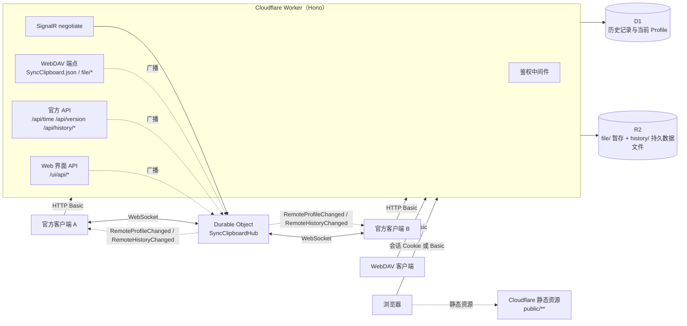

# SyncClipboard CfServer

这是 [SyncClipboard](https://github.com/Jeric-X/SyncClipboard) 官方服务端的 Cloudflare Workers 重写实现。

原版基于 ASP.NET Core 开发。本项目使用 TypeScript 重写，运行在 Cloudflare 边缘网络上，依赖 D1 数据库、R2 对象存储和 Durable Objects。官方客户端不需要任何修改，将服务器地址指向部署好的 Worker 即可使用剪贴板实时同步、历史记录查询以及跨设备历史同步。

[](https://www.typescriptlang.org/)
[](https://workers.cloudflare.com/)
[](LICENSE)

---

## 协议与功能差异

SyncClipboard 官方客户端支持三类服务端，能力不同：

| 能力 | 官方 C# 服务端 | 本项目（Cloudflare Workers） | WebDAV 存储 | S3 兼容存储 |
|---|---|---|---|---|
| 同步机制 | SignalR WebSocket 实时长连接 | SignalR WebSocket 实时长连接（Durable Objects） | 定时轮询 | 定时轮询 |
| 历史记录面板 | 支持 | 支持 | 不支持 | 不支持 |
| 历史记录跨设备同步 | 支持 | 支持 | 不支持 | 不支持 |
| 部署与运维要求 | 需要自备 VPS / Docker / 进程守护 | Cloudflare 无服务器部署，按量计费，个人用量在免费额度内 | 依赖现有 WebDAV 服务 | 依赖现有 S3 服务 |

本项目复刻了官方服务端全部接口，包括 WebDAV 端点、SignalR Hub 和 `/api/history/*` 历史记录接口。在此基础上，新增了内置的 Web 历史管理界面。

部署完成后，在电脑或手机浏览器中打开 Worker 地址，根路径会自动跳转至 Web 界面。使用与客户端相同的用户名和密码登录。

| Web 历史记录管理主界面 | 登录验证与状态提示 |
| :---: | :---: |
|  |  |

## 架构



- **Workers (Hono)**：处理 HTTP 路由、鉴权与文件流。
- **D1 (SQLite)**：存储历史记录元数据、当前剪贴板状态（Profile）以及系统配置。
- **R2**：存储剪贴板附件数据。`file/` 作为暂存区，`history/` 存放持久化文件。
- **Durable Objects**：作为 SignalR Hub 维持 WebSocket 长连接，处理心跳并向所有在线客户端广播数据变更通知。
- **静态资源 (Assets)**：托管 Web 历史管理界面，请求经过 Worker 判定开关后提供服务。

## 客户端支持

- **版本要求**：官方客户端 **v3.1.1 或更高版本**（协议基准格式要求）。
- **客户端下载**：前往官方发布页下载：[SyncClipboard Releases](https://github.com/Jeric-X/SyncClipboard/releases)。支持 Windows (WinUI3 / WPF)、Android、macOS 等平台。
- **服务端版本伪装**：Worker 对 `/api/version` 接口固定返回 `3.2.0`，与官方服务端基准版本一致，避免客户端版本检查拦截。

## 准备工作

部署前需要准备好：
1. **Cloudflare 账号**：拥有 Workers、D1、R2 和 Durable Objects 使用权限（个人免费计划即可）。
2. **Node.js 环境**：Node.js 20 或更高版本（如果采用命令行部署）。
3. **设置凭据意识**：服务端通过 HTTP Basic 鉴权保护所有剪贴板数据。你需要自行指定一组用户名和密码，不要使用默认或简单弱口令。

## 部署

部署提供两种方式：本地命令行部署与 GitHub Actions 自动部署。

两种方式部署出的 Worker 实例行为相同。在执行部署前，**必须先在 Cloudflare 账号中创建好 D1 数据库和 R2 存储桶，并将生成的真实 database_id 填入配置文件**。

### 方式一：命令行部署（Wrangler CLI）

1. **克隆项目并安装依赖**：
   ```bash
   git clone https://github.com/leeexx/SyncClipboardCfServer.git
   cd SyncClipboardCfServer
   npm install
   ```

2. **登录 Cloudflare**：
   ```bash
   npx wrangler login
   ```
   浏览器会自动打开授权页面，按提示完成登录。在无图形界面的终端（如 SSH 会话）中操作时，可直接设置环境变量 `export CLOUDFLARE_API_TOKEN="你的Token"` 免去网页交互。

3. **创建 D1 数据库与 R2 存储桶**：
   ```bash
   npx wrangler d1 create syncclipboard
   npx wrangler r2 bucket create syncclipboard
   ```
   命令执行后，终端会输出 D1 的 `database_id`（形如 `xxxxxxxx-xxxx-xxxx-xxxx-xxxxxxxxxxxx`）。
   打开根目录下的 `wrangler.toml`，找到 `[[d1_databases]]` 配置块，将 `database_id` 替换为你刚刚生成的真实 ID：
   ```toml
   [[d1_databases]]
   binding = "DB"
   database_name = "syncclipboard"
   database_id = "在这里粘贴你的 database_id"
   ```

4. **初始化线上 D1 数据库表**：
   ```bash
   npx wrangler d1 execute syncclipboard --remote --file=./schema.sql
   ```
   这一步会创建存储历史记录所需的表和索引，操作具备幂等性。

5. **设置访问凭据（用户名与密码）**：
   通过 Cloudflare Secret 设置剪贴板服务的自定义用户名和强密码：
   ```bash
   npx wrangler secret put USERNAME
   npx wrangler secret put PASSWORD
   ```
   按提示输入你计划使用的用户名和密码。这两项凭据将在后续客户端连接和网页登录中使用。

6. **发布部署**：
   ```bash
   npm run deploy
   ```
   部署完成后，终端会显示分配的 Worker 访问地址（例如 `https://syncclipboard-cf-server.<你的子域名>.workers.dev`）。

---

### 方式二：GitHub Actions 自动部署

1. **Fork 本仓库**到你自己的 GitHub 账号。
2. **创建资源并回填 ID**：
   在本地使用 wrangler 命令行，或直接在 Cloudflare 控制台网页中创建好 D1 数据库 `syncclipboard` 与 R2 存储桶 `syncclipboard`。
   将获取到的真实 `database_id` 修改到你自己仓库的 `wrangler.toml` 中，并提交推送到 master 分支。
3. **配置 GitHub Secrets**：
   在 GitHub 仓库进入 `Settings` → `Secrets and variables` → `Actions` → `Secrets`，添加以下机密项：
   - `CLOUDFLARE_API_TOKEN`：Cloudflare API 令牌。在 Cloudflare 控制台「My Profile」→「API Tokens」中生成，需要拥有以下权限：
     - `Account` - `Account Settings: Read`
     - `Account` - `Workers Scripts: Edit`
     - `Account` - `D1: Edit`
     - `Account` - `R2: Edit`
   - `CLOUDFLARE_ACCOUNT_ID`：Cloudflare 账户 ID。可在 Cloudflare 控制台 Workers 页面右侧栏复制。
   - `USERNAME` / `PASSWORD`：可选。自定义的同步用户名和密码。配置后部署流程会自动将其写入 Cloudflare Worker，无需手动执行 `wrangler secret put`；不填则需通过命令行手动设置。
4. **配置 GitHub Variables（部署开关）**：
   在同页面的 `Variables` 选项卡中，可按需添加以下仓库变量（不填则使用默认值）：

   | 变量名 | 默认值 | 作用说明 |
   |---|---|---|
   | `UI_ENABLED` | `true` | 是否开启 Web 历史界面。设为 `false` 时关闭全部 WebUI 路由与静态资源，仅保留协议同步功能。 |
   | `MAX_SAVED_HISTORY_COUNT` | `1000` | 历史记录保留条数上限（超过的旧记录会在定时清理时被软删除）。 |
   | `HISTORY_RETENTION_MINUTES` | `10080` | 历史记录保留时长（单位分钟，默认 10080 分钟即 7 天）。 |
   | `MAX_REQUEST_BODY_BYTES` | `50331648` | 单次上传请求体大小限制，默认 48 MiB（允许范围 256 KiB–64 MiB）。 |
   | `ENFORCE_STRONG_CREDENTIALS` | `false` | 设为 `true` 时，检测到弱密码会直接中断服务（返回 500）。默认仅打出安全警告。 |

   > `MAX_SAVED_HISTORY_COUNT` 与 `HISTORY_RETENTION_MINUTES` 除了在此处通过变量设置，也可以在 Web 界面的「维护面板」中直接在线修改。设置会写入 D1 数据库的 Meta 表并立即生效，不需要重新部署。在界面中清空设置即可恢复使用这里的变量值。

5. **触发部署**：
   推送代码变更到 master 分支，或者在 GitHub 仓库的 `Actions` 页面找到「Deploy」工作流点击「Run workflow」手动执行。CI 会自动跑完代码检查、测试套件并完成部署。

---

### 域名绑定与网络访问

Cloudflare 默认分配的 `*.workers.dev` 域名在部分国内运营商网络下存在 DNS 污染或连接不稳定问题。

如果官方客户端连接时频繁超时，建议绑定自定义域名：
1. 在 Cloudflare 控制台中，确保你有一个托管在此账号下的域名。
2. 进入 Worker 详情页，点击「Settings」→「Domains & Routes」→「Add」→「Custom Domain」。
3. 绑定一个二级域名（例如 `clip.yourdomain.com`）。
4. 在客户端与浏览器中，将请求地址改为绑定的自定义域名。

---

### 升级与数据备份

- **服务升级**：后续版本更新时，数据库建表脚本具备幂等性，升级不会影响已有剪贴板历史。
  - 命令行部署：拉取最新代码，执行 `npm install && npm run deploy`。若涉及表结构更新，重新执行一次 `npx wrangler d1 execute syncclipboard --remote --file=./schema.sql` 即可。
  - GitHub Actions 部署：在你的 Fork 仓库页面点击「Sync fork」同步上游更新，推送到 master 分支后会自动触发重新部署。
- **数据备份**：剪贴板历史保存在 D1 数据库中，可通过官方命令导出本地 SQL 备份：
  ```bash
  npx wrangler d1 export syncclipboard --remote --output=./backup.sql
  ```

---

## 客户端配置

在各设备上打开 SyncClipboard 官方客户端，进入设置添加账号：

| 配置项 | 填写内容与示例 |
|---|---|
| **类型** | 必须选择 **`SyncClipboard`**（切勿选择 WebDAV。WebDAV 走轮询，无法使用实时推送与历史面板） |
| **服务器地址** | 填写你的 Worker 地址，例如 `https://clip.yourdomain.com`（必须带 `https://`，末尾不要加斜杠或多余子路径） |
| **用户名** | 对应设置的 `USERNAME` 凭据 |
| **密码** | 对应设置的 `PASSWORD` 凭据 |

保存配置后，客户端状态指示灯应变为就绪状态。在任意一台设备上复制文本或图片，其他设备会在短时间内自动同步。服务端采用单空间设计（与官方服务端一致），配置相同地址与凭据的设备共享同一套剪贴板与历史。多用户独立使用需要分别部署不同的 Worker 实例。

---

## 容量估算与限制

### 请求量与免费额度

Cloudflare Workers 免费计划提供每日 10 万次请求额度：
- **客户端探活消耗**：官方客户端处于后台运行时，每 10 秒会执行一次长连接保活检查，每次包含两个请求（`PROPFIND /` 和 `GET /api/version`）。
- **单客户端请求量**：一个客户端全天保持运行，每天约产生 `(86400 / 10) * 2 ≈ 17,280` 次请求。
- **承载量**：5 台客户端同时全天在线时，每天基础心跳约产生 8.6 万次请求，落在 10 万次免费额度内。多于 5 台客户端长时间运行建议升级为 Workers Paid 计划。

### Web 界面连接消耗

- **网页处于前台且 WebSocket 连接正常**：维持一条常驻长连接，轮询降级为 60 秒一次看门狗检查（每天产生约 1,440 次 Worker 请求）。心跳走 Durable Objects，不计入 Worker 请求次数。
- **网页处于后台（标签页被隐藏）**：前台 WebSocket 连接会主动断开以节约资源，改为 30 秒一次低频轮询（每天约 2,900 次请求）。

### 上传大小与并发内存

- **单文件大小限制**：写端点对请求体进行了拦截保护，默认上限为 **48 MiB**，最大允许放宽至 **64 MiB**。超出限制的请求会直接返回 413 状态码。
- **内存考量**：Cloudflare Workers 每个 isolate 的内存为 128 MiB，由所有并发请求共享。因为 R2 无法像传统文件系统那样直接重命名文件，上传时需要将文件数据读入内存计算哈希并写入存储。限制在 48~64 MiB 是为了预留内存，避免并发写入时出现内存溢出（OOM）导致其他正常请求一并返回 503。
- **大文本同步**：复制超过 10,240 字符的长文本时，服务端自动将其转存为数据流文件，客户端可完整同步全文。
- **文件夹（Group）压缩包**：支持同步文件夹，解压总量限制为 64 MiB，解压条目上限 1,000 项，单文件解压膨胀比上限 100:1。

### 历史记录清理机制

后台定时任务通过 Cron Trigger 每 20 分钟执行一轮，单批处理 500 条记录。日常使用记录会按时清除。如果换机后客户端一次性同步数千条历史，或者临时大幅缩短了保留时间，超期记录不会立刻在页面中消失，需要等待数轮清理任务（每轮间隔 20 分钟）逐步分批删除。在此期间这些记录仍属于活跃状态。

---

## 安全机制

服务端存放剪贴板明文与附件，包含以下防护：

- **认证失败限速**：同一 IP 或用户名在 15 分钟内认证失败达到 10 次，会对该来源封锁 15 分钟（返回 429）。统计计数在 isolate 内存与 Durable Objects 中维护，认证失败的请求不会写入 D1 数据库。
- **请求来源检查**：Web 界面的写接口（`/ui/api/*`）会校验请求头中的 `Origin` 与 `Sec-Fetch-Site`，拦截跨站伪造请求。
- **传输加密**：非本地地址的明文 HTTP 请求会自动 301 重定向至 HTTPS，响应头包含 HSTS。
- **弱口令防护**：使用常见默认密码或长度少于 8 位时，系统会在控制台输出警告日志。开启 `ENFORCE_STRONG_CREDENTIALS=true` 后，命中弱密码的所有通道会直接返回 500 阻止访问。
- **静态资源安全头**：界面静态资源声明了内容安全策略（CSP）、禁止 MIME 嗅探（`nosniff`）以及禁止页面嵌套（`X-Frame-Options: DENY`）。

---

## 日志查看与排障

### 实时日志与历史查询

Cloudflare 不支持传统意义上的文件日志级别配置，日志通过以下两种途径查阅：
1. **实时日志流（CLI）**：
   ```bash
   npx wrangler tail
   ```
   可添加过滤参数：只看报错 `npx wrangler tail --status error`；按关键字搜索 `npx wrangler tail --search '[cleanup]'`。
2. **控制台历史日志**：
   登录 Cloudflare 控制台，进入「Workers & Pages」→ 选择当前 Worker → 点击「Observability」选项卡，可按时间区间和状态筛选查看过去 7 天内的调用与异常日志。

### 常见日志标识

- `[cleanup]`：后台定时清理任务运行信息。打印每阶段处理条数、批次、子请求消耗量。
- `[DO] broadcast`：SignalR Hub 处理状态变更与向客户端广播消息的记录。
- `[security]`：弱密码警告或认证失败突发告警。
- `[HISTORY ...]`：历史上传被服务端拒绝的具体原因（如缺少哈希、非法字符路径等）。

### 常见问题排查

- **客户端连接失败、指示灯为红色**：
  - 检查填写的地址是否以 `https://` 开头。
  - 检查网络是否能直接连通 `workers.dev` 域名。如果存在网络阻断，切换为自定义域名。
  - 检查用户名和密码是否与 Cloudflare Secret 中的配置相符。
- **客户端或浏览器提示 429 Too Many Requests**：
  - 触发了服务端的防暴力破解限速。默认策略为：15 分钟内认证失败超过 10 次，会对该 IP 封锁 15 分钟。请检查客户端是否有设备使用了旧密码反复重试。封锁期结束后会自动解除。
- **同步大文件或图片失败，报错 413**：
  - 上传的文件体积超过了当前配置的 `MAX_REQUEST_BODY_BYTES`（默认 48 MiB）。
- **历史记录清理有延迟**：
  - 定时清理任务通过 Cron Trigger 每 20 分钟执行一轮，单批处理 500 条记录。若单次删除大量记录或调小了保留时长，需要等待数轮清理任务逐步回收存储。

---

## 本地开发与测试

运行本地开发环境使用 Miniflare 模拟 Cloudflare 运行时：

```bash
npm install

# 初始化本地 D1 数据库（保存在 .wrangler 目录下）
npx wrangler d1 execute syncclipboard --local --file=./schema.sql

# 配置本地环境变量与测试凭据
cp .dev.vars.example .dev.vars

# 启动本地开发服务（默认监听 127.0.0.1:8787）
npm run dev
```

运行测试（22 个套件）：

```bash
# 类型检查与 ESLint
npm run check

# 运行纯算法与单元测试（无需启动服务）
npx vitest run test/hash.test.ts test/fixes.test.ts

# 运行全部集成测试套件（必须先在后台启动本地 dev 服务）
npm test
```

**写库套件默认只允许指向本机**：七个套件（`protocol`、`fix-regressions`、`transports`、`signalr`、`cleanup`、`query-filters`、`ui`）会创建/删除历史记录与 R2 对象，因此当目标地址非 `127.0.0.1` 或 `localhost` 时会默认拒绝执行，防止误删线上数据。如需向特定远端实例执行测试，必须显式附加参数：`ALLOW_REMOTE_TARGET=1 BASE=https://your-worker.workers.dev npm test`。

---

## 项目结构

```
src/
├── index.ts            Worker 入口，路由装配、鉴权中间件与 Cron 调度
├── auth.ts             HTTP Basic 鉴权处理与常量时间防时序攻击比较
├── hash.ts             Text、File、Image、Group 数据的哈希计算（逐字节对齐官方实现）
├── profile.ts          剪贴板 Profile 数据校验与状态持久化
├── db.ts               D1 数据库访问层与乐观并发控制
├── storage.ts          R2 对象存储读写、暂存区维护与孤儿文件回收
├── cleanup.ts          保留期裁剪、条数限制与孤儿清理后台任务
├── routes/             WebDAV 与官方 history 相关业务路由
├── ui/                 Web 界面服务端接口与会话管理
└── durable/            SignalR Hub（WebSocket 连接维持、心跳与广播）
public/                 静态资源：robots.txt + _headers + ui_v1/（默认界面 V1）+ ui_v2/（开发测试版 V2）+ ui/（/ui/ 的跳转壳）
schema.sql              D1 数据库建表与初始元数据语句
wrangler.toml           Cloudflare Worker 配置文件与绑定声明
test/                   测试套件（集成测试、协议回归测试、文档口径测试）
```

---

## 相关文档

- [docs/project-analysis.md](docs/project-analysis.md)：系统全景架构解析、时序图与数据模型
- [docs/design.md](docs/design.md)：系统总体架构设计、决策记录与存储映射
- [docs/protocol.md](docs/protocol.md)：官方协议逐条对照、DTO 契约与已知差异表
- [docs/ui.md](docs/ui.md)：Web 历史界面的接口设计、鉴权模型与前端规范
- [docs/security-fix-plan.md](docs/security-fix-plan.md)：安全审计与已知安全加固项说明
- [AGENTS.md](AGENTS.md)：开发行为契约与代码维护规范

## 许可证

[MIT](LICENSE)。

本项目是 SyncClipboard 服务端协议的独立重实现，其中协议行为、哈希算法与数据格式定义
移植自 [SyncClipboard](https://github.com/Jeric-X/SyncClipboard)（Copyright © 2022 JericX，MIT 许可），
原始版权声明已在 [LICENSE](LICENSE) 中保留。

## 致谢

- [SyncClipboard](https://github.com/Jeric-X/SyncClipboard) —— 客户端与服务端协议定义
- [clipserver](https://github.com/ting1e/clipserver) —— 同类服务端的参考实现与 Web 历史界面灵感来源
- [Hono](https://hono.dev/) —— 轻量 Workers Web 框架
- [fflate](https://github.com/101arrowz/fflate) —— 纯 JS zip 流式解压（Workers 内存安全兼容）
- [Microsoft ASP.NET Core SignalR](https://github.com/dotnet/aspnetcore) —— 实时推送协议规范与测试套件通信基准
- [Lucide Icons](https://lucide.dev/) —— Web 管理界面的内嵌极简 SVG 矢量图标
