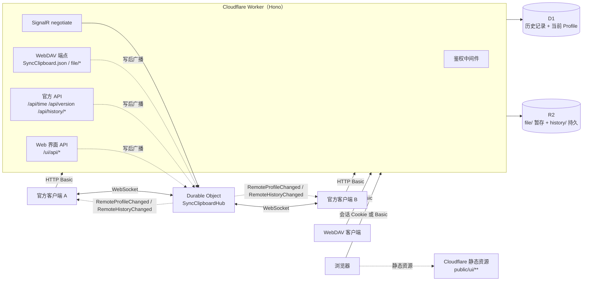

# SyncClipboard CfServer

[SyncClipboard](https://github.com/Jeric-X/SyncClipboard) 官方同步服务器的 **Cloudflare Workers 复刻版**。

用 TypeScript 重写官方 ASP.NET Core 服务端，部署在 Cloudflare 边缘网络上。**官方客户端无需任何改动**，
把服务器地址指向部署好的 Worker 即可获得完整能力：剪贴板实时同步、历史记录与跨设备历史同步。

[](https://www.typescriptlang.org/)
[](https://workers.cloudflare.com/)
[](LICENSE)

---

## 为什么需要它

SyncClipboard 客户端支持三类服务端，能力并不相同：

| 服务端类型 | 传输模型 | 历史同步 | 说明 |
|---|---|---|---|
| **官方服务器**（本项目复刻的对象） | **事件驱动**（SignalR 长连接） | ✅ | 只有 `IOfficialSyncServer` 能开启历史同步 |
| WebDAV | 轮询 | ❌ | 简单，但延迟高、无历史面板 |
| S3 兼容存储 | 轮询 | ❌ | 同上 |

官方服务器的独有能力（实时推送 + 历史记录同步）依赖 SignalR Hub 与 `/api/history/*`。
本项目把这一整套搬到 Cloudflare，省去自建服务器与运维：

- **无服务器**：无需 VPS、Docker、进程守护，按量计费，免费额度对个人使用足够
- **边缘部署**：全球加速，冷启动毫秒级
- **协议保真**：逐条对齐上游实现（含哈希算法、状态机、错误语义）

## 功能

- **剪贴板双向同步**：WebDAV 兼容 API（`SyncClipboard.json` + `file/`），支持文本 / 图片 / 文件 / 多文件组
- **实时推送**：SignalR 兼容 Hub（negotiate / 握手 / 心跳 / 广播），支持 **WebSockets、
  ServerSentEvents、长轮询** 三种传输并按上游顺序宣告，WS 不可用时自动降级
- **历史记录与历史同步**：`/api/history/*` 全套（查询 / 上传 / PATCH 乐观并发 / 统计 / 清空），
  支持官方客户端的历史面板、收藏置顶、跨设备历史同步
- **数据完整性校验**：Text / File / Image / Group 四类哈希算法逐字节对齐上游 C# 实现，
  服务端校验上传数据（不符即拒绝），避免坏数据在设备间扩散
- **保留与清理**：Cron Trigger 定时执行保留期裁剪、条数上限、已删除记录硬删与孤儿对象清理
- **Web 历史界面**（`/ui/`）：浏览器里查看/搜索/筛选/预览服务器上的剪贴板历史，
  支持时间范围（今天 / 近 7 天 / 近 30 天 / 自定义）、回收站（含恢复）、文本复制、图片预览、
  文件下载、收藏置顶、批量删除与部署信息。
  界面与官方 API 读写同一套数据，写操作走与官方 `PATCH` 相同的实现（含广播与数据清理）。
  详见 [`docs/ui.md`](docs/ui.md)
- **健壮性**：并发写入用唯一索引 + 乐观并发控制；大文件上传零冗余拷贝；
  WebSocket 升级需鉴权；附件响应带 `nosniff` / CSP 防护，界面静态资源另有 `_headers`
  声明的 CSP 与缓存策略

## 架构



| 组件 | 职责 |
|---|---|
| **Workers + [Hono](https://hono.dev/)** | HTTP 路由与请求处理 |
| **D1**（SQLite） | 历史记录与当前 Profile 元数据 |
| **R2** | 剪贴板数据文件（`file/` 暂存区 + `history/` 持久区） |
| **Durable Objects** | SignalR 兼容 Hub：持有 WebSocket 连接、心跳、全员广播 |
| **静态资源**（`public/ui/**`） | Web 界面本体，由 Cloudflare 直接托管（不经过 Worker）；`/ui/` 下的请求命中资源即返回，其余（含全部协议路径）回落给 Worker |

协议面与界面面**严格分离**：`/api/history/*`、`/SyncClipboard.json`、`/file/*` 是客户端依赖的契约，
界面只读同一套数据（另开 `/ui/api/*` 表达页大小、排序、选择集等界面需要），写操作与官方 `PATCH`
共用同一实现。详见 [`docs/ui.md`](docs/ui.md)。

## 兼容性

与上游服务端逐条对照实现，覆盖上游全部路由：

| 类别 | 端点 |
|---|---|
| 基础 | `GET /`（浏览器导航会 302 到 Web 界面 `/ui/`）、`GET /api/version`、`GET /api/time` |
| WebDAV | `GET`/`PUT /SyncClipboard.json`、`GET`/`HEAD`/`PUT`/`DELETE /file/*`、`PROPFIND`、`MKCOL` |
| 历史 | `GET /api/history/{profileId}`、`GET /api/history/{profileId}/data`、`POST /api/history`、`POST /api/history/query`、`PATCH /api/history/{type}/{hash}`、`GET /api/history/statistics`、`DELETE /api/history/clear` |
| 实时 | `/SyncClipboardHub`（negotiate + WebSocket） |

**客户端要求**：SyncClipboard **v3.1.1 或更高**（v3.1.1 起协议为当前格式，旧版不兼容）。
已验证官方 **v3.2.0 WinUI3 客户端**的文本、大文本、文件双向同步与历史同步。

已知行为差异与有意偏离记录在 [`docs/protocol.md`](docs/protocol.md) 的差异表。

## 快速开始（本地）

```bash
npm install

# 初始化本地 D1（miniflare）
npx wrangler d1 execute syncclipboard --local --file=./schema.sql

# 配置本地凭据（.dev.vars 已被 gitignore）
cp .dev.vars.example .dev.vars     # 填入 USERNAME / PASSWORD

npm run dev                        # → http://127.0.0.1:8787
```

运行测试（20 个套件）：

```bash
npm run typecheck                  # tsc --noEmit（src + test）
npm run lint                       # eslint（零构建前端 public/ui/js——它不在 tsc 的 include 里）
npm run check                      # 上面两条

# 单元/数据层套件（无需服务器）
npx vitest run test/hash.test.ts test/fixes.test.ts

# 全部套件（含 HTTP/SignalR 黑盒）——需 dev server 已启动
npm test
```

> `npm run dev` 以 `--test-scheduled` 启动，使 `cleanup` 套件能经 `GET /__scheduled`
> 触发真实 Cron 处理器；若你自己用 `wrangler dev` 不带该参数启动，该套件会跳过并提示原因。

**写库套件默认只允许指向本机**：七个套件（`protocol`、`fix-regressions`、`transports`、
`signalr`、`cleanup`、`query-filters`、`ui`）会创建/删除历史记录与 R2 对象，
因此 `BASE` 非 `127.0.0.1`/`localhost` 时会**直接拒绝运行**。确实要指向一次性实例时显式放行：

```bash
ALLOW_REMOTE_TARGET=1 BASE=https://your-worker.workers.dev npm test
```

黑盒套件默认以 `http://127.0.0.1:8787` + `admin/admin` 连接本地 dev server。
若你改了 `.dev.vars` 里的凭据或端口，用 `SYNC_USER` / `SYNC_PASS` / `BASE` 覆盖：

```bash
BASE=http://127.0.0.1:8788 SYNC_USER=me SYNC_PASS='***' npm test
```

> 变量名不用 `USER` / `USERNAME`：Windows 有 `USERNAME`、Ubuntu CI runner 有 `USER`，
> 都被宿主环境占用，读它们会拿到错的凭据而 401。

## 部署

### 方式 A：手动部署（wrangler CLI）

```bash
# 0. 登录 Cloudflare（一次性）
npx wrangler login

# 1. 创建资源（一次性；把输出的 database_id 填入 wrangler.toml）
npx wrangler d1 create syncclipboard
npx wrangler r2 bucket create syncclipboard

# 2. 初始化线上 D1 schema（幂等，可重复执行）
npx wrangler d1 execute syncclipboard --remote --file=./schema.sql

# 3. 设置 Basic Auth 凭据（一次性，长期生效；必须使用高熵随机口令，见「安全基线」）
npx wrangler secret put USERNAME
npx wrangler secret put PASSWORD

# 4. 部署（Cron Trigger 随部署自动注册）
npm run deploy
```

部署完成后 wrangler 会输出 Worker 地址（形如 `https://<worker-name>.<subdomain>.workers.dev`），
也可在 Cloudflare 控制台绑定自定义域名。

### 方式 B：GitHub Actions 自动部署

仓库内置 [`.github/workflows/deploy.yml`](.github/workflows/deploy.yml)：

- **触发**：push 到 `master` **且改动涉及产品代码或构建输入**，或 Actions 页面手动运行
  （`workflow_dispatch`）。白名单见 `deploy.yml` 的 `on.push.paths`：`src/**`、`public/**`、
  `test/**`、`schema.sql`、`wrangler.toml`、`package*.json`、`tsconfig.json`、`vitest.config.ts`、
  CI 自身。**纯文档改动不触发**——它既不改变部署产物，也不影响协议行为；反过来，将来新增
  部署输入时要同步加进那个列表，否则该变更不会触发流水线。
- **注意**：`deploy` job 需要下方两个 Secret，**未配置时该 job 会失败并列出缺少的名称**
  （`quality` job 不需要凭据，其协议/界面/文档/单元用例仍会照常运行并通过）
- **流程**：两个 job
  1. **`quality`**：`typecheck` + `lint` + **全部 20 个套件**。黑盒套件由 CI 自行用
     `wrangler dev`（miniflare）起一个本地实例来跑 —— **不接触线上资源，也不需要 Cloudflare 凭据**，
     D1 用 `--local` 初始化，凭据用 `--var` 临时注入。
  2. **`deploy`**（`needs: quality`，质量门失败则不部署）：
     D1 schema 幂等执行 → `wrangler deploy` → 凭据同步（可选）→ 冒烟检查
- **需配置**（Settings → Secrets and variables → Actions）：

  | 名称 | 类型 | 必填 | 说明 |
  |---|---|---|---|
  | `CLOUDFLARE_API_TOKEN` | Secret | ✅ | 权限：Workers Scripts:Edit、D1:Edit、R2:Edit、Account Settings:Read |
  | `CLOUDFLARE_ACCOUNT_ID` | Secret | ✅ | Cloudflare 账户 ID |
  | `USERNAME` / `PASSWORD` | Secret | 可选 | Basic Auth 凭据（见下方两种用法） |
  | `SYNC_AUTH_CREDENTIALS` | Variable | 可选 | 设为 `true` 时由 CI 把凭据写入 Worker secrets |
  | `DEPLOY_URL` | Variable | 可选 | 部署后的地址，用于冒烟检查；未设置则跳过 |

**Basic Auth 凭据的两种管理方式**（任选）：

- **A. 手动设置一次**（默认）：`npx wrangler secret put USERNAME` / `PASSWORD`。
  不配 `SYNC_AUTH_CREDENTIALS`，CI 完全不接触凭据——凭据只存在于 Cloudflare。
- **B. 交给 CI 统一管理**：配好 `USERNAME`/`PASSWORD` secrets 并把 `SYNC_AUTH_CREDENTIALS`
  设为 `true`。每次部署同步一次，**轮换密码只需改 GitHub Secrets 一处**，适合想要"配置集中、
  全自动部署"的场景。

  代价是凭据会同时存在于 GitHub 与 Cloudflare 两处。实际增量风险很低：
  CI 里的 `CLOUDFLARE_API_TOKEN` 本身就有 D1/R2 的编辑权限（可读写全部剪贴板数据）
  与任意代码部署权限，信任前者即已信任后者。为降低暴露面，workflow 把凭据只注入
  **该步骤自己的 env**（不用 job 级 env），因此 `npm ci` 的依赖安装脚本读不到它们。

> 若你的仓库可能被他人提交 PR，注意：来自 fork 的 PR 默认拿不到 secrets，但**同仓库分支**
> 的 workflow 可以。多人协作场景建议改用方式 A。

## 客户端配置

官方客户端 →「添加账号」：

| 字段 | 值 |
|---|---|
| 类型 | **SyncClipboard**（不要选 WebDAV） |
| 服务器地址 | 你的 Worker 地址 |
| 用户名 / 密码 | 与 `USERNAME` / `PASSWORD` secrets 一致 |

> 选 `SyncClipboard` 类型才能启用实时推送与历史同步；选 WebDAV 会退化为轮询模式。

## Web 界面

部署完成后，浏览器打开 Worker 地址（根路径会自动跳到 `/ui/`），用与客户端相同的
`USERNAME` / `PASSWORD` 登录，即可：

- 按类型 / 收藏筛选，**按时间范围筛选**（今天 / 近 7 天 / 近 30 天 / 自定义起止日期），全文搜索，
  按类型/大小/时间排序，翻页与每页条数切换
- **回收站**：查看已删除的记录（30 天内仍在），把还能恢复的记录一键恢复——
  数据文件在删除时已清除，故只有「文本且无数据文件」的记录可恢复，界面会禁用其余按钮并说明原因
- 预览文本全文、预览图片、下载文件；**数据文件已被清理的记录会明确显示「数据不可用」**，
  而不是裂图或静默失败
- 收藏 / **置顶** / 删除（单条与**批量**：批量收藏、取消收藏、置顶、恢复、删除）——
  写操作走与官方 `PATCH` 相同的实现，客户端会同步收到变更广播
- **实时更新**：页面可见时与 Hub 建立 WebSocket（用短期票据换连接，票据 10 分钟内可复用），别的设备一同步这边立刻可见；
  连接不可用时自动回落到轮询（10 秒），轮询始终保留为兜底
- **记录级深链接**：`/ui/#Text-<hash>` 打开即预览该条，链接可直接分享/收藏
- **维护面板**（部署信息对话框内）：清理任务的运行状态与失败信息、数据完整性自检
  （找出「记录说有数据、存储里却没有对象」的条目）、保留策略在线调整（0 = 关闭该阶段）、清空全部历史；
  「清空回收站」在**回收站视图**的选择条上（那里才看得到要清的东西）
- 与服务器失去联系时（轮询/统计失败）页面顶部出现一条状态横幅，恢复后自动收起，
  而不是继续显示可能过期的数据
- 查看「部署信息」：客户端该填的服务器地址（可一键复制）、版本、传输方式、保留策略、存储占用

界面细节（模块划分、接口契约、鉴权模型、设计系统、验证记录）见 [`docs/ui.md`](docs/ui.md)。

> 界面与客户端**共用同一套凭据**。请务必改成强密码——默认口令 + 公开的 `*.workers.dev`
> 地址意味着任何人都能读到你的全部剪贴板历史。

## 日志与排障

Cloudflare 侧**没有"日志级别"这个东西**（上游的 `Logging:LogLevel` 在此没有对应物）：`console.*` 的输出
要么进实时流，要么进 [Workers Logs](https://developers.cloudflare.com/workers/observability/logs/workers-logs/)。
本项目两处都用：

- **实时**：`npx wrangler tail`（可加 `--status error` 只看失败、`--search '[cleanup]'` 按文本过滤、
  `--format json` 便于管道处理）
- **回看**：控制台 → Workers & Pages → 选本 Worker → **Observability**，按 Worker/时间/文本查询，**保留 7 天**。
  `wrangler.toml` 已显式声明 `[observability] enabled = true` —— 不写就依赖"新建 Worker 默认开启"这一平台
  默认（默认会变，而日志丢了不会报错）；采样率 `head_sampling_rate` 保持默认 1（全量），按本仓库规模
  （见下节容量提示）远在 2000 万条/月的免费额度内，成本为 0
- **不依赖日志的可观测面**：`GET /ui/api/info` 的 `cleanup: { lastRunAt, lastError, cursors }` 是清理任务
  每轮写进 D1 `Meta` 的状态，界面「部署信息」直接展示 —— **日志只是补充，不是唯一信息源**（超过 7 天的
  清理历史只有 Meta 这一份）

**日志约定**（改日志前先读）：

| 前缀 | 位置 | 内容 |
|---|---|---|
| `[cleanup]` | `src/cleanup.ts`、`src/index.ts` | 每阶段一行（`phase= status= processed= batches= truncated= cursor= subrequests= ms=`）+ 每轮一行汇总；失败另写 `[cleanup] error stage=…`，并落进 Meta 的 `cleanup:lastError` |
| `[DO] broadcast` | `src/durable/SyncClipboardHub.ts` | 每次写操作的广播（含在线连接数）；长轮询队列溢出另有一行 |
| `[HISTORY …]` | `src/routes/history.ts` | 历史上传被拒的原因（如 `hash is required`、`Hash contains invalid path characters`） |
| `[security]` | `src/auth.ts`、`src/rateLimit.ts` | 弱凭据告警（每个 isolate 一次）、认证失败突发告警 |

**隐私**：日志里**不出现剪贴板正文** —— 只有阶段名、计数、hash、文件名与错误消息（共 12 处 `console.*`
调用点，逐处核过）。新增日志时请沿用这条约定。

## 容量提示

- **Workers 免费版每天 10 万请求**。官方客户端即使在事件驱动模式下，也在每 10 秒跑一次
  `TestAliveHelper` 探活，而那次探活是**两个请求**：`OfficialAdapter.TestConnectionAsync` 先做
  WebDAV 存活检测（**`PROPFIND /`**，`WebDavBase.Test()`）再取 `/api/version` 比对版本下限。
  单客户端因此约 **17.3k 请求/天**（2 × 8640），免费版大致可支撑 **≤5 个客户端**，更多需升级 Workers Paid。
  （早先文档只算了 `/api/version` 一个请求、写成 8.6k，是漏算了 PROPFIND 那一半；
  对上游 `28c7e596` 的对照已按 `OfficialAdapter.cs`/`WebDavBase.cs` 订正。）
- **Web 界面开着标签也会计费**，量级取决于推送通道是否连上（`/ui/api/poll` 一次 D1 读）：
  · **可见 + 推送已连接**（默认）：轮询降为 60 秒看门狗 ≈ **1.4k Worker 请求/天**；另有 DO 侧开销
    ——客户端每 30 秒一次 WS 心跳（≈2.9k 条/天）与 DO 每 15 秒一次心跳 alarm（≈5.8k 次/天），
    两者走 Durable Objects 的计量口径、**不占 Worker 请求额度**；
  · **可见但推送没连上**（被代理/CSP 阻断、DO 不可达）：退回 10 秒轮询 ≈ 8.6k 请求/天；
  · **标签在后台**：推送通道主动断开（省下那条常驻连接与心跳），轮询 30 秒 ≈ 2.9k 请求/天。
  作为对照：一个官方客户端的探活本身就是 ≈17.3k 请求/天。
- **单请求体上限**：平台 100MB，本实现另有 **32 MiB 应用层上限**（超限 413）——客户端默认文件上限 20MB，而 isolate 只有 128MB 内存，接近平台上限的体会在解析期 OOM（见 `src/requestLimits.ts` 注释）。
- **Group（文件夹）解压上限**：解压总量 64 MiB / 条目 1000 / 单条目压缩比 100:1（见 `src/hash.ts`），超限被拒。
- D1 / R2 的免费额度对个人剪贴板场景（文本与中小文件）通常绰绰有余。

## 安全基线

本服务端存放的是**剪贴板数据**（含口令、验证码、密钥类明文与文件附件），因此按"公网暴露 + 单一口令"的前提设计防护。当前已落地：

| 防护 | 行为 | 相关常量 / 开关 |
|---|---|---|
| 认证失败限速 | 同一 IP 或同一用户名在 15 分钟内失败 10 次即封锁 15 分钟（429 + `Retry-After`）；正确凭据不计数并清零；**失败路径不写 D1**（快路径在 isolate 内存，权威计数在 DO，低频落盘） | `src/rateLimit.ts` 的 `AUTH_RATE_LIMIT_*` |
| 写端点来源校验 | `/ui/api/*` 的 POST/PATCH/PUT/DELETE 拒绝外源 `Origin` 与 `Sec-Fetch-Site: cross-site`；无 `Origin` 的命令行客户端放行 | `src/index.ts` |
| 传输强制 | 明文请求（非 loopback）301 到 https；https 响应带 HSTS（`max-age=31536000; includeSubDomains`） | `src/index.ts` / `src/requestLimits.ts` |
| 请求体上限 | `PUT /SyncClipboard.json`、`POST /api/history`、`PATCH /api/history/*` 超过 **32 MiB** 直接 413 | `MAX_REQUEST_BODY_BYTES`（`src/requestLimits.ts`） |
| 归档解压上限 | Group zip：解压总量 64 MiB / 条目 1000 / 单条目压缩比 100:1（含 8 MiB 绝对下限，避免误伤小文件） | `src/hash.ts` |
| multipart | 分界串长度上限 70 字节（RFC 2046）；分界串查找为原生扫描（不再 O(体×串)） | `src/multipart.ts` |
| 长轮询队列 | 单连接队列上限 64 条 / 1 MB，超限关闭连接（204） | `src/durable/SyncClipboardHub.ts` |
| 清理可观测 | 清理按预算分阶段执行、游标续跑、失败写入 `cleanup:lastError`（`/ui/api/info` 可读） | `src/cleanup.ts` |
| 弱凭据检测 | `PASSWORD` 命中已知弱值或短于 8 位时，每个 isolate 打一次 `console.warn`，并在 `/api/version` 响应头给出 `x-credential-warning: weak`；默认**不阻断服务**（避免直接切断同步），需要强制时设 `ENFORCE_STRONG_CREDENTIALS=true` | `src/auth.ts` / `src/requestLimits.ts` |
| 界面静态资源的响应头 | `public/_headers`（这批文件由边缘直出、不经过 Worker）：CSP `default-src 'none'` + 逐项白名单（脚本/样式限本站；`connect-src 'self' wss: ws:`——`'self'` 对 websocket scheme 的解析各浏览器不一致，显式写死以免实时推送在部分浏览器被静默拦掉；`frame-ancestors 'none'`、`object-src 'none'`）、`nosniff`、`Referrer-Policy: same-origin`、`X-Frame-Options: DENY`，以及 js/css 的短 TTL + `stale-while-revalidate`（无指纹 ⇒ 部署后有 **≤5 分钟**的新旧混用窗口，之后自动收敛；强制刷新可立即取新版）。Worker 自出的 `/ui/*` 404 页另在 `src/ui/notFound.ts` 单独设 CSP——它不经过静态资源层 | `public/_headers` / `src/ui/notFound.ts` |

> **部署前必做**：`USERNAME` / `PASSWORD` 必须是**高熵随机值**。默认/占位口令 + 公开的 `*.workers.dev` 等于把全部剪贴板历史与附件
> 交给任何知道该口令的人（审计中已实测：用该口令可**离线假冒**会话 Cookie）。轮换方式见下方"方式 A/B"；轮换后需同步更新所有
> 客户端与 WebDAV/R2 工具的账号配置（否则表现为"同步无声坏掉"）。

安全审计的完整账目在 `.audits/cfserver-audit-003/`（`report.md` 为报告）；修复计划见 [`docs/security-fix-plan.md`](security-fix-plan.md)，
其中**同时属于上游 SyncClipboard 的问题**整理为 [`docs/upstream-issues.md`](upstream-issues.md)（7 条，附 `文件:行` 证据与复现）。

## 已知限制

- SignalR **三种传输**均已实现（WebSockets → ServerSentEvents → LongPolling，与上游宣告顺序一致），
  故 WS 被代理/防火墙阻断时客户端会自动降级，不会失联
- 第三方**畸形 zip**（隐式目录、重复条目、`a` 与 `a/` 同名冲突）的语义与上游存在 minor 差异
  ——官方客户端恒写显式目录条目且无重复，该路径不可达
- `Content-Type` 映射表小于 .NET 的 `FileExtensionContentTypeProvider`（客户端按文件名落盘，不校验该头）
- Web 界面可见时走 SignalR 实时推送（票据换 WebSocket，**不动协议侧的连接鉴权**：DO 本来就
  接受 `?id=<token>`，票据由 `/ui/api/hub-ticket` 签发），轮询保留为兜底：连上时 60 秒一次、
  未连上时 10 秒一次、页面隐藏时 30 秒一次；环境不支持或被稳定阻断时**连续失败 5 次后不再重试**
  （避免在坏环境里每 ≤60 秒白试一次），回前台会重新尝试
- Web 界面的图片缩略图依赖数据文件存在：对象已被清理的记录会显示占位与「数据不可用」
- **清理任务有吞吐上限，只在"批量场景"才可能被看见**：保留期/条数上限与孤儿回收由 Cron **每 20 分钟**
  跑一轮（软删单批 **500 条**，与上游一致）。日常使用（每天几十条剪贴板）每轮只处理 0~5 条，**完全无感**；
  但三种批量情形会看到"延迟"：把 `MAX_SAVED_HISTORY_COUNT` 调小、把保留期调短、换机后客户端一次重传几千条历史
  —— 等待期内这些记录仍算**活跃**（统计数字与客户端历史面板都还看得到），它们的数据文件也仍占 R2。
  实测 300 条过期记录与 500 条超量都是**一轮内**处理完，故延迟量级是"≤20 分钟 + 若干轮"。
  上限来自平台单次调用的内部子请求上限（本项目按 800 计预算，见 `src/cleanup.ts` 的记账模型）
- **大文件的内存占用高于上游**：上游 `PUT /SyncClipboard.json` 用 `File.Move`（不读数据），
  本实现因 R2 无 move/rename 必须把暂存对象**读入内存**再重传到 `history/`；`POST /api/history`
  则整体读入请求体后解析（上游是 `MultipartReader` 流式）。峰值内存 ≈ 文件大小。
  客户端默认单文件上限 20MB，本地实测 20MB / 60MB 均正常；若把客户端上限提到 ~50MB 以上，
  需留意 Workers 128MB 内存上限
- **单账号单空间**：一个部署 = 一套凭据 = 一个剪贴板空间（与上游语义一致，非多租户）

## 项目结构

```
src/
├── index.ts            Worker 入口：鉴权、路由装配、SignalR 转发、Cron 处理
├── auth.ts             HTTP Basic 鉴权（UTF-8 解码、常量时间比较、401 语义）
├── hash.ts             Text / File / Image / Group 哈希算法（逐字节对齐上游）
├── profile.ts          Profile 服务端语义：校验、持久化、历史编排
├── db.ts               D1 访问层：CRUD、查询过滤、乐观并发更新
├── storage.ts          R2 访问层：暂存 / 持久 / 候选查找 / 孤儿清理
├── multipart.ts        multipart 解析（兼容 .NET 无引号 name 形式）
├── serialization.ts    DTO 序列化与枚举/时间解析
├── cleanup.ts          历史保留与清理（Cron 任务）
├── webdavXml.ts        WebDAV PROPFIND multistatus 生成
├── historyOps.ts       历史记录的写路径（官方 PATCH 与 Web 界面共用）
├── contentTypes.ts     附件 Content-Type 与响应头加固（WebDAV 与界面共用）
├── routes/             webdav.ts / history.ts
├── ui/                 Web 界面的服务端面：session / guard / query / routes / maintenance / notFound
└── durable/            SyncClipboardHub.ts（Hub）+ signalr.ts（协议编解码）
public/                 静态资源：robots.txt（站点根）+ ui/（原生 ES 模块，无构建步骤）
                        文件清单以 docs/ui.md §3 为准（避免四处各列一份、加文件时漏更新）
test/                   全部 20 个套件 + live-signalr.mjs（线上验证脚本）
docs/                   design.md / protocol.md / ui.md / progress.md / security-fix-plan.md / upstream-issues.md / backend-gaps.md
schema.sql              D1 建表语句
```

## 文档

| 文档 | 内容 |
|---|---|
| [docs/design.md](docs/design.md) | 总体设计：架构、存储映射、核心数据流、决策记录、部署、风险 |
| [docs/protocol.md](docs/protocol.md) | 协议契约：逐条端点的精确行为、DTO 定义、哈希算法、SignalR 细节、差异表 |
| [docs/progress.md](docs/progress.md) | 开发与验证记录：里程碑、对照审核结果、版本历史 |
| [docs/ui.md](docs/ui.md) | Web 历史界面：功能融合清单、模块划分、接口契约、鉴权模型、设计系统、验证记录 |
| [docs/security-fix-plan.md](docs/security-fix-plan.md) | 安全审计修复计划（cfserver-audit-003 的 11 Findings）：优先级、逐条修复设计、实施状态 |
| [docs/upstream-issues.md](docs/upstream-issues.md) | 上游 SyncClipboard 自身的问题（13 条，附 `文件:行` 证据与复现），用于回馈上游 |
| [docs/upstream-parity.md](docs/upstream-parity.md) | 与上游 `28c7e596` 的逐文件对照报告：文件映射总表、差异与修复清单、风险分级、待确认项、上线结论 |
| [docs/backend-gaps.md](docs/backend-gaps.md) | 后端能力缺口与可完善项评估：已建未接（§1）/ 可新增（§2）/ 效率欠账（§3），附建议顺序与复核记录 |

## 许可证

[MIT](LICENSE)。

本项目是 SyncClipboard 服务端协议的独立重实现，其中协议行为、哈希算法与数据格式定义
移植自 [SyncClipboard](https://github.com/Jeric-X/SyncClipboard)（Copyright © 2022 JericX，MIT 许可），
原始版权声明已在 [LICENSE](LICENSE) 中保留。

## 致谢

- [SyncClipboard](https://github.com/Jeric-X/SyncClipboard) —— 客户端与服务端协议定义
- [Hono](https://hono.dev/) —— 轻量 Workers Web 框架
- [fflate](https://github.com/101arrowz/fflate) —— 纯 JS zip 解压（Workers 兼容）
