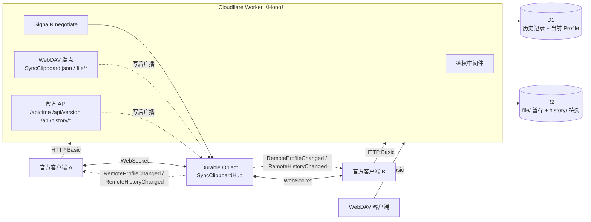

# SyncClipboard CfServer

[SyncClipboard](https://github.com/Jeric-X/SyncClipboard) 官方同步服务器的 **Cloudflare Workers 复刻版**。

用 TypeScript 重写官方 ASP.NET Core 服务端，部署在 Cloudflare 边缘网络上。**官方客户端无需任何改动**，
把服务器地址指向部署好的 Worker 即可获得完整能力：剪贴板实时同步、历史记录与跨设备历史同步。

[](https://www.typescriptlang.org/)
[](https://workers.cloudflare.com/)
[](LICENSE)

---

## 为什么需要它

SyncClipboard 客户端支持三类服务端，能力并不相同：

| 服务端类型 | 传输模型 | 历史同步 | 说明 |
|---|---|---|---|
| **官方服务器**（本项目复刻的对象） | **事件驱动**（SignalR 长连接） | ✅ | 只有 `IOfficialSyncServer` 能开启历史同步 |
| WebDAV | 轮询 | ❌ | 简单，但延迟高、无历史面板 |
| S3 兼容存储 | 轮询 | ❌ | 同上 |

官方服务器的独有能力（实时推送 + 历史记录同步）依赖 SignalR Hub 与 `/api/history/*`。
本项目把这一整套搬到 Cloudflare，省去自建服务器与运维：

- **无服务器**：无需 VPS、Docker、进程守护，按量计费，免费额度对个人使用足够
- **边缘部署**：全球加速，冷启动毫秒级
- **协议保真**：逐条对齐上游实现（含哈希算法、状态机、错误语义）

## 功能

- **剪贴板双向同步**：WebDAV 兼容 API（`SyncClipboard.json` + `file/`），支持文本 / 图片 / 文件 / 多文件组
- **实时推送**：SignalR 兼容 Hub（negotiate / 握手 / 心跳 / 广播），支持 **WebSockets、
  ServerSentEvents、长轮询** 三种传输并按上游顺序宣告，WS 不可用时自动降级
- **历史记录与历史同步**：`/api/history/*` 全套（查询 / 上传 / PATCH 乐观并发 / 统计 / 清空），
  支持官方客户端的历史面板、收藏置顶、跨设备历史同步
- **数据完整性校验**：Text / File / Image / Group 四类哈希算法逐字节对齐上游 C# 实现，
  服务端校验上传数据（不符即拒绝），避免坏数据在设备间扩散
- **保留与清理**：Cron Trigger 定时执行保留期裁剪、条数上限、已删除记录硬删与孤儿对象清理
- **健壮性**：并发写入用唯一索引 + 乐观并发控制；大文件上传零冗余拷贝；
  WebSocket 升级需鉴权；附件响应带 `nosniff` / CSP 防护

## 架构



| 组件 | 职责 |
|---|---|
| **Workers + [Hono](https://hono.dev/)** | HTTP 路由与请求处理 |
| **D1**（SQLite） | 历史记录与当前 Profile 元数据 |
| **R2** | 剪贴板数据文件（`file/` 暂存区 + `history/` 持久区） |
| **Durable Objects** | SignalR 兼容 Hub：持有 WebSocket 连接、心跳、全员广播 |

## 兼容性

与上游服务端逐条对照实现，覆盖上游全部路由：

| 类别 | 端点 |
|---|---|
| 基础 | `GET /`、`GET /api/version`、`GET /api/time` |
| WebDAV | `GET`/`PUT /SyncClipboard.json`、`GET`/`HEAD`/`PUT`/`DELETE /file/*`、`PROPFIND`、`MKCOL` |
| 历史 | `GET /api/history/{profileId}`、`GET /api/history/{profileId}/data`、`POST /api/history`、`POST /api/history/query`、`PATCH /api/history/{type}/{hash}`、`GET /api/history/statistics`、`DELETE /api/history/clear` |
| 实时 | `/SyncClipboardHub`（negotiate + WebSocket） |

**客户端要求**：SyncClipboard **v3.1.1 或更高**（v3.1.1 起协议为当前格式，旧版不兼容）。
已验证官方 **v3.2.0 WinUI3 客户端**的文本、大文本、文件双向同步与历史同步。

已知行为差异与有意偏离记录在 [`docs/protocol.md`](docs/protocol.md) 的差异表。

## 快速开始（本地）

```bash
npm install

# 初始化本地 D1（miniflare）
npx wrangler d1 execute syncclipboard --local --file=./schema.sql

# 配置本地凭据（.dev.vars 已被 gitignore）
cp .dev.vars.example .dev.vars     # 填入 USERNAME / PASSWORD

npm run dev                        # → http://127.0.0.1:8787
```

运行测试（需要 dev server 在运行）：

```bash
npm run typecheck                  # tsc --noEmit
npm test                           # 5 个套件，105 个用例
```

## 部署

### 方式 A：手动部署（wrangler CLI）

```bash
# 0. 登录 Cloudflare（一次性）
npx wrangler login

# 1. 创建资源（一次性；把输出的 database_id 填入 wrangler.toml）
npx wrangler d1 create syncclipboard
npx wrangler r2 bucket create syncclipboard

# 2. 初始化线上 D1 schema（幂等，可重复执行）
npx wrangler d1 execute syncclipboard --remote --file=./schema.sql

# 3. 设置 Basic Auth 凭据（一次性，长期生效；请用强密码）
npx wrangler secret put USERNAME
npx wrangler secret put PASSWORD

# 4. 部署（Cron Trigger 随部署自动注册）
npm run deploy
```

部署完成后 wrangler 会输出 Worker 地址（形如 `https://<worker-name>.<subdomain>.workers.dev`），
也可在 Cloudflare 控制台绑定自定义域名。

### 方式 B：GitHub Actions 自动部署

仓库内置 [`.github/workflows/deploy.yml`](.github/workflows/deploy.yml)：

- **触发**：push 到 `master`，或 Actions 页面手动运行（`workflow_dispatch`）
- **流程**：`npm ci` → 质量门（`typecheck` + 单元测试）→ D1 schema 幂等执行 → `wrangler deploy` → 凭据同步（可选）→ 冒烟检查
- **需配置**（Settings → Secrets and variables → Actions）：

  | 名称 | 类型 | 必填 | 说明 |
  |---|---|---|---|
  | `CLOUDFLARE_API_TOKEN` | Secret | ✅ | 权限：Workers Scripts:Edit、D1:Edit、R2:Edit、Account Settings:Read |
  | `CLOUDFLARE_ACCOUNT_ID` | Secret | ✅ | Cloudflare 账户 ID |
  | `USERNAME` / `PASSWORD` | Secret | 可选 | Basic Auth 凭据（见下方两种用法） |
  | `SYNC_AUTH_CREDENTIALS` | Variable | 可选 | 设为 `true` 时由 CI 把凭据写入 Worker secrets |
  | `DEPLOY_URL` | Variable | 可选 | 部署后的地址，用于冒烟检查；未设置则跳过 |

**Basic Auth 凭据的两种管理方式**（任选）：

- **A. 手动设置一次**（默认）：`npx wrangler secret put USERNAME` / `PASSWORD`。
  不配 `SYNC_AUTH_CREDENTIALS`，CI 完全不接触凭据——凭据只存在于 Cloudflare。
- **B. 交给 CI 统一管理**：配好 `USERNAME`/`PASSWORD` secrets 并把 `SYNC_AUTH_CREDENTIALS`
  设为 `true`。每次部署同步一次，**轮换密码只需改 GitHub Secrets 一处**，适合想要"配置集中、
  全自动部署"的场景。

  代价是凭据会同时存在于 GitHub 与 Cloudflare 两处。实际增量风险很低：
  CI 里的 `CLOUDFLARE_API_TOKEN` 本身就有 D1/R2 的编辑权限（可读写全部剪贴板数据）
  与任意代码部署权限，信任前者即已信任后者。为降低暴露面，workflow 把凭据只注入
  **该步骤自己的 env**（不用 job 级 env），因此 `npm ci` 的依赖安装脚本读不到它们。

> 若你的仓库可能被他人提交 PR，注意：来自 fork 的 PR 默认拿不到 secrets，但**同仓库分支**
> 的 workflow 可以。多人协作场景建议改用方式 A。

## 客户端配置

官方客户端 →「添加账号」：

| 字段 | 值 |
|---|---|
| 类型 | **SyncClipboard**（不要选 WebDAV） |
| 服务器地址 | 你的 Worker 地址 |
| 用户名 / 密码 | 与 `USERNAME` / `PASSWORD` secrets 一致 |

> 选 `SyncClipboard` 类型才能启用实时推送与历史同步；选 WebDAV 会退化为轮询模式。

## 容量提示

- **Workers 免费版每天 10 万请求**。官方客户端即使在事件驱动模式下，仍会每 10 秒调用一次
  `/api/version` 探活（`TestAliveHelper`），单客户端约 **8.6k 请求/天**；叠加历史同步与轮询，
  免费版大致可支撑 **5–10 个客户端**，更多需升级 Workers Paid。
- **单请求体上限 100MB**（客户端默认文件大小上限 20MB）。
- D1 / R2 的免费额度对个人剪贴板场景（文本与中小文件）通常绰绰有余。

## 已知限制

- SignalR **三种传输**均已实现（WebSockets → ServerSentEvents → LongPolling，与上游宣告顺序一致），
  故 WS 被代理/防火墙阻断时客户端会自动降级，不会失联
- 第三方**畸形 zip**（隐式目录、重复条目、`a` 与 `a/` 同名冲突）的语义与上游存在 minor 差异
  ——官方客户端恒写显式目录条目且无重复，该路径不可达
- `Content-Type` 映射表小于 .NET 的 `FileExtensionContentTypeProvider`（客户端按文件名落盘，不校验该头）
- 无应用层解压上限（与上游一致，受平台内存约束）
- **单账号单空间**：一个部署 = 一套凭据 = 一个剪贴板空间（与上游语义一致，非多租户）

## 项目结构

```
src/
├── index.ts            Worker 入口：鉴权、路由装配、SignalR 转发、Cron 处理
├── auth.ts             HTTP Basic 鉴权（UTF-8 解码、常量时间比较、401 语义）
├── hash.ts             Text / File / Image / Group 哈希算法（逐字节对齐上游）
├── profile.ts          Profile 服务端语义：校验、持久化、历史编排
├── db.ts               D1 访问层：CRUD、查询过滤、乐观并发更新
├── storage.ts          R2 访问层：暂存 / 持久 / 候选查找 / 孤儿清理
├── multipart.ts        multipart 解析（兼容 .NET 无引号 name 形式）
├── serialization.ts    DTO 序列化与枚举/时间解析
├── cleanup.ts          历史保留与清理（Cron 任务）
├── webdavXml.ts        WebDAV PROPFIND multistatus 生成
├── routes/             webdav.ts / history.ts
└── durable/            SyncClipboardHub.ts（Hub）+ signalr.ts（协议编解码）
test/                   5 个 vitest 套件 + 1 个线上验证脚本
docs/                   design.md / protocol.md / progress.md
schema.sql              D1 建表语句
```

## 文档

| 文档 | 内容 |
|---|---|
| [docs/design.md](docs/design.md) | 总体设计：架构、存储映射、核心数据流、决策记录、部署、风险 |
| [docs/protocol.md](docs/protocol.md) | 协议契约：逐条端点的精确行为、DTO 定义、哈希算法、SignalR 细节、差异表 |
| [docs/progress.md](docs/progress.md) | 开发与验证记录：里程碑、对照审核结果、版本历史 |

## 许可证

[MIT](LICENSE)。

本项目是 SyncClipboard 服务端协议的独立重实现，其中协议行为、哈希算法与数据格式定义
移植自 [SyncClipboard](https://github.com/Jeric-X/SyncClipboard)（Copyright © 2022 JericX，MIT 许可），
原始版权声明已在 [LICENSE](LICENSE) 中保留。

## 致谢

- [SyncClipboard](https://github.com/Jeric-X/SyncClipboard) —— 客户端与服务端协议定义
- [Hono](https://hono.dev/) —— 轻量 Workers Web 框架
- [fflate](https://github.com/101arrowz/fflate) —— 纯 JS zip 解压（Workers 兼容）
