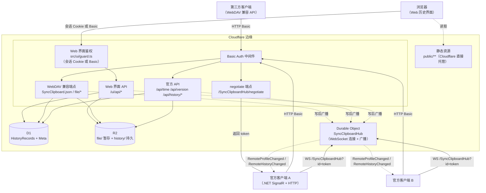

# SyncClipboard CfServer — 总体设计

> 状态：已敲定（2026-09-12）。协议契约见 [protocol.md](protocol.md)；开发进度见 [progress.md](progress.md)。

## 1. 项目概述

用 TypeScript 在 Cloudflare Workers 上复刻 [SyncClipboard](https://github.com/Jeric-X/SyncClipboard)
官方同步服务器（`SyncClipboard.Server.Core`，ASP.NET Core），使现有官方客户端
（Windows/macOS/Linux 桌面端，以及基于 WebDAV 兼容 API 的第三方移动端）无需任何改动即可
直接连接部署于 Cloudflare 边缘网络的服务器，获得与官方服务器一致的全部能力：

- 剪贴板 Profile 的读写同步（WebDAV 兼容 API）
- 官方服务器专属的实时推送（SignalR）
- 历史记录存储与跨设备同步（`/api/history/*`）

### 目标

1. **协议完全兼容**：官方客户端 v3.1.1+（当前 master 客户端 `Env.RequestServerVersion = "3.1.1"`）零改动可用。
2. 部署在 Cloudflare：无服务器、全球边缘、免运维。
3. 行为语义与官方服务器一致（包括错误码、广播、历史查找下载等细节）。

### 非目标

- 不实现 WebDAV 完整协议（DAV 锁等）——官方服务器也只实现了协议所需子集；官方客户端在
  `PreciseDelete` 模式下会解析目录列表，故本项目实现了 RFC 4918 的 `PROPFIND` 多状态响应（207）。
- 不实现 SignalR 的二进制协议（MessagePack）——官方客户端用默认 JSON 协议；传输宣告里保留
  上游同款的 `"Binary"` 声明以逐字对齐 negotiate 载荷。
- 不做多租户——官方服务器单用户（`HARD_CODED_USER_ID = "default_user"`），Basic Auth 只是门禁。
- 不兼容 v3.1.1 之前的老协议（官方自身也不兼容）。
- 界面**不通过 SignalR Hub 取实时更新**（那要改协议侧的连接鉴权），改用 `/ui/api/poll` 的变更信号；
  详见 `docs/ui.md` §6。
- 不提供 `/dav` 前缀别名（ADR D15）。

## 2. 已敲定决策（ADR）

| # | 决策 | 理由 | 状态 |
|---|---|---|---|
| D1 | 语言 TypeScript（编译产物即 JS） | 类型系统兜住协议细节（DTO/枚举/时间格式），Workers 原生支持 | 已定 |
| D2 | 独立目录 + 独立 git 仓库（`SyncClipboardCfServer`） | 与上游解耦，发布/部署独立管理 | 已定 |
| D3 | 框架 Hono | 轻量、类型安全、Workers 生态标准 | 已定 |
| D4 | 历史记录 + 当前 Profile 存 D1（SQLite），数据文件存 R2 | 强一致、可事务；文件体量走对象存储 | 已定 |
| D5 | SignalR 兼容层用 Durable Object 持连接 + 广播 | Workers 无状态，连接状态必须落在 DO | 已定 |
| D6 | negotiate 按上游顺序宣告三种传输（WebSockets → ServerSentEvents → LongPolling） | 与上游一致；WS 被代理/防火墙阻断时客户端可自动降级（原先只宣告 WS 会直接失联）。SSE 走流式响应、长轮询走挂起请求，均在 Durable Object 内实现 | 已定（2026-09-12 修订） |
| D7 | `/api/version` 返回 `VERSION` 变量（**默认 `"3.2.0"`，逐字对齐上游基线** `Directory.Build.props` 的 `VersionPrefix`；2026-09-15 从 `"3.2.1"` 改回，理由见 `protocol.md` §10 与 `progress.md` §43） | 客户端要求服务端 ≥ 3.1.1；自我描述须与上游一致 | 已定（2026-09-15 修订） |
| D8 | 存储时间用 epoch 毫秒 INTEGER（D1），DTO 边界转 ISO8601 | 排序/比较精确，协议输出为标准 ISO 字符串 | 已定 |
| D9 | 严格复刻官方行为，不做行为超集 | 兼容性以官方实现为准（如 `GET /file/{name}` 仅按历史查找） | 已定 |
| D10 | 测试 = 协议级集成测试（`wrangler dev` + 真实 HTTP + `@microsoft/signalr`）+ 真实客户端联调 + **真上游服务端 A/B**（`tools/ab-upstream-probe.ps1`，官方 v3.2.0 发布件逐条对照，退出码只对**未登记差异**报错——2026-09-15 增补） | 与 .NET 客户端同协议的 JS SignalR 客户端可验证握手细节；但**"我们读懂的协议"不等于"上游真的这么做"**——凡属推断的行为都必须有一次对真上游的实测（见 `progress.md` §44） | 已定（2026-09-15 修订） |
| D11 | **提交粒度与推送策略**（2026-09-13 修订）：**本地**可多次 minor commit（细碎、随手记）；**推送到云端 `master` 前**按主题压成合适的提交（每个逻辑变更一条），不把一堆小提交直接推 | 本地细碎便于迭代与回滚；云端历史要能看出演进，不该被几十条同类微调淹没。**修订原因**：原约定"禁止 squash/force push"在实践里产生 91 条提交、其中大量是同一件事的反复微调，云端历史反而更难读（已在用户要求下把 91 条压成 13 条：根提交 + 12 个主题提交，见 `docs/progress.md` §28；**第二次** 2026-09-15 把 89 条压成 33 条——前 13 条原样保留、14–89 共 76 条按主题压成 20 条，见 §50；**第三次** 2026-09-18 把 70 条压成 46 条——前 34 条原样保留、35–70 共 36 条按主题压成 12 条，见 §77；**第四次** 2026-09-18 把 58 条压成 15 条——根提交原样保留、其余 57 条按主题压成 14 条，见 §83）。**改写已推送历史时的硬约束**：① 先建备份分支（**只留本机**，2026-09-18 起不再推云端，见 §78）；② 用树快照回放，保证新 HEAD 与旧 HEAD **树逐字节一致**（`git diff` 必须为空）；③ 推送前跑全量套件且**真门禁**（`set -o pipefail` 或 `if` 判定退出码，别让管道吞掉失败）；④ 用 `--force-with-lease` 推送，不用裸 `--force` | 已定（2026-09-12，2026-09-13 修订；2026-09-18 备份分支改「只留本机」） |

> **D11 执行流程（2026-09-13 实测通过；2026-09-18 起备份分支只留本机）**：① 留底备份分支：`git branch -f backup/pre-squash-<日期>`（**2026-09-18 起不再 `git push` 到 origin —— 用户要求，见 `progress.md` §78**；代价是旧 SHA **只有本机**可解析，判据仍是 `git merge-base --is-ancestor`，别用 `git cat-file -t`）；② 从根提交开新分支，逐组 `git read-tree -u --reset <该组旧 tip>` 后**直接** `git commit -F <msg>`——**不要** `git add -A`（它会把未跟踪的临时文件卷进历史）；③ 逐组断言 `git diff --name-only <新提交> <该组旧 tip>` 为空（只验末态不够：中间的杂物会被下一组的 reset 悄悄抹掉）；④ 末态断言 `git diff <旧 HEAD> HEAD` 为空；⑤ 跑全量套件且用真门禁；⑥ `git push --force-with-lease origin <新分支>:master`，推送后删掉临时分支（备份分支保留）。
| D12 | Web 界面用 **Workers 静态资源 + 独立 `/ui/api/*` 命名空间**承载 | 官方 `/api/history/*` 是**协议契约**，不能为界面需要（可变页大小、多列排序、选择集、缩略图）而改动；界面另开一层，但读写同一张表、复用同一套行映射与 DTO 序列化 | 已定（2026-09-13） |
| D13 | 界面会话用**无状态签名 Cookie**（HMAC-SHA256，密钥由 `PASSWORD` 经 HKDF 派生） | Workers 没有可靠的进程内状态，服务端会话表会让每次页面请求多一次写库；签名 Cookie 零存储、可水平扩展，且改密码即让全部会话失效 | 已定（2026-09-13） |
| D14 | `motion-web` 技能的取用**限于设计系统与打磨层**，不走它的页面蓝图路径 | 该技能自述范围是创意/营销页并明确排除 dashboard/admin UI，而本界面正落在排除侧。取用其令牌层、组件方言与状态矩阵、生产打磨与动效令牌；不生成 hero/分节文案/编造指标 | 已定（2026-09-13） |
| D15 | **不实现 `/dav` 前缀别名**（另一个实现 `clipserver` 的端点前缀） | 本项目 WebDAV 端点在站点根，`PROPFIND` 的 `href` 从根计算。让前缀可用必须改写协议输出（href 前缀），为一个迁移便利碰协议保真不值得；迁移只需把客户端地址改成站点根（界面「部署信息」直接给出可复制地址） | 已定（2026-09-13） |
| D16 | **界面是可关闭的**：`UI_ENABLED`（GitHub 仓库变量，默认开）关闭后三个界面挂载点（`/ui`、`/ui_v1`、`/ui_v2` —— 2026-09-19 改名后是三个，当初是 `/ui` 一个）与 `/ui/api/*` 一律 404，根路径不再跳转；协议面不受影响。实现上必须让界面请求**先进 Worker**（`[assets] binding = "ASSETS"` + `run_worker_first`），否则平台在 Worker 之前就把静态资源托管掉了，开关无从生效 | 只想要"纯协议后端"的使用者（把服务端给别人的场景、不想暴露登录页）应当能一键关掉界面，而不是去改仓库或删资源。**不改协议面**是这个开关的硬边界：官方客户端不碰任何界面挂载点（`/ui*` —— 三个前缀都不碰，原写 `/ui_v2/*` 是 2026-09-19 改名替换打偏的收窄），因此开关对客户端零影响 | 已定（2026-09-15） |
| D17 (界面定位) | **默认界面 = V1**（`public/ui_v1/`，挂载点 `/ui_v1/`）；站点根 `GET /` 的浏览器分支与 `/ui/` 的跳转壳都指向它。V2（`public/ui_v2/`，本体 `/ui_v2/app/`）降为**开发测试版**，进去后顶栏版本号与登录页副标题都标着"开发测试版" | 用户 2026-09-18 的定位：V1 经过 2026-09-17～18 的多轮完善（密度、移动端、对比度、状态矩阵、按下反馈）后功能与质量都更完整，而 V2 是零构建方案的实验场（新的模块划分、状态矩阵、探针都先在那边试）。**物理目录名不动**：V1 的资源前缀是写死的 `/ui_old/*`（**当时叫这个名** —— `ui_v1` 是 2026-09-19 才改的，见 `docs/ui-rename-v1-v2.md`），把它搬到当时那个默认入口命名空间（`/ui/`）要同时改写全部前缀，而 2026-09-15 的改名事故已经付过一次学费 —— 变的只是入口（**2026-09-19 更新**：物理目录名随后也改了 —— `ui_old`→`ui_v1`、`ui`→`ui_v2`，见 `docs/ui-rename-v1-v2.md`） | 已定（2026-09-18，提交 `f114242`） |
| D17 (请求体上限) | **请求体上限默认 48 MiB、可调到 64 MiB**；并且**不用两个独立上限**，而是"合计工作集预算 96 MiB + 随请求体动态收缩的 zip 解压预算"（`src/requestLimits.ts`、`src/hash.ts` 的 `groupZipDecompressionCap`） | isolate 内存 128 MiB 被**所有并发请求共享**，而 Group 上传时"压缩体 + 解压内容"同时占内存 ⇒ 两个上限各自贴顶会变成 48+64 甚至 80+64，直接顶穿 isolate（OOM 会让并发中的其他请求一起 503，比 413 严重得多）。默认值贴"实际会发生的大小"（客户端默认 20 MB、线上最大 29.0 MiB），上限贴"能承受的极限"。完整推导见 §7.1。注：历史提交中该决策与上述「界面定位」同获编号 D17，两者按主题并立 | 已定（2026-09-15；沿革 32 → 64 → 48） |
| D18 | **推送后不等 CI**（2026-09-18 用户要求）：`git push` 成功即**结束这一轮**。**禁止** `gh run watch`、`gh run watch --exit-status` 以及任何"轮询到跑完为止"的等待；要确认它有没有起跑，最多允许**一次**非阻塞快照 `gh run list --limit 1` | 本仓库的质量门在**本地**：D10 的协议级套件 + `npm run check`，且 D11 已规定"推送前跑全量套件且用真门禁"。CI 是**兜底**，不是我的判据；而 `deploy` 作业还要真的部署到 Cloudflare，一趟 2–3 分钟 —— 阻塞等待只是把用户晾在对话里，等一个与本轮结论无关的状态。跑失败不会丢：GitHub 自己会通知，下一次改动也会撞见 | 已定（2026-09-18） |
| D19 | **两处「清除筛选」一律回到活跃列表**（2026-09-20 定案）：筛选工具条那枚与空状态里那枚都清掉全部条件（**包括「回收站」这个条件**），语义与 V1 同答；`boot.js` 的 `resetFilters({ keepView })` 形参随之删除 | 这两处此前**行为相反**（工具条回活跃、空状态留在回收站 —— 2026-09-18 只改了后者的遗留，见 `AUDIT-commit-9b4cdca.md` §P2 与 `progress.md` §93.4）：同一个名字的按钮，两种后果。不取"留在所在视图"的理由：它要求把「回收站」从"是否处于筛选态"的判据（`isDefaultFilters`）里排除，否则工具条那枚点完**按钮仍在** ⇒ 读起来像没生效；而"清除筛选 = 回到默认"不需要动那套判据，且与 V1 现状一致。真要"只清条件、不换视图"，那是改按钮文案（换个名字）的事，不是同一个按钮两种行为 | 已定（2026-09-20） |

| D20 | **测试工具链不引入新依赖**（2026-09-21）：`@cloudflare/vitest-pool-workers` 与 Playwright 各做过一次**有判据的试点**，本轮都**不并入产品树**；同时把 5 份 `node:sqlite` D1 适配器收敛为 `test/support/d1-sqlite.ts` 一份 | 池（vitest 2 能用的最高版是 0.12.x）**自带的引擎是另一个构建**：同一个 LIKE 模式，dev server 报 `LIKE or GLOB pattern too complex: SQLITE_ERROR`，池里连 202 字节都通过 ⇒ 把黑盒套件搬进池，会把「真 D1 才复现」的那一族（§95 修的四处 500 全是这类）**测成绿的**。Playwright 能力上可行（同三个读数逐字节吻合、`Performance.enable` 后能取 §11.2 那四个指标），但替换 4112 行探针属"改门禁工具"级别的独立任务。读数、坑与触发条件见 `progress.md` §105.2–§105.7 | 已定（2026-09-21） |

| D21 | **文档预览引入 `file-viewer`**（2026-09-21，方案层）：V1 增加「文档预览」这一档 —— 重格式（PDF/Office/压缩包/邮件/音视频）交给第三方只读渲染器，**外壳/判据/文案/状态机仍归我们**；产物以**预构建 vendor 入库**（不改 V1 的零构建定位）；判据只有一处（前端 `viewerRoute()`）；入口是**独立预览页**（列表页首屏不加载第三方资产）；**排除 CAD**（运行时 AGPL-3.0-only：网络条款 + 解读不确定 + 体积最大；取舍记录见该文档 §5 D-1） | 现状只有「文本/位图内联预览」与「其余只下载」两档，docx/xlsx/pdf/zip 只能下载后本机打开；而 221 扩展名/32 管线的成熟只读渲染器已存在且自有源码是 Apache-2.0。**代价照实登记**：预览页需放宽 CSP（`style-src 'unsafe-inline'`、`wasm-unsafe-eval`、`worker-src`、`img-src blob:`、`media-src`）⇒ 等于在同源下执行第三方解析器处理不可信文件，这一步**执行前需单独授权**（备选是独立 hostname 隔离）；`web-full` 实测 236 MB / 2961 文件，故必须窄装配。**轮 4 复审修订**（同行日期文档 §10 末段）：① CSP 放宽的**出口**不是 `_headers` 的按页规则
（同名字段逗号合并 ⇒ 交集 ⇒ 无效），而是**由 Worker 出预览页的响应**；② `web-full` ＝ `preset-all`，其依赖链含 **AGPL-3.0-only** 的 CAD 运行时
⇒ 连"用它来量体积"都不该做，改为**离线构建标准档**（`@file-viewer/web` 只有壳，renderer 必须由打包器装配） | **已定**（2026-09-21 含 CSP 放宽授权：仅预览页；实现进行中）—— 机制修正见 [`ui-document-preview.md`](ui-document-preview.md) §5 D-8 |

| D22 | **共用层 `public/ui_shared/`**（2026-09-21）：两版之间的共享面**收敛为唯一一层** —— 只放"不随某一版演进"的东西（品牌图标；无版本耦合的纯数据模块如 `icons.js`；将来放双语/翻译资源）。V1 的模块只允许逃到这一层，`/ui_v2/` 依旧禁引；挂 `/ui_shared/`、与其它三个挂载点同受 `UI_ENABLED` 管 | 此前 `favicon.svg`/`favicon-32.png`/`apple-touch-icon.png` 两版各存一份（**逐字节相同**）、`icons.js` 两份（并集关系、仅 `trash` 几何不同）—— 纯重复。**代价照实登记**：红线由"V1 完全自包含"放宽为"V1 只依赖自己 + 共用层"，`ui-guard` 的两条判据与四处文档同步改；**没有**把两版"实现有意不同"的模块（`format`/`dom`/`filters`/`api`/`messages`…）搬进去 —— 那会把"改一版"变成"两版一起变" | 已定（2026-09-21） |

| D23 | **统计条的两个计数卡随当前视图走**（2026-09-21）：V1 统计条「记录」与「已收藏」两格不再恒用全库口径——活跃视图显示 `activeCount` / `starredCountActive`，回收站视图显示 `deletedCount` / `starredCountDeleted`。「存储占用」仍**恒为活跃口径**（已删记录的 R2 文件在软删时就删了，跟着视图走会与标题对不上；`docs/ui.md` §5 的 `byType`/`byTypeActive` 就是这么分的）。服务端在 `/ui/api/statistics` 与 `/ui/api/overview` 各加 `starredCountActive` / `starredCountDeleted`（一条 `GROUP BY Type, IsDeleted, Stared` 顺带算出，**协议 DTO 的 `starredCount` 语义不动**） | 卡片与同屏的「收藏」筛选（活跃 9 条 vs 全库 12 条）与「回收站 · 共 N 条」头栏（69 vs 67）对不上——正是 `byType` 那条"控件必须与列表同源"纪律（"列表说 1019、控件说 1009"）的同一类问题，而统计条自己 2026-09-17 就因"两个口径并排会被读成自相矛盾"删过类型明细。不取"改卡片文案注明口径"：那只把矛盾换成一行解释，数字照旧对不上。**代价照实登记**：`/ui/api/statistics` 的载荷多了两个键（`starredCountActive`/`starredCountDeleted` 都是全表聚合、与请求视图无关），overview 的顶层字段因此与 statistics 的扁平形状不一致——前端落地时必须逐键搬（漏搬的静默表现是那一格回落成 0，2026-09-21 实测踩过） | 已定（2026-09-21） |

| D24 | **V1 引入第二个 hover 机制：自定义 tooltip 浮层**（2026-09-21，用户要"悬停看截断全文"）：长内容（行内正文）用自建 `js/components/tooltip.js`，短元数据（时间列、图标按钮）继续用原生 `title`。触发 `@media(hover:hover) and (pointer:fine)`、悬停 150ms、只在内容真被裁掉时出现（判据 `scrollHeight > clientHeight`）、触屏不挂监听 | 原生 `title` 对长文本排版差（不可换行）、延迟 ~1s、不可控；而"悬停看更多"要的是可读的多行浮层。**信息绝不靠 hover 单独传达**：全文/完整内容仍由点击预览与键盘可达（a11y 底线）。它同时是 docs §8.2 记的"跟随"族（handfeel §7）在 V1 的**第一个消费者**，按"必须到达并停住"实现。不建 CONTEXT.md 词汇表：V1 的交互语言约定本来就住在 `docs/ui.md` §3.3（硬约束 #26），单开一个词汇表文件是这个仓库没有的形态（最简） | 已定（2026-09-21） |
| D25 | **tooltip 必须不接收指针事件，且正文按行数封顶**（2026-09-21 重做；同日推翻 D24 首版的"可移入滚动/复制"，随后按用户要求再删掉「点击预览查看完整」提示行）：`.tooltip` 用 `pointer-events: none`，正文区 `max-height: calc(6 * 1.6em)` 后裁掉，**不给滚动条也不给说明行**；`role="tooltip"`/`aria-describedby`/focus 监听**全部删除**（触发元素是普通 `div`，那三个监听永远不响 —— 声称支持键盘、实则没有的死代码） | **首版是坏的**：浮层贴在行下方、必然压住后面 2–5 行，而它 `pointer-events: auto` 且可滚动 ⇒ 实测 `elementFromPoint` 在覆盖处返回浮层本身，鼠标顺着一列往下走"走不过去"，**被压住的行连 hover 与点击都没了**（截图与数字见 `docs/progress.md` §122）。两条选择是互斥的：可移入滚动 ⇒ 必须接收指针 ⇒ 必然封死下面的行。取舍方向由场景决定 —— 这是**读一张密集列表**，不是读一条内容；而"移进去复制"本来就有行内「复制」与「预览」两条路。因此要的形态是**看得见、不挡路**：不可移入、高度封顶、没有多余的字。提示行删掉之后，"被裁过"由行内的 `长文本` 徽标承担，取全文仍走「预览」 | 已定（2026-09-21） |
| D26 | **回收站新增"彻底删除"（单条 + 选中批量），服务端只做纯硬删**（2026-09-21，用户在真机逐档实测后定）：新端点 `POST /ui/api/history/batch-purge`（≤100 条/次）只执行 `DELETE … WHERE IsDeleted != 0`（判据写在 SQL 里 ⇒ 活跃记录删不掉）；**不广播、不碰 R2**（软删时数据目录已清，残留由清理任务的孤儿阶段兜底）。界面侧：回收站行内动作从 1 个变 2 个（恢复槽 1 / 彻底删除槽 4），选择条加「彻底删除选中」 | **为什么必须加**：此前回收站只有「恢复」与「清空回收站」两个出口，想永久删掉**几条**做不到 —— 只能整罐倒（实测线上回收站里就躺着 3 条用户记录 + 我的测试数据，清空一次全没）。上游也没有这个能力（它的硬删是 30 天定时任务），所以这是本站自己的面：路由在 `/ui/api/*` 下、官方客户端不感知、`docs/protocol.md` §10 无需登记。**为什么纯硬删**：软删那条路径每条要 1 读 + 1 写 + 1 广播 + 2 次 R2 目录清理（实测 68–81 ms/条），而"彻底删除"的语义就是"从库里拿掉"，没有并发合并可言 ⇒ 每条 1 次 D1 子请求（实测 3 ms/条，比软删快 20 倍）。逐条广播会顶到单次调用 1000 次子请求的上限，且与 `clear` 的既有处置同构（本站标签页靠 `/ui/api/poll` 收敛） | 已定（2026-09-21） |
| D27 | **批量操作给进度、失败口径改成"已生效 X / 未生效 Y"**（2026-09-21 实测后改）：`confirm.ask` 的 `action` 现在收到 `{ setMessage}`，调用方把「正在处理第 i / n 批…」写进确认框正文；批量写/彻底删除的部分失败**不再整体抛错**，而是先 `refresh` 把界面拉回事实、再用 `batchPartialText(updated, failed)` 说明条数 | **为什么**：生产实测 300 条批量删除 = 3 次请求 **51 秒**，全程只有一个转圈，用户既不知道走到哪也没法判断是不是卡死；而"有 N 条未生效，请刷新后重试"读起来像整体失败 —— 实际上服务端逐条判定，落空通常只是那几条被别的设备改过，其余几十条已经生效，用户会白重做一遍。另外**批量恢复改为按 `hasData` 预筛**：带数据文件的记录服务端一定拒绝，塞进去只会让"未生效"多几条噪音 | 已定（2026-09-21） |
| D28 | **长批量在途可中止：确认框的「取消」在途变「中止」，中止点是"批"的边界**（2026-09-21）：`confirm.ask` 在途把取消键改成「中止」并 `abort()` 本次动作的 controller（✕/Esc 仍在途挡住，F2 不变）；`api.js` 的批量循环在**片与片之间**检查 signal，中止时**返回已生效计数而不是抛错**（超时仍抛，用 `error.name` 区分）；文案 `batchAbortedText(已生效)` | 原来不许用户在途关框（F2：关掉会让调用方把"已成功"读成"用户取消"），代价是 300 条的批量中途没法停、只能刷页面（实测 3 批、客户端所见几十秒）。**取舍**：与其"关不掉"，不如给一条**诚实的中止** —— 服务端一次请求内部不会被打断（那 100 条一定跑完），所以中止点天然落在批与批之间，不会出现半条记录；已生效多少如实报出。不改服务端、不改协议（取消只发生在客户端分片循环之间）。单条动作与清空回收站是单次请求，不接这条 | 已定（2026-09-21） |
| D29 | **回收站改成"真回收站"：软删保留数据，30 天硬删 /「彻底删除」时才清**（2026-09-22，用户在 A/B 之间点选 B）：`historyOps.applyHistoryUpdate` 不再在软删时清 R2 目录；`db.updateHistory` 去掉上游那条「有数据就不许恢复」的守卫；孤儿阶段的参照集从「只算活跃记录」改成「**全部记录含已删**」（`listReferencedWorkingDirs`）；`purgeTrash` / `batch-purge` 删行后各自清扫目录 | **为什么**：上游 `DeleteProfileDataIfNeed`（`HistoryService.cs:80`）让「回收站」对图片/文件变成**单向门** —— 用户的质问正是这个（「图片放进去就回不来，这算哪门子回收站」）。代价逐条算过：① R2 多占 ≤30 天（$0.015/GB/月，「彻底删除」可立刻释放）；② **孤儿阶段的参照集必须一起改** —— 漏了它会每 20 分钟把回收站里的数据删一次（行还在、数据没了，最难看的那种坏法）；③ `PATCH isDelete:false` 对带数据记录从 404 变 200，登记 `protocol.md` §10；④ 「存储占用」不再随删除下降 —— 它本来就是 R2 真实占用，改完反而更诚实。**收益**：图片/文件能真恢复（官方客户端会自动把数据下回来：`RemoteHistoryChanged` 带 DTO，见 `!IsLocalFileReady` 即 `EnqueueDownload`）；界面里「不可恢复」那一整族分支（禁用按钮、`hasData` 预筛、失败文案）全部消失 | 已定（2026-09-22） |

| D30 | **预览框加「编辑」：保存 = 新建一条文本记录（两态机 预览 ⇄ 编辑）**（2026-09-22，用户在 `grilling` 四问里定案）：`Text` 记录的预览页脚最左加「编辑」（`> 1 MiB` 关闭并说明原因），进入后正文换成等宽 `<textarea>`、页脚换「取消 / 保存」；保存调**新端点** `POST /ui/api/history`（`{text}`），服务端走协议同一条写路径 `addRecordDto`、`version` 取 0；**保存后不关框** —— 正文就地换成刚保存的那段、上方一行「已保存为新记录（N 个字符）」，复制/下载跟着屏幕上的文本走；**Esc 在编辑态只退编辑不关框**；内容没变（**行尾归一后**比）就不发请求。**同日自审（读完全部 V1 代码）又收口三条**：保存途中 ✕ 与点背景也关不掉框（提示条压在这个模态之下，在途关框=把失败丢在屏幕外——与 confirm.js 的 F2 同源）；保存成功后对话框**改指向新记录**（头部由 `renderHead()` 单点重画、深链接换成新 hash、后续编辑改的是屏幕上这条）；头部与"已保存"说明的字符数**同源**（服务端的 `size`，即 `docs/archive/AUDIT-v1-v2-divergence.md` §12.2 记过的那条 V1 口径） | **为什么**：文本记录的 `hash = SHA256(utf8(正文))`，改一个字就是**另一条记录**（协议模型里同 hash 才能覆盖），所以"编辑"只能是新建 —— 这也让它天然安全：`addRecordDto` **只广播 `RemoteHistoryChanged`、不碰当前剪贴板**（`notifyProfile` 根本不会被调用），其它设备只是多一条历史，没人被迫换剪贴板。不关框是因为"编辑"的产出（这段新文本）紧接着就要被复制/下载，关掉等于让用户重新找那条新记录（Q3=c）。（曾被考虑的方案：改这条记录的 `text` 列 —— 会让 `hash` 与正文不一致，等于把一条捏造的记录塞进协议模型，否）**上限 1 MiB 而协议是 48 MiB**：限制来自"浏览器 `<textarea>` 装不下几十 MB"，故工具是「下载文本」而不是更大的输入框；两处常量（`src/ui/routes.ts` 的 `UI_TEXT_CREATE_MAX_BYTES` 与 `preview.js` 的 `EDIT_MAX_BYTES`）必须同值。**自审时实测抓到一个真缺陷**：`api.createText` 最初没过 `normalizeItem`，服务端的 `type` 是数字 `0` ⇒ 「文本」那一支全判错（头部显示成字节数、页脚只剩「下载」、深链接也不换）—— 边界归一化这条纪律对**新增端点**同样成立 | 已定（2026-09-22） |

## 3. 架构总览



## 4. 目录结构

```
SyncClipboardCfServer/
├── AGENTS.md                   # 行为契约（给 AI 代理与新人）：改代码顺手维护文档、DoD、协议与前端红线
├── package.json / tsconfig.json / vitest.config.ts / eslint.config.js / wrangler.toml
├── schema.sql                  # D1 建表语句（部署时执行）
├── docs/
│   ├── design.md               # 本文件
│   ├── protocol.md             # 协议契约（精确到端点与字段）
│   ├── ui.md                   # Web 历史界面：来源、边界、模块、API、设计系统
│   ├── ui-document-preview.md  # 文档预览集成（File Viewer）：决策、方案、CSP 放宽清单与过程日志
│   └── progress.md             # 开发进度追踪
├── public/                     # 静态资源（由 Cloudflare 托管，run_worker_first 优先进 Worker 以支持 UI_ENABLED 开关）
│   ├── robots.txt              # 必须放站点根（爬虫只读根路径）
│   ├── _headers                # 响应头（边缘直出）：CSP/安全头 + 四个挂载点各自的 js/css no-cache、图标与 manifest 长缓存
│   ├── ui_v1/                  # 默认界面 V1（2026-09-18 起接手默认入口 /ui_v1/；详见其 README.md）
│   │   ├── index.html / login.html / manifest.webmanifest
│   │   ├── css/                # tokens / base / layout / components / motion / auth
│   │   └── js/                 # api / clipboard / dom / filters / format / latest / login / main / messages / next-target / signalr / store / theme-init（图标表在共用层）
│   │       └── components/     # confirm / header / info / list / pagination / preview / row-content / stats / toast / toolbar / tooltip
│   ├── ui_shared/              # **V1/V2 唯一的共享面**（挂 /ui_shared/，同受 UI_ENABLED）：brand/（品牌图标）+ js/icons.js（共用图标表）
│   ├── ui_v2/                  # 开发测试版 V2（挂载 /ui_v2/，应用本体在 /ui_v2/app/；详见 docs/ui-v2-design.md）
│   │   ├── app/                # 应用本体（index.html / login.html）
│   │   ├── css/                # tokens-v2 / base-v2 / shell-v2 / board-v2 / overlay-v2
│   │   └── js/                 # api / boot / clipboard / dom / filters / focus / format / icons / keys / latest / login / menus / messages / next-target / paths / push / spark / state / theme / theme-init / ui/*
│   └── ui/                     # `/ui/` 的跳转壳：index.html + js/redirect-hash.js（送到 /ui_v1/）
├── src/
│   ├── index.ts                # Worker 入口：Hono 装配、中间件、Hub 转发、Cron
│   ├── env.ts                  # 绑定类型（D1/R2/HUB/Vars/Secrets）
│   ├── auth.ts                 # Basic Auth 校验、凭据校验、请求体排空
│   ├── rateLimit.ts            # 认证失败限速：isolate 内存快路径 + DO 权威计数（F7）
│   ├── requestLimits.ts        # 请求体上限与 loopback 判定（F8/HSTS 与 F9 共用）
│   ├── pathCase.ts             # 协议路径**字面段**大小写归一（对齐 ASP.NET 路由；2026-09-15 A/B 后补救）
│   ├── uiEnabled.ts            # Web 界面部署开关（UI_ENABLED）：关闭时四个挂载点（/ui*、/ui_v1*、/ui_v2*、/ui_shared*）全 404、根路径不跳转
│   ├── types.ts                # ProfileDto / HistoryRecordDto / QueryDto / StatisticsDto / 枚举
│   ├── serialization.ts        # camelCase 序列化、枚举字符串、时间与体积口径转换
│   ├── hash.ts                 # Text / File / Image / Group 哈希（协议级精确复刻）
│   ├── multipart.ts            # 字节级 multipart 解析（兼容 .NET 的无引号 name=hash）
│   ├── profile.ts              # Profile 服务端语义：校验、落盘移动、持久化命名
│   ├── historyOps.ts           # 历史记录的写路径（官方 PATCH 与 UI 共用：判定+广播+R2 清理）
│   ├── db.ts                   # D1 访问层：CRUD、查询过滤、ShouldUpdate 判定、清理
│   ├── storage.ts              # R2 访问层：暂存、持久化、历史查找下载
│   ├── contentTypes.ts         # 附件 Content-Type（mrmime 438 项 + 12 项补遗）与响应头加固：默认-deny 内联白名单 + XML/HTML 家族强制下载（WebDAV 与 UI 共用）
│   ├── webdavXml.ts            # PROPFIND 多状态响应（RFC 4918）
│   ├── hub.ts                  # 广播触发封装 + negotiate 载荷
│   ├── cleanup.ts              # 保留/清理任务（Cron 触发）
│   ├── routes/
│   │   ├── webdav.ts           # SyncClipboard.json、file/*、PROPFIND/MKCOL
│   │   └── history.ts          # /api/history/* 全部端点
│   ├── ui/                     # Web 界面的服务端面（协议面无反向依赖）；文件清单以 docs/ui.md §3 为准
│   │   ├── session.ts          # 签名 Cookie 的签发/校验/清除
│   │   ├── guard.ts            # 会话或 Basic 鉴权 + 失败路径排空请求体
│   │   ├── query.ts            # 列表查询层：参数解析、白名单排序、截断、变更信号
│   │   ├── routes.ts           # /ui/api/* 路由装配
│   │   ├── maintenance.ts      # 后台维护与自检：完整性自检 GET /ui/api/integrity 与在线保留策略 PUT /ui/api/settings
│   │   └── notFound.ts         # 四个界面前缀（/ui/*、/ui_v1/*、/ui_v2/*、/ui_shared/*）共用的 404 页
│   └── durable/
│       ├── SyncClipboardHub.ts # Durable Object：WS/SSE/长轮询三传输 + 广播 + 心跳
│       └── signalr.ts          # SignalR JSON 协议消息编解码
├── tools/                      # 按需运行的核实工具（不进任何套件、不参与部署产物）
│   ├── ab-upstream-probe.ps1   # 真上游 A/B：官方发布件逐条对照，退出码 = 未登记差异数（D10）
│   └── check-d1-like-limit.mjs # D1 引擎的 LIKE 模式上限是否仍与 MAX_LIKE_PATTERN_BYTES 一致（progress §105.3）
└── test/
    ├── hash.test.ts            # 哈希算法对照 C# 参考值
    ├── protocol.test.ts        # HTTP 协议黑盒测试
    ├── signalr.test.ts         # 真实 SignalR 客户端连接/广播
    ├── transports.test.ts      # 三种传输的 negotiate 与握手
    ├── query-filters.test.ts   # 查询过滤与排序
    ├── cleanup.test.ts         # 保留/清理语义
    ├── fixes.test.ts           # 历次缺陷的回归
    ├── fix-regressions.test.ts # 修复回归
    ├── ui.test.ts              # /ui/api/* 的接口与鉴权（含回收站视图与恢复）
    ├── ui-logic.test.ts        # 零构建前端的纯逻辑（筛选/格式化/归一化）
    ├── ui-contract.test.ts     # 跨文件契约（预载清单、BEM 类名、属性生产者、原生可解析）
    └── support/
        ├── target-guard.ts     # 写库套件的目标守卫（非本机需显式放行）
        └── d1-sqlite.ts        # node:sqlite 上的最小 D1 适配器（唯一一份；非 D1，口径差异见 progress §105.3）
```

## 5. 存储设计

### 5.1 D1 schema（`schema.sql`，镜像 `HistoryRecordEntity`）

```sql
CREATE TABLE IF NOT EXISTS HistoryRecords (
  ID INTEGER PRIMARY KEY AUTOINCREMENT,
  UserId TEXT NOT NULL DEFAULT 'default_user',
  Type INTEGER NOT NULL,               -- ProfileType 枚举值
  Text TEXT NOT NULL DEFAULT '',
  Size INTEGER NOT NULL DEFAULT 0,
  TransferDataFile TEXT NOT NULL DEFAULT '',
  TransferDataSha256 TEXT NOT NULL DEFAULT '',
  TransferDataMd5 TEXT NOT NULL DEFAULT '',
  FilePaths TEXT NOT NULL DEFAULT '[]',-- JSON 数组（**活跃列**：src/profile.ts 写入，src/serialization.ts 用它推导 DTO 的 hasData；对外协议与前端 DTO 均不含该字段名）
  Hash TEXT NOT NULL,
  CreateTime INTEGER NOT NULL,         -- epoch 毫秒（UTC）
  LastAccessed INTEGER NOT NULL,       -- epoch 毫秒（UTC）
  LastModified INTEGER NOT NULL,       -- epoch 毫秒（UTC）
  Stared INTEGER NOT NULL DEFAULT 0,
  Pinned INTEGER NOT NULL DEFAULT 0,
  "From" TEXT NOT NULL DEFAULT '',     -- 保留列（SQLite 关键字，须引号）
  Tags TEXT NOT NULL DEFAULT '[]',
  ExtraData TEXT,
  Version INTEGER NOT NULL DEFAULT 0,
  IsDeleted INTEGER NOT NULL DEFAULT 0
);
-- (UserId, Type, Hash) 唯一（F5）：建索引前先删除历史遗留的重复行（同一 key 只保留 ID 最小者）
CREATE UNIQUE INDEX IF NOT EXISTS ux_h_user_type_hash ON HistoryRecords(UserId, Type, Hash);
CREATE INDEX IF NOT EXISTS idx_h_user_type_hash ON HistoryRecords(UserId, Type, Hash);
CREATE INDEX IF NOT EXISTS idx_h_user_create   ON HistoryRecords(UserId, CreateTime);
CREATE INDEX IF NOT EXISTS idx_h_user_access   ON HistoryRecords(UserId, LastAccessed);
CREATE INDEX IF NOT EXISTS idx_h_user_modify   ON HistoryRecords(UserId, LastModified);

CREATE TABLE IF NOT EXISTS Meta (
  Key TEXT PRIMARY KEY,
  Value TEXT NOT NULL
);
-- Meta 行：Key='current_profile' → ProfileDto JSON（camelCase）
```

`Type` 枚举值（`ProfileType`）：`Text=0, File=1, Image=2, Group=3, Unknown=4, None=5`。
`ProfileTypeFilter` 位掩码：`None=0, Text=1, File=2, Image=4, Group=8, FileAndGroup=10`（= `File|Group`）、`All=15`。

### 5.2 R2 key 布局

| 区域 | Key | 说明 |
|---|---|---|
| WebDAV 暂存 | `file/{dataName}` | `PUT /file/{name}` 落此处；`PUT SyncClipboard.json` 成功后移出；`DELETE /file` 清空 |
| 历史持久 | `history/{Type}_{Hash}/{transferDataName}`（**`Hash` 不得含 `/`/`\`**：否则 key 结构会与孤儿判定不同构，见 protocol.md §5.0） | File/Image 保留原始文件名（来源 `text` 字段 / `DataName`）；Group 无既有名时为 `File_{stamp}_{rand}.zip`；Text 为 `Text_{stamp}_{rand}.txt`（`Utility.CreateTimeBasedFileName()` 等价形状） |

> 注意：`GET /file/{name}` **不直读**暂存区，而是按"历史记录 `TransferDataFile` 文件名匹配 + LastAccessed 倒序取最新"查找（复刻 `GetRecentTransferFile`），再读 `history/...`。找不到返回 404。

### 5.3 时间存储约定

- D1 存 epoch 毫秒 INTEGER（`Date.now()`），比较/排序无歧义。
- DTO 边界输出 ISO8601（`new Date(ms).toISOString()`，如 `2026-09-12T05:00:00.000Z`）。
  客户端用 `DateTimeOffset.TryParse(..., RoundtripKind)` 解析，`Z` 与 C# 的 `+00:00` 等价。
- 输入解析：`Date.parse` 可处理 ISO8601 与 C# 的 `+00:00` 后缀、7 位小数。
- 官方服务器在部分响应中输出 `DateTimeOffset.UtcNow`（`/api/time` 等），格式 `...Z`。

## 6. 核心数据流

### 6.1 上传剪贴板（官方客户端 → 服务器）

```
客户端: PUT /file/{DataName}（二进制，暂存 file/{DataName}）
客户端: PUT /SyncClipboard.json（ProfileDto JSON）
服务器:
  1. 解析 ProfileDto（camelCase，Type 字符串枚举）
  2. hash 非空 且 历史命中（Type+Hash 且 !IsDeleted）?
     → 更新记录：LastAccessed=LastModified=now, Version++
       → 广播 RemoteHistoryChanged(记录 dto)
       → 写 Meta.current_profile = 记录 dto
       → 200
  3. 否则（新建或复活）:
     a. dto.HasData 且 DataName 空 → 400 "DataName cannot be null or empty when HasData is true"
     b. R2 读 file/{DataName}，不存在 → 404 "Transfer data file not found"
     c. 按类型校验数据哈希（见 protocol.md §8），不符 → 400 "Hash is not match data."
     d. 移到 history/{Type}_{Hash}/{transferDataName}
     e. 插入/更新历史记录（存在则复活：IsDeleted=false, 刷新时间, Version++；不存在则新建）
     f. 写 Meta.current_profile，广播 RemoteProfileChanged(dto) + RemoteHistoryChanged(记录 dto)
     g. 200
```

### 6.2 下载剪贴板（官方客户端轮询/事件 → 下载数据）

```
事件路径：DO 收到 RemoteProfileChanged → 推给所有连接（客户端 A 收到后按需 GET）
轮询路径：GET /SyncClipboard.json → Meta.current_profile（无则返回空 TextProfile dto）
下载数据：GET /file/{DataName}
  → 历史查找（TransferDataFile 文件名 == DataName，LastAccessed 倒序第一条）
  → R2 读 history/{Type}_{Hash}/{name} → 200 二进制
  → 找不到 → 404
```

### 6.3 历史上传（客户端 POST /api/history，multipart 流式）

```
1. 解析 multipart：元数字段（大小写不敏感）+ data 文件流（必须最后）
2. 记录已存在?
   → 是：IsDeleted 则先补数据；ShouldUpdate（见 §7）为真则更新（Version=max(incoming, existing+1)）→ 广播 → 删除数据(若删除标记)
   → 否：写文件（R2 history/...，SetTransferData verify）→ 校验失败 → 422（code=history_data_invalid）→ 入库 → 广播
3. 200 + serverDto
```

### 6.4 历史查询 / 更新

- `POST /api/history/query`：multipart 表单 → 过滤（before/after/modifiedAfter/types 位掩码/searchText LIKE/starred）→ 分页 50 → `List<HistoryRecordDto>`。
- `PATCH /api/history/{type}/{hash}`：部分更新（starred/pinned/isDelete/lastModified/lastAccessed/version）→
  `ShouldUpdate` 为真 → 更新 + 广播 + 200 空体；为假 → 409 + 服务器当前 update dto；记录不存在 → 404。

## 7. 并发与一致性

- **更新判定**（复刻 `HistoryHelper.ShouldUpdate`）：
  `|newLastModified - oldLastModified| <= 5 分钟` 时按 `newVersion >= oldVersion`；
  否则按 `newLastModified >= oldLastModified`。
- D1 写操作用 SQL 事务；`PATCH` 采用"读-判定-写"（D1 单语句可原子完成场景下用条件 UPDATE）。
- 当前 Profile 单行 `Meta` 读写；并发多设备写为 last-write-wins（官方同为覆盖语义）。
- 广播与写不在同一事务：先落库、后广播，广播失败不影响 200（与官方一致，官方 `_hubContext` 抛错被吞）。
- R2 暂存区 `file/` 是客户端上传与服务器移入之间的窗口，存在"重复上传覆盖"与"移走后 404"竞态，
  与官方文件系统语义一致，客户端有重试（重新 PUT /file 再 PUT SyncClipboard.json），无需额外处理。

### 7.1 资源上限与内存预算（含请求体上限的取值依据）

**三道天花板**（前两条是平台给的，第三条是我们在预算内定的）：

| 约束 | 值 | 说明 |
| --- | --- | --- |
| 平台单请求体 | **100 MiB**（Free/Pro；Business 200 / Enterprise 500） | 平台在 Worker 读到 body 之前就判，任何应用层设计都绕不过 |
| isolate 内存 | **128 MiB**，**被所有并发请求共享** | 预算是"求和"关系，不是"每请求一份" |
| CPU 时间 | Free **10 ms** / Paid **30 s** 每请求 | 哈希与 zip 解压都是 CPU 工作 ⇒ 大文件同步本质上需要付费计划；应用层改不了 |

**单请求峰值 ≈ 1× body**（不是 2×）——这三处都为"省一份拷贝"专门改过，所以"body 大小"直接等于"内存占用"：

- multipart 解析用 `bytes.subarray()`（视图，零拷贝）把数据段透传给 R2（`src/multipart.ts` 注释记着
  "此前用 `slice` 会为整个 body 再复制一份，是峰值内存的主要来源之一"）；
- R2 写入不做防御性拷贝（`src/storage.ts` 同样记着"此前 `body.slice().buffer` 会为每次上传再复制一份"）；
- Group（文件夹）上传是唯一例外：**zip 的压缩体在整个解压期间一直存活**（`parseGroupZip` 边解压边把条目
  内容留在 `contents` 里）⇒ 峰值 ≈ **body + 解压内容**。

**因此两个上限不能各自贴顶**，改用"一份合计预算 + 动态收缩的解压预算"：

```
ISOLATE_TRANSFER_BUDGET_BYTES = 96 MiB          // = 128 MiB − 32 MiB（留给运行时与并发）
单请求占用 = body + 解压内容 ≤ 96 MiB
解压预算   = clamp(96 MiB − body, 1 MiB, GROUP_ZIP_MAX_TOTAL_BYTES 64 MiB)   // src/hash.ts
```

| body | 解压预算 |
| --- | --- |
| 20 MiB（官方客户端默认上限） | 64 MiB（满额，常规使用**完全不受影响**） |
| **48 MiB（默认）** | 48 MiB |
| **64 MiB（上限）** | 32 MiB |

不变式（`test/limits.test.ts` 守卫）：任何允许的 body + 其解压预算 ≤ 96 MiB。

**默认 48 MiB / 上限 64 MiB 的取值依据**（2026-09-15 定稿，沿革 32 → 64 → 48）：

- 默认值贴"**实际会发生的大小**"，上限贴"**能承受的极限**"：官方客户端默认单文件上限 **20 MB**
  （`SyncConfig.cs:23`）；本部署线上 92 条记录合计 25.22 MB，最大一条是 **29.0 MiB 的 Group**。
- **并发才是决定性的**：默认 48 ⇒ 两个大上传重叠 96 MiB，仍留 32 MiB 给运行时；
  默认 64 ⇒ 2×64 = 128 MiB 正好顶格（大概率 OOM）。
- 上限不取 80：65–80 MiB 那一段里 Group 解压预算只剩 ≤16 MiB，本就名存实亡；
  64 还留出离平台 100 MiB 的 36 MiB 余量。
- **残留风险**（登记见 §13）：预算是**按请求**算的，两个**同时进行**的大 Group 上传理论上仍可能顶穿
  128 MiB。单客户端同步场景不会出现；要做全局串行需 isolate 级信号量。

**为什么不做流式上传**（结论留档，详见 `docs/progress.md` §48.4）：字节从来不进 D1（D1 只有元数据行，
数据体在 R2），且 `PUT /file/{name}`（暂存）与所有下载**已经是流式**；瓶颈只在"提交"两步，而它们必须整包读，
原因是 ① 协议要求"先验证 hash 后落盘"（不符 → 400 且不留对象，流式必然变成"先写后删"）；
② Group 的哈希要解压 zip、按名字 UTF-8 字节序**排序**后再拼行哈希，排序需收齐条目；
③ R2 的 Workers 绑定没有 copy/rename（只有 get/put/multipart/delete/list），暂存→持久无论如何要再读写一遍。
可行性已实测（`nodejs_compat` 下 `node:crypto` 的增量哈希可用、R2 支持流式 `put` 与分片上传），
但收益只有"上限从 64 MiB 提到平台 100 MiB"，成本是重写 multipart 解析器 + 哈希 + 失败语义 +
重证 Group 的逐位 golden 一致性 ⇒ 现在不做。触发条件：真要传 >64 MiB 的单文件、或并发大上传成为常态。

## 8. 错误语义

| 状态码 | 场景 | 响应体 |
|---|---|---|
| 200 | 成功（PATCH 成功为 200 空体） | 按端点 |
| 400 | 参数非法 / 哈希不符（`Hash is not match data.`）/ 历史数据无效 | 纯文本错误消息 |
| 400 | **模型绑定失败**（对齐上游 `[ApiController]`）：`Page` 非 int32/非十进制整数、`Types` 非法枚举值、`Starred`/`SortByLastAccessed` 非 true\|false、JSON body 非对象（`[]`/`null`/数字/字符串） | 纯文本错误消息 |
| 404 | `GET /api/history/{id}/data` 的 `profileId` 解析失败（上游该端点不自行校验格式） | — |
| 401 | Basic Auth 失败 | — |
| 404 | 记录/文件/暂存文件不存在 | — |
| 409 | PATCH 版本冲突 | JSON `HistoryRecordUpdateDto`（服务器当前值） |
| 422 | POST /api/history 数据校验失败 | ProblemDetails `{"status":422,"title":"History transfer data is invalid","code":"history_data_invalid","detail":"..."}` |

客户端对上述语义有硬依赖（409 回写本地、422 判定数据拒绝、400/404 重试路径），必须精确复刻。

## 8.1 降级与容错（对齐上游的宽 catch）

上游控制器在多处用 `catch` 把「读/解析失败」降级成可用的默认值，而不是把错误抛给客户端。
本实现逐条对齐（除标注的两处有意偏离）：

| 位置 | 上游行为 | 本实现 |
|---|---|---|
| `GET /SyncClipboard.json`：存储值反序列化抛错 | catch → 空 `TextProfile` dto（hash=`SHA256("")`、`size:0`） | `classifyStoredProfile` → 同左 |
| `GET /SyncClipboard.json`：存储值为字面 `null` | `?? new ProfileDto()`（hash=""、`size` 键省略） | 同左（两个出口形状不同，见 protocol.md §4.0） |
| `PUT /SyncClipboard.json`：数据校验失败 | catch 全部异常 → 400 `"Hash is not match data."` | 同左 |
| `POST /api/history`：时间/布尔/整数解析失败 | `TryParse` 失败 → 默认值（`UtcNow` / `false` / `0`） | 同左 |
| `DELETE /file`：删除失败 | `SafeDeleteFolder` 吞异常 → 200 | `clearTempFolder` 吞异常 → 200 |
| `GET /file/{name}`：内部异常 | `catch (Exception)` → 400 + 消息 | **500**（有意偏离：内部故障不应报成 400，客户端两者都按失败处理） |
| 广播失败 | hub 调用被 `try/catch` 吞掉 | 同左（`broadcast` 内吞异常） |
| hash 含路径分隔符 | `GetWorkingDirName` 抛 `ArgumentException`（未捕获 → 500） | 请求边界 → 400；存储值分类 → 降级；key 构造处另有断言兜底（三层一致，见 protocol.md §5.0） |

## 9. 历史保留与清理（对齐上游 HistoryCleaner）

| 上游任务 | 周期 | 语义 | CF 实现 |
|---|---|---|---|
| LimitHistoryCountTask | 10 分钟 | `RemoveOutOfRetentionRecords(HistoryRetentionMinutes)` + `SetRecordsMaxCount(MaxSavedHistoryCount)` | 同一 Cron 批次 |
| CleanDeletedHistoryTask | 12 小时 | 硬删 `IsDeleted` 且 `LastModified < now-30d` | 同一 Cron 批次 |
| CleanOrphanedFoldersTask | 12 小时 | 删无活记录引用的 `{Type}_{hash}` 目录 | 同一 Cron 批次 |

- 触发：`wrangler.toml [triggers] crons = ["7,27,47 * * * *"]`（CF 侧统一**每 20 分钟**一次批量执行；
  上游是"10min / 12h / 12h"三个独立后台任务，本实现合成一条 Cron）
- 配置：`MAX_SAVED_HISTORY_COUNT`（默认 1000）、`HISTORY_RETENTION_MINUTES`（默认 10080 = 7 天）
- 保留规则：过期的**未收藏/未置顶/未删除**记录才删；条数裁剪按 `MAX(LastModified, LastAccessed)` 升序软删最旧的，收藏/置顶豁免
- 每次删除同步清理 R2 工作目录，并广播 `RemoteHistoryChanged`（与上游逐条通知一致）
- 吞吐与批次（2026-09-15 起）：软删单批 **500 条**（对齐上游 `HistoryManagerHelper.BatchSize`）；
  目录清扫改为"每轮一次列举 + 每批一次批量删"，于是**每条记录只花 1 次子请求**（广播；硬删 0 次），
  而不是旧实现的 3 次（R2 列举 + R2 删除 + 广播）。实测：300 条过期 / 500 条超量都在**一轮内**处理完
  （旧实现分别为 105 / 115 条每轮）。约束仍是平台单次调用的 1,000 次内部子请求上限（本项目按 800 计预算）。
- 实现：`src/cleanup.ts`（`runCleanup`）+ `src/index.ts` 的 `scheduled` handler + `db.ts`/`storage.ts` 数据层方法

> **孤儿判定的键形式契约（曾因此出一小时清空一次的生产事故）**：
> 目录名一律用 `{Type}_{hash}/`（**不带 `history/` 前缀**、**带尾斜杠**）这一种形式 ——
> `R2Storage.listHistoryObjectsByDir()` 的键、`db.listActiveWorkingDirs()` 的产物、以及清理时构造的
> 待删目录名（`storage.ts` 的 `workingDirName()`）必须**同构**，否则集合比较恒不命中 →
> 把所有历史数据目录当孤儿删除。构造完整 R2 key 时才用 `workingDirPrefix()`（= `history/` + 目录名）；
> 尾斜杠同时是 `deletePrefix` 的正确性所需（`history/File_AB` 会误匹配 `history/File_ABC/…`）。
> 回归守卫：`test/fixes.test.ts` 的 F33（内存 bucket 驱动**真实** `R2Storage` + 真实 `runCleanup`）。

## 9.1 输入校验策略（对齐上游模型绑定）

「能绑定就接受、绑定失败即 400」是 ASP.NET `[ApiController]` 的默认行为，也是本实现刻意复刻的部分——
宽松解析会把「拼错的过滤条件」变成「返回全部记录」这类静默错误：

| 输入 | 上游绑定 | 本实现 |
|---|---|---|
| `Page` | `int.TryParse`（可选符号 + 十进制 + int32 范围） | 同左；失败 → 400，`< 1` 钳为 1 |
| `Types` | `Enum.TryParse<ProfileTypeFilter>`（名称 / 逗号组合 / **数字**） | 同左；混用或非法名 → 400 |
| `Starred`、`SortByLastAccessed` | `bool.TryParse`（空 → 默认） | 同左；非 true/false → 400 |
| POST 表单 `version`/`size` | `int.TryParse`/`long.TryParse`（**整体**必须合法，失败取 0） | 同左（不再用 `parseInt` 的前缀解析） |
| JSON body | `[FromBody]` 反序列化失败 → 400 | 非对象（数组/null/标量）→ 400（此前会被当作「字段全空的 DTO」并在 PUT 路径**覆盖当前 profile**） |
| 时间字段 | `DateTimeOffset.TryParse(RoundtripKind)` | `Date.parse`；失败时 POST → `UtcNow`，PATCH → 400，**query 过滤器 → 忽略该项**（有意偏离，理由见 protocol.md §10 差异表） |

## 10. 版本策略

- `/api/version` 返回 `VERSION` 变量（wrangler.toml `[vars]`，**默认 `"3.2.0"`**）。
  - **该值 = 上游基线编译后真实会返回的串**，不是本仓库的版本号：上游 `src/Directory.Build.props`
    的 `<VersionPrefix>3.2.0</VersionPrefix>` 是唯一事实源，`SyncClipboardProperty.AppVersion` 取
    程序集 `AssemblyInformationalVersion` 并截掉 `+` 之后的部分 ⇒ 基线 `28c7e596` 报 `3.2.0`。
  - **两套编号互不相干**：`package.json` 的版本（当前 `1.25.2`）是**迁移项目自身**的版本；
    `VERSION` 是**对外协议的自我描述**。不要把两者"对齐"（这是本轮显式决定的坑，见 `progress.md` §43）。
  - **跟版规则**：仅当上游改动版本事实源（bump `<VersionPrefix>` / 换版本来源）才改 `VERSION`，
    并同步 `protocol.md` §10 的登记行与本节。
- 官方客户端校验 `serverVersion >= Env.RequestServerVersion("3.1.1")`，低版本拒绝连接。
  注意 `AppVersion.TryParse` 失败时该检查**被静默跳过**（`OfficialAdapter` 里 `if` 无 `else`）——
  所以该值没有功能后果，改它是**忠实性**要求而非兼容性要求。

## 11. 部署指南

```bash
# 1. 安装依赖
npm install

# 2. 创建资源
npx wrangler d1 create syncclipboard        # 输出 database_id，填入 wrangler.toml
npx wrangler r2 bucket create syncclipboard
npx wrangler deploy --dry-run               # 首次部署 DO 迁移

# 3. 初始化 D1 schema
npx wrangler d1 execute syncclipboard --remote --file=./schema.sql

# 4. 设置凭据
npx wrangler secret put USERNAME
npx wrangler secret put PASSWORD

# 5. 部署（必须在**仓库根**执行：静态资源目录是相对路径 ./public）
npm run deploy

# 6.（可选）自定义域名：wrangler.toml 增加 routes 或 Cloudflare 控制台绑定
```

部署会一并上传 `public/**`（`[assets]`）：四个界面前缀（`/ui`、`/ui_v1`、`/ui_v2`、`/ui_shared` 及各自的 `/*`）的请求**先进 Worker**（由 `UI_ENABLED` 决定"转回静态资源"还是 404）；其余路径由边缘先行处理 ——
命中静态资源的直接返回，未命中的（含全部协议端点）回落给 Worker。因此**部署必须在仓库根执行**，且 `public/` 不能缺失——
少了它 wrangler 会直接报 `assets.directory does not exist`。

部署完成后浏览器打开站点根即可进入 Web 界面（`GET /` 对浏览器导航 302 到 `/ui_v1/`，
即默认界面 V1；`/ui/` 的跳转壳同样指向它 —— 两处必须一致，守卫见 `test/ui-guard.test.ts`），
用与客户端相同的 `USERNAME` / `PASSWORD` 登录。界面的能力与边界见 [`docs/ui.md`](ui.md)。

本地开发：`npm run dev`（miniflare 模拟 D1/R2/DO；本地 D1 用 `wrangler d1 execute --local` 初始化 schema）。

## 12. 测试策略

| 层 | 手段 | 覆盖 |
|---|---|---|
| 单元 | vitest（纯函数） | 哈希算法（对照 C# 参考值）、ShouldUpdate、时间格式、枚举解析 |
| 集成（黑盒） | `wrangler dev` 起本地服务，vitest 发真实 HTTP | 全部端点行为、错误码、上传/下载/历史全流程 |
| SignalR | `@microsoft/signalr`（与 .NET 客户端同协议）连本地 hub | negotiate、握手、ping、广播接收 |
| E2E | 本机官方客户端（WinUI3/Avalonia）连接 `wrangler dev` / 部署 URL | 真实客户端全流程（含历史同步） |
| **真上游 A/B** | `tools/ab-upstream-probe.ps1`：把**官方 v3.2.0 服务端发布件**起在回环，逐条对照状态码/`Allow`/`WWW-Authenticate`，再对 `negotiate` 的 18 个取值做逐字比较 | 框架/路由/绑定层行为（未认证 401、415、`HEAD`/`PROPFIND`/`DELETE`、路径大小写、negotiate 钳制与错误串）。退出码 = **未登记差异**条数（已在 `protocol.md` §10 登记的不算） |

> A/B 探针的准备步骤（下载发布件、自写回环 `appsettings.json`、起临时实例）与结果记录见
> `docs/progress.md` §44；它只覆盖**框架/路由/绑定层**，涉及 `GroupProfile`/`TextProfile`/
> `HistoryManagerHelper`（基线与本发布件差异最大的文件）的行为不适用。

**套件清单**（`npm test` = 22 套件）：`ui-input`（延迟输入取消与提交）、`ui-activity`（活动趋势的按天分桶：
毫秒时间戳必须换算成秒，否则 `strftime(..., 'unixepoch')` 返回 NULL、接口恒为全 0）、`hash`、`fixes`（数据层，用 node:sqlite 建真实 SQLite）、
`protocol`、`fix-regressions`、`cleanup`、`query-filters`、`signalr`、`transports`、`ui`（Web 界面的
`/ui/api/*`：会话生命周期、双通道鉴权、列表过滤与排序白名单、写操作、数据端点语义、回收站视图与恢复）、
`docs`（文档口径
守卫：套件数与前端资源数必须与实际一致），以及安全加固轮新增的 `next-target`（登录跳转同源判定）、
`dto-validation`（PATCH/PUT 整数校验与 `/data` 头编码）、`limits`（multipart 分界串与 zip 解压上限）、
`cleanup-budget`（清理预算/游标/失败可观测）、`rate-limit`（认证失败限速与来源校验、头部与体量）、
`ui-guard`（遍历 `/ui/api/*` 断言未带凭据一律 401）、`hardening`（审计残余 G2/G6：未配置凭据时会话 fail-closed、
SearchText 按字节限长）、`clipboard`（前端剪贴板写入的判别结果：环境不支持 / 转码失败 / 权限拒绝三态分开）、
`ui-logic`（零构建前端的纯逻辑：时间范围的本地日界与开区间上界、URL ⇄ 筛选状态往返、
展示格式化、API 边界的归一化与查询串构造），
`ui-contract`（零构建前端的跨文件契约：每页 modulepreload == 该页 import 闭包；BEM 类名**按页**双向核对
——用到的必须在**该页加载的样式表**里有定义、定义了的必须有人用；CSS 消费的 `data-*`/`aria-*` 必须有生产者。
它的前身是手工审计：`.auth__note` 跨表失效、`.btn--icon` 等 4 条死规则、`[data-pop]` 从未被写这些真缺陷
都只在人眼过一遍时才被发现）。

其中**纯逻辑套件**（`hash`、`fixes`、`docs`、`next-target`、`limits`、`ui-guard`、`ui-logic` 等）
进程内运行、不需要
服务器；其余黑盒套件由运行者（或 CI 的 `quality` job）先起 `wrangler dev` 再跑。
这些进程内套件里的 D1 是**同一份** `test/support/d1-sqlite.ts`（`node:sqlite` 适配器）——
它**不是**真 D1，两者的引擎口径差异有实测读数，见 `progress.md` §105.3；平台口径类断言一律不放它上面。

`query-filters` 专门覆盖 `/api/history/query` 的**过滤与排序语义**（SearchText / Starred / Types /
SortByLastAccessed / Before·After / ModifiedAfter 及组合）。客户端历史 UI 与增量同步直接依赖它们，
而此前只测了「非法值 → 400」。

`clipboard` 覆盖 `public/ui_v2/js/clipboard.js` 的**判别结果**（此前只在浏览器里手工验过）：位图扩展名判定
（不含 svg）、PNG 直写 / 非 PNG 转码、以及 `unsupported` / `failed(+底层原因)` / 降级到 `execCommand`
三条分支——headless 环境拒绝 `clipboard.write`，成功路径只能这样钉住。

**写库套件必须自我收尾**：黑盒套件会向目标库写记录。`cleanup`、`query-filters` 与 `ui` 均在 `afterAll`
删除自己创建的记录，**清理失败即判套件失败**（静默残留会让共享/线上实例积累垃圾）。
两条与时间戳有关的约束：

| 字段 | 选择 | 原因 |
|---|---|---|
| `CreateTime` / `LastAccessed` | **未来**值 | 两种排序都是 DESC，只有比库里既有记录都新才保证落在首页（页大小固定 50） |
| `LastModified` | **过去**值 | 它不参与排序，却决定清理能力：未来值会让 `softDeleteExpiredRecords`（`< cutoff`）与 `hardDeleteOldDeletedRecords`（`< now-30d`）永不命中；**且 afterAll 也删不掉** —— `ShouldUpdate` 在时间差 > 5 分钟时要求 `newLastModified >= oldLastModified`，用 now 收尾会被判 409 |

> 其它早期黑盒套件（`protocol`、`fix-regressions`）也会写记录，但它们用的是「当前时间」时间戳，
> 会被保留期（7 天）与条数裁剪自然回收，属有界残留。

**目标守卫（防误指线上）**：七个写库套件在文件顶层调用
`assertWritableTarget(BASE)`（`test/support/target-guard.ts`）—— `BASE` 非本机
（`127.0.0.1`/`localhost`/`::1`/`0.0.0.0`）且未设 `ALLOW_REMOTE_TARGET=1` 时**抛错终止**，
连 `beforeAll` 都不会执行。这是对「误把黑盒套件指向线上」这一事故类别的硬防护：本仓库曾因此
在线上留下数十条记录与已删数据目录（其中 `lastModified` 落在未来的一批连 PATCH 都删不掉）。

`cleanup` 套件经 `GET /__scheduled` 触发**真实的 scheduled handler**，因此 dev server 必须以
`--test-scheduled` 启动（`npm run dev` 已含该参数，CI 的 quality job 同）。未启用时该套件会
**跳过并明确报告原因**，而不是假装通过 —— 该套件是为「清理任务」这类后台副作用专门加的回归守卫
（曾发生「孤儿判定键形式不一致 → 每小时清空 history/」的生产事故，而当时只有数据层单测）。

**CI 执行策略**（`.github/workflows/deploy.yml` 的 `quality` job）：
`typecheck` + `lint` + **全部 22 个套件**。黑盒套件由 CI 自行起 `wrangler dev --local`（miniflare）——
D1 用 `--local` 初始化、凭据用 `--var` 临时注入，因此 **CI 不需要 Cloudflare 凭据、也不接触线上资源**；
`deploy` job 通过 `needs: quality` 依赖它，质量门失败即不部署。

**测试的凭据与地址来源**：`SYNC_USER` / `SYNC_PASS` / `BASE`（默认 `admin`/`admin` + `127.0.0.1:8787`）。
刻意**不读** `USER` / `USERNAME`：Windows 有 `USERNAME`（当前用户名）、Ubuntu CI runner 有 `USER=runner`，
读它们会静默拿到错凭据 → 401 假失败。

## 13. 风险登记

| 风险 | 等级 | 缓解 |
|---|---|---|
| 平台单请求体上限 100 MiB；大文件同步受应用层上限（默认 48 MiB）约束 | 中 | 客户端默认 `MaxFileByte`=20 MB；上限可用仓库变量 `MAX_REQUEST_BODY_BYTES` 调到 64 MiB；付费计划可提升平台上限。取值依据见 §7.1 |
| isolate 内存 128 MiB 被并发共享，而工作集预算**按请求**计算 | 低 | 单客户端同步场景不会出现两个大上传重叠；真要并发大文件需加 isolate 级信号量（见 §7.1「残留风险」） |
| SignalR 协议细节多（token 模式/握手/ping） | 中 | `@microsoft/signalr` 真实客户端测试；按上游顺序宣告三种传输（D6），WS 被阻断时客户端可自动降级 |
| D1 免费版写并发/读主库限制 | 低 | 单用户秒级频率，远低于限额 |
| Group ZIP 校验在 JS 端性能（大压缩包） | 低 | fflate 流式处理；单文件解压逐条哈希 |
| DO 单实例为广播单点 | 低 | 个人场景足够；DO 迁移由平台保障连接不掉 |

## 14. 里程碑

- [x] M0 方案敲定 + 设计文档（本文件 + protocol.md + progress.md）
- [x] M1 脚手架与本地开发环境（依赖安装、schema、`wrangler dev` 跑通 hello）
- [x] M2 HTTP 层：Basic Auth + WebDAV 兼容端点（含哈希校验与历史查找）
- [x] M3 官方 API：/api/time、/api/version、/api/history/* 全套
- [x] M4 SignalR 兼容 Hub（DO：三传输 + 握手 + 心跳 + 广播）
- [x] M5 协议级集成测试全绿（当轮全部套件）
- [x] M6 真实客户端联调（Windows 官方客户端 → wrangler dev → 部署）
- [x] M7 部署上线 + 运维文档（README 完善）
- [x] M8 Web 历史界面（静态资源 + `/ui/api/*` + 零构建前端；见 docs/ui.md）
