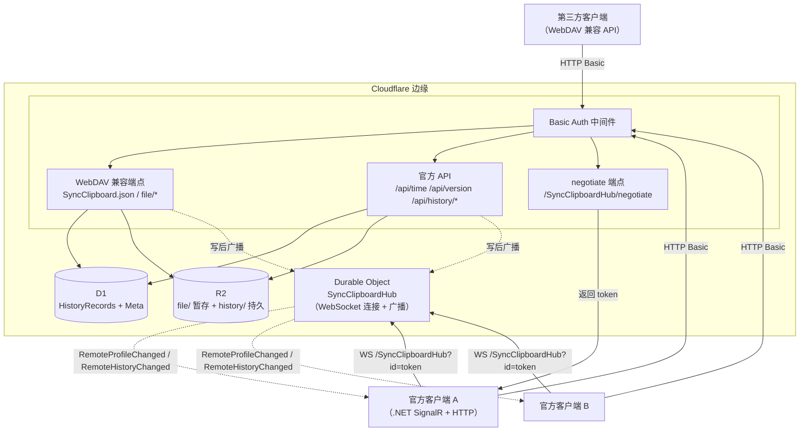

# SyncClipboard CfServer — 总体设计

> 状态：已敲定（2026-09-12）。协议契约见 [protocol.md](protocol.md)；开发进度见 [progress.md](progress.md)。

## 1. 项目概述

用 TypeScript 在 Cloudflare Workers 上复刻 [SyncClipboard](https://github.com/Jeric-X/SyncClipboard)
官方同步服务器（`SyncClipboard.Server.Core`，ASP.NET Core），使现有官方客户端
（Windows/macOS/Linux 桌面端，以及基于 WebDAV 兼容 API 的第三方移动端）无需任何改动即可
直接连接部署于 Cloudflare 边缘网络的服务器，获得与官方服务器一致的全部能力：

- 剪贴板 Profile 的读写同步（WebDAV 兼容 API）
- 官方服务器专属的实时推送（SignalR）
- 历史记录存储与跨设备同步（`/api/history/*`）

### 目标

1. **协议完全兼容**：官方客户端 v3.1.1+（当前 master 客户端 `Env.RequestServerVersion = "3.1.1"`）零改动可用。
2. 部署在 Cloudflare：无服务器、全球边缘、免运维。
3. 行为语义与官方服务器一致（包括错误码、广播、历史查找下载等细节）。

### 非目标

- 不实现 WebDAV 完整协议（PROPFIND 多状态响应、DAV 锁等）——官方服务器也只实现了协议所需子集。
- 不实现 SignalR 的 SSE / 长轮询传输——通过 negotiate 只宣告 WebSockets 强制客户端走 WS。
- 不做多租户——官方服务器单用户（`HARD_CODED_USER_ID = "default_user"`），Basic Auth 只是门禁。
- 不兼容 v3.1.1 之前的老协议（官方自身也不兼容）。

## 2. 已敲定决策（ADR）

| # | 决策 | 理由 | 状态 |
|---|---|---|---|
| D1 | 语言 TypeScript（编译产物即 JS） | 类型系统兜住协议细节（DTO/枚举/时间格式），Workers 原生支持 | 已定 |
| D2 | 独立目录 + 独立 git 仓库（`SyncClipboardCfServer`） | 与上游解耦，发布/部署独立管理 | 已定 |
| D3 | 框架 Hono | 轻量、类型安全、Workers 生态标准 | 已定 |
| D4 | 历史记录 + 当前 Profile 存 D1（SQLite），数据文件存 R2 | 强一致、可事务；文件体量走对象存储 | 已定 |
| D5 | SignalR 兼容层用 Durable Object 持连接 + 广播 | Workers 无状态，连接状态必须落在 DO | 已定 |
| D6 | negotiate 只宣告 WebSockets 传输 | 官方客户端默认 WebSockets 优先，免去 SSE/长轮询实现 | 已定 |
| D7 | `/api/version` 返回 `VERSION` 变量（默认 "3.2.1"） | 客户端要求服务端 ≥ 3.1.1 | 已定 |
| D8 | 存储时间用 epoch 毫秒 INTEGER（D1），DTO 边界转 ISO8601 | 排序/比较精确，协议输出为标准 ISO 字符串 | 已定 |
| D9 | 严格复刻官方行为，不做行为超集 | 兼容性以官方实现为准（如 `GET /file/{name}` 仅按历史查找） | 已定 |
| D10 | 测试 = 协议级集成测试（`wrangler dev` + 真实 HTTP + `@microsoft/signalr`）+ 真实客户端联调 | 与 .NET 客户端同协议的 JS SignalR 客户端可验证握手细节 | 已定 |

## 3. 架构总览



## 4. 目录结构（规划）

```
SyncClipboardCfServer/
├── package.json / tsconfig.json / wrangler.toml
├── schema.sql                  # D1 建表语句（首次部署手动执行或 migration）
├── docs/
│   ├── design.md               # 本文件
│   ├── protocol.md             # 协议契约（精确到端点与字段）
│   └── progress.md             # 开发进度追踪
├── src/
│   ├── index.ts                # Worker 入口：Hono app、中间件装配、路由挂载
│   ├── auth.ts                 # Basic Auth 校验
│   ├── constants.ts            # HubPath、数据目录常量、错误消息
│   ├── types.ts                # ProfileDto / HistoryRecordDto / UpdateDto / QueryDto / StatisticsDto
│   ├── serialization.ts        # camelCase 序列化、枚举字符串、时间格式转换
│   ├── hash.ts                 # Text / File / Image / Group 哈希算法（协议级精确复刻）
│   ├── profile.ts              # Profile 服务端语义：校验、落盘移动、持久化命名
│   ├── db.ts                   # D1 访问层：CRUD、查询过滤、ShouldUpdate 判定
│   ├── storage.ts              # R2 访问层：暂存、持久化、历史查找下载
│   ├── hub.ts                  # 广播触发封装（写操作后通知 DO）
│   ├── routes/
│   │   ├── webdav.ts           # GET/PUT SyncClipboard.json、GET/PUT/DELETE file/*、PROPFIND/MKCOL
│   │   └── history.ts          # /api/history/* 全部端点
│   └── durable/
│       ├── SyncClipboardHub.ts # Durable Object：WebSocket 生命周期 + 广播 + 心跳
│       └── signalr.ts          # SignalR JSON 协议消息编解码（握手/ping/invocation）
├── test/
│   ├── hash.test.ts            # 哈希算法对照 C# 参考值
│   ├── protocol.test.ts        # HTTP 协议黑盒测试（wrangler dev 起本地服务）
│   └── signalr.test.ts         # @microsoft/signalr 真实客户端连接/广播测试
└── scripts/
    └── e2e.md                  # 真实客户端联调操作手册
```

## 5. 存储设计

### 5.1 D1 schema（`schema.sql`，镜像 `HistoryRecordEntity`）

```sql
CREATE TABLE IF NOT EXISTS HistoryRecords (
  ID INTEGER PRIMARY KEY AUTOINCREMENT,
  UserId TEXT NOT NULL DEFAULT 'default_user',
  Type INTEGER NOT NULL,               -- ProfileType 枚举值
  Text TEXT NOT NULL DEFAULT '',
  Size INTEGER NOT NULL DEFAULT 0,
  TransferDataFile TEXT NOT NULL DEFAULT '',
  TransferDataSha256 TEXT NOT NULL DEFAULT '',
  TransferDataMd5 TEXT NOT NULL DEFAULT '',
  FilePaths TEXT NOT NULL DEFAULT '[]',-- JSON 数组（业务未用，保留镜像）
  Hash TEXT NOT NULL,
  CreateTime INTEGER NOT NULL,         -- epoch 毫秒（UTC）
  LastAccessed INTEGER NOT NULL,       -- epoch 毫秒（UTC）
  LastModified INTEGER NOT NULL,       -- epoch 毫秒（UTC）
  Stared INTEGER NOT NULL DEFAULT 0,
  Pinned INTEGER NOT NULL DEFAULT 0,
  "From" TEXT NOT NULL DEFAULT '',     -- 保留列（SQLite 关键字，须引号）
  Tags TEXT NOT NULL DEFAULT '[]',
  ExtraData TEXT,
  Version INTEGER NOT NULL DEFAULT 0,
  IsDeleted INTEGER NOT NULL DEFAULT 0
);
CREATE INDEX IF NOT EXISTS idx_h_user_type_hash ON HistoryRecords(UserId, Type, Hash);
CREATE INDEX IF NOT EXISTS idx_h_user_create   ON HistoryRecords(UserId, CreateTime);
CREATE INDEX IF NOT EXISTS idx_h_user_access   ON HistoryRecords(UserId, LastAccessed);
CREATE INDEX IF NOT EXISTS idx_h_user_modify   ON HistoryRecords(UserId, LastModified);

CREATE TABLE IF NOT EXISTS Meta (
  Key TEXT PRIMARY KEY,
  Value TEXT NOT NULL
);
-- Meta 行：Key='current_profile' → ProfileDto JSON（camelCase）
```

`Type` 枚举值（`ProfileType`）：`Text=0, File=1, Image=2, Group=3, Unknown=4, None=5`。
`ProfileTypeFilter` 位掩码：`None=0, Text=1, File=2, Image=4, Group=8, FileAndGroup=6, All=15`。

### 5.2 R2 key 布局

| 区域 | Key | 说明 |
|---|---|---|
| WebDAV 暂存 | `file/{dataName}` | `PUT /file/{name}` 落此处；`PUT SyncClipboard.json` 成功后移出；`DELETE /file` 清空 |
| 历史持久 | `history/{Type}_{Hash}/{transferDataName}` | File/Image 保留原始文件名；Group 为 `File_*.zip` |

> 注意：`GET /file/{name}` **不直读**暂存区，而是按"历史记录 `TransferDataFile` 文件名匹配 + LastAccessed 倒序取最新"查找（复刻 `GetRecentTransferFile`），再读 `history/...`。找不到返回 404。

### 5.3 时间存储约定

- D1 存 epoch 毫秒 INTEGER（`Date.now()`），比较/排序无歧义。
- DTO 边界输出 ISO8601（`new Date(ms).toISOString()`，如 `2026-09-12T05:00:00.000Z`）。
  客户端用 `DateTimeOffset.TryParse(..., RoundtripKind)` 解析，`Z` 与 C# 的 `+00:00` 等价。
- 输入解析：`Date.parse` 可处理 ISO8601 与 C# 的 `+00:00` 后缀、7 位小数。
- 官方服务器在部分响应中输出 `DateTimeOffset.UtcNow`（`/api/time` 等），格式 `...Z`。

## 6. 核心数据流

### 6.1 上传剪贴板（官方客户端 → 服务器）

```
客户端: PUT /file/{DataName}（二进制，暂存 file/{DataName}）
客户端: PUT /SyncClipboard.json（ProfileDto JSON）
服务器:
  1. 解析 ProfileDto（camelCase，Type 字符串枚举）
  2. hash 非空 且 历史命中（Type+Hash 且 !IsDeleted）?
     → 更新记录：LastAccessed=LastModified=now, Version++
       → 广播 RemoteHistoryChanged(记录 dto)
       → 写 Meta.current_profile = 记录 dto
       → 200
  3. 否则（新建或复活）:
     a. dto.HasData 且 DataName 空 → 400 "DataName cannot be null or empty when HasData is true"
     b. R2 读 file/{DataName}，不存在 → 404 "Transfer data file not found"
     c. 按类型校验数据哈希（见 protocol.md §8），不符 → 400 "Hash is not match data."
     d. 移到 history/{Type}_{Hash}/{transferDataName}
     e. 插入/更新历史记录（存在则复活：IsDeleted=false, 刷新时间, Version++；不存在则新建）
     f. 写 Meta.current_profile，广播 RemoteProfileChanged(dto) + RemoteHistoryChanged(记录 dto)
     g. 200
```

### 6.2 下载剪贴板（官方客户端轮询/事件 → 下载数据）

```
事件路径：DO 收到 RemoteProfileChanged → 推给所有连接（客户端 A 收到后按需 GET）
轮询路径：GET /SyncClipboard.json → Meta.current_profile（无则返回空 TextProfile dto）
下载数据：GET /file/{DataName}
  → 历史查找（TransferDataFile 文件名 == DataName，LastAccessed 倒序第一条）
  → R2 读 history/{Type}_{Hash}/{name} → 200 二进制
  → 找不到 → 404
```

### 6.3 历史上传（客户端 POST /api/history，multipart 流式）

```
1. 解析 multipart：元数字段（大小写不敏感）+ data 文件流（必须最后）
2. 记录已存在?
   → 是：IsDeleted 则先补数据；ShouldUpdate（见 §7）为真则更新（Version=max(incoming, existing+1)）→ 广播 → 删除数据(若删除标记)
   → 否：写文件（R2 history/...，SetTransferData verify）→ 校验失败 → 422（code=history_data_invalid）→ 入库 → 广播
3. 200 + serverDto
```

### 6.4 历史查询 / 更新

- `POST /api/history/query`：multipart 表单 → 过滤（before/after/modifiedAfter/types 位掩码/searchText LIKE/starred）→ 分页 50 → `List<HistoryRecordDto>`。
- `PATCH /api/history/{type}/{hash}`：部分更新（starred/pinned/isDelete/lastModified/lastAccessed/version）→
  `ShouldUpdate` 为真 → 更新 + 广播 + 200 空体；为假 → 409 + 服务器当前 update dto；记录不存在 → 404。

## 7. 并发与一致性

- **更新判定**（复刻 `HistoryHelper.ShouldUpdate`）：
  `|newLastModified - oldLastModified| <= 5 分钟` 时按 `newVersion >= oldVersion`；
  否则按 `newLastModified >= oldLastModified`。
- D1 写操作用 SQL 事务；`PATCH` 采用"读-判定-写"（D1 单语句可原子完成场景下用条件 UPDATE）。
- 当前 Profile 单行 `Meta` 读写；并发多设备写为 last-write-wins（官方同为覆盖语义）。
- 广播与写不在同一事务：先落库、后广播，广播失败不影响 200（与官方一致，官方 `_hubContext` 抛错被吞）。
- R2 暂存区 `file/` 是客户端上传与服务器移入之间的窗口，存在"重复上传覆盖"与"移走后 404"竞态，
  与官方文件系统语义一致，客户端有重试（重新 PUT /file 再 PUT SyncClipboard.json），无需额外处理。

## 8. 错误语义

| 状态码 | 场景 | 响应体 |
|---|---|---|
| 200 | 成功（PATCH 成功为 200 空体） | 按端点 |
| 400 | 参数非法 / 哈希不符（`Hash is not match data.`）/ 历史数据无效 | 纯文本错误消息 |
| 401 | Basic Auth 失败 | — |
| 404 | 记录/文件/暂存文件不存在 | — |
| 409 | PATCH 版本冲突 | JSON `HistoryRecordUpdateDto`（服务器当前值） |
| 422 | POST /api/history 数据校验失败 | ProblemDetails `{"status":422,"title":"History transfer data is invalid","code":"history_data_invalid","detail":"..."}` |

客户端对上述语义有硬依赖（409 回写本地、422 判定数据拒绝、400/404 重试路径），必须精确复刻。

## 9. 历史保留与清理（对齐上游 HistoryCleaner）

| 上游任务 | 周期 | 语义 | CF 实现 |
|---|---|---|---|
| LimitHistoryCountTask | 10 分钟 | `RemoveOutOfRetentionRecords(HistoryRetentionMinutes)` + `SetRecordsMaxCount(MaxSavedHistoryCount)` | 同一 Cron 批次 |
| CleanDeletedHistoryTask | 12 小时 | 硬删 `IsDeleted` 且 `LastModified < now-30d` | 同一 Cron 批次 |
| CleanOrphanedFoldersTask | 12 小时 | 删无活记录引用的 `{Type}_{hash}` 目录 | 同一 Cron 批次 |

- 触发：`wrangler.toml [triggers] crons = ["17 * * * *"]`（CF 侧统一每小时一次批量执行）
- 配置：`MAX_SAVED_HISTORY_COUNT`（默认 1000）、`HISTORY_RETENTION_MINUTES`（默认 10080 = 7 天）
- 保留规则：过期的**未收藏/未置顶/未删除**记录才删；条数裁剪按 `MAX(LastModified, LastAccessed)` 升序软删最旧的，收藏/置顶豁免
- 每次删除同步清理 R2 工作目录，并广播 `RemoteHistoryChanged`（与上游逐条通知一致）
- 实现：`src/cleanup.ts`（`runCleanup`）+ `src/index.ts` 的 `scheduled` handler + `db.ts`/`storage.ts` 数据层方法

## 10. 版本策略

- `/api/version` 返回 `VERSION` 变量（wrangler.toml `[vars]`，默认 `"3.2.1"`）。
- 官方客户端校验 `serverVersion >= Env.RequestServerVersion("3.1.1")`，低版本拒绝连接。

## 11. 部署指南

```bash
# 1. 安装依赖
npm install

# 2. 创建资源
npx wrangler d1 create syncclipboard        # 输出 database_id，填入 wrangler.toml
npx wrangler r2 bucket create syncclipboard
npx wrangler deploy --dry-run               # 首次部署 DO 迁移

# 3. 初始化 D1 schema
npx wrangler d1 execute syncclipboard --remote --file=./schema.sql

# 4. 设置凭据
npx wrangler secret put USERNAME
npx wrangler secret put PASSWORD

# 5. 部署
npm run deploy

# 6.（可选）自定义域名：wrangler.toml 增加 routes 或 Cloudflare 控制台绑定
```

本地开发：`npm run dev`（miniflare 模拟 D1/R2/DO；本地 D1 用 `wrangler d1 execute --local` 初始化 schema）。

## 12. 测试策略

| 层 | 手段 | 覆盖 |
|---|---|---|
| 单元 | vitest（纯函数） | 哈希算法（对照 C# 参考值）、ShouldUpdate、时间格式、枚举解析 |
| 集成（黑盒） | `wrangler dev` 起本地服务，vitest 发真实 HTTP | 全部端点行为、错误码、上传/下载/历史全流程 |
| SignalR | `@microsoft/signalr`（与 .NET 客户端同协议）连本地 hub | negotiate、握手、ping、广播接收 |
| E2E | 本机官方客户端（WinUI3/Avalonia）连接 `wrangler dev` / 部署 URL | 真实客户端全流程（含历史同步） |

## 13. 风险登记

| 风险 | 等级 | 缓解 |
|---|---|---|
| Workers 免费版单请求体上限 100MB，大文件同步受限 | 中 | 剪贴板默认 MaxFileByte=20MB；文档注明限制；付费计划可提升 |
| SignalR 协议细节多（token 模式/握手/ping） | 中 | `@microsoft/signalr` 真实客户端测试；只宣告 WebSockets 缩小面 |
| D1 免费版写并发/读主库限制 | 低 | 单用户秒级频率，远低于限额 |
| Group ZIP 校验在 JS 端性能（大压缩包） | 低 | fflate 流式处理；单文件解压逐条哈希 |
| DO 单实例为广播单点 | 低 | 个人场景足够；DO 迁移由平台保障连接不掉 |

## 14. 里程碑

- [x] M0 方案敲定 + 设计文档（本文件 + protocol.md + progress.md）
- [ ] M1 脚手架与本地开发环境（依赖安装、schema、`wrangler dev` 跑通 hello）
- [ ] M2 HTTP 层：Basic Auth + WebDAV 兼容端点（含哈希校验与历史查找）
- [ ] M3 官方 API：/api/time、/api/version、/api/history/* 全套
- [ ] M4 SignalR 兼容 Hub（DO：negotiate + WS + 握手 + 心跳 + 广播）
- [ ] M5 协议级集成测试全绿（hash/protocol/signalr）
- [ ] M6 真实客户端联调（Windows 官方客户端 → wrangler dev → 部署）
- [ ] M7 部署上线 + 运维文档（README 完善）
