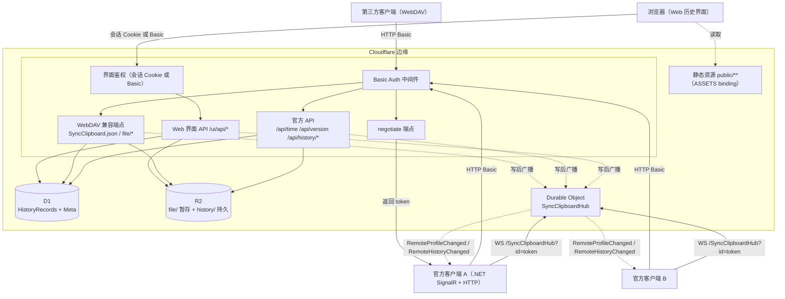

# SyncClipboard CfServer — 总体设计

> **精简介**：本节起为 2026-10-04 的整篇重写（原文 721 行）；历史版本见
> `git show <hash>:docs/design.md`：重写前最近一版 `e88599f`，初版见
> `git show --diff-filter=A --format=%h -- docs/design.md`。
>
> **内容分工**（本文件回答的问题）：
> - **为什么这么设计** → §2 的 ADR 表（**46 条，逐字保留** —— 每条都被代码或其它文档按 `D<n>` 引用）；
> - **东西放在哪** → §4 的目录树（**由 `test/docs.test.ts` 逐项校验**，见 §4 的说明）；
> - **数据与流程长什么样** → §5–§9；
> - 逐条协议行为 → [`protocol.md`](protocol.md)；界面 → [`ui.md`](ui.md)；历史开发记录 → [Git history](Git history)（冻结档案，非现行规范）。

## 1. 项目概述

用 TypeScript 在 Cloudflare Workers 上复刻 [SyncClipboard](https://github.com/Jeric-X/SyncClipboard)
官方同步服务器（`SyncClipboard.Server.Core`，ASP.NET Core），使现有官方客户端
（桌面端，以及基于 WebDAV 兼容 API 的第三方移动端）**无需任何改动**即可连接部署在 Cloudflare 边缘的服务器，
获得与官方服务器一致的能力：

- 剪贴板 Profile 的读写同步（WebDAV 兼容 API）
- 官方服务器专属的实时推送（SignalR）
- 历史记录存储与跨设备同步（`/api/history/*`）

**目标**：① 协议完全兼容（官方客户端 v3.1.1+ 零改动可用）；② 部署在 Cloudflare（无服务器、全球边缘、免运维）；
③ 行为语义与官方一致（错误码、广播、历史查找下载等细节）。

**非目标**：不实现完整 WebDAV（DAV 锁等 —— 官方也只实现了协议所需子集；`PreciseDelete` 需要目录列举，
故实现了 RFC 4918 的 `PROPFIND` 207）；不实现 SignalR 的二进制协议（官方客户端用默认 JSON，
但传输宣告里保留上游同款的 `"Binary"` 以逐字对齐 negotiate 载荷）；不做多租户（上游就是单账号 + 硬编码 UserId）；
不兼容 v3.1.1 之前的老协议；不提供 `/dav` 前缀别名（D15）。

## 2. 已敲定决策（ADR）

**这张表是 `D<n>` 编号的唯一权威** —— 代码、测试与其它文档里的 `ADR D29`、`（D42）` 之类都指向这里。

| # | 决策 | 理由 | 状态 |
|---|---|---|---|
| D1 | 语言 TypeScript（编译产物即 JS） | 类型系统兜住协议细节（DTO/枚举/时间格式），Workers 原生支持 | 已定 |
| D2 | 独立目录 + 独立 git 仓库（`SyncClipboardCfServer`） | 与上游解耦，发布/部署独立管理 | 已定 |
| D3 | 框架 Hono | 轻量、类型安全、Workers 生态标准 | 已定 |
| D4 | 历史记录 + 当前 Profile 存 D1（SQLite），数据文件存 R2 | 强一致、可事务；文件体量走对象存储 | 已定 |
| D5 | SignalR 兼容层用 Durable Object 持连接 + 广播 | Workers 无状态，连接状态必须落在 DO | 已定 |
| D6 | negotiate 按上游顺序宣告三种传输（WebSockets → ServerSentEvents → LongPolling） | 与上游一致；WS 被代理/防火墙阻断时客户端可自动降级（原先只宣告 WS 会直接失联）。SSE 走流式响应、长轮询走挂起请求，均在 Durable Object 内实现 | 已定（2026-09-12 修订） |
| D7 | `/api/version` 返回 `VERSION` 变量（**默认 `"3.3.0-beta1"`，逐字对齐上游基线** `Directory.Build.props` 的 `VersionPrefix` + `VersionSuffix`；2026-09-15 从 `"3.2.1"` 改为 `"3.2.0"`，2026-09-22 随上游 #435 跟到 `3.3.0-beta1`，理由见 `protocol.md` §10 与 Git history§162） | 客户端要求服务端 ≥ 3.1.1；自我描述须与上游一致 | 已定（2026-09-15 修订；2026-09-22 跟版） |
| D8 | 存储时间用 epoch 毫秒 INTEGER（D1），DTO 边界转 ISO8601 | 排序/比较精确，协议输出为标准 ISO 字符串 | 已定 |
| D9 | 严格复刻官方行为，不做行为超集 | 兼容性以官方实现为准（如 `GET /file/{name}` 仅按历史查找） | 已定 |
| D10 | 测试 = 协议级集成测试（`wrangler dev` + 真实 HTTP + `@microsoft/signalr`）+ 真实客户端联调 + **真上游服务端 A/B**（`tools/ab-upstream-probe.ps1`，官方 v3.2.0 发布件逐条对照，退出码只对**未登记差异**报错——2026-09-15 增补） | 与 .NET 客户端同协议的 JS SignalR 客户端可验证握手细节；但**"我们读懂的协议"不等于"上游真的这么做"**——凡属推断的行为都必须有一次对真上游的实测（见 Git history） | 已定（2026-09-15 修订） |
| D11 | **提交粒度与推送策略**（2026-09-13 修订）：**本地**可多次 minor commit（细碎、随手记）；**推送到云端 `master` 前**按主题压成合适的提交（每个逻辑变更一条），不把一堆小提交直接推 | 本地细碎便于迭代与回滚；云端历史要能看出演进，不该被几十条同类微调淹没。**修订原因**：原约定"禁止 squash/force push"在实践里产生 91 条提交、其中大量是同一件事的反复微调，云端历史反而更难读（已在用户要求下把 91 条压成 13 条：根提交 + 12 个主题提交，见 Git history；**第二次** 2026-09-15 把 89 条压成 33 条——前 13 条原样保留、14–89 共 76 条按主题压成 20 条，见 §50；**第三次** 2026-09-18 把 70 条压成 46 条——前 34 条原样保留、35–70 共 36 条按主题压成 12 条，见 §77；**第四次** 2026-09-18 把 58 条压成 15 条——根提交原样保留、其余 57 条按主题压成 14 条，见 §83）。**改写已推送历史时的硬约束**：① 先建备份分支（**只留本机**，2026-09-18 起不再推云端，见 §78）；② 用树快照回放，保证新 HEAD 与旧 HEAD **树逐字节一致**（`git diff` 必须为空）；③ 推送前跑全量套件且**真门禁**（`set -o pipefail` 或 `if` 判定退出码，别让管道吞掉失败）；④ 用 `--force-with-lease` 推送，不用裸 `--force` | 已定（2026-09-12，2026-09-13 修订；2026-09-18 备份分支改「只留本机」） |

> **D11 的机械执行步骤**（`read-tree` 回放 + 逐组 `git diff` 断言 + `--force-with-lease`）
> 留在原文件，用 `git show <hash>:docs/design.md` 查（重写前最近一版见本文件头）。四条硬约束见上表。
| D12 | Web 界面用 **Workers 静态资源 + 独立 `/ui/api/*` 命名空间**承载 | 官方 `/api/history/*` 是**协议契约**，不能为界面需要（可变页大小、多列排序、选择集、缩略图）而改动；界面另开一层，但读写同一张表、复用同一套行映射与 DTO 序列化 | 已定（2026-09-13） |
| D13 | 界面会话用**无状态签名 Cookie**（HMAC-SHA256，密钥由 `PASSWORD` 经 HKDF 派生） | Workers 没有可靠的进程内状态，服务端会话表会让每次页面请求多一次写库；签名 Cookie 零存储、可水平扩展，且改密码即让全部会话失效 | 已定（2026-09-13） |
| D14 | `motion-web` 技能的取用**限于设计系统与打磨层**，不走它的页面蓝图路径 | 该技能自述范围是创意/营销页并明确排除 dashboard/admin UI，而本界面正落在排除侧。取用其令牌层、组件方言与状态矩阵、生产打磨与动效令牌；不生成 hero/分节文案/编造指标 | 已定（2026-09-13） |
| D15 | **不实现 `/dav` 前缀别名**（另一个实现 `clipserver` 的端点前缀） | 本项目 WebDAV 端点在站点根，`PROPFIND` 的 `href` 从根计算。让前缀可用必须改写协议输出（href 前缀），为一个迁移便利碰协议保真不值得；迁移只需把客户端地址改成站点根（界面「部署信息」直接给出可复制地址） | 已定（2026-09-13） |
| D16 | **界面是可关闭的**：`UI_ENABLED`（GitHub 仓库变量，默认开）关闭后三个界面挂载点（`/ui`、`/ui_v1`、`/ui_v2` —— 2026-09-19 改名后是三个，当初是 `/ui` 一个）与 `/ui/api/*` 一律 404，根路径不再跳转；协议面不受影响。实现上必须让界面请求**先进 Worker**（`[assets] binding = "ASSETS"` + `run_worker_first`），否则平台在 Worker 之前就把静态资源托管掉了，开关无从生效 | 只想要"纯协议后端"的使用者（把服务端给别人的场景、不想暴露登录页）应当能一键关掉界面，而不是去改仓库或删资源。**不改协议面**是这个开关的硬边界：官方客户端不碰任何界面挂载点（`/ui*` —— 三个前缀都不碰，原写 `/ui_v2/*` 是 2026-09-19 改名替换打偏的收窄），因此开关对客户端零影响 | 已定（2026-09-15） |
| D17 (界面定位) | **默认界面 = V1**（`public/ui_v1/`，挂载点 `/ui_v1/`）；站点根 `GET /` 的浏览器分支与 `/ui/` 的跳转壳都指向它。V2（`public/ui_v2/`，本体 `/ui_v2/app/`）降为**开发测试版**，进去后顶栏版本号与登录页副标题都标着"开发测试版" | 用户 2026-09-18 的定位：V1 经过 2026-09-17～18 的多轮完善（密度、移动端、对比度、状态矩阵、按下反馈）后功能与质量都更完整，而 V2 是零构建方案的实验场（新的模块划分、状态矩阵、探针都先在那边试）。**物理目录名不动**：V1 的资源前缀是写死的 `/ui_old/*`（**当时叫这个名** —— `ui_v1` 是 2026-09-19 才改的，见 历史改名记录（见 Git 历史）），把它搬到当时那个默认入口命名空间（`/ui/`）要同时改写全部前缀，而 2026-09-15 的改名事故已经付过一次学费 —— 变的只是入口（**2026-09-19 更新**：物理目录名随后也改了 —— `ui_old`→`ui_v1`、`ui`→`ui_v2`，见 历史改名记录（见 Git 历史）） | 已定（2026-09-18，提交 `f114242`） |
| D17 (请求体上限) | **请求体上限默认 48 MiB、可调到 64 MiB**；并且**不用两个独立上限**，而是"合计工作集预算 96 MiB + 随请求体动态收缩的 zip 解压预算"（`src/requestLimits.ts`、`src/hash.ts` 的 `groupZipDecompressionCap`） | isolate 内存 128 MiB 被**所有并发请求共享**，而 Group 上传时"压缩体 + 解压内容"同时占内存 ⇒ 两个上限各自贴顶会变成 48+64 甚至 80+64，直接顶穿 isolate（OOM 会让并发中的其他请求一起 503，比 413 严重得多）。默认值贴"实际会发生的大小"（客户端默认 20 MB、线上最大 29.0 MiB），上限贴"能承受的极限"。完整推导见 §7.1。注：历史提交中该决策与上述「界面定位」同获编号 D17，两者按主题并立 | 已定（2026-09-15；沿革 32 → 64 → 48） |
| D18 | **推送后不等 CI**（2026-09-18 用户要求）：`git push` 成功即**结束这一轮**。**禁止** `gh run watch`、`gh run watch --exit-status` 以及任何"轮询到跑完为止"的等待；要确认它有没有起跑，最多允许**一次**非阻塞快照 `gh run list --limit 1` | 本仓库的质量门在**本地**：D10 的协议级套件 + `npm run check`，且 D11 已规定"推送前跑全量套件且用真门禁"。CI 是**兜底**，不是我的判据；而 `deploy` 作业还要真的部署到 Cloudflare，一趟 2–3 分钟 —— 阻塞等待只是把用户晾在对话里，等一个与本轮结论无关的状态。跑失败不会丢：GitHub 自己会通知，下一次改动也会撞见 | 已定（2026-09-18） |
| D19 | **两处「清除筛选」一律回到活跃列表**（2026-09-20 定案）：筛选工具条那枚与空状态里那枚都清掉全部条件（**包括「回收站」这个条件**），语义与 V1 同答；`boot.js` 的 `resetFilters({ keepView })` 形参随之删除 | 这两处此前**行为相反**（工具条回活跃、空状态留在回收站 —— 2026-09-18 只改了后者的遗留，见 历史审计（见 Git 历史） §P2 与 Git history）：同一个名字的按钮，两种后果。不取"留在所在视图"的理由：它要求把「回收站」从"是否处于筛选态"的判据（`isDefaultFilters`）里排除，否则工具条那枚点完**按钮仍在** ⇒ 读起来像没生效；而"清除筛选 = 回到默认"不需要动那套判据，且与 V1 现状一致。真要"只清条件、不换视图"，那是改按钮文案（换个名字）的事，不是同一个按钮两种行为 | 已定（2026-09-20） |

| D20 | **测试工具链不引入新依赖**（2026-09-21）：`@cloudflare/vitest-pool-workers` 与 Playwright 各做过一次**有判据的试点**，本轮都**不并入产品树**；同时把 5 份 `node:sqlite` D1 适配器收敛为 `test/support/d1-sqlite.ts` 一份 | 池（vitest 2 能用的最高版是 0.12.x）**自带的引擎是另一个构建**：同一个 LIKE 模式，dev server 报 `LIKE or GLOB pattern too complex: SQLITE_ERROR`，池里连 202 字节都通过 ⇒ 把黑盒套件搬进池，会把「真 D1 才复现」的那一族（§95 修的四处 500 全是这类）**测成绿的**。Playwright 能力上可行（同三个读数逐字节吻合、`Performance.enable` 后能取 §11.2 那四个指标），但替换 4112 行探针属"改门禁工具"级别的独立任务。读数、坑与触发条件见 Git history–§105.7 | 已定（2026-09-21） |

| D21 | **文档预览引入 `file-viewer`**（2026-09-21，方案层）：V1 增加「文档预览」这一档 —— 重格式（PDF/Office/压缩包/邮件/音视频）交给第三方只读渲染器，**外壳/判据/文案/状态机仍归我们**；产物以**预构建 vendor 入库**（不改 V1 的零构建定位）；判据只有一处（前端 `viewerRoute()`）；入口是**独立预览页**（列表页首屏不加载第三方资产）；**排除 CAD**（运行时 AGPL-3.0-only：网络条款 + 解读不确定 + 体积最大；取舍记录见该文档 §5 D-1） | 现状只有「文本/位图内联预览」与「其余只下载」两档，docx/xlsx/pdf/zip 只能下载后本机打开；而 221 扩展名/32 管线的成熟只读渲染器已存在且自有源码是 Apache-2.0。**代价照实登记**：预览页需放宽 CSP（`style-src 'unsafe-inline'`、`wasm-unsafe-eval`、`worker-src`、`img-src blob:`、`media-src`）⇒ 等于在同源下执行第三方解析器处理不可信文件，这一步**执行前需单独授权**（备选是独立 hostname 隔离）；`web-full` 实测 236 MB / 2961 文件，故必须窄装配。**轮 4 复审修订**（同行日期文档 §10 末段）：① CSP 放宽的**出口**不是 `_headers` 的按页规则
（同名字段逗号合并 ⇒ 交集 ⇒ 无效），而是**由 Worker 出预览页的响应**；② `web-full` ＝ `preset-all`，其依赖链含 **AGPL-3.0-only** 的 CAD 运行时
⇒ 连"用它来量体积"都不该做，改为**离线构建标准档**（`@file-viewer/web` 只有壳，renderer 必须由打包器装配） | **已定**（2026-09-21 含 CSP 放宽授权：仅预览页；**方案已定、实现未开始** —— 树里暂无 `viewerRoute()`/vendor，`public/_headers` 的 CSP 也仍是严格那套）—— 机制修正见 [Issue #4](https://github.com/Leexunhuan743/SyncClipboardCfServer/issues/4) §5 D-8 |

| D22 | **共用层 `public/ui_shared/`**（2026-09-21）：两版之间的共享面**收敛为唯一一层** —— 只放"不随某一版演进"的东西（品牌图标；无版本耦合的纯数据模块如 `icons.js`；将来放双语/翻译资源）。V1 的模块只允许逃到这一层，`/ui_v2/` 依旧禁引；挂 `/ui_shared/`、与其它三个挂载点同受 `UI_ENABLED` 管 | 此前 `favicon.svg`/`favicon-32.png`/`apple-touch-icon.png` 两版各存一份（**逐字节相同**）、`icons.js` 两份（并集关系、仅 `trash` 几何不同）—— 纯重复。**代价照实登记**：红线由"V1 完全自包含"放宽为"V1 只依赖自己 + 共用层"，`ui-guard` 的两条判据与四处文档同步改；**没有**把两版"实现有意不同"的模块（`format`/`dom`/`filters`/`api`/`messages`…）搬进去 —— 那会把"改一版"变成"两版一起变" | 已定（2026-09-21） |

| D23 | **统计条的两个计数卡随当前视图走**（2026-09-21）：V1 统计条「记录」与「已收藏」两格不再恒用全库口径——活跃视图显示 `activeCount` / `starredCountActive`，回收站视图显示 `deletedCount` / `starredCountDeleted`。「存储占用」仍**恒为活跃口径**（**修订（2026-09-22，ADR D29）**：原文写的是"已删记录的 R2 文件在软删时就删了"—— 真回收站之后**不再成立**（数据留 ≤30 天）。该字段今天的实际口径是「**活跃记录**的按类型分布」，且**当前没有前端消费方**（统计条 2026-09-17 起不再列类型明细），而「存储占用」的字节数来自 R2 实列（`storage.totalHistorySize()`，含回收站字节）⇒ 两者口径**有意不同**；`docs/ui.md` §5 的 `byType`/`byTypeActive` 分法未变）。服务端在 `/ui/api/statistics` 与 `/ui/api/overview` 各加 `starredCountActive` / `starredCountDeleted`（一条 `GROUP BY Type, IsDeleted, Stared` 顺带算出，**协议 DTO 的 `starredCount` 语义不动**） | 卡片与同屏的「收藏」筛选（活跃 9 条 vs 全库 12 条）与「回收站 · 共 N 条」头栏（69 vs 67）对不上——正是 `byType` 那条"控件必须与列表同源"纪律（"列表说 1019、控件说 1009"）的同一类问题，而统计条自己 2026-09-17 就因"两个口径并排会被读成自相矛盾"删过类型明细。不取"改卡片文案注明口径"：那只把矛盾换成一行解释，数字照旧对不上。**代价照实登记**：`/ui/api/statistics` 的载荷多了两个键（`starredCountActive`/`starredCountDeleted` 都是全表聚合、与请求视图无关），overview 的顶层字段因此与 statistics 的扁平形状不一致——前端落地时必须逐键搬（漏搬的静默表现是那一格回落成 0，2026-09-21 实测踩过） | 已定（2026-09-21） |

| D24 | **V1 引入第二个 hover 机制：自定义 tooltip 浮层**（2026-09-21，用户要"悬停看截断全文"）：长内容（行内正文）用自建 `js/components/tooltip.js`，短元数据（时间列、图标按钮）继续用原生 `title`。触发 `@media(hover:hover) and (pointer:fine)`、悬停 150ms、只在内容真被裁掉时出现（判据 `scrollHeight > clientHeight`）、触屏不挂监听 | 原生 `title` 对长文本排版差（不可换行）、延迟 ~1s、不可控；而"悬停看更多"要的是可读的多行浮层。**信息绝不靠 hover 单独传达**：全文/完整内容仍由点击预览与键盘可达（a11y 底线）。它同时是 docs §8.2 记的"跟随"族（handfeel §7）在 V1 的**第一个消费者**，按"必须到达并停住"实现。不建 CONTEXT.md 词汇表：V1 的交互语言约定本来就住在 `docs/ui.md` §3.3（硬约束 #26），单开一个词汇表文件是这个仓库没有的形态（最简） | 已定（2026-09-21） |
| D25 | **tooltip 必须不接收指针事件，且正文按行数封顶**（2026-09-21 重做；同日推翻 D24 首版的"可移入滚动/复制"，随后按用户要求再删掉「点击预览查看完整」提示行）：`.tooltip` 用 `pointer-events: none`，正文区 `max-height: calc(6 * 1.6em)` 后裁掉，**不给滚动条也不给说明行**；`role="tooltip"`/`aria-describedby`/focus 监听**全部删除**（触发元素是普通 `div`，那三个监听永远不响 —— 声称支持键盘、实则没有的死代码） | **首版是坏的**：浮层贴在行下方、必然压住后面 2–5 行，而它 `pointer-events: auto` 且可滚动 ⇒ 实测 `elementFromPoint` 在覆盖处返回浮层本身，鼠标顺着一列往下走"走不过去"，**被压住的行连 hover 与点击都没了**（截图与数字见 Git history）。两条选择是互斥的：可移入滚动 ⇒ 必须接收指针 ⇒ 必然封死下面的行。取舍方向由场景决定 —— 这是**读一张密集列表**，不是读一条内容；而"移进去复制"本来就有行内「复制」与「预览」两条路。因此要的形态是**看得见、不挡路**：不可移入、高度封顶、没有多余的字。提示行删掉之后，"被裁过"由行内的 `长文本` 徽标承担，取全文仍走「预览」 | 已定（2026-09-21） |
| D26 | **回收站新增"彻底删除"（单条 + 选中批量），服务端只做纯硬删**（2026-09-21，用户在真机逐档实测后定）：新端点 `POST /ui/api/history/batch-purge`（≤100 条/次）只执行 `DELETE … WHERE IsDeleted != 0`（判据写在 SQL 里 ⇒ 活跃记录删不掉）；**不广播**（理由见下）；**删行后顺带清扫它的数据目录**（**修订（2026-09-22，ADR D29）**：原文是"**不碰 R2** —— 软删时数据目录已清，残留由清理任务的孤儿阶段兜底"；真回收站之后必须扫，否则"彻底删除"只是把行抹掉、字节留给孤儿阶段等 ≤20 分钟）。界面侧：回收站行内动作从 1 个变 2 个（恢复槽 1 / 彻底删除槽 4），选择条加「彻底删除选中」 | **为什么必须加**：此前回收站只有「恢复」与「清空回收站」两个出口，想永久删掉**几条**做不到 —— 只能整罐倒（实测线上回收站里就躺着 3 条用户记录 + 我的测试数据，清空一次全没）。上游也没有这个能力（它的硬删是 30 天定时任务），所以这是本站自己的面：路由在 `/ui/api/*` 下、官方客户端不感知、`docs/protocol.md` §10 无需登记。**为什么纯硬删**：软删那条路径每条要 1 读 + 1 写 + 1 广播 + 2 次 R2 目录清理（实测 68–81 ms/条），而"彻底删除"的语义就是"从库里拿掉"，没有并发合并可言 ⇒ 每条 1 次 D1 子请求（实测 3 ms/条，比软删快 20 倍）。逐条广播会顶到单次调用 1000 次子请求的上限，且与 `clear` 的既有处置同构（本站标签页靠 `/ui/api/poll` 收敛） | 已定（2026-09-21） |
| D27 | **批量操作给进度、失败口径改成"已生效 X / 未生效 Y"**（2026-09-21 实测后改）：`confirm.ask` 的 `action` 现在收到 `{ setMessage}`，调用方把「正在处理第 i / n 批…」写进确认框正文；批量写/彻底删除的部分失败**不再整体抛错**，而是先 `refresh` 把界面拉回事实、再用 `batchPartialText(updated, failed)` 说明条数 | **为什么**：生产实测 300 条批量删除 = 3 次请求 **51 秒**，全程只有一个转圈，用户既不知道走到哪也没法判断是不是卡死；而"有 N 条未生效，请刷新后重试"读起来像整体失败 —— 实际上服务端逐条判定，落空通常只是那几条被别的设备改过，其余几十条已经生效，用户会白重做一遍。另外**批量恢复改为按 `hasData` 预筛**：带数据文件的记录服务端一定拒绝，塞进去只会让"未生效"多几条噪音 | 已定（2026-09-21） |
| D28 | **长批量在途可中止：确认框的「取消」在途变「中止」，中止点是"批"的边界**（2026-09-21）：`confirm.ask` 在途把取消键改成「中止」并 `abort()` 本次动作的 controller（✕/Esc 仍在途挡住，F2 不变）；`api.js` 的批量循环在**片与片之间**检查 signal，中止时**返回已生效计数而不是抛错**（超时仍抛，用 `error.name` 区分）；文案 `batchAbortedText(已生效)` | 原来不许用户在途关框（F2：关掉会让调用方把"已成功"读成"用户取消"），代价是 300 条的批量中途没法停、只能刷页面（实测 3 批、客户端所见几十秒）。**取舍**：与其"关不掉"，不如给一条**诚实的中止** —— 服务端一次请求内部不会被打断（那 100 条一定跑完），所以中止点天然落在批与批之间，不会出现半条记录；已生效多少如实报出。不改服务端、不改协议（取消只发生在客户端分片循环之间）。单条动作与清空回收站是单次请求，不接这条 | 已定（2026-09-21） |
| D29 | **回收站改成"真回收站"：软删保留数据，30 天硬删 /「彻底删除」时才清**（2026-09-22，用户在 A/B 之间点选 B）：`historyOps.applyHistoryUpdate` **与 `profile.addRecordDto`（POST 写路径）**都不再在软删时清 R2 目录（后者是**同日审核补上**的：它是上游 `HistoryService.cs:328/387` 的忠实移植，只改 PATCH 会让经 POST 软删的记录进回收站后**没有数据**）；`db.updateHistory` 去掉上游那条「有数据就不许恢复」的守卫；孤儿阶段的参照集从「只算活跃记录」改成「**全部记录含已删**」（`listReferencedWorkingDirs`）；`purgeTrash` / `batch-purge` 删行后各自清扫目录 | **为什么**：上游 `DeleteProfileDataIfNeed`（`HistoryService.cs:80`）让「回收站」对图片/文件变成**单向门** —— 用户的质问正是这个（「图片放进去就回不来，这算哪门子回收站」）。代价逐条算过：① R2 多占 ≤30 天（$0.015/GB/月，「彻底删除」可立刻释放）；② **孤儿阶段的参照集必须一起改** —— 漏了它会每 20 分钟把回收站里的数据删一次（行还在、数据没了，最难看的那种坏法）；③ `PATCH isDelete:false` 对带数据记录从 404 变 200，登记 `protocol.md` §10；④ 「存储占用」不再随删除下降 —— 它本来就是 R2 真实占用，改完反而更诚实。**收益**：图片/文件能真恢复（官方客户端会自动把数据下回来：`RemoteHistoryChanged` 带 DTO，见 `!IsLocalFileReady` 即 `EnqueueDownload`）；界面里「不可恢复」那一整族分支（禁用按钮、`hasData` 预筛、失败文案）全部消失 | 已定（2026-09-22） |

| D30 | **预览框加「编辑」：保存 = 新建一条文本记录（两态机 预览 ⇄ 编辑）**（2026-09-22，用户在 `grilling` 四问里定案）：`Text` 记录的预览页脚最左加「编辑」（`> 1 MiB` 关闭并说明原因），进入后正文换成等宽 `<textarea>`、页脚换「取消 / 保存」；保存调**新端点** `POST /ui/api/history`（`{text}`），服务端走协议同一条写路径 `addRecordDto`、`version` 取 0；**保存后不关框** —— 正文就地换成刚保存的那段、上方一行「已保存为新记录（N 个字符）」，复制/下载跟着屏幕上的文本走；**Esc 在编辑态只退编辑不关框**；内容没变（**行尾归一后**比）就不发请求。**同日自审（读完全部 V1 代码）又收口三条**：保存途中 ✕ 与点背景也关不掉框（提示条压在这个模态之下，在途关框=把失败丢在屏幕外——与 confirm.js 的 F2 同源）；保存成功后对话框**改指向新记录**（头部由 `renderHead()` 单点重画、深链接换成新 hash、后续编辑改的是屏幕上这条）；头部与"已保存"说明的字符数**同源**（服务端的 `size`，即 历史 V1/V2 审计（见 Git 历史） §12.2 记过的那条 V1 口径） | **为什么**：文本记录的 `hash = SHA256(utf8(正文))`，改一个字就是**另一条记录**（协议模型里同 hash 才能覆盖），所以"编辑"只能是新建 —— 这也让它天然安全：`addRecordDto` **只广播 `RemoteHistoryChanged`、不碰当前剪贴板**（`notifyProfile` 根本不会被调用），其它设备只是多一条历史，没人被迫换剪贴板。不关框是因为"编辑"的产出（这段新文本）紧接着就要被复制/下载，关掉等于让用户重新找那条新记录（Q3=c）。（曾被考虑的方案：改这条记录的 `text` 列 —— 会让 `hash` 与正文不一致，等于把一条捏造的记录塞进协议模型，否）**上限 1 MiB 而协议是 48 MiB**：限制来自"浏览器 `<textarea>` 装不下几十 MB"，故工具是「下载文本」而不是更大的输入框；两处常量（`src/ui/routes.ts` 的 `UI_TEXT_CREATE_MAX_BYTES` 与 `preview.js` 的 `EDIT_MAX_BYTES`）必须同值。**自审时实测抓到一个真缺陷**：`api.createText` 最初没过 `normalizeItem`，服务端的 `type` 是数字 `0` ⇒ 「文本」那一支全判错（头部显示成字节数、页脚只剩「下载」、深链接也不换）—— 边界归一化这条纪律对**新增端点**同样成立 | 已定（2026-09-22） |

| D31 | **对话框的高度由**外壳**管，正文是唯一的收缩者**（2026-09-22，自审实测后定）：`.dialog` 自身是 `display:flex; flex-direction:column`，页眉/页脚 `flex:none`，正文 `flex:1 1 auto; min-height:0`；高度上限**不自写**，沿用原生 `<dialog>` 的 UA `max-height: calc(100% - 6px - 2em)` | **为什么**：原生 `<dialog>` 超出高度时**只裁框、不压内容** —— 实测 390×360 视口下编辑态多一条错误说明时页脚落到 ~381（越出 21px），保存/取消被推到视口外。改成 flex 列之后，「视口够高 = 内容多高就多高」「视口不够 = 正文变矮并内部滚动」是同一条机制的两端，页眉页脚永远在视野里。**被否的方案**：给每个对话框各写一个 `max-height`（各自算一遍 chrome 高度，加一处内容就要重算一次，且三个对话框会算出三个口径）；给编辑态单独写 `max-height: calc(100vh - 180px)`（`180px` 是个量出来的魔数，换主题字号就失效）。**编辑框的高度**顺势改成 `height:40vh; min-height:0`：它是"理想高度"而非下限，空间不够时先让位给错误说明与页脚（优先级：页脚 > 错误说明 > 编辑框多高），实测 390×360 下编辑框自动收到 98px、错误说明与页脚都完整可见。⚠️ **2026-09-22 修订**：那条 `height:40vh` 已撤 —— 编辑框改为**取正文区此刻的高度**并随输入长高、封顶与正文区同一个值（`min(64vh, 620px)`；用户两问："编辑和预览的高度为什么差别那么大、为什么不复用一下"＋"短文本上编辑时随输入长高"）。D31 关于"外壳管高度、正文是唯一收缩者"的部分**不变**；新规则的实测与代价见 `docs/ui.md` §8 与 Git history。⚠️ 随之必须**显式写回** UA 那条 `dialog:not([open]) { display: none }`（作者规则会盖掉 UA 规则）；漏了它的那一次由探针的 `PRVCLOSE`/`AUDIT` 抓到（关掉的对话框不再隐藏、正文也不再释放，见 Git history） | 已定（2026-09-22） |

| D32 | **界面自己的复制 / 下载推进记录的 `LastAccessed`**（2026-09-22，用户定案「方案 B」；推翻 Git history 那轮"不推进"的判定）：`public/ui_v1/js/main.js` 的 `touchAccess(item)` 在复制文本 / 复制图片 / 下载 / 下载文本 / 复制最近一条**成功之后**发 `PATCH {lastAccessed: now, lastModified: item.lastModified, version: item.version}`；`src/ui/routes.ts` 的 UI PATCH 白名单相应放宽到接受这三个字段（`lastModified`/`version` 只在带 `lastAccessed` 时透传） | **为什么**：`LastAccessed` 在协议里的语义是"最近一次被某个客户端拿去用"，推进它的本来就是**客户端**（上游 `HistoryManager.AddLocalProfile(updateLastAccessed: true)` → `entity.LastAccessed = DateTime.UtcNow`），而本界面是同一个协议的一个客户端 ⇒ 不推进会让「访问」列对网页用户永远沉默、按「访问」排序对他们也说不通。**关键实现约束**：载荷必须**回显 `version` 与 `lastModified`**，否则 `db.updateHistory` 的缺省（`newVersion = dto.version ?? version + 1`、`newLastModified = dto.lastModified ?? max(now, existing + 1)`）会顺带抬高版本、改掉修改时间，而**版本号正是官方客户端判冲突的依据**（`shouldUpdate` 在 5 分钟窗口内比 `newVersion >= oldVersion`）—— 回显之后落库**只改 `lastAccessed`**，零版本扰动（实测见 §146）。**失败一律静默**（409 = 别的设备刚改过 ⇒ 不碰它正是想要的；网络抖动只丢这一次触碰），只有 401 走统一的回登录页。**例外**：「批量复制」不触碰（一次点击 N 条 ⇒ N 次写 + N 次广播，代价与收益不成比例）。**被否的方案 A**：保持只读 —— 与"忠实上游服务端"更贴，但界面自己的使用痕迹全丢。 | 已定（2026-09-22） |

| D33 | **批量写的广播合并成一次子请求**（2026-09-22，用户定案）：`historyOps.applyHistoryUpdate` 新增 `deferBroadcast`（批量路径只写库、把待广播载荷带回主线程）；`batch-update` 整批跑完后一次 `hub.broadcastMany(env, 'RemoteHistoryChanged', payloads)`；DO 的 `/broadcast` 接受 `{target, payloads}`，**逐条入队**（消息内容与顺序不变） | **为什么**：逐条广播 = 每条 1 次 DO 子请求，100 条批量写就是 100 次；而免费档「内部服务子请求」上限 **1000 次/调用** ⇒ 一次 1000 条的批量删除逐条广播正好触顶（与 `clear` 当初"不逐条广播"是同一个理由）。合并后 100 条 = **1 次**子请求，客户端收到的东西**一模一样**（`test/rate-limit.test.ts` 钉"三个载荷 ⇒ 三条独立消息、保序"，`test/transports.test.ts` 钉"一次 batch-update 改 3 条 ⇒ 连接上 3 条广播"）。**被否**：只广播其中一条（其余 99 条要靠客户端下一次同步补齐 ⇒ 实时性语义悄悄变了）；完全不广播（会让批量写与单条写的实时性分叉）。**代价**：客户端**整批同时**收到（而不是边写边收）——这正是合并的应有之义。 | 已定（2026-09-22） |

| D34 | **批量动作在途可中止：选择条上那枚按钮变成「中止」**（2026-09-22，用户定案）：`list.js` 的 `batchButton` 新增 `cancellable`，在途时同一个键换一副面孔（CSS `[data-cancel]` 保留指针事件、去掉转圈、窄屏也显示「中止」文字）；`main.js` 用模块级 `batchAbort` 钩子把点击接到本次动作的 `AbortController` 上 | **为什么**：对话框驱动的两个销毁性动作早就有「取消 → 中止」（`components/confirm.js`）；而**无对话框**的那四个（复制选中 / 收藏 / 置顶 / 恢复）在 >100 条时要发多片请求、几十秒，却没有任何停下来的路。**两条语义**：写批量（收藏/置顶/恢复）按片停 —— 在途那一片跑完再停，故能如实报「停之前生效了多少」；批量复制是**读**，连在途请求一起掐断（`api.batchMeta` 把 `signal` 交给 `request`），全文没取齐就不动剪贴板 ⇒ 中止的语义干净到只有一句话「什么都没写」。**被否**：掐断在途的**写**请求（服务端可能已应用一部分，界面无法如实交代，只能报一个猜的数）。 | 已定（2026-09-22） |

| D35 | **行内徽标靠内容列右缘站成一列；内容格 ≤360px 时让出正文行**（2026-09-22，用户点名"文字后面那个 badge 合理完善一下，注意宽屏和窄屏"）：`components.css` 给 `.cell-content__flags` 加 `margin-left: auto`（右缘对齐），`.cell-content` 加 `container-type: inline-size`，并在 `@media (max-width: 860px)` 内嵌 `@container (max-width: 360px)` 让徽标 `flex-basis: 100%` 独占下一行 | **为什么**：① 紧贴正文时徽标落在"正文结束的地方"，同一屏位置各异（1440 实测短正文行 x=500、长正文行 x=705，差 205px）⇒ 一屏之内位置各异的徽标没法扫读，而"哪几条是置顶的"正是徽标存在的意义；② 窄屏上徽标吃掉半行，正文只剩个位数（390px 视口实测 97px ≈ 7 个汉字），而正文是这一行唯一要看的东西；③ 判据必须是**内容格自己的宽度**而非视口 —— 同一视口下它由列布局决定（900px 视口 348px 比 720px 的 556px 还窄），媒体查询写不出来 ⇒ 用容器查询。**只在卡片档换行**：表格档的行必须等高（900px 视口是表格档而内容格 348px，不设这道门会让那一档 47 → 67px）。**被否**：把徽标并进 `.cell-content__meta` 那一行（可省下窄屏那 28px，但要拆掉 `.cell-content__line` —— 它的 `min-height: 22px` 正是"带徽标与不带徽标的行等高"的守卫，拆掉要重算卡片高度、骨架算式与探针断言，收益不值）。**代价**：卡片档带徽标的行高 28px（103 → 131px，粗指针 117 → 145px），骨架仍按基础值估。 | 已定（2026-09-22） |
| D36 | **对话框开着时的提示条：把 `#toasts` 宿主搬进最上层对话框**（2026-09-22，用户看到编辑器里那条「已保存为一条新记录（38 个字符）。原来那条仍在历史里，列表已刷新。」后点名：「这个根本不是真实的toast 你合理安排设计」）：`toast.js` 新增 `dockHost()` —— 显示提示条前，若存在 `dialog[open]`，就把 `#toasts` 宿主 append 进**最上层**那个对话框的 `.dialog__foot`，并在该框 `close` 时把宿主放回 `document.body`；CSS 加 `.dialog__foot { position: relative }` 与 `.dialog__foot > .toasts { position: absolute; left: 50%; bottom: 100%; translate: -50% 0 }`；删除预览框里那份「长得像提示条」的 `.dialog__toast`（连同它的定时器、`role` 与样式），保存成功的反馈改由动作拥有者 `main.js` 的 `createTextRecord` 弹**真**提示条，文案 `textSavedNote` 缩短为一行（`已保存为新记录（N 个字符）`） | **为什么**：模态 `<dialog>` 在 **top layer** —— 宿主留在 `body` 下时提示条既被半透明 `::backdrop` 压暗、又**完全收不到点击**（CDP 真实鼠标实测：点提示条中心命中的是 `dialog`）。**被否**：① `popover="manual"` + `showPopover()` —— 模态把 top layer **之外**的 popover 也置为 inert，实测点不中（`hits=[]`），且要先重置一堆 UA popover 样式；② 第二条模态框当宿主 —— 会抢焦点并挡住对底下对话框的操作；③ 保留对话框内另造的那一条（就是被点名的那版）。**残留取舍**：`<dialog>` 在 rest 态也有 `translate: 0 0`（进出动效），故它**是**内部 fixed/absolute 后代的包含块 —— 搬进去的宿主按**对话框**定位（浮在页脚之上），而不是视口底部；换来的是「看得见 + 点得动」 | 已定（2026-09-22）；判据：探针 `PRVTOAST`（同宿主 / 真实点击命中 / 浮在页脚之上 / 2.6s 自收 / 关框后宿主回 `body`）**修订（2026-09-22 同日，用户实测"已保存为新记录的 toast 为什么不会消失"）**：停靠有个必须配套的约束 ——
**重建正文/页脚时不能整块 `replaceChildren`**：宿主暂住在页脚里，整块重建会把它（连同正在显示的提示）
从 DOM 摘掉，此后所有提示都写进游离节点、永远看不见（实测：保存后 `document.querySelector('#toasts')`
返回 `null`）。修法：预览框改用 `replaceOwn()`（只清本组件自己放的节点），`toast.js` 的 `show()` 另加一行
自愈（宿主不在文档里就先接回 `body`）。判据：探针 `SAVE`（真保存 → 真提示条 → 自清理，且**回收站里也不残留**；
顺带修掉探针清理里两个错误：`type` 必须转字符串才被 `batch-purge` 接受、残留要查**回收站**而不是活跃视图）**修订（2026-09-23，两处都是实测出来的洞）**：① **停靠时机**从"只在 `show()` 里搬"改成挂在 `<dialog>` 的 `toggle` 事件上（**捕获阶段** —— `toggle` 不冒泡）—— 只在 `show()` 里搬时，"提示条**先**显示、对话框**后**打开"这一档宿主留在 `body`：那条提示看得见、点不动，**点下去命中 backdrop 会把对话框关掉**（实测：真实鼠标点「重试」的位置 ⇒ `dlgOpen=false`）；现在开框/关框都会重算落点。② **"最上层"按打开顺序取**（`toggle` 维护的栈），不是按文档序 —— 四个对话框是模块求值时按创建顺序 append 进 `body` 的，而 `querySelectorAll('dialog[open]')` 给的是文档序，"预览开着、确认框开在它上面"这一档里文档序在后的那个反而是**下面**的那个（实测：`open[len-1]` 是预览，而该点命中的是确认框）⇒ 提示条会落进被压住的框里。判据：探针 `DOCK`（先提示条后开框 / 真实鼠标点「重试」必须命中它自己且不关框 / 嵌套模态停在真正最上层那个框）|
| D37 | **V1 快捷键：七条，每条都必须有可见的等价按钮**（2026-09-22，用户要求「全面的评估一下 ui v1 的全部页面 然后看一下可不可以有什么合适的设计一下更多的快捷键」）：列表页 `/`（原有）·`?` 帮助·`r` 刷新·`t` 换主题·`n`/`p` 翻页；预览框 `c` 复制·`d` 下载·`e` 编辑；编辑态 `Ctrl/⌘+Enter` 保存·`Esc` 取消；对话框 `Esc` 关闭。新增 `components/shortcuts.js`（帮助浮层 + 键帽样式；帮助与派发器读**同一份表** `main.js` 的 `listShortcuts()`，杜绝漂移）；预览框的键**点击对应的页脚按钮**而不是另写一套动作（按钮那侧已带「无数据隐藏 / 超限禁用并说明 / 在途挡重复」这些判据）；各按钮 `title` 里写上自己的键，另加 `aria-keyshortcuts` | **为什么是这七条**：① 每条都能在按钮的 hover 提示里看到 ⇒ 用户不必背；② 不与浏览器/输入法抢键（唯一例外是 `Ctrl+Enter`，它是多行编辑器的通用提交键）；③ **输入处让路**（`INPUT`/`TEXTAREA`/`SELECT`/`contentEditable` 与 IME 组字）+ **对话框打开时让路** —— 两条硬前提，少了它们「加键」等于「把页面弄坏」。**不做**：行级导航 `j`/`k` 与任何**销毁性单键** —— 行选择牵动既有焦点模型与选择集语义（`next-target.js`、`ui.md` §3.3 第 33 条），而单键删除会把「手滑」变成「删掉一条」（`confirm.js` 的初始焦点落在「取消」是同一条取向） | 已定（2026-09-22）；判据：探针 `KEYS`（帮助列全三组 / `t` 可逆换主题 / `r` 真的重发列表请求 / `n`·`p` 真的翻页 / 输入处按 `r` 不刷新 / 对话框开着按 `r` 不刷新）+ `PRVEDIT`（编辑态两键与按钮提示）**修订（2026-09-22 同日第二轮，用户："使用键盘将光标移动到某一行 没有一套对应的快捷键复制，预览等……键盘的操作你也要合理完善的设计"、"你还要详细点捋一下现在的键盘操作都合理完善吗 达到了可用的水平吗 不仅仅只是快捷键"）**：① 上一轮"**不做**行级键"的判断**撤回** —— 行内动作键落地为 `v` 预览 / `c` 复制 / `d` 下载 / `s` 收藏 / `i` 置顶 / `r` 恢复（仅回收站视图）/ `Delete`·`Backspace` 移动到回收站或彻底删除（仍过确认框）；实现是"点那一行的按钮"（与预览框同一手法），表 `ROW_SHORTCUTS` 同时供派发器与帮助浮层（新增"行内"一组，另含 `↑↓`/`Home`·`End`/`Shift+方向键`/`Tab` 四条导航说明）。② **`Shift+方向键` = 从锚点行扩展选择**（与鼠标 `Shift+点击` 共用 `anchorIndex` 与 `onSelectRange`）—— 此前键盘用户只能一条条按 Space。③ **吸顶链不吃焦点**：行内控件加 `scroll-margin-top: calc(var(--header-h) + 100px)`（按**展开态**取常数 —— 向上聚焦会把顶栏带回来，按 `--header-h-effective` 算会少 56px，实测停在 100 而吸顶链到 148）。④ 帮助浮层焦点落在对话框本身（`tabindex="-1"`）。判据：探针 `KBD`（八条，含"焦点滚动不被吸顶链挡"与"`c` 真进剪贴板"）**修订（2026-09-23，用户追问"你有没有真实的看看键盘操作+快捷键能够正确且完善的操作页面"）**：① 新增 **`Esc` = 清空选择**（有选中时；逐级退出，与 V2 的 `keys.js` 同一条取向，可见等价物是选择条上的「取消选择」）。② **"输入处让路"的判据从 `tagName` 改成 `isTextEntry()`**（真的能输入文字的控件）—— 复选框也是 `INPUT`，而键盘选行/方向键导航的落点正是它，按 `tagName` 让路会让 `t`/`?`/`n`/`p`/`r` 在那一刻**全部静默失效**（实测：复选框上按 `t` 主题不变、按 `n` 不翻页；换到行内按钮同一按键立刻生效）；`select` 的字母键是控件自己的选项跳转，仍让路。③ **帮助浮层补可见入口**：工具栏新增一枚「?」按钮（`aria-label="键盘快捷键"`）—— 此前只有键、没有按钮，而这份列表存在的理由正是"让不知道自己能按什么的人发现它们"（触屏用户更是永远看不到）。④ **键→按钮的映射统一走 `data-action`**（预览框的 `c`/`d`/`e` 此前用 `textContent.startsWith('下载')`，改措辞即静默失效）。⑤ `n`/`p` 翻页前把焦点交给分页条对应的那枚按钮（此前翻页重建整表、焦点掉回 `<body>`，此后方向键与行内键全部失灵）。⑥ `Ctrl`+滚轮不被预览框的滚轮转发吞掉（此前 `preventDefault` ⇒ 预览开着时页面缩放失效）。⑦ 锚点在**换了一份列表**（翻页/改筛选/换排序，判据是首行 key 变了）时清空 —— 此前 `anchorIndex` 是个下标，跨页使用会选中一片与用户锚点无关的行（实测：第 1 页锚第 6 行 → 第 2 页 `Shift+↓`×2 选中页内第 4–6 行）。判据：探针 `KBD2`（复选框上的列表级键 / 翻页后的焦点归属 / `Ctrl`+滚轮 / 帮助的可见入口 / `e` 走 `data-action`）+ 真实按键逐站走查（逐站读数见 `ui.md` §3.3 第 38 条；批量动作的键盘入口在同日第二轮补齐，见下面 ⑧）**再修订（2026-09-23，用户追问"为什么不做"）**：⑧ 补 **`b` = 跳到选中操作条**（`list.focusSelectionBar()`）—— 走查实测选择条的批量按钮在 DOM 里位于表格**之前**，从列表深处够过去要 Shift+Tab **41 站**（第 6 行的复选框起算，1440 档），批量动作对键盘用户事实上不可达；落点避开销毁性按钮（活跃视图「复制选中」/ 回收站视图「恢复选中」），没有选中时不接管。它是导航键（只移动焦点），与 `↑↓`/`Home`·`End`/`Tab`/`Shift+方向键` 同属"帮助浮层里列、不要求按钮写键"那一类。判据：`KBD2`（焦点落在带子里且不是 `btn--danger-solid`；`Esc` 之后选中数归零）**再修订（2026-09-23，用户问"收藏夹 回收站 有快捷键吗"）**：⑨ 补 **`f` = 只看收藏 / `h` = 回收站**（两个视图开关，对应工具栏那两枚 chip，再按一次切回）—— 它们此前只能靠 Tab 够到，而"从列表深处够工具栏"与"够选择条"是同一类问题（chip 同样在表格之前）。与 `s` 的分工写进帮助与 chip 的 `title`：`s` 是**行**的收藏开关、`f` 是**视图**。判据：探针 `KEYS`（`f`/`h` 之后 **URL 与 chip 的 `aria-pressed` 同时变**，再按一次回到原 URL —— 只看 URL 会把"键触发了但视图没切"读成通过）|

| D38 | **V1 列表结果必须与当前查询同属一份状态**（2026-09-23）：筛选、排序、翻页及浏览器后退/前进共用 `applyFilters()`；成员资格改变时清空跨页选择。请求期间暂留变淡的旧行作视觉占位，但表格与批量操作条为 `inert`；新查询失败后改为持续的错误态并收起旧行，同一查询的后台刷新失败则保留旧行。列表、统计、轮询的失联来源分别登记，只有本链路恢复才能清除自己的失败状态 | 旧实现的 `popstate` 绕过选区清理：回收站选中 1 条后退回历史，批量条仍写「已选 1 条」而当前页 0 行勾选。列表请求失败时 URL/筛选控件已经切到新视图，旧行仍显示在它下面；成功的统计请求还能清掉列表失败的横幅。两条浏览器复现见 Git history。保持请求期间的旧行可避免瞬间空白，但它们不能在新条件下继续接收操作 | 已定（2026-09-23） |
| D39 | **V1 的「N 个字符」只报用户可见字符数**（2026-09-23）：预览头部、复制与编辑保存提示在正文 ≤20,000 UTF-16 码元时统一用 `charCount()`；更大的正文不展示字符数（头部写「长文本」），避免同步扫描阻塞预览与操作反馈。`messages.js` 两版正文保持逐字一致，`textSavedNote(null)` 表示省略数字 | 服务端 `size = dto.text.length` 是 UTF-16 码元数，10 个 emoji 会报 20 个「字符」；V1 原先头部和保存提示取 `size`、复制提示取字素簇数，同屏互相矛盾。直接给所有大文本跑 `Intl.Segmenter` 又会给 1 MiB 预览增加约 169ms 主线程工作。按长度分档保留短文本的准确性，同时让大文本优先流畅显示。历史上「头部有意使用 size」的决定见归档审计 §12.2，本条自此取代它 | 已定（2026-09-23；静态改动，运行验证留给用户手动完成） |
| D40 | **Free 计划适配：10 ms CPU 是平均预算（平台有 rollover）、`[limits]` 不要设、清理按 CPU 收敛**（2026-09-25，审计轮；**同日按账户实测修订 ①**）：① 请求体上限的**默认值不动**，**部署到 Free 时也不要调小** —— 48 MiB 是 isolate 内存维度（Free/Paid 同为 128 MiB）的结论；原「推算有效上限约 3–10 MiB、建议先设 `2 MiB`」**已被账户实测推翻**（本账号真实承载过 15.5 MiB 的 zip 请求体 / 20.36 MiB 的 Group 载荷，单次调用 CPU 达 ~0.7 s 仍成功，30 天 0 次资源超限；见 `docs/free-plan-account-facts.md`）；② `wrangler.toml` **不加 `[limits]` 段** —— Free 上 `subrequests` 不能放宽额度，只可能把「到 Cloudflare 服务」的 1,000 次/调用钳低，而清理的 800 次预算正建立在那 1,000 之上；③ 清理任务（Cron）在 Free 上按**慢收敛**对待：单轮工作量由**子请求预算 + CPU 行字节预算**（256 KiB/轮/阶段，按实测行字节动态收敛，**不是平坦条数**）双重收敛；万一整轮仍被平台终止，**轮首心跳**（进入 `runCleanup` 先写一次 `cleanup:lastRunAt`）让「被终止」可见而不再静默 | 依据：早期 Free 计划审计（见 Git 历史） §1（限额事实 + 子请求口径裁定：Free = 50 次外部 `fetch` + 1,000 次到 Cloudflare 服务）、§3（落库路径的 SHA-256/解压是 CPU 主导项）、§5（P0-1/P0-2/P0-3）、§6.1（实测回填）；账户实测见 `docs/free-plan-account-facts.md`（配额消耗、CPU 分位与单次峰值、权限边界、账户计划未判定）。三条官方出处：<https://developers.cloudflare.com/workers/platform/limits/>（CPU 10 ms 档 + 子请求两行）、<https://developers.cloudflare.com/workers/wrangler/configuration/#limits>（"The free account maximum is 50"）、<https://developers.cloudflare.com/changelog/post/2026-02-11-subrequests-limit/>（"50 external subrequests and 1000 subrequests to Cloudflare services"）。**为什么不做成代码里的"Free 档默认值"**：Worker 运行期读不到账号计划（`Bindings` 里没有计划字段），只能靠人配 ⇒ 做成开关会立刻漂移（部署开关要同步四处的纪律见 `AGENTS.md` §1）；**代价与影响** —— **Free**：10 ms 是**平均**预算 —— 平台对偶发越界有 rollover CPU time（官方 metrics 页：「更高的分位可能看起来超过 CPU 时间上限而不产生调用错误」），只有**持续**越界才以 `error 1102`（CPU 超限）终止；实测本账号单次 CPU 达 633 / 712 ms 仍成功（`docs/free-plan-account-facts.md` §3.2）。一个常驻 WebSocket 的 DO duration 实测 11,014–11,103 GB-s/天 = 日额度 13,000 GB-s 的 **84.5–85.5%**（与推算吻合）；清理按行字节预算慢收敛，被终止时**可见**（轮首心跳）但仍慢。**Paid**：CPU 5 min ⇒ 上传侧与 `[limits]` 那两条都不成立、48 MiB 默认值继续有效，**无需任何改动**。**另有一条两档都生效**：行字节预算是按 **CPU 安全上限**取的（运行期读不到账号计划 ⇒ 不可能按计划分档），因此 Paid 上它**比必要值保守**（那边是 30 s CPU 档）—— 代价是大记录库的清理收敛比改动前慢（256 KiB/轮/阶段；4 KB 行约 64 条/轮），收益是**任何档都不会因为一轮清理过大而整轮被终止**（宁可慢收敛，也不依赖"当轮一定不超"）；数值待实测标定（见 早期 Free 计划审计（见 Git 历史） §6 M3） | 已定（2026-09-25）；首轮落地为**文档**（本文件 §4/§7.1/§13 + `README.md`「容量估算与限制」），代码侧不改默认值。**第二轮（同日）已按本条落地代码**：单轮工作量改按**行字节预算**收敛 + **轮首心跳**（`src/cleanup.ts`），文档同步在本文件 §9/§13 与 `docs/protocol.md` §10 |
| D41 | **P4（放宽心跳节奏）不做：实测证明 15 s alarm 的 duration 代价仅满额的 0.1%**（2026-09-25）：**决策** —— 不把 `HEARTBEAT_INTERVAL_MS`（`src/durable/SyncClipboardHub.ts:38`）放宽到接近客户端超时，也不为「省唤醒」改心跳机制；`sendPings` / `scheduleHeartbeat` 的现有形态**保持不动**。**理由** —— 云端 A 臂实测（`HibernatingAlarm` = `acceptWebSocket` + 15 s alarm ping）：两个**独立全窗**读数分别是满额的 **0.076%**（30 分钟、alarm 触发 119 次、净 0.175 / 满额 230.4 GB-s）与 **0.1%**（10 分钟、alarm 触发 39 次、0.12 / 满额 76.8 GB-s）⇒ **15 s alarm 自身的 duration 代价可忽略**，放宽它对 duration **没有收益**；另有一条硬约束：客户端 **ServerTimeout 30 s**（`src/durable/SyncClipboardHub.ts:11` / `:37`）⇒ 服务端到客户端的应用层 Ping **不能稀于 ~30 s**，能调的空间本来就只有「15 s → 更接近 30 s」。**代价** —— 无（本决策 = 不改）。**影响** —— Free 与 Paid **都无需**为此改动；早期 Hibernation 方案（见 Git 历史） §5 P4 已相应降级为「不需要」（其「零唤醒心跳」备选路径所依赖的 `setWebSocketAutoResponse` 匹配语义，也因此不再需要验证）。 | 依据：早期 Hibernation 方案（见 Git 历史） §4.1（A 臂两次读数与「满额」口径）与 §5 P4；实验过程与两条环境事实见 Git history–§183。**注意**：本条**不**涉及 WS hibernation 改造本身（那是 P1 —— 已由 **D42** 采纳并实施，见 §4.1 与 Git history§184），也**不**涉及 SSE / 长轮询（P3 / P2，仍不能判定）。 | 已定（2026-09-25）；实现处无需注明 D 号（本轮不涉及代码改动） |
| D42 | **采纳 P1：`SyncClipboardHub` 的 WS 路径迁到 Hibernation API**（2026-09-25，用户定案）：`src/durable/SyncClipboardHub.ts` 的 `handleWebSocket` 由 `server.accept()` + 三个 `addEventListener` 改为 `state.acceptWebSocket(server)` + 类方法 `webSocketMessage` / `webSocketClose` / `webSocketError`（**类声明保持普通 class**，不改成 `extends DurableObject` —— §4.2① 已本地实测按名分派成立）；WS 连接集合与 `lastSeen` 从内存 `Map` 迁到 `state.getWebSockets()` + 每连接的 `serializeAttachment({lastSeen})`（**每次触碰都要重新序列化**，单条上限 16,384 字节）；心跳防重排判据从内存标志 `heartbeatScheduled` 改为 `await state.storage.getAlarm()`（`alarm()` 运行中它返回 `null`）；`webSocketClose` 里**必须**显式 `ws.close(code, reason)`；`authLimits` 的封锁状态改为**按实质变化落盘**（封锁开始/延长立即落、计数清零强制落、纯计数按 15 s 节流落），因为 hibernate 会常规性清空内存态而封锁窗口是分钟级。**为什么**：生产实测该 DO 的 duration 吃掉 Free 日额度 **84.5–85.5%**（11,014–11,103 GB-s/天、`activeTime` 99.6%），根因是标准 WS API 让 hibernate 前置条件「No WebSocket standard API is used」不成立（pricing 脚注 4：`accept()` 之后**整个连接期间**计费，与是否真被回收无关）；A 臂两次独立全窗实测把「WS 单独在线」的 duration 压到满额的 **0.076%**（30 min / 119 次 alarm）与 **0.1%**（10 min / 39 次 alarm），并已裁定 **15 s alarm 不阻止 hibernate** ⇒ 心跳节奏不动（D41 不变）。**边界（不得越读）**：① **SSE 与长轮询的既有实现保持原样** —— 活的 `writer` 与未兑现的 `pending` 不可迁移 ⇒ **有这两类连接在线时该对象仍不可 hibernate、照样全程计费**（P2/P3 仍不能判定）；② 本地**不**验证 hibernation 本身（本地不会真 hibernate，Git history）⇒ 收益须上线后按 早期 Hibernation 方案（见 Git 历史） §8.5 的 Analytics 查询复核；③ wire **逐字节不变**（`docs/protocol.md` §10 无新差异行），`compatibility_date` / `[[migrations]]` / `AVAILABLE_TRANSPORTS` 均未动。**代价**：`lastSeen` 每次触碰都要重写 attachment；`getWebSockets()` 可能含 CLOSING ⇒ `clientCount()` 可能略偏高（最坏多排几轮心跳）；认证失败计数的落盘行写数 = **1 行/次**（快速爆破 ≈1–2 行/封锁事件，慢速试探上界 ≈ 封锁窗口 / 15 s + 1）。**2026-09-25 第二轮（三处微优化 + 真实边缘实测）**：① `authLimits` 快照改**按需加载**（`loadAuthLimitsOnce` —— 只有 `handleAuthRateLimit` 与 `connectionAuthFailure` 两条入口读，**有效 token 的连接路径零存储读**）：hibernate 后构造函数每次唤醒都重跑，旧写法让每次唤醒白付一次 storage 读**和一个往返**；② `alarm()` 内的重排改走 `rearmHeartbeatInAlarm()`、**不再读** `getAlarm()`（alarm 运行期间该读必为 `null`）⇒ 省 5,760 读/天；③ 快照读取加**形状守卫 + 旧形态迁移** `readPersistedAuthLimits`：新形态 `{persistedAt, limits}` 与**上一版的平铺表**都认 —— 后者逐条用 `isAuthLimitState` 校验后接收、`persistedAt` 取 0（节流判据立刻允许落盘 ⇒ 下一次实质变化即写成新形态）⇒ **部署不再清空生效中的封锁与失败计数**；只有真正不可识别的损坏值才按空表起算并留一条告警（**2026-09-26 按用户审查意见 F3 从「按空表起算」改为「迁移」**，见 §8.7(d) 与 Git history）。旁挂 A/B 实测（真实边缘，同一套客户端脚本，两版 `compatibility_date` 逐字相同）：分支每连接秒只计满速的 **0.025%**、master（标准 API）**≈104%**（约 4,100×）；P3 补测：长轮询挂住 = 满速 **103%**、SSE = **20%**、静默 8 分钟零唤醒泄漏、响应时间无差异。详见 早期 Hibernation 方案（见 Git 历史） §8.7。 | 已定（2026-09-25）；实现处注明 D42 |
| D43 | **在非 Free 档账号上精简三处 CPU 向优化（2026-09-27，用户定案；Git history）**：① `/file/{name}` 的同名候选**上限 32 撤销** —— 候选数不设上限（与上游一致，`docs/protocol.md` §10 那行改成"本轮对齐"），SQL 只取 `Type/Hash/TransferDataFile` 三列；② 统计的四个计数（`totalCount`/`starredCount`/`deletedCount`/`activeCount`）**只留一份实现** `db.statistics()` —— 界面的 `/ui/api/statistics` 与 `/ui/api/overview` 改回调它，删掉 2026-09-25（P1-3）引入的 `statisticsFromViews` 及其等价性用例；`db.statistics()` 不再吃 `totalFileSizeMB`（体积是 R2 实列的事实）⇒ 它与 R2 列举可并发；③ 清理的**行字节预算只留软删两条路径**：删掉硬删阶段那份**从不生效**的字节代码（`fetchBatch` 忽略 `byteLeft`，而注释写着"积压 20,000 条时才会先触发"），并修一个真缺陷 —— `rowsWithinBytes` 加 `minTake`「**本轮第一批至少取一条**」，否则"单行就超过整个 256 KiB 预算"时该阶段每轮取回 0 条、`truncated` 常驻、**软删永不推进**（D1 单行上限够得着这个尺寸） | 2026-09-26/27 探针实测该账号**不在 Free 的 10 ms CPU 档**（单请求可烧 2–3 s 才被 `exceededCpu` 终止，Git history）⇒ 为"Free 的 10 ms"而做的取舍要在新前提下重新评估。但仓库是**给别人部署的产品**：Free 档的 CPU 与子请求约束对使用者仍然成立 ⇒ 保留一切**防线**，只删「同一语义两份实现」「从不生效的分支」与「以正确性换子请求数」的那部分；**整体删掉清理的字节预算不在本次范围内** —— 它同时是"取回字节有界"的内存守卫（128 MiB isolate），而被它替换掉的"首批 5 条探路 + 均值外推"正是产生 25× 越界那个 bug 的版本（§188） | 已定（2026-09-27）；两处回归钉子：`test/fixes.test.ts` 的「40 条同名候选全部返回」、`test/cleanup-budget.test.ts` 的「单行 512 KiB 也必须被取到」 |
| D44 | **query 时间字段：保持「忽略 + warn」，不做 day-first 超集**（2026-10-03）：`Before`/`After`/`ModifiedAfter` 解析不了时仍**忽略该项并返回 200**（不改 400），只在 `src/routes/history.ts` 的 `parseDateOrNull` 里补一条 `[HISTORY QUERY] drop <字段>: <值>` 的 warn（值压单行、截 80 字符）。**不做**「点分日期按 day-first 解析」：2026-10-03 用 V8 `Date.parse` × .NET `DateTimeOffset.Parse` 逐串对照（实测表在 `docs/protocol.md` §10），`03.10.2026 …`（de-DE 形态）**两侧都按美式读成 3 月 10 日** —— 本实现与 invariant/en-US/zh-CN 区域性的上游**同侧**，主动改日序反而变成"偏离上游"；而 `/` 分隔的 day-first 区域性（fr-FR）无论如何都消歧不了 | 依据：`docs/protocol.md` §10 的实测表 + 「客户端会因此整轮同步失败」比「过滤条件退化」更糟（客户端唯一在发的字段是 `ModifiedAfter`，见 `UserServices/ClipboardService/HistoryService.cs:215`）；丢弃有 warn 可查，不再是静默 | 已定（2026-10-03） |
| D45 | **搜索不换 `instr`：保留上游的 LIKE 通配语义与 48 字节上限**（2026-10-03）：`/api/history/query` 的 `SearchText` 继续用 `Text LIKE '%…%'`（`%`/`_` 仍是通配符 —— 那是上游 `HistoryService.cs:153` 的行为），入口继续按 `MAX_SEARCH_BYTES = 48` 校验（D1 官方 limits：`LIKE`/`GLOB` 模式上限 50 字节）。**不做** `instr(lower(Text), lower(?))` 改写：它能解除长度上限（>16 个汉字可搜），但会丢掉上游的通配语义（= 新的有意偏离），且协议面与界面面两条路径的守卫/用例都要一起改 | 依据：D1 平台硬约束 + 「客户端不发 `SearchText`」（与 D44 同一处核对）⇒ 收益面主要是本站界面，留待专门一轮权衡（Git history） | 已定（2026-10-03） |

## 3. 架构总览

```mermaid
flowchart TB
    subgraph CF["Cloudflare 边缘"]
        W["Worker（Hono 路由） index.ts"]
        subgraph W[" "]
            AUTH["Basic Auth 中间件"]
            WEBDAV["WebDAV 兼容端点\nSyncClipboard.json / file/*"]
            API["官方 API\n/api/time /api/version /api/history/*"]
            NEG["negotiate 端点"]
            UIG["界面鉴权（会话 Cookie 或 Basic）"]
            UI["Web 界面 API /ui/api/*"]
        end
        AS["静态资源 public/**（ASSETS binding）"]
        DB[("D1\nHistoryRecords + Meta")]
        R2[("R2\nfile/ 暂存 + history/ 持久")]
        DO["Durable Object\nSyncClipboardHub"]
    end

    Client1["官方客户端 A（.NET SignalR + HTTP）"]
    Client2["官方客户端 B"]
    Client3["第三方客户端（WebDAV）"]
    Browser["浏览器（Web 历史界面）"]

    Client1 -->|HTTP Basic| AUTH
    Client2 -->|HTTP Basic| AUTH
    Client3 -->|HTTP Basic| AUTH
    Browser -->|会话 Cookie 或 Basic| UIG
    Browser -.读取.-> AS
    UIG --> UI
    UI --> DB
    UI --> R2
    AUTH --> WEBDAV
    AUTH --> API
    AUTH --> NEG
    WEBDAV --> DB
    WEBDAV --> R2
    API --> DB
    API --> R2
    NEG -->|返回 token| Client1
    Client1 -->|WS /SyncClipboardHub?id=token| DO
    Client2 -->|WS /SyncClipboardHub?id=token| DO
    WEBDAV -.写后广播.-> DO
    API -.写后广播.-> DO
    UI -.写后广播.-> DO
    DO -.RemoteProfileChanged / RemoteHistoryChanged.-> Client1
    DO -.RemoteProfileChanged / RemoteHistoryChanged.-> Client2
```

**分流规则**：四个界面前缀（`/ui`、`/ui_v1`、`/ui_v2`、`/ui_shared` 及各自的 `/*`）的请求**先进 Worker**
（由 `UI_ENABLED` 决定"转回静态资源"还是 404，见 D16 与 [`ui.md`](ui.md) §2.1）；
其余路径由边缘先行处理 —— 命中静态资源的直接返回，未命中的（含全部协议端点）回落给 Worker。

## 4. 代码所有权

不要在文档维护完整文件树；文件系统本身就是目录结构的唯一事实源。这里只保留模块边界：

| 区域 | 职责 |
|---|---|
| `src/` | Worker、协议、D1/R2、SignalR/DO、清理任务与 UI 服务端 |
| `public/ui_v1/` | 默认产品界面 |
| `public/ui_v2/` | 开发测试版界面 |
| `public/ui_shared/` | 两版唯一共享的稳定静态资产 |
| `test/` | 协议/UI/部署回归与 manual probes |
| `docs/` | 当前设计与少量历史事实；不再存放每轮审计过程 |

新增文件时不需要同步任何“文件数”或完整目录树。只有会影响运行时的挂载点、部署变量和数据库迁移需要机械守卫。

## 5. 存储设计

### 5.1 D1 schema（`schema.sql`，镜像 `HistoryRecordEntity`）

`schema.sql` 是**唯一**的建表事实源（幂等：`CREATE … IF NOT EXISTS` + 建索引前先去重），
`tools/migrate-d1.mjs` 负责老库加列 —— **两者的 DDL 必须逐字同源**，
`test/docs.test.ts` 有一条守卫逐条比对（新库由 `CREATE TABLE` 建列、老库由 `ALTER TABLE ADD COLUMN` 加列，
两边不一致时 DDL 都能跑过、不报错，只在新老库行为分叉时暴露）。

要点：`ID` 是 rowid 别名；`(UserId, Type, Hash)` 建**唯一索引**（并发防重）；
时间列一律 epoch 毫秒 INTEGER；保留列（`TransferDataSha256` / `TransferDataMd5` / `From` / `Tags` / `ExtraData`）
两侧都只建列、从不写入。

### 5.2 R2 key 布局

| 区域 | Key | 说明 |
|---|---|---|
| 暂存 | `file/{dataName}` | `PUT /file/{name}` 落此处；`PUT SyncClipboard.json` 成功后移出 |
| 历史持久 | `history/{Type}_{Hash}/{transferDataName}` | `Hash` 不得含 `/` 或 `\` —— 否则 key 结构与孤儿判定不同构（见 `protocol.md` §5.0） |

> `GET /file/{name}` **不直读**暂存区，而是按"历史记录 `TransferDataFile` 文件名匹配 + `LastAccessed` 倒序
> 取最新"查找，再读 `history/…`。找不到返回 404 —— 这是与官方行为一致的关键点。

### 5.3 时间存储约定

D1 存 epoch 毫秒（`Date.now()`），比较 / 排序无歧义；DTO 边界输出 ISO8601。

## 6. 核心数据流

- **上传**（`PUT /SyncClipboard.json`）：命中未删记录 → 更新 `LastAccessed/LastModified/Version` 并广播；
  未命中 → 类型提升（File + 图片扩展名 → Image）→ 校验数据哈希 → 移入 `history/` → 插入或复活 →
  写 `Meta.current_profile` 并广播。**当前 profile 与历史记录相互独立**，
  只有这条路径更新它（任何删除路径都不触碰）—— 推论：删掉历史记录**不能**让当前 profile 停止对外提供该内容。
- **下载**：见 §5.2 的注。
- **历史上传**（`POST /api/history`）：multipart 解析（元数据字段大小写不敏感 + `data` 文件），
  无 data 时走**严格校验**（正文与声明 hash 必须吻合）。
- **历史查询 / 更新**：`POST /query`（过滤 + 分页 50）、`PATCH`（乐观并发，冲突 409 回带服务器当前值）。

逐条形态与边界见 [`protocol.md`](protocol.md)。

## 7. 并发与一致性

- **更新判定**（复刻上游 `ShouldUpdate`）：`|newLastModified − oldLastModified| ≤ 5 分钟` 时比 `version`
  （`newVersion ≥ oldVersion`），否则比时间戳。**这条不能改** —— 它是跨设备收敛算法。
- **唯一索引 + 版本化 UPDATE**：并发抢先插入由 `ux_h_user_type_hash` 兜住并转入确定的合并路径；
  乐观并发下推到 SQL（`UPDATE … WHERE ID = ? AND Version = ?`，按受影响行数判冲突）。
  上游只靠进程内信号量（多副本失效）且 DB 层无约束 —— 这两条偏离登记在 `protocol.md` §10。

### 7.1 资源上限与内存预算

三道天花板：**isolate 内存 128 MiB**（所有并发请求共享）、**单次调用 1000 次内部子请求**、
**Free 档 10 ms CPU 平均预算**（平台另有 rollover CPU time，偶发越界不报错、持续越界才终止）。

请求体上限的取值依据：**不用两个独立上限**，而是"合计工作集预算 96 MiB + 随请求体动态收缩的 zip 解压预算"
（D17）—— 两个上限各自贴顶会直接顶穿 isolate，而 OOM 会让并发中的其它请求一起 503，比 413 严重得多。
默认值贴"实际会发生的大小"（客户端默认 20 MB），上限贴"能承受的极限"。

**CPU 侧不要额外调小**：实测本账号单次调用 CPU 达 633 / 712 ms（15.5 MiB 的 Group zip 上传）仍然成功
（D40 与 [`free-plan-account-facts.md`](free-plan-account-facts.md)）。

## 8. 错误语义

| 码 | 场景 |
|---|---|
| 400 | 请求体不合法、DTO 校验失败、hash 含路径分隔符 |
| 404 | 记录 / 暂存文件不存在 |
| 409 | 乐观并发冲突（回带服务器当前值） |
| 413 | 请求体超限 |
| 415 | 媒体类型不符（`POST /api/history` 有显式 `[Consumes]`） |
| 422 | 「有数据但取不到」（上游 3.3.0 起的语义，ProblemDetails `history_data_invalid`） |
| 500 | 未预期的内部故障（**不降级成 4xx** —— 把内部故障报成 400 会误导排障） |

### 8.1 降级与容错（对齐上游的宽 catch）

上游在多处用 `catch` 把"读 / 解析失败"降级成可用的默认值，而不是把错误抛给客户端。
本实现逐条对齐（除个别标注的有意偏离），逐条登记在 `protocol.md` §10。

## 9. 历史保留与清理

Cron 每 20 分钟一轮，四个阶段：保留期软删 → 条数上限裁剪（收藏 / 置顶豁免）→ 超 30 天硬删 →
R2 孤儿目录回收。**保留期默认 0 = 不限制**（对齐上游 3.3.0），默认态只有条数上限在回收。

受**双重预算**约束：子请求预算（800/轮 + 阶段保底 + 游标续跑）与**行字节预算**
（256 KiB/轮/阶段，软删两阶段按候选行的只读字节扫描硬约束）。
整轮若仍被平台终止（顶层 catch 不执行），**轮首心跳**会先落下 `cleanup:lastRunAt`、
而完成戳只在轮尾写 ⇒ 「只开始了、没跑完」在界面上显示为**「清理未完成」**而不是静默（D40）。

### 9.1 输入校验策略（对齐上游模型绑定）

`int.TryParse` / `long.TryParse` / `bool.TryParse` / `Enum.TryParse` 的"整体合法、失败取默认"
与 `[ApiController]` 的"绑定失败即 400"两条都复刻 —— 哪一处用哪一条由上游的模型绑定语义决定，
逐条见 [`protocol.md`](protocol.md) §3.4 / §10。

## 10. 版本策略

`/api/version` 返回 `VERSION` 变量，**逐字对齐上游基线**（`Directory.Build.props` 的
`VersionPrefix` + `VersionSuffix`）。它与本仓库 `package.json` 的版本是**两套互不相干的编号**：
前者是对外自我描述，后者是迁移项目自身的版本。跟版规则：仅当上游改动版本事实源时才改（D7）。

## 11. 部署指南

见 [`README.md`](../README.md) 的部署章节（命令行与 GitHub Actions 两条路径、开关表、升级与备份）。
本文只登记一条**必须**遵守的部署事实：`[assets]` 会让 `public/**` 一并上传，
**部署必须在仓库根执行且 `public/` 不能缺失**（少了它 wrangler 直接报 `assets.directory does not exist`）。

## 12. 测试策略

| 层 | 手段 | 覆盖 |
|---|---|---|
| 单元 | vitest（纯函数） | 哈希算法（对照 C# 参考值）、`ShouldUpdate`、时间格式、枚举解析 |
| 集成（黑盒） | `wrangler dev` 起本地服务，vitest 发真实 HTTP | 全部端点行为、错误码、上传 / 下载 / 历史全流程 |
| SignalR | `@microsoft/signalr` 连本地 hub | negotiate、握手、ping、广播接收 |
| E2E | 本机官方客户端连接 | 真实客户端全流程（含历史同步） |
| **真上游 A/B** | `tools/ab-upstream-probe.ps1` | 框架 / 路由 / 绑定层行为；退出码 = **未登记差异**条数 |

**测试清单不在文档复制**：以 `test/*.test.ts` 的实际文件和 `npm test` 输出为准。

其中**纯逻辑套件**进程内运行、不需要服务器；其余黑盒套件由运行者（或 CI 的 `quality` job）先起
`wrangler dev` 再跑。这些进程内套件里的 D1 是**同一份** `test/support/d1-sqlite.ts`（`node:sqlite` 适配器）——
它**不是**真 D1，两者的引擎口径差异有实测读数（Git history）；**平台口径类断言一律不放它上面**。

**写库套件必须自我收尾**：黑盒套件会向目标库写记录，由 `afterAll` 删除自己创建的记录，
**清理失败即判套件失败**。两条与时间戳有关的约束：

| 字段 | 选择 | 原因 |
|---|---|---|
| `CreateTime` / `LastAccessed` | **未来**值 | 两种排序都是 DESC，只有比库里既有记录都新才保证落在首页（页大小固定 50） |
| `LastModified` | **过去**值 | 它不参与排序，却决定清理能力：未来值会让软删与硬删永不命中，**且 afterAll 也删不掉**（`ShouldUpdate` 在时间差 > 5 分钟时要求 `newLastModified ≥ oldLastModified`，用 now 收尾会被判 409） |

**目标守卫（防误指线上）**：写库套件在文件顶层调用 `assertWritableTarget(BASE)` ——
`BASE` 非本机且未设 `ALLOW_REMOTE_TARGET=1` 时**抛错终止**，连 `beforeAll` 都不执行。
这是对「误把黑盒套件指向线上」这一事故类别的硬防护。

`cleanup` 套件经 `GET /__scheduled` 触发**真实的 scheduled handler**，故 dev server 必须以
`--test-scheduled` 启动；未启用时该套件**跳过并明确报告原因**，而不是假装通过。

**CI 执行策略**：`typecheck` + `lint` + 全部测试套件；黑盒套件由 CI 自起 `wrangler dev --local`、
`d1 execute --local` 初始化、凭据用 `--var` 临时注入 ⇒ **不需要 Cloudflare 凭据、也不接触线上资源**；
`deploy` job 通过 `needs: quality` 依赖它。

**凭据与地址来源**：`SYNC_USER` / `SYNC_PASS` / `BASE`。刻意**不读** `USER` / `USERNAME`：
Windows 与 CI runner 上它们恒被占用，读它们会静默拿到错凭据 → 401 假失败。

## 13. 风险登记

| 风险 | 等级 | 缓解 |
|---|---|---|
| 大文件同步受应用层上限约束（默认 48 MiB） | 中 | 上限可用仓库变量调到 64 MiB。**CPU 侧不要额外调小**（10 ms 是**平均**预算、平台有 rollover；实测单次 712 ms 仍成功 —— D40） |
| isolate 内存 128 MiB 被并发共享，而工作集预算**按请求**计算 | 低 | 单客户端同步场景不会出现两个大上传重叠；真并发大文件需加 isolate 级信号量（§7.1） |
| SignalR 协议细节多（token 模式 / 握手 / ping） | 中 | 真实 SignalR 客户端测试；按上游顺序宣告三种传输（D6），WS 被阻断时客户端自动降级 |
| D1 免费版写并发 / 读主库限制 | 低 | 单用户秒级频率，远低于限额 |
| Group ZIP 校验的 JS 端性能 | 低 | fflate 流式；单文件解压逐条哈希；条目内容用后即弃只留哈希 |
| DO 单实例为广播单点 | 低 | 个人场景足够；DO 迁移由平台保障连接不掉 |
| 默认保留期 0 + 收藏 / 置顶豁免 ⇒ 默认态只有条数上限在回收 | 中 | 对齐上游 3.3.0 的既定语义；要按时间回收需显式设置保留期。极端情形（收藏 / 置顶占满上限）下 D1 行数无界增长直至平台容量上限 —— 个人场景不可达 |
| Free 清理预算（10 ms CPU 平均 + 1000 子请求 / 调用） | 中 | 子请求侧 800 / 轮 + 阶段保底 + 游标续跑；CPU 侧有行字节预算 ⇒ 双重截断（§9）。**行字节预算是同一个常数**（运行期读不到账号计划）⇒ 升级 Paid 只解掉平均预算这一档、**不会放宽它** |
| `statistics.totalFileSizeMB` 每次全桶列举 R2（O(对象数) 子请求） | 低 | 单用户规模 ≈ 数次调用；十万对象级再考虑落缓存 |
| Group 上传峰值内存 = body + 2×解压 | 低 | 解压预算按 2 分摊 + 单条目上限；见 §7.1 |
| 长轮询队列上限按连接计 | 低 | 30–60 条停滞连接才逼近 DO 内存；客户端轮询超时 + 静默清理兜底 |

## 14. 里程碑

M0 方案敲定 → M1 脚手架 → M2 HTTP 层（Basic Auth + WebDAV）→ M3 官方 API 全套 →
M4 SignalR Hub（DO）→ M5 协议级集成测试全绿 → M6 真实客户端联调 → M7 部署上线与运维文档 →
M8 Web 历史界面。**全部已完成。**
