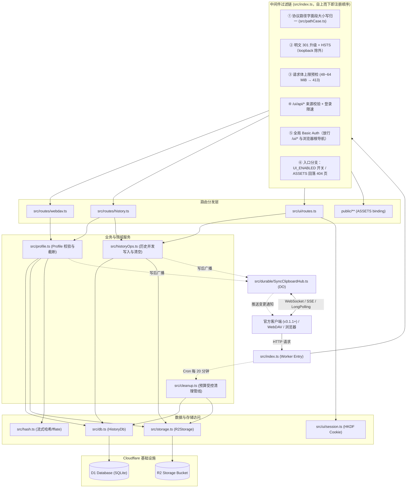
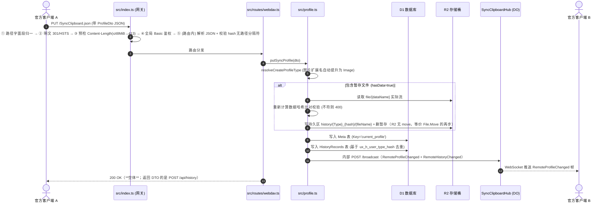
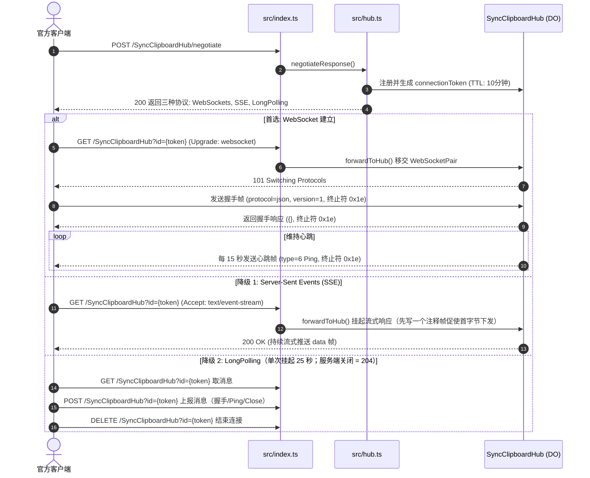
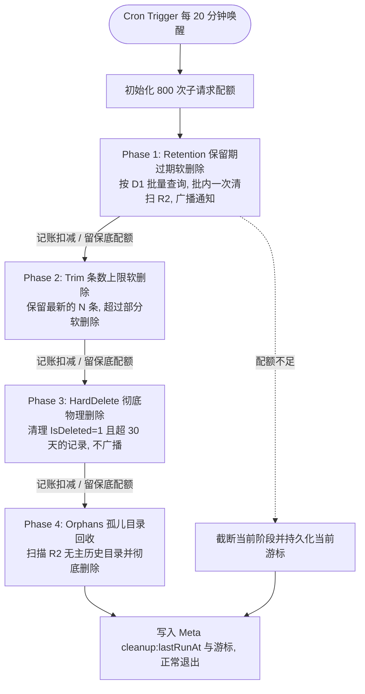

# SyncClipboard CfServer 全面解析

> **核对基线**：本文件的事实依据核对于 2026-09-21（仓库 HEAD `cecec3d`，工作区干净）。
> 文中 `文件:行号` 形式的出处是写作时的近似位置，**以文件内容为准**；
> 协议行为以 [`protocol.md`](protocol.md) 为准，界面以 [`ui.md`](ui.md) 为准。

## 1. 定位
- **一句话概括**：基于 Cloudflare Workers + D1 + R2 + Durable Objects，用 TypeScript 完全独立重写上游 [SyncClipboard](https://github.com/Jeric-X/SyncClipboard) 官方 ASP.NET Core 同步服务器的边缘无服务器实现，并内嵌纯原生零构建的 Web 历史管理系统。
- **解决什么问题**：官方客户端连接第三方存储（WebDAV / S3）时只能使用轮询模式且缺失剪贴板历史面板；只有连接官方 C# 服务端才能启用基于 SignalR 的长连接实时双向同步和历史跨设备漫游。本项目将官方服务端的专属能力原样移植至 Cloudflare Serverless 架构，使用户无需自备 VPS、Docker 与守护进程，在 Cloudflare 个人免费额度内即可获得与官方服务端一致的体验。
- **支持平台**：
  - 官方桌面端客户端（Windows WinUI3 / WPF、macOS、Linux，要求版本 ≥ 3.1.1）；
  - 官方/第三方移动端（Android、iOS 等基于 WebDAV / 历史 API 的客户端）；
  - 现代桌面与移动端浏览器（Web 管理后台）。
- **出处**：`README.md:1-25`、`docs/design.md:7-35`、`docs/protocol.md:1-20`。

---

## 2. 功能要点
提炼自 `README.md`、`docs/protocol.md` 及版本演进记录 `docs/progress.md`：

1. **WebDAV 兼容同步**：支持 `SyncClipboard.json` 当前剪贴板 Profile 读取与写入；支持 `/file/*` 附件流式暂存与清理；支持 `PROPFIND`（207 Multi-Status）与 `MKCOL` 目录探活，完全满足客户端在 `PreciseDelete` 模式下的目录递归发现与清理。*(出处：`src/routes/webdav.ts`、`docs/protocol.md §4`)*
2. **SignalR 实时推送中枢**：支持 `/SyncClipboardHub`；按官方顺序宣告并支持 **WebSockets（首选）→ Server-Sent Events (SSE) → LongPolling (长轮询)** 三种传输协议，在网络受限时自动平滑降级；实现 15 秒心跳 Ping 守护与 60 秒静默超时连接清理；写操作后毫秒级向全员广播 `RemoteProfileChanged` 与 `RemoteHistoryChanged`。*(出处：`src/durable/SyncClipboardHub.ts`、`src/durable/signalr.ts`)*
3. **历史记录与跨设备同步（`/api/history/*`）**：全套对齐上游 HistoryController；支持分页（Page 从 1 起，固定每页 50 条）、时间跨度过滤（Before/After/ModifiedAfter）、全文模糊匹配（`LIKE %text%`）、ProfileTypeFilter 位掩码筛选；历史上传在本实现里只有**单条**端点（`POST /api/history`；协议端点表里没有批量项 —— 批量语义只存在于界面面的 `/ui/api/history/batch-update`）；支持基于版本号（`version`）的 PATCH 乐观并发修改，冲突返回 409 及服务器**当前值**实体。*(出处：`src/routes/history.ts`、`src/historyOps.ts`)*
4. **严格逐字节对齐的数据完整性校验**：服务端逐字节复刻上游 C# 的哈希算法；对客户端提交的数据在落库前做严格校验，哈希不符直接 400/422 拒绝。*(出处：`src/hash.ts`、`docs/protocol.md §8`)*
5. **分级保留与定时清理（Cron Pipeline）**：通过 Cron Trigger 每 20 分钟执行一次后台任务；包含保留期过期软删除、记录总数上限裁剪、已删除超过 30 天的记录硬删除、以及 R2 孤儿存储目录回收。*(出处：`src/cleanup.ts`)*
6. **内置 Web 历史管理面板（V1 生产面）**：浏览器访问站点根（`GET /` 且 `Accept` 含 `text/html`，且界面开关 `UI_ENABLED` 开着）时 302 跳转至 `/ui_v1/`；提供全文检索、类型与自定义时间范围筛选、原图预览、文本一键复制、文件下载、单条与批量收藏置顶/删除；提供回收站恢复（对附件已被物理删除的条目禁用恢复并明确标注「数据不可用」）；提供在线维护面板查看 Cron 运行状态与动态调整保留参数。*(出处：`public/ui_v1/`、`src/ui/routes.ts`、`docs/ui.md`)*

---

## 3. 解决方案结构

### 3.1 模块与项目清单

| 模块目录 / 文件 | 技术类别 | 核心职责 |
|---|---|---|
| `src/index.ts` | Hono / Worker Entry | 网关总入口：中间件串联、静态资源与 WebUI 熔断判定、路由转发、Cron 调度 |
| `src/routes/` | Hono 业务路由 | `webdav.ts`（WebDAV 兼容端点）、`history.ts`（官方 `/api/history/*` 接口） |
| `src/durable/` | Cloudflare Durable Objects | `SyncClipboardHub.ts`（SignalR 连接池、心跳、广播、限速权威状态）、`signalr.ts`（帧编解码） |
| `src/ui/` | Web 界面服务端面 | `/ui/api/*` 专属接口、HMAC-SHA256 无状态签名 Cookie 会话、维护与自检接口 |
| `src/` (核心领域与存储) | 核心算法与存储模型 | `db.ts`（D1 数据层）、`storage.ts`（R2 访问层）、`hash.ts`（哈希与解压）、`profile.ts`（Profile 状态机）、`cleanup.ts`（定时清理） |
| `public/ui_v1/` | 前端生产界面 (V1) | 纯原生 ES 模块与 CSS，零构建；系统默认主界面 |
| `public/ui_v2/` | 前端重构实验面 (V2) | 新一代设计系统与状态机演进分支，本体位于 `/ui_v2/app/` |
| `public/ui/` | 页面跳转壳 | 仅包含 `index.html` 与 `redirect-hash.js`，将老书签携带 URL Fragment 重定向到 `/ui_v1/` |
| `test/` | Vitest 测试工程 | 22 个测试套件，涵盖协议回归、长连接通信、安全防爆破、清理预算与文档口径 |

### 3.2 依赖与调用拓扑


*(出处：`src/index.ts:1-250`、`docs/design.md:160-210`)*

---

## 4. 技术栈与依赖

### 4.1 核心运行时与依赖库
- **语言**：TypeScript `^5.6.0`（`strict` + `noUncheckedIndexedAccess`；**`noEmit: true`** —— 仓库不产出编译文件，类型只作静态把关，运行时由 wrangler/esbuild 就地处理 TS）。*(出处：`tsconfig.json`、`package.json`)*
- **Web 框架**：`hono` (v4.6.0) —— 边缘极轻量 Web 路由框架，提供零开销中间件模型与类型安全上下文绑定。*(出处：`package.json:17`)*
- **解压引擎**：`fflate` (v0.8.2) —— 纯 JavaScript 实现的高性能 zip 流式解压库，无 Node 平台 C++ 扩展依赖，完全运行在 Cloudflare V8 isolate 内部。*(出处：`package.json:16`、`src/hash.ts:2`)*
- **MIME 映射**：`mrmime` (v2.0.1) —— 438 项扩展名→类型表（MIT、零依赖）。2026-09-21 起取代原先手写的 46 项表，另留 12 项本地补遗（`.docx`/`.xlsx`/`.pptx`/`.xls`/`.ppt`/`.7z`/`.rar`/`.tar`/`.ico`/`.avi`/`.mkv`/`.flac`）。*(出处：`package.json` 的 `dependencies`、`src/contentTypes.ts`、`progress.md` §106)*

### 4.2 开发与测试工具链
- **Wrangler**：`^4.131.2` —— Cloudflare Workers 部署与本地 Miniflare 边缘模拟环境。
- **Vitest**：`^2.1.0` —— 测试框架，驱动 22 个测试套件。
- **@microsoft/signalr**：`^8.0.7` —— 微软官方 SignalR 客户端，仅用于自动化测试验证 Hub 长连接通信。
- **ESLint**：`^10.10.0` —— 只覆盖**零构建前端与手动探针**（`public/ui_v1/js`、`public/ui_v2/js`、`test/manual`）；`src/**` 与 `test/**` 由 `tsc --noEmit` 把关，**eslint 不覆盖后端**（见 `eslint.config.js` 头部）。
- **其它开发依赖**：`globals`（eslint 环境）、`undici`（测试期 fetch 实现）、`@types/node`。
- **出处**：`package.json` 的 `devDependencies` 与 `scripts`。

---

## 5. 核心数据模型

### 5.1 领域实体与 DTO（`src/types.ts`）

| 模型名称 | 类型 | 存储/传输格式 | 关键行为与校验规则 |
|---|---|---|---|
| **`ProfileType`** | 枚举 | `0:Text, 1:File, 2:Image, 3:Group, 4:Unknown, 5:None` | 传输序列化为字符串；C# 原版同构 |
| **`ProfileTypeFilter`** | 枚举位掩码 | `None=0, Text=1, File=2, Image=4, Group=8, FileAndGroup=10, All=15` | 用于 `/api/history` 与 `/ui/api/history` 的类型组合筛选；**名字**（`Text,Image`）与**数字**（`5`）都接受，非法名 → 400（协议面）|
| **`ProfileDto`** | DTO | JSON (camelCase) | `hasData: boolean`；大文本（>10240 字符）`text` 截断为前 10240 字符，`size` 仍为全文字符数 |
| **`HistoryRecordDto`** | DTO | JSON (camelCase) | 客户端拉取历史记录载体；`size`（字节或字符数）、`version`（并发版本号） |
| **`HistoryRecordUpdateDto`** | DTO | JSON (camelCase) | 乐观更新载体；注意字段名严格为 `isDelete`（非 isDeleted）；带 `version` 校验 |
| **`HistoryRecordEntity`** | 数据库实体 | SQLite 行映射 (`HistoryRecords`) | `stared` 对应 D1 列名 `Stared`；`filePaths` 序列化为 JSON 字符串 |

*(出处：`src/types.ts:1-130`、`docs/protocol.md §3`)*

### 5.2 存储与索引模式（`schema.sql`）

- **`HistoryRecords` 表**：
  - 主键：`ID INTEGER PRIMARY KEY AUTOINCREMENT`；
  - 并发防重唯一索引：`CREATE UNIQUE INDEX ux_h_user_type_hash ON HistoryRecords(UserId, Type, Hash)`，从数据库底层阻断多客户端并发提交相同内容的重复插入；
  - 检索索引群：覆盖 `(UserId, CreateTime)`、`(UserId, LastAccessed)`、`(UserId, LastModified)`，以及针对收藏筛选的复合索引 `(UserId, Stared, CreateTime)` 与 `(UserId, Stared, Type, CreateTime)`。
- **`Meta` 表**：
  - 键值存储：`Key TEXT PRIMARY KEY, Value TEXT NOT NULL`；
  - 键的四个族（键名定义处：`src/cleanup.ts` 的 `CLEANUP_META_KEYS` / `SETTINGS_META_KEYS`、`src/db.ts` 的 `current_profile`）：
    - `current_profile` —— 当前剪贴板快照（ProfileDto JSON）；
    - `cleanup:lastRunAt` / `cleanup:lastError` —— 清理轮次的可观测面（`/ui/api/info` 只读展示同名键）；
    - `cleanup:cursor:retention` / `cleanup:cursor:trim` / `cleanup:cursor:hardDelete` / `cleanup:cursor:orphans` —— **每个阶段一个**游标键（**不存在**聚合的 `cleanup:cursors`）；
    - `settings:retentionMinutes` / `settings:maxSavedHistoryCount` —— 免重新部署的在线覆盖。
- **出处**：`schema.sql:1-45`。

### 5.3 哈希计算与防爆破模型（`src/hash.ts`）

- **Text**：`SHA256Hex(UTF-8(text))`；
- **File / Image**：`SHA256Hex(UTF-8($"{fileName}|{contentHash.toUpperCase()}"))`；
- **Group (Zip 文件夹)**：按无符号字典序（`ByteArrayComparer`）对条目排序后格式化为 `D|{name}\0` 与 `F|{name}|{length}|{hash}\0`，拼接计算 SHA-256；
- **防 Zip 炸弹护栏**：流式解压限制最大体积 64 MiB、条目数 ≤ 1000、单条目解压膨胀比 ≤ 100:1（比值只在单条目解压后 ≥ 8 MiB 时才判定）。
- **解压预算随 Body 收缩**：`groupZipDecompressionCap(zip) = clamp(96 MiB - zip.length, 1 MiB, 64 MiB)`（`ISOLATE_TRANSFER_BUDGET_BYTES = 96 MiB`）。理由是 zip 的压缩体与解压内容在解压期间**同时存活**，两个上限各自贴顶会顶穿 isolate。
- **出处**：`src/hash.ts`（`groupZipDecompressionCap`）、`src/requestLimits.ts`。

---

## 6. 核心架构与分层描述

```
[模型层]   src/types.ts, src/serialization.ts (数据契约与严格类型同构)
   │
[存储层]   src/db.ts, src/storage.ts (D1 SQLite 访问与 R2 分层对象读写)
   │
[业务层]   src/profile.ts, src/historyOps.ts, src/cleanup.ts (状态机、并发控制、定时管线)
   │
[通讯层]   src/durable/SyncClipboardHub.ts, src/hub.ts (SignalR 协议与 DO 长连接广播)
   │
[适配层]   src/routes/webdav.ts, src/routes/history.ts, src/ui/routes.ts (端点解析与契约映射)
   │
[网关壳]   src/index.ts, src/auth.ts, src/rateLimit.ts (全局安全中间件、Hono 路由总装)
```

1. **模型层**：以领域类型为唯一事实源，消除 C# 与 JS 跨语言边界的空值、时间格式与位运算差异。
2. **存储层**：D1 负责强一致事务与元数据检索；R2 负责二进制数据归档（`file/` 暂存与 `history/{Type}_{hash}/` 持久区分离），杜绝防御性 Buffer 拷贝以保住 128 MiB 内存上限。
3. **业务层**：`profile.ts` 协调 Profile 入库与大文本自动转附件；`historyOps.ts` 集中收敛官方 PATCH 与 WebUI 写操作，保证数据修改、广播与 R2 清理原子一致；`cleanup.ts` 基于严格的 800 次子请求配额调度定时任务。
4. **通讯层**：通过 Durable Object 单例有状态管理连接池，实现跨边缘无状态实例的实时消息全员广播与权威限速计数。
5. **适配层**：将 WebDAV、ASP.NET Core 专有格式与 WebUI 接口分流隔离，确保协议面与产品展示面解耦。
6. **网关壳**：统一处理 TLS 强制、HSTS、防时序 Basic 鉴权、流式 Body 排空及前端静态资源代理。
- **出处**：`docs/design.md:130-220`。

---

## 7. 关键流程

### 流程 1：剪贴板变更上传与实时广播（PUT /SyncClipboard.json）


*(出处：`src/routes/webdav.ts:85-150`、`src/profile.ts:280-360`)*

### 流程 2：SignalR 协商、升级与传输降级链路


*(出处：`src/hub.ts:1-88`、`src/durable/SyncClipboardHub.ts:130-220`)*

### 流程 3：定时清理预算记账管线（Cron Trigger）


*(出处：`src/cleanup.ts:1-200`)*

---

## 8. 配置与状态

### 8.1 双层配置系统
1. **静态/部署环境变量（`wrangler.toml` 与 GitHub Variables）**：
   - `VERSION`：服务版本号，固定对齐上游报 `"3.2.0"`；
   - `MAX_SAVED_HISTORY_COUNT`：历史条数硬上限（默认 1000）；
   - `HISTORY_RETENTION_MINUTES`：保留时长（默认 10080 分钟 = 7 天）；
   - `MAX_REQUEST_BODY_BYTES`：单请求体上限（默认 48 MiB，允许调至 64 MiB）；
   - `UI_ENABLED`：Web 界面总熔断开关（默认 `"true"`）；
   - `ENFORCE_STRONG_CREDENTIALS`：弱口令硬阻断开关（**未设置 = 仅打告警日志**；设 `"true"` 时命中文档化默认口令或长度不足 8 的请求一律 500）；
   - `AUTH_RATE_LIMIT_WINDOW_MS` / `_MAX_FAILURES` / `_BLOCK_MS` / `_BURST_WARN`：认证失败限速四参数（**不建议改**；非法/越界值**逐字段**回落默认并打一次日志，见 `src/rateLimit.ts`）；
   - CI 侧专属（不在 `wrangler.toml`）：`D1_DATABASE_ID`（钉住要绑定的库 id，`Sync fork` 冲不掉）、`D1_BOOTSTRAP`（缺库时是否允许自动创建）。
2. **动态运行时覆盖（D1 `Meta` 表）**：
   - Web 界面维护面板通过 `PUT /ui/api/settings` 在线更新 `settings:retentionMinutes` 与 `settings:maxSavedHistoryCount`；
   - **机制**：读取时优先采用 Meta 覆盖值，键**不存在**才回退部署环境变量（唯一读入口 `readRetentionSettings`，`src/cleanup.ts`），实现**免重新部署在线调优**。
   - ⚠️ **「清除覆盖」= 删除该 Meta 键，不是写空串**：空串经 `Number('')` 会解析成 `0`，而 `0` 的语义是「**关闭该阶段**」，与「回退到 env」恰好相反（`src/db.ts` 的 `deleteMetaValues`、`src/cleanup.ts` 的 `SETTINGS_META_KEYS`）。
- **出处**：`wrangler.toml:30-80`、`src/cleanup.ts:380-420`、`src/ui/maintenance.ts:90-150`。

### 8.2 持久化与状态迁移
- D1 数据库由 `schema.sql` 驱动，建表脚本具备绝对幂等性（使用 `CREATE TABLE IF NOT EXISTS` 与 `CREATE UNIQUE INDEX IF NOT EXISTS`）；
- 升级部署时执行 `wrangler d1 execute --remote --file=./schema.sql`，旧数据与索引自动保留。
- **出处**：`schema.sql`、`README.md:90-110`。

---

## 9. 测试

### 9.1 测试体系与框架
- **测试框架**：Vitest 2.1.0（由于涉及本地 D1 数据改写，全局强制 `--no-file-parallelism` 串行执行）。
- **套件规模**：共 **22 个测试套件**（`npm test` 全绿）。**用例数不写死** —— 每加一条断言就变、且无法从文件系统数出来（见 `AGENTS.md` §2 的「写文档的数字口径」），要引用就写"见 `npm test` 输出"。
- **出处**：`package.json` 的 `test` 脚本、`test/docs.test.ts`。

### 9.2 套件覆盖清单（全部 22 个套件）

| 类别 | 套件文件 | 覆盖内容与验证点 |
|---|---|---|
| **协议黑盒** | `protocol.test.ts`, `signalr.test.ts`, `transports.test.ts` | 真实模拟客户端 HTTP 与 SignalR 全套交互、长连接升级与降级（WS / SSE / LongPolling） |
| **回归防线** | `fix-regressions.test.ts`, `fixes.test.ts` | 历史上已修复缺陷与回归守卫（孤儿目录误删、原型链查找污染、跨平台用户名等） |
| **数据与算法** | `hash.test.ts`, `dto-validation.test.ts`, `clipboard.test.ts` | 4 类哈希逐字节对齐、C# DTO 边界值、剪贴板格式与大文本拆分校验 |
| **安全与防护** | `rate-limit.test.ts`, `limits.test.ts`, `hardening.test.ts` | 爆破限速与解封、413 内存护栏、防 Zip 炸弹、伪造 Cookie 阻断、XSS 响应头 |
| **后台清理** | `cleanup.test.ts`, `cleanup-budget.test.ts` | 800 次子请求记账模型、保底配额、游标续跑、孤儿目录回收 |
| **查询与目标** | `query-filters.test.ts`, `next-target.test.ts` | 复杂组合 SQL 过滤（类型位掩码、排序方向、时间范围）与焦点切换边界测试 |
| **WebUI 契约** | `ui.test.ts`, `ui-logic.test.ts`, `ui-guard.test.ts`, `ui-input.test.ts`, `ui-contract.test.ts`, `ui-activity.test.ts` | 多列排序、回收站恢复边界、跨版本文案一致性、挂载点动态发现 |
| **防漂移守卫** | `docs.test.ts` | 只校验**能从文件系统数出来**的量：5 份现状文档（`README.md`/`AGENTS.md`/`docs/design.md`/`docs/ui.md`/`.github/workflows/deploy.yml`）声明的**套件数（22）**、`docs/ui.md` 的**资源数（85）**、以及 `docs/design.md` 的套件清单是否逐个覆盖实际套件。⚠️ **端点表、目录树、挂载点、写库套件名单都不在它管辖内** —— 挂载点由 `ui-guard.test.ts` 动态发现守卫，「写库套件」是各套件自己调用 `assertWritableTarget`（见 §9.3） |

### 9.3 安全防护网（`test/support/target-guard.ts`）
7 个写库套件（`protocol`, `fix-regressions`, `transports`, `signalr`, `cleanup`, `query-filters`, `ui`）在文件顶层调用 `assertWritableTarget(BASE)`：目标主机不属于 `127.0.0.1` / `localhost` / `::1` / `[::1]` / `0.0.0.0` **且**未设 `ALLOW_REMOTE_TARGET=1` 时**直接抛错终止**（连 `beforeAll` 都不会执行），杜绝误向线上实例执行测试导致数据损坏。*(出处：`test/support/target-guard.ts`)*

---

## 10. 文档与约定

### 10.1 文档体系分工
- `README.md`：面向使用者与运维的白描指南（部署、客户端配置、网络、排障）；
- `docs/design.md`：架构总览与核心架构决策记录（**ADR D1–D30，共 31 行** —— D17 按主题并立两行：界面定位 / 请求体上限）；
- `docs/protocol.md`：协议唯一权威契约，附带与上游源码行级比对的差异登记表（§10）；
- `docs/ui.md`：Web 界面设计、安全头策略、接口契约与来源融合清单；
- `docs/progress.md`：按轮次记录的开发、审计与性能调优历史曲线；
- `AGENTS.md`：给 AI Agent 与开发者的行为契约（DoD 完成定义）。

### 10.2 工程红线与规范（`AGENTS.md`）
1. **代码与文档同改**：责任范围是 `AGENTS.md` §1 那张同步表（**端点表、目录树、令牌表、差异登记表都在守卫之外**，靠人逐行过）。门禁只机械盯住其中一部分：
   - `test/docs.test.ts` → 套件数（22）、`public/` 资源数（85）、`docs/design.md` 的套件清单；
   - `test/ui-guard.test.ts` → 三个界面挂载点（`run_worker_first` ×2 + `isUiAsset` ×1 + `_headers` ×2，挂载点集合从 `public/` **动态发现**）、`/ui/api/*` 端点清单（`EXPECTED_API_ROUTES`，20 条）、V1 与 V2 的 `messages.js` 正文对等、V1 预载清单 == import 闭包、`/ui/api/*` 的注册顺序（未认证一律 401）。
2. **两套前端定位红线**：`/ui_v1/` 为默认产品面，禁止跨版引用 `/ui_v2/`（V1 自包含）；两版同名的 `messages.js` 正文必须逐字一致（对等守卫断言；文件头**有意不同**）。
3. **完成定义（DoD，`AGENTS.md` §2 共五条）**：① `tsc --noEmit` 0 错；② eslint 0 告警（范围含 `test/manual`）＋ 4 个 `test/manual/*.mjs` 过 `node --check`；③ 在**端口 8787** 的 dev server 上 **22 个套件全过**；④ §1 同步表逐行核对；⑤ **改前端必须用真实浏览器量一次**（`test/manual/probe.mjs` / `probe-ui-v1.mjs`：零 console 错误、零失败请求）。
- **出处**：`AGENTS.md` §1–§2。

---

## 11. 近期演进

从最近 20 次提交（`git log --oneline -20`，HEAD `cecec3d`）看，当前重心已从协议功能转到**质量门与部署链路**：

1. **CI 资源自举**（`bc88af4`；其前的 `4551c16` / `66278f0` / `cecec3d` 是铺垫）：fork → 配 secret → 跑一次 Action → 直接拿到地址，不必手工建资源、也不必把 `database_id` 回填仓库。D1 按**库名**解析（`D1_DATABASE_ID` 可钉住、`D1_BOOTSTRAP=false` 可改为 fail-fast），R2 按名字幂等创建。真实 run `35556677091`（新建库）与 `35556926009`（复用既有库）都已跑通，证据见 `docs/progress.md` §109.5。
2. **依赖与加固同步收敛**（`09fb758`）：MIME 表换 `mrmime`（438 项 + 12 项本地补遗），内联策略由黑名单改**默认-deny 白名单**并叠加 CSP 沙箱（`src/contentTypes.ts`）—— 两者必须同改：`.xml` 换表后成为浏览器可渲染类型，只换表会把已修的存储型 XSS 链重新打开。
3. **门禁工具链，不引入新依赖**（ADR D20）：`@cloudflare/vitest-pool-workers` 与 Playwright 各做过有判据的试点后**不并入**产品树；5 份 `node:sqlite` D1 适配器收敛为 `test/support/d1-sqlite.ts`（`4b9ade4`）；`test/manual` 纳入 eslint 的 `no-undef`（`9e63eab`，拦下「调了从未定义的标识符」这类 `node --check` 永远绿的缺陷，`docs/progress.md` §105.6）。
4. **文档事实订正**：多轮逐 hunk 核实台账（`9e29cd0` / `fdde201` / `4fc8a51`）与 README 重构（`7c77988` / `612fb7c` / `9f81b61`）—— 三类服务端差异表改回叙述、补首次接触者的导读。
5. **更早的主题线**：界面 `ui_old→ui_v1` / `ui→ui_v2` 改名事故的收敛（`e3858cd` → `7f4de45` → `d32631b` → `1149af0` → `c4a9b93` → `60c510f`，见 `docs/ui-rename-v1-v2.md`）；前端首屏/CLS 与「清除筛选」语义统一（`fee8078`，ADR D19）。

- **出处**：`git log --oneline`、`docs/progress.md` §95–§109。

---

## 12. 总结

### 12.1 架构风格
SyncClipboard CfServer 是一套**极具工匠精神的高保真 Serverless 移植系统**。它并未因为运行在 FaaS 平台而对协议做妥协或取巧，而是在严格对齐 C# 官方服务端所有二进制哈希、XML 协议、SignalR 帧序列化与错误语义的同时，深度适配了 Cloudflare 的边缘分布式特性。

### 12.2 核心工程难点与攻关解法
1. **内存边界（128 MiB isolate，且被所有并发请求共享）**：R2 无 `move`（改名 = put 新对象 + 删旧对象）；入口按 `content-length` 预检（>48 MiB → 413），落库时再按**暂存对象实际大小**判一次（流式暂存可以绕过预检），Zip 解压预算随请求体收缩，上传路径不做防御性拷贝（`storage.ts` 不再 `slice().buffer`）。⚠️ **multipart 表单体不是流式的**：`POST /api/history` 会 `await c.req.arrayBuffer()` 整包读入内存，再由 `src/multipart.ts` 手写字节级扫描（首字节 memchr 优化）；真正流式的只有 `PUT /file/{name}`（body 直接透传 R2 `put`）；
2. **调度配额（1,000 次子请求）**：通过设计「批内目录清扫」，将定时清理任务单条记录消耗由 3 次降为 1 次，并引入分阶段预算记账与游标断点续跑，完美化解了平台硬性调度限制；
3. **状态同步与安全**：巧妙利用 Durable Objects 单线程特性实现无需分布式锁的 WebSocket 实时广播与防爆破权威计数；利用 HKDF 口令派生实现无状态会话即时吊销。

整个系统设计扎实、代码克制、证据链完整，具备工业级的健壮性。

---

### 建议下一步深入方向
- 如需探究 SignalR 帧与 WebSocket 降级实现细节，可精读 `src/durable/SyncClipboardHub.ts` 与 `src/durable/signalr.ts`；
- 如需了解平台配额下的定时任务记账推导，可精读 `src/cleanup.ts` 与 `docs/design.md §7.2`；
- 如需查看完整的协议端点差异与处置依据，可精读 `docs/protocol.md §10`。
