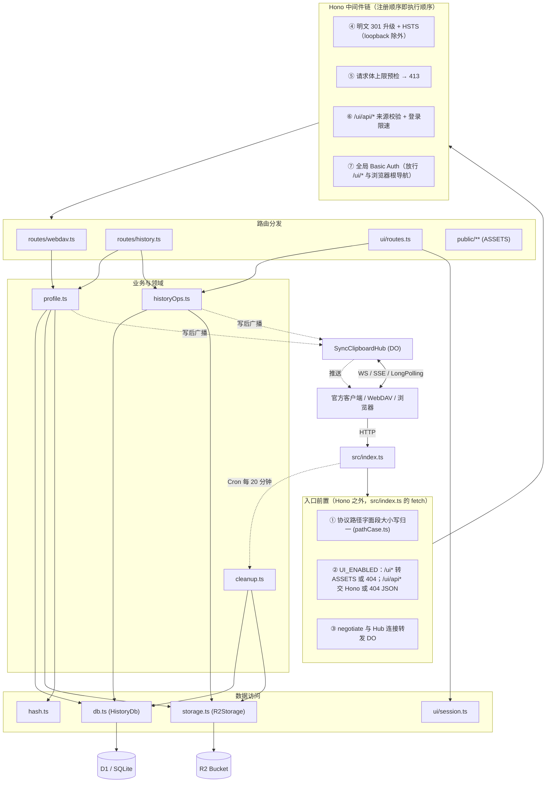
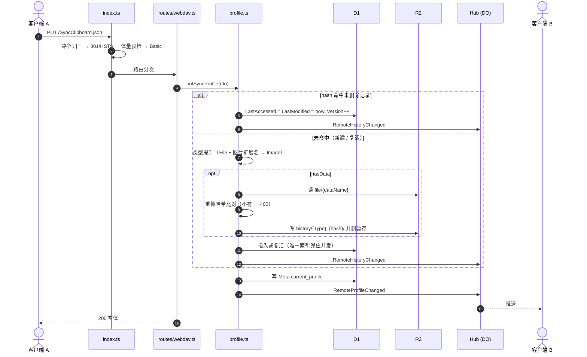
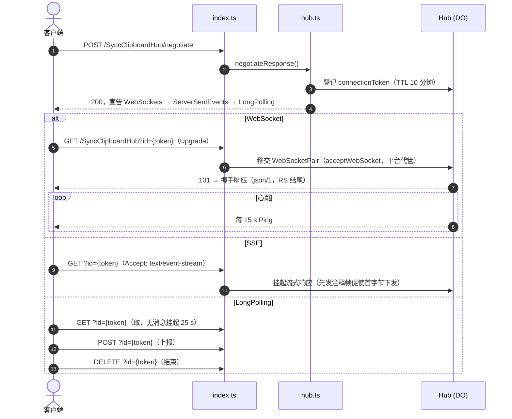
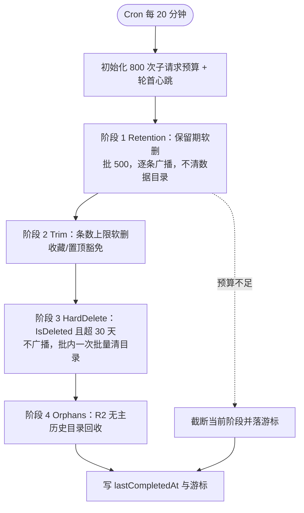

# SyncClipboard CfServer —— 项目解析

> **本文件只描述当前实现**，不记录改动过程。协议逐条行为以 [`protocol.md`](protocol.md) 为准，
> 界面以 [`ui.md`](ui.md) 为准，取舍理由见 [`design.md`](design.md) 的 ADR。
> **精简介**：本节起为 2026-10-04 的整篇重写（原文 471 行 → 本版）；历史版本见
> `git show <hash>:docs/project-analysis.md`：重写前最近一版 `e88599f`，初版 `7c77988`。
> 重写只改表述，事实逐条照代码重新核对；核对中发现并已订正的原文错误列在文末 §9。

## 1. 定位

用 TypeScript 在 Cloudflare Workers 上独立重写 [SyncClipboard](https://github.com/Jeric-X/SyncClipboard)
官方 ASP.NET Core 服务端，并内嵌一套零构建的原生 Web 历史管理界面。

解决的痛点：官方客户端只有连官方 C# 服务端才能拿到 **SignalR 长连接实时同步**与**历史跨设备漫游**；
连第三方存储（WebDAV / S3）时只能轮询、且没有历史面板。本项目把前者的能力搬到边缘 Serverless：
无需 VPS / Docker / 常驻进程，在 Cloudflare 免费额度内即可获得与官方服务端一致的体验。

服务对象：官方客户端 **≥ 3.1.1**（`Env.RequestServerVersion`）；走 WebDAV / 历史 API 的第三方客户端；
现代浏览器。`/api/version` 返回 `3.3.0-beta1` —— 这是**上游基线的真实返回值**，与本仓库
`package.json` 里的项目版本号（1.25.2）是两套互不相干的编号（见 §6.1）。

## 2. 能力要点

1. **WebDAV 兼容面**：`GET/PUT /SyncClipboard.json`（当前剪贴板）、`/file/*` 附件暂存与清理
   （含单文件 `DELETE`，客户端 `PreciseDelete` 依赖）、`PROPFIND`（207 multistatus）与 `MKCOL` 探活。
   客户端实际只调用 `/api/version`、`/SyncClipboard.json`、`/file/*`、`PROPFIND`、`/api/history*`
   （query / 单条 / data / PATCH / POST）。
2. **SignalR 实时推送**：`/SyncClipboardHub` 按上游顺序宣告三种传输
   **WebSockets → ServerSentEvents → LongPolling**，写操作后广播 `RemoteProfileChanged` /
   `RemoteHistoryChanged`。心跳 15 s、静默 60 s 清理、长轮询单次挂起 25 s（服务端关闭以 204 结束）。
   界面侧的批量写把整批广播**合并成一次 DO 子请求**（消息内容与顺序不变）。
3. **历史 API**（对齐上游 `HistoryController`）：单条 `POST`、`POST /query`（分页固定 50、时间范围、
   `LIKE %text%`、`Types` 位掩码）、`GET /{profileId}`、`GET /{profileId}/data`、`PATCH`（`version`
   乐观并发，冲突 409 且回带服务器当前值）、`GET /statistics`、`DELETE /clear`。
   **协议面没有批量上传端点** —— 批量语义只存在于界面面的 `/ui/api/history/batch-update`。
4. **逐字节对齐的哈希与数据校验**：见 §5.3；哈希不符的请求在落库前被拒。
5. **分级保留 + 定时清理**：Cron 每 20 分钟一轮，含保留期软删、条数上限裁剪、超 30 天硬删、
   R2 孤儿目录回收；受子请求预算与行字节预算双重截断，游标续跑（§7.3）。
6. **内嵌 Web 历史面板**：站点根对浏览器 302 到 `/ui_v1/`（受 `UI_ENABLED` 管）。检索、类型/时间筛选、
   图片与文档预览、文本复制与编辑、文件下载、单条与批量收藏/置顶/删除/恢复、
   回收站与在线维护面板（清理状态、保留参数在线调整、数据完整性自检）。四条落在界面面的语义：
   - **预览里「保存」= 新建一条文本记录**（文本记录 `hash = SHA256(utf8(正文))`，正文一改就是另一条），
     走协议 `POST /api/history` 的写路径，只广播 `RemoteHistoryChanged`、不碰当前剪贴板；上限 1 MiB。
   - **复制 / 下载会推进该记录的 `LastAccessed`**，载荷回显 `version` 与 `lastModified` ——
     版本不动则客户端随后的同步不判冲突，修改时间不动则「修改」列不跳。
   - **批量动作在途可中止**，中止点落在批与批之间，已生效条数如实报出。
   - **回收站是可恢复形态**：软删只置 `IsDeleted=1` 且**保留数据文件**（与上游立即删目录不同，
     已在 `protocol.md` §10 登记）；行内「彻底删除」与「清空回收站」是立刻释放 R2 空间的出口。

## 3. 代码结构

### 3.1 模块清单

| 路径 | 职责 |
|---|---|
| `src/index.ts` | Worker 入口：入口前置分支、Hono 中间件链、路由总装、Cron scheduled handler |
| `src/routes/webdav.ts` | `SyncClipboard.json` / `file/*` / `PROPFIND` / `MKCOL` / `GET /` |
| `src/routes/history.ts` | 官方 `/api/history/*`、`/api/time`、`/api/version` |
| `src/ui/` | `/ui/api/*`、会话 Cookie、维护与自检端点、404 页 |
| `src/durable/SyncClipboardHub.ts` | SignalR 连接池（DO）：三种传输、心跳、广播、认证失败的权威计数 |
| `src/durable/signalr.ts` | SignalR JSON 帧编解码（RS 0x1E 分隔） |
| `src/hub.ts` | negotiate 响应与连接转发（版本判定逐字对齐 ASP.NET Core） |
| 领域与存储 | `db.ts`(D1)、`storage.ts`(R2)、`hash.ts`(哈希/解压)、`profile.ts`(Profile 写路径)、`historyOps.ts`(历史写路径) 、`cleanup.ts`(清理管线) |
| 横切 | `serialization.ts`(DTO 解析/序列化)、`requestLimits.ts`(体量上限)、`contentTypes.ts`(MIME 与附件加固)、`multipart.ts`(字节级表单解析)、`pathCase.ts`(协议路径字面段归一)、`webdavXml.ts`(207)、`auth.ts` / `rateLimit.ts`(Basic + 限速)、`uiEnabled.ts` |
| `public/` | 四个界面挂载点，见 §3.3 |
| `test/` | Vitest，**22 个套件**（§8） |
| `tools/` | 按需运行的核实脚本（上游 A/B 探针、D1 LIKE 上限、D1 迁移）；不进套件、不进部署产物 |
| `schema.sql` / `wrangler.toml` | D1 建表与索引（幂等）；绑定、DO 迁移、`[vars]`、Cron、`[assets]`、可观测性 |
| `.github/workflows/deploy.yml` | `quality`（typecheck + lint + 全部套件）→ 解析/创建 D1、R2 → schema → 迁移 → 部署 → 只读冒烟 |

### 3.2 依赖与调用拓扑


```mermaid
flowchart TD
    Client["官方客户端 / WebDAV / 浏览器"] -->|HTTP| Entry["src/index.ts"]
    Client <-->|WS / SSE / LongPolling| HubDO["SyncClipboardHub (DO)"]

    subgraph EntryBranch["入口前置（Hono 之外，src/index.ts 的 fetch）"]
        PathNorm["① 协议路径字面段大小写归一 (pathCase.ts)"]
        AssetSwitch["② UI_ENABLED：/ui* 转 ASSETS 或 404；/ui/api* 交 Hono 或 404 JSON"]
        HubRoute["③ negotiate 与 Hub 连接转发 DO"]
    end

    subgraph Middleware["Hono 中间件链（注册顺序即执行顺序）"]
        HSTS["④ 明文 301 升级 + HSTS（loopback 除外）"]
        BodyLimit["⑤ 请求体上限预检 → 413"]
        Origin["⑥ /ui/api/* 来源校验 + 登录限速"]
        Basic["⑦ 全局 Basic Auth（放行 /ui/* 与浏览器根导航）"]
    end

    subgraph Handlers["路由分发"]
        WebDAV["routes/webdav.ts"]
        HistoryAPI["routes/history.ts"]
        UIAPI["ui/routes.ts"]
        Assets["public/** (ASSETS)"]
    end

    subgraph Services["业务与领域"]
        ProfileSvc["profile.ts"]
        HistoryOps["historyOps.ts"]
        CleanupSvc["cleanup.ts"]
    end

    subgraph Infra["数据访问"]
        DB["db.ts (HistoryDb)"]
        Storage["storage.ts (R2Storage)"]
        Hash["hash.ts"]
        Session["ui/session.ts"]
    end

    Entry --> EntryBranch --> Middleware --> Handlers
    WebDAV --> ProfileSvc
    HistoryAPI --> ProfileSvc & HistoryOps
    UIAPI --> HistoryOps & Session
    Entry -.Cron 每 20 分钟.-> CleanupSvc
    ProfileSvc --> DB & Storage & Hash
    HistoryOps --> DB & Storage
    CleanupSvc --> DB & Storage
    ProfileSvc -.写后广播.-> HubDO
    HistoryOps -.写后广播.-> HubDO
    HubDO -.推送.-> Client
    DB --> D1[("D1 / SQLite")]
    Storage --> R2[("R2 Bucket")]
```

### 3.3 界面挂载点（`UI_ENABLED`，默认开）

| 前缀 | 源目录 | 定位 |
|---|---|---|
| `/ui_v1/` | `public/ui_v1/` | **默认界面（产品面）**；站点根对浏览器 302 到这里 |
| `/ui_v2/` | `public/ui_v2/` | 开发测试版，应用本体在 `/ui_v2/app/` |
| `/ui_shared/` | `public/ui_shared/` | 两版唯一共享面：品牌图标与无版本耦合的纯数据模块 |
| `/ui/` | `public/ui/` | 只剩一层跳转壳（保留它是因为 `/ui/api/*` 这个接口命名空间必须以 `/ui/` 为前缀） |

关掉界面（`UI_ENABLED=false`）时四个挂载点与 `/ui/api/*` 一律 404，协议面完全不受影响；
因此这四个前缀都必须在 `wrangler.toml` 的 `run_worker_first` 名单里（否则静态资源在 Worker 之前
就被托管掉了，开关无从生效）。详见 §6.2。

### 3.4 界面服务端接口（`/ui/api/*`）

这一层**不属于协议契约**（官方客户端不感知任何 `/ui/*` 路径），但与协议面**共用**同一张表、
同一套行映射与写路径，因此不存在「界面改了而客户端不知道」。下面 20 条是完整清单，
`test/ui-guard.test.ts` 的 `EXPECTED_API_ROUTES` 与之逐条对齐（该守卫遍历 Hono 注册表逐条打
未认证请求，只放行 3 条公开端点）。

**公开 3 条**：`POST /login`（400 体非法 / 401 凭据错 / 500 未配置凭据）、`POST /logout`（清本机 Cookie）、
`GET /session`（**恒 200**，用 `authenticated` 表达）。**其余 17 条**要求会话 Cookie 或 Basic，
未带凭据一律 401；维护端点（`integrity` / `settings`）在守卫中间件**之后**注册（顺序写反 = 端点照常
工作但不再要求凭据，守卫会红）。

| 方法 | 路径（前缀 `/ui/api`） | 语义 | 错误 |
|---|---|---|---|
| GET | `/history` | 列表：`page`、`pageSize`(≤500，默认 50)、`types`、`search`、`starred`、`after`/`before`、`deleted`、`sort`(6 字段白名单)、`order`、`includeDeleted`、`pinnedFirst`(默认 true)；正文截 500 **码点**并带 `textTruncated` | 400 |
| POST | `/history` | 新建一条文本记录（正文 ≤1 MiB），落库后回读该条 | 400 / 415 |
| GET | `/history/:type/:hash` | 单条元数据（正文完整） | 400 / 404 |
| GET | `/history/:type/:hash/data` | 数据文件；`?download=1` 走附件；支持单区间 `Range`（206，后缀区间 `bytes=-n`，不可满足 416） | 404 `not_found` / 404 `data_missing` |
| PATCH | `/history/:type/:hash` | 收藏 / 置顶 / 删除；也承接「触碰访问时间」的 `{lastAccessed, lastModified, version}` | 400 / 404 / 409 |
| POST | `/history/batch-update` | 批量写（`starred`/`pinned`/`isDelete`），≤100 条、有界并发 10、整批一次广播 | 400 / 415 |
| POST | `/history/batch-meta` | 批量取记录（含完整正文），≤100 条（≥100 条会撞 D1 的单语句 100 绑定参数上限，故按 99 分片） | 400 / 415 |
| POST | `/history/batch-purge` | 回收站彻底删除：只删 `IsDeleted != 0` 的行并清其数据目录；≤100 条、不广播 | 400 / 415 |
| POST | `/history/clear` | `{scope:'trash'\|'all'}`；`all` 与协议 `DELETE /api/history/clear` 共用同一实现，**不逐条广播** | 400 / 415 |
| POST | `/hub-ticket` | 签发 Hub 连接票据 `{token, path}`（浏览器建 WS 时带不了请求头） | 503（DO 不可达，前端继续轮询） |
| GET | `/statistics` | 官方统计 + 三套计数：`byType`（随 `deleted` 走）、`byTypeActive`（恒活跃口径）、两个 `starredCount*` | 400 |
| GET | `/overview` | 首屏合成快照：统计、类型计数、变更标记、部署信息、`serverTime` 一次返回 | 400 |
| GET | `/activity` | 活动趋势：`days`(≤90，默认 14) + `tz`（分钟偏移），按调用方时区切天 | 400 |
| GET | `/info` | 部署信息：客户端该填的地址、版本、Hub 传输、保留策略（含来源）、存储占用、清理可观测面 | — |
| GET | `/poll` | 变更信号 `{count, lastModified, serverTime}` | — |
| GET | `/integrity` | 数据完整性自检：期望目录集 × R2 实际对象求差，只对差集逐条探测 | — |
| PUT | `/settings` | 保留策略在线调整：数字 = 覆盖、`null` = 清除覆盖回落部署变量、缺省 = 不改动；响应回读生效值 | 400 / 415 |

横切约定：

- **缓存**：JSON 响应一律 `no-store`；数据端点自带 `private, max-age=60`（预览/缩略图复用）。
  ⚠️ 补头挂在 Hono 后置中间件上，**在路由之前就返回的响应拿不到它** —— 已知两条例外是
  跨站 403 与 `UI_ENABLED=false` 的 JSON 404（都是错误响应、不含用户数据）。
- **内容类型**：五个 JSON 写端点只接受 `application/json`，否则 415（跨站**表单**能直接发 POST
  且不过 CORS 预检，JSON 必须由脚本构造 ⇒ 纵深防御）。
- **来源校验**：状态变更方法校验 `Origin` 与 `Sec-Fetch-Site`，外源 403。
- **未知路径**：`/ui/api/*` 未命中返回 `{"error":"not_found"}` JSON（页面命名空间才返回 404 页）。

## 4. 技术栈

- **语言**：TypeScript `^5.6.0`，`strict` + `noUncheckedIndexedAccess`；`noEmit: true` ——
  仓库不产出编译文件，类型只作静态把关。
- **运行时依赖（3 个）**：`hono` `^4.6.0`、`fflate` `^0.8.2`（流式 zip 解压）、
  `mrmime` `^2.0.1`（扩展名→MIME 表，另留 12 项本地补遗）。
- **工具链**：`wrangler` `^4.131.2`、`vitest` `^2.1.0`、`eslint` `^10.10.0`、
  `@microsoft/signalr` `^8.0.7`（仅测试用真实客户端验证 Hub）、`globals`、`undici`、`@types/node`、
  `@cloudflare/workers-types`。
- ESLint 只覆盖**零构建前端与手动探针**（`public/ui_v*/js`、`public/ui_shared/js`、`test/manual`）；
  `src/**` 与 `test/**` 由 `tsc --noEmit` 把关。

## 5. 数据模型

### 5.1 领域类型与 DTO

| 类型 | 说明 |
|---|---|
| `ProfileType` | `0:Text, 1:File, 2:Image, 3:Group, 4:Unknown, 5:None`；传输为字符串；`POST`/`PUT` 拒绝 `Unknown`/`None` |
| `ProfileTypeFilter` | 位掩码 `None=0, Text=1, File=2, Image=4, Group=8, FileAndGroup=10, All=15`；**名字与数字都接受**，非法 → 400 |
| `ProfileDto` | `type`/`hash`/`text`/`hasData`/`dataName`/`transferDataHash`/`size`。大文本（> 10240 字符）时 `text` 只带前缀、全文走传输数据文件，`size` 仍为全文字符数；`dataName` 为 null 时**保留键**、`size` 为 null 时**省略键**（对齐上游 `WhenWritingNull` 的不对称） |
| `HistoryRecordDto` | `hash`/`text`/`type`/三个 ISO 时间/`starred`/`pinned`/`size`/`hasData`/`version`/`isDeleted`；`size` 口径按类型（见 §5.3） |
| `HistoryRecordUpdateDto` | 乐观更新载体；字段名是 **`isDelete`**（不是 `isDeleted`）；`version` 必须 int32、日期必须可解析，否则 400 |
| `HistoryRecordEntity` | SQLite 行映射；注意 `stared` 与列名 `Stared` 同形（对外一律叫 `starred`） |
| `HistoryQueryDto` | 表单字段**PascalCase**、解析大小写不敏感；绑定失败 400；**唯一例外**：时间字段解析不了时忽略该项并打 warn（有意偏离） |
| `HistoryStatisticsDto` | `totalCount`/`starredCount`/`deletedCount`/`activeCount`/`totalFileSizeMB`（两位小数；有数据但不足 0.01 MB 取 0.01） |
| `UiHistoryItem` / `UiHistoryListItem` | 协议 DTO 加 `id`（D1 行 ID，仅前端 key）与 `dataName`；列表项正文截 500 字符并置 `textTruncated` |
| `UiViewCounts` | 一条 `GROUP BY Type, IsDeleted, Stared` 出齐：活跃/回收站两套按类型计数 + 两个收藏计数 |

### 5.2 存储

**`HistoryRecords`**（`schema.sql`）：

- `ID INTEGER PRIMARY KEY AUTOINCREMENT`（= SQLite rowid 别名）；
- `ux_h_user_type_hash` **唯一索引** `(UserId, Type, Hash)` —— 从库层阻断并发重复插入（应用层
  「先查再插」在并发下保证不了唯一性）；建索引前先跑一句去重 `DELETE`，否则存量重复行会让建索引失败；
- 检索索引：`(UserId, CreateTime)`、`(UserId, LastAccessed)`、`(UserId, LastModified)`，
  以及收藏维度的 `(UserId, Stared, CreateTime)` 与 `(UserId, Stared, Type, CreateTime)`；
  另有与唯一索引同形的非唯一索引 `idx_h_user_type_hash`。

**`Meta`**：`Key TEXT PRIMARY KEY, Value TEXT NOT NULL`。键的四个族：

- `current_profile` —— 当前剪贴板快照（ProfileDto JSON）；
- `cleanup:lastRunAt` / `cleanup:lastCompletedAt` / `cleanup:lastError` —— 清理可观测面；
- `cleanup:cursor:retention` / `:trim` / `:hardDelete` / `:orphans` —— **每个阶段一个**游标键
  （不存在聚合的 `cleanup:cursors`）；
- `settings:retentionMinutes` / `settings:maxSavedHistoryCount` —— 免部署的在线覆盖。

**R2 key 布局**：暂存 `file/{dataName}`；持久 `history/{Type}_{Hash}/{transferDataName}`。
`Hash` 不得含 `/`、`\` —— 否则 R2 侧的目录名与 DB 侧的工作目录名不同构，孤儿清理会误判。

### 5.3 哈希与解压

| 类型 | 公式 |
|---|---|
| Text | `SHA256hex(UTF8(text))` |
| File / Image | `SHA256hex(UTF8("{fileName}|{contentHash大写}"))` |
| Group | 条目按 **UTF-8 字节序**排序后拼 `D\|{name}\0`（目录）与 `F\|{name}\|{len}\|{hash}\0`（文件），整体 SHA-256 |

Group 的三条输入形状规则：**隐式父目录计入**（等价上游「解压后遍历文件系统」，空目录也计入）；
**同名条目首见优先**（上游这一档是 500，本实现更宽容，属有意偏离）；**条目名安全校验一律拒**
（盘符形态、反斜杠、NUL、前导 `/`、`..` / `.` 段；`a:b.txt` 这类「第二字符是冒号」的名字接受）。
`text` 字段由**顶层条目名**（`TrimEnd('/')` 后不含 `/`）用 `\n` 拼成。

**解压护栏**（解压在哈希校验**之前**发生，不封顶就是免费的内存攻击）：

- 条目数 ≤ 1000、总解压字节 ≤ 64 MiB、单条目 ≤ 24 MiB、
  单条目压缩比 ≤ 100:1（仅当解压后 ≥ 8 MiB 才判）；
- **解压预算随请求体收缩**：`clamp((96 MiB − zip.length) / 2, 1 MiB, 64 MiB)`。
  峰值不是「body + 解压」而是 **body + 2×解压**（条目内容留一份，fflate 交付与拼接各复制一份），
  故按 2 分摊；两个上限各自贴顶会顶穿 isolate。

## 6. 架构与配置

### 6.1 配置

**部署期变量（`wrangler.toml` `[vars]` ∪ GitHub 仓库变量）**：

| 变量 | 默认 | 说明 |
|---|---|---|
| `VERSION` | `3.3.0-beta1` | `/api/version` 的返回值，**逐字对齐上游**；与 `package.json` 的项目版本号无关 |
| `MAX_SAVED_HISTORY_COUNT` | `1000` | 条数上限；0 = 不限制 |
| `HISTORY_RETENTION_MINUTES` | `0` | **0 = 不限制**（对齐上游 3.3.0）；正数才按时间清理 |
| `MAX_REQUEST_BODY_BYTES` | `48 MiB` | 范围 `[256 KiB, 64 MiB]`，越界/非整数逐字段回落默认并打日志 |
| `UI_ENABLED` | `"true"` | 只有显式 `"false"` 才关 |
| `ENFORCE_STRONG_CREDENTIALS` | 未设置 | 未设置 = 只打告警；`"true"` = 弱口令请求 500 |
| `AUTH_RATE_LIMIT_*`（4 个） | — | 认证失败限速窗口/次数/封锁时长/告警阈值；不建议改 |
| `D1_DATABASE_ID` / `D1_BOOTSTRAP` | — | CI 专属（不在 `wrangler.toml`）：钉库 id / 是否允许自动建库 |

**运行期覆盖（D1 Meta）**：`PUT /ui/api/settings` 在线写 `settings:*` 两键。读取时 Meta 覆盖优先，
键**不存在**才回落 env（唯一读入口 `readRetentionSettings`）。
⚠️ **清除覆盖 = 删键**，不是写空串 —— 空串经 `Number('')` 是 `0`，而 `0` 的语义是「关闭该阶段」，
与「回落 env」恰好相反。

**D1 绑定**：仓库里的 `database_id` 是全零占位值。本地 `wrangler dev` 与全部测试都不读它
（绑定只按 `binding` 名建立）；CI 在部署前按**库名**解析真实 id，只注入 runner 里的配置副本、
不回写仓库。设 `D1_DATABASE_ID` 可钉住某个库，`D1_BOOTSTRAP=false` 可禁止自动建库。

**DO**：`[[migrations]] tag = "v1"`（`new_sqlite_classes`）声明；改存储形态时**新增** tag，不改旧 tag。

### 6.2 界面开关与静态资源

两个界面面原本由 Cloudflare 直接托管、不经过 Worker，那样「关掉界面」无从实现。现在
`[assets]` 声明了 `binding = "ASSETS"` 与 `run_worker_first = ["/ui", "/ui/*", "/ui_v1", ...]`：
界面前缀的请求先进 Worker，由 Worker 按 `UI_ENABLED` 决定转回静态资源还是 404。
代价是界面请求多一层 Worker；协议面与根路径不受影响（只有这几个模式进 Worker）。

⚠️ 四个挂载点必须**都在** `run_worker_first` 名单里：边缘对**已存在的资源**直接返回，请求根本到不了
Worker，于是漏掉的那个挂载点在 `UI_ENABLED=false` 时照样对外服务。挂载点集合由
`test/ui-guard.test.ts` 从 `public/` **动态发现**（只防新增，不写死清单）。

### 6.3 分层

```
[模型]  types.ts / serialization.ts
[存储]  db.ts / storage.ts
[业务]  profile.ts / historyOps.ts / cleanup.ts
[通讯]  durable/SyncClipboardHub.ts / hub.ts
[适配]  routes/webdav.ts / routes/history.ts / ui/routes.ts
[网关]  index.ts / auth.ts / rateLimit.ts
```

约束：模型层是跨语言边界的唯一事实源（空值、时间格式、位运算差异都收敛在这里）；
R2 无 `move`，改名 = 写新 + 删旧，上传路径不做防御性拷贝；D1 负责强一致与检索，R2 负责二进制归档；
`historyOps` 收敛官方 PATCH 与界面写操作，保证改库、广播与 R2 清理一致。

## 7. 关键流程

### 7.1 `PUT /SyncClipboard.json`


```mermaid
sequenceDiagram
    autonumber
    actor A as 客户端 A
    participant GW as index.ts
    participant WD as routes/webdav.ts
    participant P as profile.ts
    participant D1 as D1
    participant R2 as R2
    participant Hub as Hub (DO)
    actor B as 客户端 B

    A->>GW: PUT /SyncClipboard.json
    GW->>GW: 路径归一 → 301/HSTS → 体量预检 → Basic
    GW->>WD: 路由分发
    WD->>P: putSyncProfile(dto)
    alt hash 命中未删除记录
        P->>D1: LastAccessed = LastModified = now, Version++
        P->>Hub: RemoteHistoryChanged
    else 未命中（新建 / 复活）
        P->>P: 类型提升（File + 图片扩展名 → Image）
        opt hasData
            P->>R2: 读 file/{dataName}
            P->>P: 重算哈希比对（不符 → 400）
            P->>R2: 写 history/{Type}_{hash}/ 并删暂存
        end
        P->>D1: 插入或复活（唯一索引兜住并发）
        P->>Hub: RemoteHistoryChanged
    end
    P->>D1: 写 Meta.current_profile
    P->>Hub: RemoteProfileChanged
    Hub-->>B: 推送
    WD-->>A: 200 空体
```

> **当前 profile 与历史记录相互独立**：`Meta.current_profile` **只**由本路径更新；任何删除路径
> （`PATCH isDelete`、`clear`、清理、硬删）都不触碰它。推论：删掉历史记录**不能**让当前 profile
> 停止对外提供该内容 —— 要让客户端不再把它当活动剪贴板，必须再 `PUT` 一次覆盖。

### 7.2 SignalR negotiate 与传输降级


```mermaid
sequenceDiagram
    autonumber
    actor C as 客户端
    participant E as index.ts
    participant H as hub.ts
    participant DO as Hub (DO)

    C->>E: POST /SyncClipboardHub/negotiate
    E->>H: negotiateResponse()
    H->>DO: 登记 connectionToken（TTL 10 分钟）
    H-->>C: 200，宣告 WebSockets → ServerSentEvents → LongPolling
    alt WebSocket
        C->>E: GET /SyncClipboardHub?id={token}（Upgrade）
        E->>DO: 移交 WebSocketPair（acceptWebSocket，平台代管）
        DO-->>C: 101 → 握手响应（json/1，RS 结尾）
        loop 心跳
            DO-->>C: 每 15 s Ping
        end
    else SSE
        C->>E: GET ?id={token}（Accept: text/event-stream）
        E->>DO: 挂起流式响应（先发注释帧促使首字节下发）
    else LongPolling
        C->>E: GET ?id={token}（取，无消息挂起 25 s）
        C->>E: POST ?id={token}（上报）
        C->>E: DELETE ?id={token}（结束）
    end
```

三条对外契约：

- **出错也返回 200**，响应体只有 `error`，不签发 id/token。版本判定按 .NET `int.TryParse`：
  缺参数 = 版本 0；解析成功但为负 → 回显解析后的整数；非数字或超 Int32 → 回显**原样未 trim 的入参**；
  `> 1` **钳制**为 1 不报错。
- **两种 id 形态**：版本 > 0 的客户端用 `connectionToken` 当 `?id=`，版本 0 的用 `connectionId`
  （本实现让二者同值，两种形态都能通过 DO 鉴权）。
- **连接鉴权在 DO 内**：登记 token 有 10 分钟 TTL；没带可验证 token 时回落校验 Basic 凭据，
  两者皆无 → 401。连接侧的认证失败与 HTTP 面共用同一套 key 与限速状态机。

### 7.3 清理管线（Cron）


```mermaid
flowchart TD
    S([Cron 每 20 分钟]) --> Init[初始化 800 次子请求预算 + 轮首心跳]
    Init --> P1[阶段 1 Retention：保留期软删<br/>批 500，逐条广播，不清数据目录]
    P1 --> P2[阶段 2 Trim：条数上限软删<br/>收藏/置顶豁免]
    P2 --> P3[阶段 3 HardDelete：IsDeleted 且超 30 天<br/>不广播，批内一次批量清目录]
    P3 --> P4[阶段 4 Orphans：R2 无主历史目录回收]
    P4 --> F[写 lastCompletedAt 与游标]
    P1 -.预算不足.-> T[截断当前阶段并落游标]
    T --> F
```

契约：**`runCleanup` 不向调用方抛裸错**（scheduled handler 只有 `waitUntil`，抛出去就是静默失败）。
每阶段独立 try/catch；后面的阶段有保底配额，不会被前面的吃光；进度写进游标，下一轮接着跑。
CPU 侧另按**行字节**收敛（支配项是字节数而非条数），轮首先写心跳，使「跑了一半被杀」在界面上
显示为「清理未完成」而不是静默。

## 8. 测试与门禁

- **框架**：Vitest 2.1.0，全局 `--no-file-parallelism`（涉及本地 D1 改写，必须串行）。
- **规模**：**22 个套件**。用例数不写死（每加一条断言就变、且无法从文件系统数出来）——
  要引用就写「见 `npm test` 输出」。
- **两半**：纯逻辑套件在进程内跑；HTTP 黑盒套件要求 dev server 已起。
  其中四个（`fixes`、`dto-validation`、`cleanup-budget`、`ui-activity`）的 D1 由
  `test/support/d1-sqlite.ts`（`node:sqlite` 适配器）模拟 —— 它**不是真 D1**（两者引擎口径有差异），
  因此**平台口径类断言不放在它上面**。
- **覆盖**：协议黑盒（`protocol`/`signalr`/`transports`）、回归防线（`fix-regressions`/`fixes`）、
  数据与算法（`hash`/`dto-validation`/`clipboard`）、安全（`rate-limit`/`limits`/`hardening`）、
  清理（`cleanup`/`cleanup-budget`）、查询与目标（`query-filters`/`next-target`）、
  界面契约（`ui*` 六个）、防漂移守卫（`docs`）。
- **写库防护**：7 个写库套件在文件顶层调 `assertWritableTarget(BASE)` —— 目标不是
  `127.0.0.1`/`localhost`/`::1`/`[::1]`/`0.0.0.0` 且未设 `ALLOW_REMOTE_TARGET=1` 时**直接抛错终止**，
  杜绝误向线上实例写数据。
- **地址与凭据**：`BASE`/`SYNC_USER`/`SYNC_PASS`（默认 `127.0.0.1:8787` + `admin`/`admin`）。
  刻意**不读**宿主的 `USER`/`USERNAME`（Windows 与 CI runner 上恒被占用，会静默拿错凭据 → 401 假失败）。
- **CI**（`quality` job）：`typecheck` + `lint` + 全部 22 套件；CI 自起 `wrangler dev --local
  --test-scheduled`、用 `--var` 注入凭据、`d1 execute --local` 初始化 schema ⇒ **不需要 Cloudflare
  凭据、也不接触线上资源**。`deploy` job `needs: quality`。
- **防漂移守卫**（`docs.test.ts`）只校验**能从文件系统数出来**的量：5 份现状文档
  （`README.md`/`AGENTS.md`/`docs/design.md`/`docs/ui.md`/`deploy.yml`）声明的套件数与
  部署变量清单、D1 migration/schema 一致性、UI 挂载点与协议不变式，
  界面目录树的模块清单、部署开关的四处清单、D1 迁移 DDL ↔ `schema.sql` 的同源。
  ⚠️ 端点表、令牌表、差异登记表**不在**守卫范围内（靠人逐行过，见 `AGENTS.md` §1）。
- **完成定义（DoD）**：① `tsc --noEmit` 0 错；② eslint 0 告警 + 4 个 `test/manual/*.mjs` 过
  `node --check`；③ 端口 **8787** 的 dev server 上 22 套件全过；④ `AGENTS.md` §1 的同步表逐行核对；
  ⑤ 改前端必须用真实浏览器量一次（零 console 错误、零失败请求）。

## 9. 关键工程约束

1. **内存（128 MiB isolate，所有并发请求共享）**：R2 无 `move`；入口按 `content-length` 预检
   （> 上限 → 413），落库时再按**暂存对象实际大小**判一次（流式暂存能绕过预检）；
   Zip 解压预算随请求体收缩；上传路径不做防御性拷贝。
   ⚠️ **multipart 表单体不是流式的**：`POST /api/history` 整包读入内存再字节级扫描；
   真正流式的只有 `PUT /file/{name}`（body 直接透传 R2 `put`）。
2. **调度配额（1,000 次子请求/调用）**：清理的「批内目录清扫」把单条记录的子请求由 3 次降为 1 次，
   再加分阶段预算记账与游标续跑；界面批量写把 N 次 DO 广播合并为 1 次；界面批量删除走有界并发 10
   （生产实测 100 条从 ~66 s 降到 ~5 s，总子请求数不变）。
3. **状态与安全**：DO 单线程特性免掉了分布式锁 —— 实时广播与防爆破权威计数都建在它上面；
   会话是 HKDF 从 `PASSWORD` 派生密钥签名的无状态 Cookie（零存储、可水平扩展）。
   **改口令即让全部已签发会话失效**；登出只清本机 Cookie，不吊销令牌。

### 附：本次重写订正的原文错误

重写时逐条对照代码，改了原文的六处不实：

1. §1「支持平台」把「Linux」列为官方桌面客户端平台、把 Web 管理后台的浏览器与客户端混在一张表里 ——
   删除未核实的平台清单，改为按**服务对象**（客户端版本 / 第三方客户端 / 浏览器）陈述。
2. §2 用「哈希不符直接 400/422 拒绝」把两种状态码并列 —— 改为指向 §5.3 与 `protocol.md`，
   不再在同一句里给两个状态码。
3. §7 流程 2 写 negotiate 响应为「200 返回三种协议」，读起来像只宣告了传输名 ——
   补上宣告顺序与 `negotiateVersion`/`connectionId` 的实际载荷形状（见 `hub.ts`）。
4. 原文 §9.2 的表头写「全部 22 个套件」，而表格正文并没有逐个列出它们（有的行把几个套件文件
   合并成一格）—— 改为按类别列出**全部**套件名，与表头相符。
5. §3.1 把 `src/index.ts` 的职责写成「静态资源与 WebUI 熔断判定」并称 `test/` 覆盖「长连接通信」等 ——
   改为与代码一致的模块职责表。
6. §11 结尾的「整个系统设计扎实、代码克制、证据链完整，具备工业级的健壮性」是**无证据的价值判断** ——
   删除。同节「128 MiB 内存上限」的表述保留，但来源与推导改指 `design.md` §7.1。
