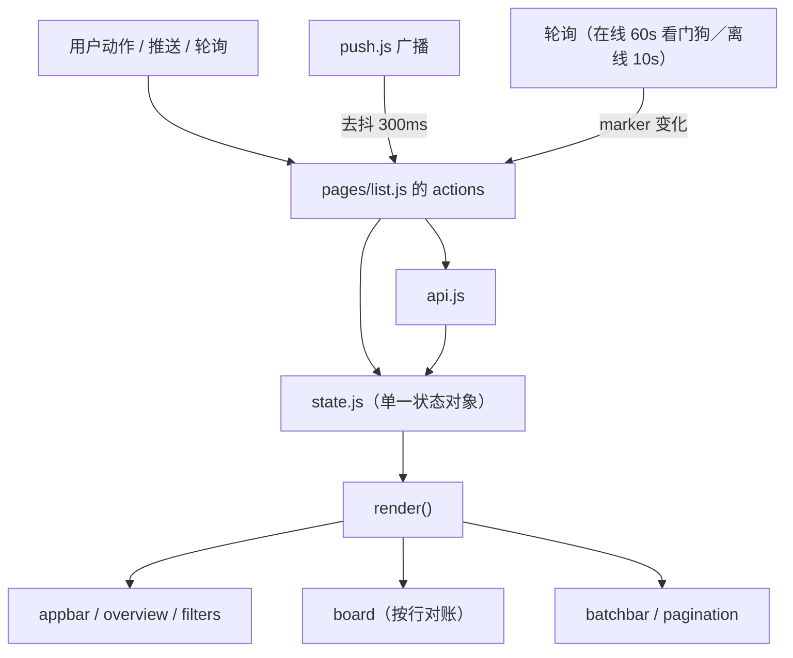

# Web 界面 V2 设计（`/ui_v2/`）

## 生产完善（2026-09-17）

发布目标：桌面与移动端均有清楚的内容层级；登录、检索、预览、复制下载、收藏、
批量操作和维护形成完整闭环；加载、空结果、离线、会话失效与操作失败均可理解、可恢复。
完成依据为当前代码、自动化回归和真实浏览器的视觉与交互检查，不沿用旧报告的通过结论。

本轮设计决定：
- 页面标题与品牌分离，标题解释当前工作区；搜索与列表为主，统计退为辅助。
- 每个组件只拥有一个样式根节点，HTML 挂载点不重复消费组件布局类。
- 搜索支持中文输入法，立即提交、清空和 URL 切换必须取消旧的延迟提交。
- 文本、图片、普通文件分别预览，普通文件不能显示图片加载错误或复制图片动作。
- 登录文案面向使用者，不将存储、密钥派生与 CLI 操作放入日常登录流程。

待验收：窄屏与深色视觉、键盘与触屏主要流程、搜索竞态、各类型预览、失败恢复、
完整测试与发布构建。后续发现的问题继续纳入本轮，不以首批改动代替发布验收。

> **状态（V2 实现轮，2026-09-15）：已实现并通过全量质量门**。本文件既是 V2 的**设计事实源**（骨架、令牌、
> 组件词汇表、API 契约、移动端行为），也记录了实现后的验证结果（§12）。
> 后续改动请先改本文件再改代码 —— 尤其是 §3 的线框、§5 的类名词汇表与 §6 的 API 契约：
> 它们与 `test/ui-contract.test.ts` 的双向守卫直接对应，改一处不改另一处会红。
>
> 与 V1 的关系（用户 2026-09-15 决策，2026-09-18 定位调整）：**V1 整体保留在 `/ui_v1/`**，
> V2 落在 `/ui_v2/app/`。**2026-09-18 起 V1 是默认界面**（站点根与 `/ui/` 的跳转壳都指向 `/ui_v1/`），
> V2 降为**开发测试版** —— 本文件因此读作"V2 的设计与实现记录"，不再是默认入口的说明。
> ⚠️ **下面这一段（V1 冻结、不受守卫约束）已被紧随其后的两条更新取代**，保留作历史决策记录：
> V1 的源码原样冻结（只加弃用横幅与路径改写），作为设计与实现的可对照基线；
> `test/ui-contract.test.ts` 等契约守卫改为覆盖 V2，V1 不再受守卫约束（它是冻结的存档，
> 见 `public/ui_v1/README.md`）。
>
> **2026-09-17 更新**：V1 不再冻结 —— 它重新纳入维护（修掉接口前缀故障、
> 重做密度与移动端、加了运行时可重复验证与回归守卫），逐条见 `docs/progress.md` §53。
> 本文件对 V1 的描述保留为历史决策记录。**2026-09-18 更新：V1 成为默认界面，V2 降为开发测试版**
> （站点根与 `/ui/` 的跳转壳都指向 `/ui_v1/`，守卫见 `test/ui-guard.test.ts`），两者的挂载点与守卫分工不变，
> 变化只有一条：V1 现在也受 `test/ui-guard.test.ts` 里那一节 V1 断言的约束。
>
> **验证工具**（手动运行，不属于 `npm test`）：`test/manual/shoot.mjs` 出截图（给人看），
> `test/manual/probe.mjs` 读真实 DOM 值（给断言看）。两者都零依赖（CDP + 本机 Edge/Chrome）。

---

## 1. 为什么重做（V1 的实际问题，附截图证据）

V1 的**工程**是可靠的：13 条交互约定（`docs/ui.md` §3.3）、真实令牌层、诚实的空/错/失联状态、
就地 loading/success、竞态守卫、推送降级。问题**全部集中在视觉与信息架构**：

截图：`.shots/01-list-light.png`、`.shots/02-list-dark.png`（1440×900，真实数据 2191 条）

| # | 问题 | 具体表现 | 根因 |
|---|---|---|---|
| 1 | **正文不是主角** | 内容列被截断在 ~360px，而「大小/创建/修改/访问」四列合计更宽 | 表格列宽按「字段等权」分配，没有按「用户来干什么」分配 |
| 2 | **顶栏浪费** | 品牌之后 ~800px 空白，无搜索、无同步状态、无连接状态 | 顶栏只承担品牌与账号 |
| 3 | **工具栏 8 个控件同权** | 类型分段 + 收藏 + 回收站 + 时间 + 搜索 + 页大小 + 刷新挤成一行 | 高频（搜索）与低频（页大小）同权重 |
| 4 | **统计条竖向浪费** | 60–90px 高度只放 3 个数字 | 卡片式统计占用整行 |
| 5 | **行操作不可见** | 5 个 16px 灰色图标，几乎只能靠 hover 发现 | 无 rest 态的可发现性设计 |
| 6 | **类型标识含糊** | 色点 + 文字，四种类型辨识度低 | 徽标试图同时表达「分类」与「状态」 |
| 7 | **行密度与层级** | 56px 行高、灰底表头、卡片阴影偏平 | 未做视觉分层（surface 阶梯） |

**结论**：不是推倒工程，是**推倒视觉与信息架构**。V2 复用 V1 已验证的非视觉资产：
`latest.js`（竞态守卫）、`signalr.js`（推送通道）、`filters.js`（URL ⇄ 状态）、
`clipboard.js`（剪贴板降级）、`dom.js`（无 innerHTML 的 DOM 工具）、`api.js` 的错误归一化。

---

## 2. 定位与设计原则

**一句话**：一个**私有、单账号、以「找回来 → 取用」为主线的剪贴板历史应用**，兼顾一眼掌握
「我的剪贴板最近在发生什么」。

用户在四种场景里打开它（V2 的每个设计决定都要能指回其中之一）：

| # | 场景 | 频率 | 成功标准 |
|---|---|---|---|
| S1 | **找回来**：十几分钟前复制的东西，想再看看/再粘贴一次 | 高频 | 不搜索、不翻页，进页面 2 秒内看到并复制 |
| S2 | **找回来（旧的）**：上周复制过的一段文本/一个文件 | 中频 | 搜索或时间范围 → 预览 → 复制/下载 |
| S3 | **确认同步**：刚在手机上复制了，电脑上有没有过来 | 中频 | 顶部「最近同步」一眼可见，无需操作 |
| S4 | **清理与维护**：删几条、清空回收站、确认清理任务在跑 | 低频 | 批量选择顺手，维护信息可查但不碍事 |

由此定四条原则：

1. **正文优先**：内容列是唯一的主角，其余列是它的注解。任何元数据不得比内容占更宽。
2. **两秒可达**（S1）：打开即见最近记录，主操作（复制）**在行上、rest 态可见**。
3. **概览在顶部一条**（S3）：同步状态、活动趋势、用量、类型分布合成**一条 44–56px 的概览带**，
   展开才看细节——满足「一眼掌握」而不吃列表的高度。
4. **移动端是第二形态，不是缩小版**：< 720px 时表格换成卡片流、筛选换成抽屉、
   主操作换成底部固定条。**复用同一份数据与同一条写路径**（只换呈现）。

---

## 3. 页面骨架（ASCII 线框）

### 3.1 桌面（≥ 1080px）

```
┌───────────────────────────────────────────────────────────────────────────────────────────┐
│  ⬢ 剪贴板历史                                    ⌘K 搜索        ● 已同步 2 分钟前   ◐  ⓘ  ⏻  │  56px 顶栏（吸顶）
├───────────────────────────────────────────────────────────────────────────────────────────┤
│  1009 条记录        最近同步 2 分钟前        ▁▂▅▃▇▂▁▃▅   20 KB        903·17·72·17        │  概览带 56px
│  ↑ 主数字+副文案     ↑ 同步健康度(S3)        ↑ 14天活动    ↑ 存储        ↑ 类型分布(可点)  │  整条可点 → 展开抽屉
├───────────────────────────────────────────────────────────────────────────────────────────┤
│  ┌─────────────────────────────────────────────────────────────────────────────────────┐  │
│  │ ⌕  搜索剪贴板内容…                                                          ⌘K     │  │  主搜索（大）
│  └─────────────────────────────────────────────────────────────────────────────────────┘  │
│  [ 全部 1009 ][ 文本 903 ][ 图片 17 ][ 文件 72 ][ 组合 17 ]   ☆收藏  🗑回收站  全部时间 ▾  ⚙ │  筛选条 44px（吸顶）
├───────────────────────────────────────────────────────────────────────────────────────────┤
│  共 1009 条 · 按创建时间倒序                                                    50/页 ▾   │  列表头
├───────────────────────────────────────────────────────────────────────────────────────────┤
│  ☐  ┃ 今天 ──────────────────────────────────────────────────────────────────────────────  │  时间分组（sticky 小标题）
│  ☐  ┃ ▌文本  信号量调试输出 …hannel closed before handshake…            ⧉  ☆  📌  ⋯      │
│     ┃        signalr-1789486138463 · 27 B · 1 小时前                          ↑ 主操作可见 │  行 64px
│  ☐  ┃ ▌图片  [▣ 缩略图]  screenshot.png                                 ⧉  ☆  📌  ⋯      │
│     ┃        1920×1080 · 412 KB · 1 小时前                                               │
│  ☐  ┃ ▌文件  ⬒  report-2026-Q3.pdf                                      ⬇  ☆  📌  ⋯      │
│     ┃        2.4 MB · 昨天 14:20                                                          │
├───────────────────────────────────────────────────────────────────────────────────────────┤
│  ☐  ┃ 更早 ──────────────────────────────────────────────────────────────────────────────  │
│  ☐  ┃ ▌文本  会议纪要：下周三下午两点…                                    ⧉  ☆  📌  ⋯      │
├───────────────────────────────────────────────────────────────────────────────────────────┤
│  ‹ 上一页   第 1 / 21 页   下一页 ›                                    跳至 [  1  ] 页      │  分页
└───────────────────────────────────────────────────────────────────────────────────────────┘
          └── 选中 ≥1 条时，底部升起批量操作条（悬浮，不推挤布局）
              ┌──────────────────────────────────────────────────────────────┐
              │  已选 3 条    ☆ 收藏   📌 置顶   ⬇ 下载   ↺ 恢复   🗑 删除   ✕ │
              └──────────────────────────────────────────────────────────────┘
```

**列的分配（原则 1 的落地）**——表格只有 4 列，元数据合并进第二行：

| 列 | 宽度 | 内容 |
|---|---|---|
| 选择框 | 40px | 复选框（表头全选） |
| 类型条 | 4px | 左边缘 4px 类型色条（替代 V1 的徽标色点） |
| 内容 | **弹性，≥ 45%** | 第一行：类型词 + 预览（文本两行截断 / 图片缩略图 / 文件名）；第二行：`标识 · 大小 · 时间`（次要色） |
| 操作 | 约 150px | rest 态就可见：主操作（⧉ 复制 / ⬇ 下载）+ ☆ + 📌 + ⋯（溢出菜单：预览、删除） |

> 关键取舍：**把「大小/创建/修改/访问」四列收进第二行的次要文本**。
> 排序入口移到列表头右上角的「排序」菜单（V1 的 `docs/backend-gaps.md` §1.4 指出 6 个排序字段只有 3 个可点）。

### 3.2 移动端（< 720px）

```
┌───────────────────────────────┐
│ ⬢ 剪贴板历史      ⌕    ⓘ   ⏻ │  顶栏：搜索收成图标
├───────────────────────────────┤
│ 1009 条 · 已同步 2 分钟前     │  概览带折成两行，趋势图**独占第二行**
│ ▁▂▅▃▇▂▁▃▅          20 KB    │  （中屏与桌面它让位给数字：右半栏放不下 132px 的图）
├───────────────────────────────┤
│ ⌕ 搜索…                       │  搜索（点击后全屏聚焦态）
├───────────────────────────────┤
│ [全部][文本][图片][文件][组合]│  横向滚动 chips（无边框分段）
│ ☆ 收藏   全部时间 ▾      ⚙   │  第二行
├───────────────────────────────┤
│ 今天                          │
│ ┌───────────────────────────┐ │
│ │▌文本                    ☆ │ │  卡片：类型条 + 预览两行
│ │ 信号量调试输出 …closed    │ │
│ │ 27 B · 1 小时前            │ │
│ └───────────────────────────┘ │
│ ┌───────────────────────────┐ │
│ │▌图片                    ☆ │ │
│ │ [▣ 缩略图 全宽]            │ │
│ │ screenshot.png · 412 KB   │ │
│ └───────────────────────────┘ │
├───────────────────────────────┤
│      上一页   1 / 21   下一页 │
└───────────────────────────────┘
  长按卡片 → 进入多选；选中后底部升起「复制 / 下载 / 删除」
```

**移动端三条硬规则**：

1. **命中区 ≥ 44×44px**（`--hit-min`），行内图标按钮在触屏下用 44px 隐形扩展区（`--col-actions-coarse` 已存在的做法）。
2. **主操作不靠 hover**：卡片不显示 hover 才出现的按钮，主操作进卡片底部或长按菜单。
3. **筛选抽屉**：时间范围、每页条数、排序、进入「⚙」抽屉（`<dialog>`），避免顶部堆三行控件。

---

## 4. 设计系统（令牌层，V2 重写）

### 4.1 视觉方向

**暖中性底 + 单一强调色（深青）+ 星标琥珀**（保留 V1 的调色板——它是对的，问题在执行细节）。
V2 的三处升级：

1. **surface 阶梯由 3 级扩到 4 级**，用**色调差异**（而非边框）分层：页面底 → 卡片 → 卡片内嵌 → 浮层。
   V1 靠 `border` 划一切，是「框感重、层级平」的来源。
2. **行不用边框**，用 `border-bottom: 1px solid color-mix(border 50%)` + 末行无边框，
   配合 hover 整行染色（`--surface-2`），让表格读成一整块而不是格子。
3. **类型色改成「左侧 4px 色条 + 文字标签」**：色条承担识别（扫视快），文字承担确认。
   四种类型色沿用 V1 的低饱和值（`--type-*`）。

### 4.2 排版

保留系统字体栈（ADR：国内网络下 Web 字体不可靠，`docs/ui.md` §6）。

| 令牌 | 值 | 用途 |
|---|---|---|
| `--fs-title` | `1.0625rem` | 页面标题（**17px**；概览带那个"主数字"`.overview__value` 挂的也是它） |
| `--fs-body` | `0.875rem` | 正文、行预览 |
| `--fs-meta` | `0.75rem` | 行第二行元数据 |
| `--fs-micro` | `0.6875rem` | 标签、徽标 |

> 这里曾有一档 `--fs-display`（`clamp(1.5rem, 1.32rem + 0.5vw, 1.875rem)` = 24 → 30px，概览带主数字用）：
> 2026-09-17 起它没有任何消费者，2026-09-20 删除（`tokens-v2.css` 与 `shell-v2.css` 的 `≤380px` 分支
> 一并删）。**上限从 2.25rem 收到 1.875rem** 是 2026-09-15 第二轮的实测调整（见 §13.3）——
> 概览带的设计约束是"压成一条"（`--overview-h: 60px`）：2026-09-20 实跑过，把 `.overview__value` 改回
> 30px 会让这条带从 **62px 撑到 76px**（+14px）⇒ 放不进，所以不要照抄回来。
> 同一条政策（成组的保留、孤立的删）与判据见 `docs/progress.md` §94.17，守卫见 `test/ui-guard.test.ts`。

### 4.3 间距（8pt 网格，V1 是 4pt——更大的步长减少「什么都挨着」的拥挤感）

`--sp-1: 4` `--sp-2: 8` `--sp-3: 12` `--sp-4: 16` `--sp-5: 24` `--sp-6: 32` `--sp-7: 48` `--sp-8: 64`

### 4.4 尺寸

| 令牌 | 值 | 说明 |
|---|---|---|
| `--row-h` | `64px` | 列表行（V1 56px；内容两行需要更多） |
| `--row-h-dense` | `52px` | 用户开启「紧凑」时 |
| `--control-h` | `34px` | 常规控件 |
| `--search-h` | `44px` | 主搜索框（**令牌名是 `--search-h`**，不是 `--control-h-lg` —— 后者从来没定义过，曾是本表的笔误） |
| `--hit-min` | `44px` | 触屏命中区 |
| `--content-max` | `1240px` | 容器（V1 是 `1280px`；V2 更窄，两侧留白更多） |

### 4.5 动效（沿用 V1 唯一的准入规则：每个动效对应真实内容事件，关掉不丢信息）

| 动效 | 事件 | 时长 |
|---|---|---|
| 行入场错峰 | **仅首屏** | 每行 28ms、上限 10 行 |
| 行高亮闪一次 | 内容变化（别处改了这条） | 1200ms |
| 行离场淡出 | 删除成功 | 180ms |
| 就地成功对勾 | 复制/下载/删除做成 | 160ms + 1.6s 还原 |
| 悬浮面板升起 | 概览带展开 / 批量条出现 | 220ms `--ease-out-expo` |
| 对话框进出 | 开关 | 200ms（`@starting-style`） |
| 跨文档视图过渡 | 登录页 → 列表页 | `@view-transition` |

**删除 V1 的两条**：结果区整块交叉淡入（实测 ~60ms 成本且无信息）、计数数字滚动动画
（V1 没有，明确不加——它不对应内容事件）。

---

## 5. 组件词汇表（V2 契约，测试按此校验）

**命名纪律**：BEM 形态（`block__element` / `block--modifier`），因为
`test/ui-contract.test.ts` 的双向契约守卫只认这一形态。**新增/删除类名必须同步更新守卫扫描结果。**

| 组件 | class 根 | 状态（`data-*`） | 说明 |
|---|---|---|---|
| 顶栏 | `.appbar` | — | 品牌、搜索入口、同步状态、主题、部署信息、登出 |
| 同步状态点 | `.sync` | `data-state="live\|poll\|connecting"` | 点 + 文案，来自推送通道状态与 `/ui/api/poll`（`offline` 没有生产者，2026-09-18 已删） |
| 概览带 | `.overview` | —（子节点有 `data-value` / `data-key`） | 主数字、同步、趋势、体积（`overview.js:119/145` 只写子节点 dataset；`.overview` 本身是无状态的 `<button>`） |
| 趋势图 | `.overview__spark` | — | 内联 SVG，纯装饰（`aria-hidden`），数据来自 `/ui/api/activity` |
| 主搜索 | `.omnibox` | `data-busy` | 44px 高，`⌘K`/`/` 聚焦，自带清空 |
| 筛选条 | `.filters` | — | 类型 chips、收藏、回收站、时间、抽屉入口 |
| 类型 chips | `.chips` / `.chip` | `aria-pressed` | 取代 V1 的 `.segmented` |
| 列表 | `.board` | `data-busy` | 容器（`<table>` 语义保留） |
| 时间分组头 | `.daymark` | — | sticky 小标题（今天/昨天/本周/更早 或具体日期） |
| 行 | `.item` | `data-selected`, `data-flashing`, `data-leaving` | 内容两行 + 操作列 |
| 类型条 | `.item__kind` | `data-type="Text\|Image\|File\|Group"` | 4px 左色条 |
| 预览 | `.entry`（行内）/ `.item`（外层） | — | 文本截断 / 缩略图 / 文件图标 |
| 行操作 | `.rowops` | — | 主操作 + ☆ + 📌 + `⋯` |
| 溢出菜单 | `.menu` | 原生 `hidden` | 预览、重命名？、删除（原有一句 `data-open` 的 `removeAttribute`，既无 setter 也无消费者，2026-09-19 已删 —— 见审计 N-13） |
| 批量条 | `.batchbar` | — | 底部悬浮，选中 ≥1 条出现；条数在 `.batchbar__count` 文本里（无 `data-count`） |
| 抽屉 | `.drawer` | 原生 `[open]` | 时间范围/页大小/排序/紧凑模式/清理状态 |
| 按钮 | `.btn` | `data-loading`, `data-state="ok"` | 沿用 V1 的就地状态机 |
| 图标按钮 | `.icon-btn` | 同上 | |
| 徽标 | `.tag` | `data-tone="warn"` | 两个生产者都在 `ui/row.js`：「正文已截断」（**无** tone）与「已删除」（`warn`）。**收藏/置顶那两档 tone 的 CSS 规则 2026-09-18 已删**（行内没有那两种按钮 ⇒ 无生产者，原委写在 `overlay-v2.css` 那两条的删除说明里）—— 别照本表去 CSS 里找它们 |
| 对话框 | `.dialog` | — | `<dialog>` + `@starting-style` |
| 提示条 | `.toast` | — | 最多 4 条 |
| 空状态 | `.blank` | `data-kind="filter\|trash\|empty"` | 三种语境三套文案与出口 |
| 骨架 | `.ghost` | — | 保留布局的加载占位 |

---

## 6. API 设计（新增与复用）

### 6.1 已有的（全部复用，**协议面一行不动**）

`session` / `login` / `logout` / `history`（列表）/ `history/:type/:hash`（单条）/
`history/:type/:hash/data`（数据 + Range）/ `PATCH history/:type/:hash` /
`history/batch-update` / `history/clear` / `hub-ticket` / `integrity` / `settings` /
`statistics` / `info` / `poll`

### 6.2 V2 新增（为设计服务，全部在 `/ui/api/*` 命名空间内）

| # | 端点 | 为什么需要 | 契约 |
|---|---|---|---|
| N1 | `GET /ui/api/overview` | **首屏从 4 个请求降到 1 个**：V1 的 `refresh` + `refreshStats` + `info` 在首屏打三次 D1/R2，且 `statistics` 内部还要跑 3 条查询（`backend-gaps.md` §3.1）。概览带需要的是它们**合并后**的一个快照 | `{stats, byType, byTypeActive, info:{version,serverUrl,retention,storage,cleanup,hubTransports}, marker:{count,lastModified}, serverTime}`。**只读、无副作用**；`info` 里任何单块失败 → 该块为 `null`，其余照常（诊断面不能被它要诊断的对象拖垮，与 §2.7 同一条纪律） |
| N2 | `GET /ui/api/activity?days=30&tz=-480` | 概览带的**趋势图**需要「每天多少条」——现有端点只能给总数（`backend-gaps.md` §2.6 记了这条缺口，且提示**不要**复用 `db.statistics()` 的全表拉取） | `{days:[{day:'2026-09-15', total, Text, Image, File, Group}], max}`。`day` 按**客户端时区**切分（`tz` 分钟，与 `Date.prototype.getTimezoneOffset` 同号），否则「今天」在 UTC+8 会在早上 8 点错位。`days` 上限 90；SQL 走 `GROUP BY` + `strftime`，**1 条聚合查询**；顺带补上 `backend-gaps.md` §3.1 欠的合并查询 |
| N3 | `POST /ui/api/history/batch-meta` | 预览/复制**全文**时逐条取单条是 O(N) 请求（`backend-gaps.md` §2.8 的口径）。列表正文截断在 500 字符且带 `textTruncated` | `{items:[{type,hash}]}`（≤ 100）→ `{items:[完整 HistoryRecordDto…]}`。用于「选中多条 → 一起复制/下载」与预览预取 |
| N4 | `GET /ui/api/clients` | 概览带要显示**「几台设备在线」**；`backend-gaps.md` §2.7 指出 DO **没有可读状态端点**且 `clientCount()` 是 private | `{clients: number\|null, updatedAt}`。DO 侧新增一个**只读分支**（注意别落到 `handleLongPoll`），失败 → `clients: null`（不整体 5xx）。**成本复核**：这条会让 `/ui/api/overview` 带上一次 DO 往返；故 `overview` 里该字段仅当概览带展开时才请求，首屏不带 |
| N5 | `GET /ui/api/export?format=json\|zip&scope=active\|all` | 「导出历史」是私有数据服务端的**最低义务**（用户数据可携带）；当前零导出路径 | **流式**产出（免费档 10ms CPU / 50 子请求约束下不得先聚合再压缩）：`json` 走 `ReadableStream` 逐行写；`zip` 复用既有 `fflate` 的 `Zip`（流式）。`scope` 上限由 `MAX_SAVED_HISTORY_COUNT` 约束 |

**N5 的取舍**：导出是**大工程量**且不属于「让界面好看好用」的主线。
本设计把它列为 **P3（可选，最后做）**，前置条件是 P0–P2 全部完成且验证通过。

### 6.3 明确不新增的

- **不新增**服务端"搜索建议/自动补全"——`LIKE %…%` 的现状足够，且 48 字节上限已定。
- **不新增**服务端分组接口（按域名/来源聚类）——`From` 列在历史里恒为空（`schema.sql` 保留列），无数据可聚。
- **不新增**缩略图端点——`backend-gaps.md` §2.10 的 Cloudflare Images 路线属独立立项，不是本次范围。

---

## 7. 前端文件结构（V2）

```
public/
├── _headers                   静态资源的 CSP/安全头 + 缓存策略（由静态资源层施加：`/ui*` 的请求虽先进 Worker，资源仍由 `ASSETS` 出网，规则本身不由 Worker 执行）
├── robots.txt                 站点根（爬虫只读根路径）
│                              ↑ 根路径**不放** index.html —— 它要留给 PROPFIND，见 wrangler.toml 的注释
├── ui_shared/                 **V1/V2 唯一的共享面**（2026-09-21 新增；挂 `/ui_shared/`，同受 UI_ENABLED 管）
│   ├── brand/                 品牌图标：favicon.svg / favicon-32.png / apple-touch-icon.png（两版此前各存一份）
│   └── js/icons.js            共用图标表（两版并集，33 键：两版都用 23 + 只 V1 用 4 + 只 V2 用 6）
│                              ↑ 允许放什么、判据与守卫见 docs/ui.md §3.4 —— 它不随某一版演进
├── ui_v2/                     V2（**开发测试版**；默认界面是 V1 `ui_v1/`，见 docs/ui.md §3）
│   ├── manifest.webmanifest   PWA manifest（`start_url` = `/ui_v2/app/`；图标指向共用层）
│   ├── app/                   两页（`/ui_v2/app/` 才是应用本体）
│   │   ├── index.html         列表页
│   │   └── login.html         登录页
│   ├── css/                   样式表名带 `-v2` 后缀：与 `ui_v1/` 的同名文件区分开，
│   │   │                      grep 时不会两边一起命中（V1 的 `tokens.css` 等仍在存档里）
│   │   ├── tokens-v2.css      设计令牌（原始值 → 语义 → 组件三层）
│   │   ├── base-v2.css        重置、排版、焦点、可访问性、工具类
│   │   ├── shell-v2.css       骨架：顶栏、概览带、搜索、筛选条、主区、页脚
│   │   ├── board-v2.css       列表：列表头、表格、时间分组、行、空状态、骨架、分页
│   │   └── overlay-v2.css     浮层与控制：按钮、表单、徽标、对话框、抽屉、菜单、批量条、提示条、登录页、关键帧
│   └── js/
│       ├── boot.js            装配点：唯一知道「谁是谁」的地方，也是唯一碰网络的地方
│       ├── theme-init.js      **经典脚本**（不是 module）：首帧前定主题与密度，避免白闪
│       ├── login.js           登录页逻辑
│       ├── next-target.js     `?next=` 的同源判定（纯函数，安全边界）
│       ├── api.js             /ui/api 封装 + 归一化 + 401 统一跳登录
│       ├── state.js           状态容器（`get` / `patch`，刻意不提供订阅，也**没有** `update(key, fn)`）
│       ├── filters.js         筛选状态 ⇄ URL
│       ├── format.js          展示格式化（类型/体积/相对时间/日期分组/时钟差）
│       ├── keys.js            全局快捷键的**判据**（模态期间不接管；Esc 与其它键的"正在输入"判据不同）
│       ├── menus.js           菜单项的**构造**（行 `⋯` 与排序菜单；纯函数，可断言）
│       ├── messages.js        用户文案（删除/清空确认、错误翻译、剪贴板失败原因；纯函数，可断言）
│       ├── paths.js           记录数据文件的**路径构造**（纯函数：`api.js` 与 `ui/row.js` 的缩略图
│       │                      共用一处 —— 两处各拼一次模板就是"改前缀漏一处"的经典形态，见 O-08k）
│       ├── latest.js          竞态守卫（最新请求胜出）
│       ├── push.js            原生 SignalR 推送通道（票据换 WebSocket）
│       ├── clipboard.js       剪贴板写入（文本/图片，含降级与可判别结果）
│       ├── dom.js             DOM 工具（**不提供插入 HTML 的途径**）
│       ├── (icons.js)          已移入共用层 `public/ui_shared/js/icons.js`（2026-09-21；两版一份）
│       ├── focus.js           **焦点保持**：DOM 就地重建时把键盘位置搬回来（见 §17.3）
│       ├── spark.js           趋势图（内联 SVG，纯函数）
│       ├── theme.js           主题与密度的运行期读写
│       └── ui/                纯呈现组件（**不 import `api.js`**，网络只在 boot.js）
│           ├── appbar.js      顶栏（品牌 h1、同步状态、主题、设置、登出）
│           ├── button.js      **按钮构造**：`iconButton` / `labelButton`（全站共用，见 §17.2）
│           ├── overview.js    概览带（主数字、同步、趋势、体积、类型分布）
│           ├── omnibox.js     主搜索（`/` 与 `Ctrl/Cmd+K` 聚焦）
│           ├── filters.js     类型 chips + 状态开关 + 时间范围
│           ├── board.js       列表容器：对账、时间分组、选择、空/错/加载态
│           ├── row.js         单行：结构与内容签名（`signature`）
│           ├── rowops.js      行内操作按钮（rest 态可见 + 就地状态）
│           ├── batchbar.js    批量操作条
│           ├── pager.js       分页
│           ├── drawer.js      抽屉：趋势明细、视图偏好、自定义范围、保留策略、清理状态、部署信息、维护
│           ├── dialog.js      对话框基元（+ 确认框 / 只读信息面板）
│           ├── menu.js        行溢出菜单与排序菜单
│           ├── blank.js       空状态（三种语境）/ 加载失败态
│           ├── ghost.js       骨架屏
│           └── toast.js       提示条 + **原地状态**（`setPending` / `flashOk`）
├── ui/                        `/ui/` 的跳转壳（老书签入口）：index.html + js/redirect-hash.js
│                              ↑ 它的 fragment 中继把 `/ui/#Type-hash` 的 hash 带到 `/ui_v1/`（声明式 refresh 不继承 fragment）
├── ui_v1/                     默认界面 V1（**产品面**，挂 `/ui_v1/`；见该目录 README.md）
└── ……（`ui_v1/` 内是 V1 的全部文件，含它自己的 6 张样式表与 24 个 JS 模块；清单见 docs/ui.md §3.2）
```

**分层纪律**（可被测试校验）：`ui/*` 组件**不得** import `api.js`——
网络只发生在 `pages/*` 里。这样「渲染」与「取数」不会纠缠，组件可纯函数化。

---

## 8. 状态与数据流



**三条不变式**（从 V1 继承，继续由测试与代码结构保证）：

1. **actions 返回结果，组件呈现结果**（`true` 才算做成）。
2. **每次往返过 `latest.js` 守卫**：列表、统计、概览各持一个 gate；`isCurrent` 通过才写回。
3. **同一视图内按行对账**：行内容签名不变则不重建 DOM（保缩略图、动画、焦点）。

### 8.1 写操作之后该打哪个端点（2026-09-18 记录；第 2 件已于 2026-09-19 实施，见 O-01）

2026-09-18 核对两版调用点时带出来的结论（用户要求记在这里）：

- **V1**：首屏打一次 `GET /ui/api/overview`（合成快照）；此后每次**切视图 / 写操作**只补打**轻的**
  `GET /ui/api/statistics`（`public/ui_v1/js/main.js` 的 `refreshStats()` 是唯一的调用点；首屏**不再**单独调它，
  见同一文件里那句注释（说明首屏为何不再单独调它））。
- **V2**：写操作后走 `refresh({ silent: true })` **加** `refreshOverview()`
  （`public/ui_v2/js/boot.js:670-671`、`:746-747`、`:777-778`、`:796-797`、`:1045-1046`、`:1081-1082`、`:1109-1110`；
  切视图同理 `:493`）——也就是**每次都整只重打 overview**。

> **这 9 个行号已于 2026-09-19 晚整体重指（各 +1）**：当天 `public/ui_v1/js/main.js`
> 与 `public/ui_v2/js/boot.js` 里各新增了注释行，其上编号一律后移一行 —— 上面 V1 的
> `:411` / `:1240` → `:412` / `:1241`，V2 的 `:669-670`…`:1108-1109` 与 `:492`、`:653`
> → 各 +1。**对应行内容一字未变**，只是位置。再动这两个文件时照旧按行内容锚定。

代价不只是"多一次请求"，两条端点的实际成本差在服务端（`src/ui/routes.ts`）：

| 端点 | 一次调用做了什么 |
|---|---|
| `GET /ui/api/statistics`（`src/ui/routes.ts:572-588`） | `storage.totalHistorySize()`（**R2 逐页列举**，`src/storage.ts:200`）+ `db.statistics()`（1 条聚合，`src/db.ts` 的 `statistics()`）+ `countByTypeViews()`（两个口径） |
| `GET /ui/api/overview`（`src/ui/routes.ts:623-641`） | 上面那整套 **＋** `readChangeMarker()` **＋** `deploymentInfo()` —— 而 **2026-09-19（O-01）之前**`deploymentInfo` **自己又算了一遍** `totalHistorySize()` + `db.statistics()` + `countByTypeViews()` + 两次 Meta 读；现已拆成 `deploymentStats()`（统计层，`:76-88`）+ `deploymentMeta()`（元信息层，`:97-144`），统计层只算一次 |

所以现状是：**点一次「收藏」**，V2 付的是 overview 的全套，而 V1 只付 `statistics` 那一套。
差额在 O-01 之前是 R2 列举 **2 遍**、statistics **2 遍**、按类型计数 **2 遍**；O-01 之后那三项
各只剩 **1 遍**（统计层只算一次），V2 仍多付的是 `readChangeMarker()` 与 `deploymentMeta()` 里的两次 Meta 读。

两件可以做的，互相独立：

1. **V2 侧**：写操作后只补打 `statistics`（列表照旧 `refresh()`）。安全性有三条依据：写操作是
   **本机发起的**；`marker` / "最近同步" 不需要由它刷新 —— 在线 60s 看门狗与离线 10s 轮询
   （`boot.js` 里那条 `api.poll` 调用）会带回来；部署信息（保留策略、版本、地址）不因一次收藏而变。
2. **两版共享的后端**：`overview` 内部把 `statistics` / `totalHistorySize` / `countByTypeViews`
   算了**两遍**（一遍给它自己的 `stats`/`byType`，一遍在 `deploymentInfo` 里）。让 `deploymentInfo`
   接一份**已算好的快照**（或让 overview 复用它返回的 `stats`/`views`/`bytes`）就能各减一半 ——
   这条对 **V1 的首屏同样有效**，所以它是更划算的那一件。

**状态**（2026-09-19 更新）：记录当时只做核对、没动代码；随后第 2 件按这里的建议实施了 ——
`src/ui/routes.ts` 把 `deploymentInfo` 拆成 `deploymentStats()`（统计层，`:76-88`）与
`deploymentMeta()`（元信息层，`:97-144`），`overview` 一次算好、同时喂给响应的 `stats` 与 `info`
（同文件 `:621` 的 O-01 注释）。**第 1 件（V2 写操作后不再整只重打 `overview`）仍未做。**
反向的那张表（"V2 有什么值得 V1 借鉴"）在 `docs/frontend-checklist.md` §26，它此前只写了单向。

---

## 9. 渲染与性能预算

| 项 | 预算 | 手段 |
|---|---|---|
| 首屏请求数 | **≤ 2**（overview + activity） | N1 合并；`info` 不再单独打 |
| 首屏 JS 传输 | ≤ 45 KB（gzip 前） | 零构建 ES 模块 + `modulepreload` 全清单 |
| 列表一帧落地 | 首屏后不播入场动画 | 与 V1 相同 |
| 轮询成本 | 在线 60s / 离线 10s / 隐藏 30s | 沿用 V1 |
| 行 DOM 重建 | 仅签名变化时 | 沿用 V1 的 `signature()` |
| 趋势图 | 纯内联 SVG，≤ 30 个 `<rect>` | `spark.js` 纯函数，无 canvas |

---

## 10. 可访问性（不可协商项）

- 每页恰好一个 `<h1>`；`<header>/<main>/<footer>/<nav>` 地标齐全；跳转链接在首位。
- 焦点：`:focus-visible` 环（2px、offset 2px）；删除行后焦点交给邻居行的同一操作（V1 约定 5）。
- 对话框：`<dialog>` + `showModal`，结算**不依赖 `close` 事件**（V1 实测 headless 不派发）。
- 状态矩阵：每个可交互组件有 rest / hover / `:active` / `:focus-visible` / disabled / loading；
  hover 一律包在 `@media (hover: hover) and (pointer: fine)`。
- `prefers-reduced-motion: reduce`：全部动画归零、行立即终态、无视图过渡。
- 触屏：命中区 ≥ 44px；无依赖 hover 的功能。

---

## 11. 实施顺序（每步都能独立验证）

**全部已完成**（2026-09-15 一轮内落地）。下表保留为实施路径的记录，也是后续改动可参考的分层顺序。

| 阶段 | 内容 | 状态 | 验证 |
|---|---|---|---|
| **P0** | 文档定稿（本文件）+ V1 迁到 `ui_old/`（**当时叫这个名**，2026-09-19 才改名 `ui_v1/`）+ `wrangler.toml`/`index.ts` 适配 + 契约测试改指向 | ✅ | `/ui_v1/` 可达、开关同时管住两个挂载点（`ui-guard` 新增守门） |
| **P1** | 令牌层 + 骨架 + 组件层（`tokens-v2` / `base-v2` / `shell-v2` / `board-v2` / `overlay-v2`） | ✅ | 截图（§12.1） |
| **P2** | 数据接线：`api.js` 扩展、`state.js`、`overview`+`activity` 端点、列表渲染与对账 | ✅ | 首屏 2 次请求；`probe.mjs` 读到真实值（§12.2） |
| **P3** | 交互补齐：搜索、筛选、抽屉、批量条、行操作、菜单、对话框、提示条、深链接、键盘 | ✅ | 桌面/移动截图 + `probe.mjs` 读 DOM 值 |
| **P4** | 后端：`/ui/api/overview`、`/ui/api/activity`、`/ui/api/history/batch-meta`（N1–N3） | ✅ | 三个端点冒烟通过（§12.2 的 facts/bars/copyline 即它们的产物） |
| **P5** | 文档收尾 + 守卫测试扩展 | ✅ | 22 套件全通过（§12.4） |

**N4（`/ui/api/clients`）与 N5（`/ui/api/export`）未实施** —— 理由记在 §12.6，都是"收益不抵成本 /
属于独立立项"，不是遗漏。⚠️ 订正：`clients()` 的调用封装**并不存在** —— 它当年被写进 V2 的 `api.js`
之后，在 2026-09-16 的系统性审计里作为**死代码**删掉了（§17.2 的"删除死代码"一栏列了
`api.statistics` / `api.clients` / `api.batchMeta` 三个无人调用的封装）。将来真要接线，
契约（`{clients: null}` 而非整体 5xx）仍需照 §6.2 的 N4 行重新实现。


---

## 12. 验证记录

### 12.1 视觉（截图，`.shots/`，由 `test/manual/shoot.mjs` 生成）

| 文件 | 内容 |
|---|---|
| `01-list-light.png` | 桌面 1440×900，浅色，真实数据 |
| `02-list-dark.png` | 同上一屏，深色 |
| `03-drawer.png` | 抽屉：活动趋势、视图偏好、保留策略、清理状态、部署信息、维护 |
| `05-login.png` | 登录页 |
| `06-notfound.png` | `/ui_v2/*` 的 404 页 |
| `09-mobile.png` | 移动 390×844 |

### 12.2 运行时（`test/manual/probe.mjs` 读真实 DOM 值，非截图目测）

一次完整运行的输出（桌面 1440×900，本地 2191 条记录）：

```
STATE   booted=1  theme=light  h1Count=1  rows=50
        boardCount="1009 条记录"   chipAll="1009"   overviewTotal="1009"
        overviewTotalLabel="活跃记录 · 回收站 1182"   overviewSize="16 KB"
        kinds=["文本903","图片17","文件72","组合17"]   sparkBars=14
        syncState="live"  syncLabel="实时同步中"  noticeHidden=true
        daymarks=["昨天50 条"]  firstRowKind="Text"  pageOverflow=0
DRAWER  open=true
        sections=[活动趋势,视图偏好,自定义时间范围,保留策略,清理任务,部署信息,维护]
        retentionDays="7"   bars=14   copyline="http://127.0.0.1:8787/"
        facts=[上次运行2026-09-15 23:28:34, 上次错误无, 未跑完无, 服务端版本v3.2.0,
               存储占用16 KB, 记录数2191 条（活跃 1009）, 时钟差与本机一致,
               实时传输WebSockets / ServerSentEvents / LongPolling]
EMPTY   blank="filter"  title="没有符合条件的记录"  actions=["清除筛选条件"]
CONSOLE ERRORS   none
FAILED REQUESTS  none
```

移动 390×844：`rows=50`、`pageOverflow=0`、`h1Count=1`、`daymarks=["今天43 条","昨天7 条"]`。

### 12.3 探针抓到的四个真实缺陷（都已修）

这四个都是**截图看不出来**、只有读 DOM 值才会暴露的（这正是 probe.mjs 存在的理由）：

| # | 症状 | 根因 | 修法 |
|---|---|---|---|
| 1 | 概览带上的**三个数字位置是三条黑横杠** | 值还没到时填了 `—`，而主数字是 `--fs-display`（28–36px），破折号在那个尺寸下是一条粗黑杠 | 未加载时给淡色骨架条（`overview__ghost`），它同时表达"将有个数字"与"还没到" |
| 2 | 抽屉**点了打不开** | `overview.js` 自己新建了 `<button>` 而没带 `id="overview"`；HTML 里那个只是挂载点、被 `replaceWith` 换掉了。按 id 找它拿到 `null` | 新按钮自己带 `id`（占位元素不该留在 DOM 里，故 id 必须跟着走） |
| 3 | 抽屉打开后**七个区块全空** | `drawer.update()` 从未被调用（写好了但没接线） | 接进 `renderChrome()` |
| 4 | 顶栏同步状态显示 `实时同步中 · `（尾随分隔符） | `lastSyncMs` 为 0/undefined 时仍拼了 ` · ` | 只在确实有时间时追加 |

另外两个由**契约测试**抓到、后果同样是"静默失效"的缺陷：

| # | 症状 | 根因 |
|---|---|---|
| 5 | 星标选中后**不变色** | CSS 写的是 `[data-star]`，而 JS 写的是 `dataset: { icon: 'star' }` → DOM 上是 `data-icon="star"`。选择器永远不命中 |
| 6 | 类型筛选切到"文件"时，**文本行也跟着显示警示图标** | `renderThumb` 把"`hasData` 为假"一律标成"数据缺失"，而 Text 记录**本来就没有数据文件**（内联文本在 `text` 里）—— 一屏全是警示等于没有警示。改为只对 `File`/`Image`/`Group` 判缺数据 |

以及一个**测试工具自身**的缺陷（不修的话上面那批契约守卫会集体失去判别力）：

| # | 症状 | 根因 |
|---|---|---|
| 7 | `test/ui-contract.test.ts` 的「modulepreload == import 闭包」把 24 条**正确**清单报成多余；`ui-logic.test.ts` 整个套件加载失败 | 它的 `stripComments` 用「任何位置的 `/*`…`*/`」剥块注释，而注释里的**通配写法**（`/ui_v2/*`、`public/ui_v2/js/*.js` —— 这个仓库的注释里到处都是）中那个 `/` 后面的 `*` 被当成块注释开头，于是它到下一个 `*/` 之间的**整整一屏正代码**被删掉。`boot.js` 的全部 import 落在那个区间里，闭包因此只剩入口自己。修法：块注释的 `/*` 只认**行首**（合法 JS 里它几乎总在行首，而文本中间的 `/*` 在注释里恰恰就是通配） |

### 12.4 原有质量门

- `npm run typecheck` ✅（`src` + `test`，`strict` + `noUncheckedIndexedAccess`）
- `npm run lint` ✅（`public/ui_v2/js` 共 30 个模块，零告警）
- `npm test` ✅ **22 个套件全通过**（含 `ui-contract` 10 条跨文件契约、`ui-guard` 22 条鉴权/开关与 V1 契约、`docs` 7 条文档口径）

### 12.5 V1 存档未受影响

- `/ui_v1/` 可达，且与 V2 共用 `UI_ENABLED` 开关：关闭态两个挂载点都 404
  （`test/ui-guard.test.ts` 新增一条守这条不变式）
- 存档源码相对冻结前只有三类改动（路径改写 / 存档横幅 / README），逐条记在
  `public/ui_v1/README.md`

### 12.6 未做 / 有意不做

| 项 | 原因 |
|---|---|
| `GET /ui/api/clients`（N4，在线客户端数） | 现状可用的信号已经够（同步状态点 + 最近同步时间）。要加它得给 DO 开一个只读分支，且会让概览带多一次 DO 往返 —— 收益不抵成本，**留作可选** |
| `GET /ui/api/export`（N5，导出历史） | 流式 json/zip 是独立工程量（免费档 10ms CPU 约束下必须全程流式），不属于"让界面好用"的主线。**P3 候补** |
| `GET /ui/api/status`（合并 overview + activity） | 首屏已经压到 2 次请求（overview + list 并发，activity 不阻塞），再合并的收益小于它带来的耦合 |
| 服务端缩略图（Cloudflare Images） | `docs/backend-gaps.md` §2.10 的独立立项，不是本次范围 |

### 12.7 已知局限

- **activity 的聚合用不上索引**：`strftime(..., CreateTime + ?)` 是表达式，`CreateTime` 上的索引用不上。
  但候选集先被 `CreateTime >= ?` 的范围条件筛过，实际扫描量与**窗口内记录数**成正比（本机 2191 条下
  与 `COUNT(*)` 同量级）。若将来记录数上到十万级，应改为物化每日计数（`docs/backend-gaps.md` §2.6 的路线）。
- **深链接的 hash 清理依赖 `dialog` 的 `close` 事件**：headless 的隐藏标签页里该事件不派发（页面被冻结），
  故这条行为**只在真实浏览器可靠** —— 与 V1 同一条已知限制（`docs/ui.md` §3.3 第 10 条）。
- **`public/` 的资源计数守卫（`test/docs.test.ts`）的含义在本次交接中变大了**：它数的是 `public/` 下
  **全部**文件（现在含 V1 存档），故 `docs/ui.md` 的「共 N 个资源」声明的是总数。判据没变
  （数字仍能从文件系统数出来），但读那个数字时要记得它包含存档。

---

## 13. 第二轮：打磨层验证与视觉迭代（2026-09-15）

§12 验证的是**首屏静止**的 DOM。而「界面像不像成品」几乎全在**交互状态**里 ——
选中态、批量条、浮层、键盘、reduced-motion。这些在 §12 里**一条都没被验证过**：
写的时候是照约定写的，但没人真的点过。

### 13.1 新增工具：`test/manual/states.mjs`

零依赖 CDP 脚本，逐个进入这些状态并断言**可观测事实**（不是"看起来对不对"）：

| 检查 | 判据 |
|---|---|
| 挂载点 id 契约 | 9 个挂载点在 DOM 里都能按 id 找到，且不重复 |
| 行几何 | 行高容得下两行；正文占表格宽度 ≥55% |
| 行操作 | 恰好 3 个；rest 不透明度 ≥0.5（否则等于不可见） |
| 键盘 `/` | 焦点落到 `#omnibox-input` |
| 批量条 | 出现、`position: fixed`、**不遮挡行**；活跃视图禁用「恢复」、回收站视图禁用「删除」 |
| 溢出菜单 | 打开、**在视口内**、贴按钮（间距 <40px）、焦点进入菜单 |
| 预览 | 打开、**有内容**（`.readout` / `.figure`）、焦点陷阱成立、关闭后清 hash |
| 确认框 | 打开、焦点在内、取消能关掉 |
| 抽屉 | 打开、7 个区块、14 根活动条、8 条事实 |
| reduced-motion | 50 行**零**真实动画、opacity=1 |
| 深色 | 类型色条与正文色能读出 |

### 13.2 它抓到的三个新缺陷（都已修）

| # | 症状 | 根因 |
|---|---|---|
| 8 | **批量条永远不出现**（选中一条后什么都没发生） | `batchbar.js` 新建的 `<div>` 没带 `id="batchbar"` —— 与 §12.3 的缺陷 2 **完全同一个坑**：HTML 里的占位元素被 `replaceWith` 换掉后，id 必须跟着走。两处都踩过，故 `states.mjs` 里加了一条**遍历式的挂载点 id 断言** |
| 9 | **预览对话框打开后正文区永远空着** | `createSheet.open(spec)` 接受了 `content` 参数却**从未使用** —— 它总是让 `createDialog` 用它自己那个建对话框时就固定的空占位 `body`。纯接线遗漏，且症状是"对话框看起来正常、只是没内容" |
| 10 | `states.mjs` 自身的第一版在预览上读到假阴性 | 它只等 900ms，而正文被截断的记录（`textTruncated`）打开预览时**要先取一次单条**才拿得到全文。改成轮询等待 `.readout`/`.figure` 出现（≤6s） |

**教训**：缺陷 8 与 §12.3 的缺陷 2 是同一类问题的两次复发，说明「占位元素被替换」这条约定
靠注释守不住 —— 必须有一条**遍历式**的断言（现在是 `states.mjs` 的 `mount ids` 检查）。
一次踩坑是意外，两次是约定没被机械化。

### 13.3 视觉迭代（两处，都有明确的理由）

| 改动 | 前 | 后 | 理由 |
|---|---|---|---|
| 概览带主数字字号 | `clamp(1.75rem, …, 2.25rem)` = 28–36px | `clamp(1.5rem, …, 1.875rem)` = 24–30px | 截图里**最大的三个字是「1009 / 刚刚 / 17 KB」**，而这是个**剪贴板历史**应用，正文才是主角。30px 仍明显大于正文 14px，层级照旧，但不再与列表争"谁更重要" |
| 概览带右侧的类型分布 | 「文本 903 / 图片 17 / 文件 72 / 组合 17」 | **移除**（位置留给"存储占用"） | 筛选条的 chips 同时显示着这四个数 —— 同一份数据一屏出现两遍，且第二遍**不可点**，于是它既不是信息（重复）也不是控件（点不了），纯粹是噪声。chips 才是类型筛选的正确形态（可点、有 `aria-pressed`、计数与当前视图同源） |

结果：概览带高度 82px → **74px**；类型分布只剩一处；主数字与下方 chips 的字号不再"打架"。

**过程中自己造成并修掉的一个回归**：删 `.kinds` 那段 CSS 时用了一次按索引切片的删除，
**连带吃掉了 `.filters` / `.chips` / `.chip*` / `.omnibox*` / `.kbd` 五组规则**。
三次都靠 `test/ui-contract.test.ts` 的「JS/HTML 用到的类必须在样式表里有定义」逐条报出来
（`chip__icon` → `filters__spacer` → `omnibox__clear`），每次补一组就前进一格。
**这条守卫的价值在这一轮体现得最清楚**：它是零构建前端唯一能发现"样式整块丢了"的手段 ——
没有它，页面会静默地失去一整块版式，而截图上看只是"有点不对"。

### 13.4 第二轮验证结果

- `npm run typecheck` ✅ / `npm run lint` ✅
- `npm test` ✅ **22 套件全通过**（用例数见命令输出 —— 刻意不把用例数写进文档：它每加一条断言就变）
- `states.mjs` ✅ **全部 20 条断言通过**（含上述 11 类检查），运行时零 console 错误
- 几何实测（1440×900）：行高 77px、内容列 **998 / 1190 = 84%**（V1 同一位置约 30%）、
  同屏 10 行、概览带 74px

### 13.5 仍未做

- **移动端的复选框位置**：卡片把选择框放在右上角绝对定位（`top: --sp-2; right: --sp-2`），
  卡片自身的 `padding` 是 `--sp-3`（12px），两者差 4px，观感上"贴边"。更正确的做法是让它
  与卡片内容对齐（`right: --sp-3; top: --sp-3`）。**未改**，因为那会把它压到预览文字上 ——
  需要连同"移动端长按进入多选"一起设计，属独立一轮。
- **概览带在窄屏占 3 行**（主数字行 / 同步行 / 趋势行，约 230px）。当前取舍是"移动端保留趋势图"，
  代价是它吃掉约 1/4 屏。是否值得，取决于用户在手机上更多是"扫一眼"还是"找一条"。

---

## 14. 第三轮：普通用户视角走查 + 紧凑模式搬家（2026-09-15）

### 14.1 用户的三条决定

| # | 决定 | 落地 |
|---|---|---|
| 1 | 概览带主数字字号**保持现状** | 不动（§13.3 的 24–30px 保留） |
| 2 | **紧凑模式从抽屉移到「创建时间」旁边** | 已做，见 §14.2 |
| 3 | `/ui/api/clients` **暂时不用** | 不做 |

> ⚠️ 本表第 1 条的"24–30px 保留"**已被取代**：`.overview__value` 自 2026-09-17 起挂的是
> `--fs-title`（**17px**），那个 `--fs-display` 令牌 2026-09-20 删除（实测：改回 30px 会把概览带
> 从 62px 撑到 76px，放不进 `--overview-h: 60px` 那条带）。**这条决定在当时是真的**，这里不改写它，只标注它已被取代；
> 取证与判据见 `docs/progress.md` §94.17。

### 14.2 紧凑模式搬家（已实现并验证）


**从**：抽屉 →「视图偏好」→「紧凑模式」开关
**到**：列表头右侧，与「创建时间」「50 条/页」并排（一个 ☰ 图标按钮，`aria-pressed` 表达状态）

理由：它是"这一屏看起来什么样"的**视图开关**，而人们是在**看着列表**时产生"行太疏"这个念头的。
让用户为此打开抽屉再滚到"视图偏好"，是把一步变成三步。

**没有两处都能改**：抽屉里改成了只读的一行说明（"行高 宽松（在列表右上角的 ☰ 按钮切换）"），
因为两处控件各自显示自己的状态、改了一处另一处不刷新，用户会以为设置没生效
（`states.mjs` 有断言：那一行不能含任何 `input` / `select` / `button`）。

### 14.3 走查抓到的新缺陷（已修）

**功能生效了，但反馈没有** —— 这是本项目到此为止**最难查**的一个缺陷，值得完整记录：

- **症状**：点 ☰ 之后行高**真的变了**（77px → 65px）、`localStorage` 也**真的写了**，
  但按钮自己的 `aria-pressed` 与 `aria-label` **永远不动**，第二次点击看起来"没反应"。
- **排查过程**（四次走偏，最后靠 trace 定位）：
  ① 先怀疑闭包里的 `currentDensity` 与 `theme-init.js` 恢复的持久化值不一致 —— 这个**确实是**
     一个真缺陷（已改为把"下一个值"的判定交给唯一事实源 store），但**不是**这个症状的成因；
  ② 再用 `setAttribute` 打桩证明那个按钮**一次都没被写过**；
  ③ 给 `renderChrome` 的尾部打桩，证明它**没有跑到底**（分页的 `replaceChildren` 零调用）；
  ④ 最后在 `onDensity` 与 `board.update` 里各插一条 trace —— 真相是
     **`renderChrome()` 从头到尾就没有调用过 `board.update()`**。
- **根因**：`boot.js` 里 `board.update()` 只出现在 `render()` 里，而 `renderChrome()` 刻意不调它
  （那个会整表重建，把正在播的对勾动画、焦点、hover 全打断）。于是"只改显示偏好"的操作
  走 `renderChrome()` 这条路时，行的重画由 CSS 变量自动完成（`data-density` 一切换
  `--row-h` 就变了），而**按钮自己的状态没有任何人负责**。
- **修法**：给 `board` 加一个 `updateChrome({ filters, density })`，**只刷列表头**（排序标签、
  每页条数、紧凑开关），由 `renderChrome()` 调用。职责因此是清楚的：
  `render()` = 行 + 头，`renderChrome()` = 头 + 概览 + 筛选条 + 批量条 + 分页 + 抽屉。
- **验证**：`states.mjs` 新增 8 条断言（开关存在 / 行高真的变矮 / 状态可见 / 写盘 /
  能切回宽松 / 刷新后仍生效且开关态正确 / 抽屉只说明不重复控件 / 说明指出了开关位置）。
  其中"刷新后仍生效"这条特别有价值：它把 `theme-init.js`（首帧恢复）与组件状态（运行期切换）
  之间那条容易脱节的缝**钉住了**。

**教训**：① "功能生效"与"反馈正确"是**两条独立的链路**，验收时要分别验 —— 只测"行高变了吗"
不会发现"按钮样子没变"。② 这个缺陷的根因不在新写的组件里，而在**新组件与既有渲染管线的接缝**上：
`render()` 与 `renderChrome()` 的分工是上一轮定的，加新控件时没有回头检查"它属于哪一条路"。
凡新增"只影响显示偏好"的控件，都要问一句：**它由哪条渲染路径负责刷新？**

### 14.4 普通用户视角走查（评审，8 条待用户决定）

以"非开发者、第一次用这个页面"的视角走查，证据全部来自真实浏览器（几何、`dialog.open`、
实际滚动位置、真实鼠标事件），不靠读代码推断。**已向用户提交清单，等确认后再改**：

| 严重度 | 位置 | 用户会遇到的困扰 |
|---|---|---|
| 🔴 高 | 行尾 `⋯` 菜单 | 点屏幕其他地方**关不掉**、滚动页面**菜单不消失**且会飘到别的行上（根因：`showModal()` 的透明遮罩吃掉点击 + 关菜单的监听挂在 `document` 上 + `showModal()` 不锁 `documentElement` 的滚动） |
| 🟠 中 | 手机端筛选区 | 占 **5 行**，加上概览/搜索/列表头后一屏只剩 **6 张卡片** |
| 🟠 中 | 「概览与设置」抽屉 | 内容 **1536px**（视口 833px），最没用的"活动趋势"占了最大的 333px 且常常是一排 0 |
| 🟠 中 | 时间范围「自定义…」 | 选了之后列表**一条都没筛掉**，但下拉框却显示"自定义"——用户以为筛过了 |
| 🟠 中 | 复制失败 | 只说"浏览器拒绝了剪贴板访问"，没说**为什么**（不是 https）、也没说退路在哪 |
| 🟡 低 | 概览带整条可点 | 没有任何"可以点"的视觉提示（且顶栏 ⚙ 做同一件事，两个入口互相削弱） |
| 🟡 低 | 回收站行操作 | 主操作是"复制"，而用户进回收站几乎总是为了**恢复** |
| 🟡 低 | 搜索框 | 用户原话"有点丑"；实测边框偏重、阴影极淡、`Ctrl K` 常驻其中读起来像一个按钮 |

**同时确认不是问题的两处**（避免误改）：
- 菜单里的动作**确实生效**（点「置顶」发出 `PATCH … {"pinned":true}`，服务端复核 `pinned: true`）——
  坏的只是"关不掉"，不是"点了没用"；
- 单条"不可恢复"与批量"恢复"的判据写法不一致（`hasData` vs `hasData !== true`），
  但本地库 1181 条可恢复记录**全部**是 Text 且 `transferDataFile` 为空，两者结论一致 ——
  属**潜在**隐患，眼下不产生错误行为。

### 14.5 本轮验证

- `npm run check` ✅
- `npm test` ✅ **22 套件全通过**（用例数见命令输出 —— 刻意不把用例数写进文档：它每加一条断言就变）
- `states.mjs` ✅ **全部断言通过**（含新增的 8 条紧凑模式断言）
- 运行时零 console 错误
- 紧凑模式实测：宽松 77px ↔ 紧凑 65px，`localStorage` 持久化，刷新后仍生效且开关态正确

---

## 15. 第四轮：用户点名的三处问题（2026-09-15）

用户确认的三条：① 概览带字号保持；② 紧凑模式移到列表头（见 §14.2）；③ `/ui/api/clients` 不做。
外加**用户点名的三处问题**，本轮全部修掉 —— 这三条本来也在 §14.4 的候审清单里，
用户点名即视为选定，故不再等确认。

### 15.1 🔴 溢出菜单：点外部关不掉、滚动不消失（用户报告的原始症状）

**根因是两个独立缺陷叠在一起**，都源自第一版用了 `<dialog>` + `showModal()`：

| # | 症状 | 根因 |
|---|---|---|
| a | 点屏幕任何其他地方都关不掉 | `showModal()` 铺一层**全屏遮罩**，所有"点空白处"的点击都被它吃掉、到不了 `document`；而关闭逻辑挂在 `document` 的 `pointerdown` 上。遮罩还是**透明**的 —— 用户看不见它，却确实在被它拦 |
| b | 滚动页面时菜单不消失、还会飘到别的行旁边 | `showModal()` 只锁 `body` 的滚动，本页滚的是 `documentElement`，所以页面照样滚；菜单是 `position: fixed`，于是钉在视口上**脱开了它所属的那一行** |

**修法**：不再用 `dialog`。改成一个 `position: fixed` 的**真遮罩**（透明、自己负责响应点外部）
+ 一个 `position: fixed` 的菜单面板，并新增「**一滚就关**」（`scroll` / `wheel` / `touchmove`
捕获阶段）与 `resize` 关闭。后者不只是修 bug —— "菜单是这一行的操作"这个前提在行被滚走之后
就不成立了，所以滚动即关是下拉菜单的通行行为，不是补丁。

顺带把菜单的关闭能力补齐成**四种**：点遮罩、滚动、`Esc`（改成非 dialog 后要自己实现）、
再点同一个 `⋯`（切换语义）。

**验证**（`states.mjs`，判据都用**真实鼠标/滚轮事件**，合成事件绕不过"遮罩吃掉点击"这个真实成因）：

```
菜单               open=true  gapFromButton=6  inViewport=true  backdropPresent=true
点外部后           open=false backdropGone=true          ← 症状 a 已修
滚动后             menuOpen=false scrollY=400            ← 症状 b 已修（页面确实滚了，断言非空转）
Esc 后菜单还开着？  false
菜单里的「置顶」     menuClosed=false wasPinned=false serverPinned=true   ← 动作确实生效
```

最后一条特意**用服务端返回值复核**而不是读行内按钮的 `aria-pressed`：行会被随后的静默刷新
重建，那一刻读按钮可能还没重绘完 —— 第一版断言就是这么误报的（实测踩过）。

### 15.2 🟠 搜索框观感（用户原话"有点丑"）

三个问题叠在一起：① 边框用 `--line-strong`（页面里最重的那条线）而阴影只有 4% 不透明度，
读起来是"一个描了灰线的长条"而不是控件；② 底色是纯白，与它下面的 chips 重量几乎相同，
两条横条分不出主次；③ `Ctrl K` 提示**常驻**，且自己带边框 + 底 —— 一个输入框里套了第二个"框"。

改法（对应三条）：
- 底色压深一档（`--surface-inset`，与 chips 的纯白分开）+ 边框降一档（`--line`）
  + 圆角收小一档（`r-md` → `r-sm`）；
- 新增一条**内凹影**令牌 `--shadow-inset`（顶边细阴影 = 凹进去，输入控件的通用语汇）。
  单独一个令牌而不是复用 `--shadow-xs`：那是"浮起来"，方向相反，混用必然误伤；
- `Ctrl K` 改成**悬停/聚焦才出现**（它仍是键盘入口的发现路径，而一个准备用键盘的人，
  注意力本来就在这个框上）；触屏直接不渲染；
- 聚焦时**底色回到最亮**（从"凹槽"变成"一张激活的纸"）—— 只改边框色不够，
  那正是原来"点下去没什么反馈"的原因之一；
- 与筛选条用**同一组**负外边距 + 内边距，两者的左右边缘因此精确对齐
  （原来搜索框比 chips 宽出 12px，那种"没对齐"很难指名但看得出来）。

### 15.3 🟠 「概览与设置」抽屉：信息层级重排

原状：7 个区块总高 **1536px**，视口只有 833px。区块高度实测：
活动趋势 333 / 视图偏好 160 / 自定义时间范围 155 / 保留策略 232 / 清理任务 107 /
部署信息 248 / 维护 109。

三处改动：
1. **顺序按"多久用一次"重排**：会动手改的在前（视图偏好 → 自定义范围 → 保留策略），
   只看的在后（活动趋势 → 清理任务 → 部署信息 → 维护）。原来「活动趋势」排第一，
   点开抽屉先看到一片图表，要滚很久才够到"每页条数"这种真正会改的东西。
2. **活动趋势折成一行摘要**（原生 `<details>`）：`近 14 天 N 条 · M 天有记录`，点开才展开图表。
   它的信息（"最近有没有在用"）一句话就够，而十四根柱子要 333px。用原生 `<details>` 而不是
   自己做折叠：键盘可达、`aria-expanded` 语义、打印行为都由平台负责。
3. **部署信息精简**：原来五行里「服务端版本 / 存储占用 / 记录数」三个概览带**已经**各有一个
   更大的数字，「时钟差」顶栏也报了 —— 同一份数据说两遍不会更清楚，只会多占 248px。
   保留**服务器地址**（只有这里有，且可复制）、实时传输（排查"客户端连不上推送"要看）、
   以及**时钟差超限时**的警告（"同步不动"最常见的根因）。

**结果：1536px → 934px**（视口的 1.26 倍，原先 1.84 倍），打开即可看到全部设置项。

### 15.4 顺带修掉一个真缺陷：`[hidden]` 被 `display` 覆盖

量抽屉高度时发现：**「自定义时间范围」在非 `custom` 时间范围下带着 `hidden` 属性，
却仍然渲染出 155px 的空表单。**

根因是浏览器 UA 样式表里的 `[hidden] { display: none }` 是**最弱**的规则之一 ——
任何一条类选择器上的 `display` 都能盖掉它，而本站到处都是 `display: flex` / `grid`。
于是元素带着 `hidden` 照样占位、照样被看见，而 `element.hidden === true` 让代码看起来一切正常。

修法是在 `base-v2.css` 加一条兜底：

```css
[hidden] { display: none !important; }
```

用 `!important` 是刻意的：这条规则的唯一职责就是压过所有 `display` 声明，
而它表达的是"作者明确要求隐藏"这个语义，不该被样式优先级意外推翻。
（需要"隐藏但保留占位"时用 `visibility: hidden`，不要用 `hidden` 属性。）

**这一类隐患在本站不止一处** —— `.notice` / `.batchbar` / `.omnibox__clear` /
`.menu[hidden]` 等都各自补了 `xxx[hidden]` 规则，那是逐处补丁；现在有兜底了，
漏掉的人不会再静默出错。

### 15.5 本轮验证

- `npm run check` ✅
- `npm test` ✅ **22 套件全通过**（用例数见命令输出 —— 刻意不把用例数写进文档：它每加一条断言就变）
- `states.mjs` ✅ **全部断言通过**，其中本轮的 4 类新断言：
  菜单四种关闭方式 / 抽屉区块顺序（设置在前）/ 活动趋势默认收起且有摘要 /
  抽屉总高 ≤ 视口 1.35 倍
- 运行时零 console 错误

### 15.6 仍然待定（§14.4 里剩下的 5 条，等用户决定）

手机端筛选区占 5 行、时间范围「自定义…」选了不生效却显示"自定义"、复制失败文案不知所以、
概览带看不出可点、回收站主操作是"复制"而非"恢复"。

> 这 5 条已在第五轮全部处理，见 §16。

## 16. 第五轮：用户点名的 5 条（2026-09-15）

用户原话：**"处理这几条"** —— 指 §14.4 走查清单剩下的 5 条。逐条记录"症状 → 根因 → 修法 → 怎么验证"。

### 16.1 🟠 手机端筛选区占 5 行，一屏只剩 6 张卡片

**症状**：390px 视口下，类型 chips 换行成两行，把「收藏 / 回收站 / 时间范围 / 清除筛选」推到下面，
整个筛选条吃掉 5 行，列表首屏只剩下很少内容。

**根因**：`.chips` 在桌面端是 `flex-wrap: wrap`（5 个 chip 换行只占两行，是合理选择）；
但 390px 下换行会连带把后面一排控件整体下压 —— 换行在这里不是"多占一行"，是**多米诺**。

**修法**（`shell-v2.css` 的窄屏媒体查询）：

| 属性 | 值 | 为什么 |
| --- | --- | --- |
| `flex-wrap` | `nowrap` | 覆盖桌面端换行，chip 不再把别人挤下去 |
| `overflow-x` | `auto` | 溢出部分横滑 —— 触屏上的自然手势 |
| `flex` | `1 1 100%` | 独占一行，于是"哪些是类型筛选、哪些是开关"在视觉上分成两组 |
| `scrollbar-width` | `none` | 44px 高的控件行里，一条横滚条是纯噪声；"右边 chip 被切一半"已经承担了可滑提示 |
| `overscroll-behavior-x` | `contain` | 横滑到此为止，不冒泡成整页横滑 |

**结果**：筛选条 **76px（2 行）**，出现「清除筛选」时 **112px（3 行）**；一屏 **6 张卡片**；
`pageOverflowX = 0`。

**量测方法上的一个教训**：第一版断言数的是 `.filters > *` 里 `top` 的去重个数，
于是把 3 个**零尺寸**项（无筛选时 `hidden` 的「清除筛选」、窄屏 `display:none` 的「刷新」、
纯占位的 `.filters__spacer`）各算成一行，量出 4 行、把**已经合格**的布局判成失败。
判据必须是"占了多高"，不是"有几个 top"：先 `filter(r.width > 0 && r.height > 0)` 再数。
断言同时覆盖了"有筛选条件"这个最坏情况（多一个按钮）。

### 16.2 🟠 时间范围选「自定义…」不生效，但下拉框停在"自定义"

**症状**：选「自定义…」→ 抽屉打开让用户填日期；但下拉框**自己停在"自定义"上**，
而列表一条都没筛。用户以为已经筛过了。

**根因**：「自定义…」在语义上是一个**入口**，不是一个筛选值。`<select>` 一旦被选中就会显示为当前值，
而它显示的正是"当前筛选条件"—— 这两件事在下拉框里被同一个像素表达了。

**修法**：
- `filters.js` 新增 `updateRangeValue(range)`：只把下拉框拨回某个值；
- `boot.js` 的 `onRange('custom')` 先 `filtersBar.updateRangeValue(lastAppliedRange)`（打开抽屉前就把显示纠正），
  再由 `setFilters` 在 `patch.range !== undefined` 时同步 `lastAppliedRange`。

要点是**记住"上一次真正生效的范围"**，而不是无脑退回默认值 —— 用户上次筛的是"近 7 天"，
打开自定义面板后又关掉，下拉框该回到"近 7 天"。

**验证**：`states.mjs` 断言"选自定义后下拉框的值 = 打开前的生效值"且"列表条数不变"。

### 16.3 🟠 复制失败的提示"不知所以"

**症状**：复制失败时提示是"浏览器拒绝了剪贴板访问，请打开预览手动复制"。两个问题：
① 用户不知道"什么叫拒绝"；② "打开预览"是哪个按钮，得自己找。

**根因**：真实原因只有一个，但没说出口 —— `navigator.clipboard` **只在安全上下文存在**
（https / localhost），站点跑在 `http://<局域网IP>` 时它压根没有；回退路径 `document.execCommand('copy')`
也已被浏览器逐步禁用。「拒绝了访问」听起来像用户在权限弹窗上点错了。

**修法**（`boot.js`）：
- 抽出 `clipboardFailureHint(retreat)`：区分"不是 https"与"浏览器拒绝了权限"两种措辞，
  并要求调用方传入**具体退路**；
- 复制记录正文失败时**直接替用户打开预览**（既然只有这一条退路，就别让他自己找）；
- 顺手修掉同一处缺陷的第二份拷贝：appbar 的「复制服务器地址」原来是同一句含糊文案，
  现在会说"页面不是 https"，并指出地址就在抽屉的「部署信息」里可手动选中。

**验证方式值得记一笔**：这条路径在开发机上**永远不会自然发生** ——
`http://127.0.0.1` 是安全上下文，剪贴板写得进去。所以 `states.mjs` 把两条写入路径都打桩成失败
（`navigator.clipboard.writeText` 与 `document.execCommand`），再点第一行的「复制」，
断言：提示点明原因、提示里有下一步、**预览真的开了**；并把 `window.isSecureContext` 打桩成 `false`
再验一遍 http 那份措辞。只改页面内的全局，不写库。

### 16.4 🟡 概览带看不出可点

**症状**：概览带整条是一个按钮（点开抽屉），但外观是一个"数据条"——没有任何可点的暗示，
用户不会去点它。

**修法**：`.overview__hint` —— 右侧加一个 chevron，hover 时变强调色并轻微右移。
没有加"描边 + 阴影"那类更重的按钮化处理：概览带的首要身份仍是**概览**（读数字），
可点性是它的第二身份，用一个箭头交代即可，加边框会让它跟真正的按钮抢注意力。
箭头配色从 `--ink-faint` 提到 `--ink-muted`：第一版在 1440px 截图里几乎看不见 ——
**一个本身需要凑近看的提示，等于没有提示**。这是"改完必须回头看截图"的又一个例子。

**验证**：`states.mjs` 断言 `.overview__hint` 存在、可见，且 `.overview` 的 `cursor` 是 `pointer`。

### 16.5 🟡 回收站里的主操作是"复制"，而"恢复"藏在 `⋯` 里

**症状**：用户进回收站几乎总是为了把某条找回来，但行的主操作按钮是「复制」，
「恢复」要展开 `⋯` 菜单才有 —— 把这个视图的首要任务藏起来了。

**修法**（`rowops.js`）：主操作按 `item.isDeleted` 分流，回收站视图里是 `undo`（恢复到历史记录）。
`rowops.js` 里没有 `isDeleted` 怎么办？——**有**：它在行的内容签名里，所以切进/切出回收站时行会正确重建。

不可恢复的记录（带数据文件的：软删时数据已清除，服务端会回 404）**禁用并说明原因**
（`title`/`aria-label` 说"数据文件已随删除清除，不可恢复"），与 `⋯` 菜单里的处置一致 —— 不让用户白点一次。
`renderRowOps` 因此多收一个 `onRestore`，3 个调用点与 `boot.js` 的 `restoreItem` 都已接上。

**验证**：`states.mjs` 进 `?deleted=1`，断言第一行的主操作图标是 `undo`、
且若被禁用其标签必须含"不可恢复"。

### 16.6 顺带修掉一个真缺陷：`query-filters` 套件在"脏库"上必然失败

跑全量门禁时 `test/query-filters.test.ts` 红了 3 条（排序 / Types / Before），现象是
**夹具里最老的 `alpha` 记录查不出来**，而 `SearchText=alpha` 又能查到它 —— 记录本身没问题。

**根因**（用 CDP 之外的办法取证：直接打协议接口数首页）：
协议查询固定 **50 条/页**、默认按 CreateTime DESC，且**不过滤软删行**，而本套件的 `afterAll` 只做软删
⇒ 每跑一次就在排序窗口顶部留下 3 行，**永不清除**（`LastModified` 被写成了远期值，
`hardDeleteOldDeletedRecords` 永不命中）。历史夹具的时间戳是"它那次运行的 now + 4..6 天"，
本批是"本次 now + 4..6 天"：本批 **gamma** 只比历次 gamma 新几十分钟，但本批 **beta/alpha**
比历次 gamma **旧**，于是全库混排的名次是
**本批 gamma → 历次 gamma → 本批 beta → 历次 beta → … → 本批 alpha**。
实测首页 50 条 = **26 条 `qf-*-gamma` + 20 条 `qf-*-beta`，`qf-*-alpha` 0 条** ——
原注释里"取远期锚点压过历史残留"只保证了**新于现在**，保证不了**新于历史**。

**修法**（`test/query-filters.test.ts`）：
锚点从"现在 + N 天"改为**"库里现有最大 CreateTime + 4 天"**（库为空时回退系统时间），
本批因此永远占据前三名，与运行次数无关；
同时把 `LastModified` 改回**真过去值**（相对系统时间），`afterAll` 的收尾用系统 `now`，
于是这 3 行残留能在 30 天后被 Cron 真正硬删 —— 原来的写法让它们永久留在库里。

这条修的是**测试夹具的摆放**，不是产品的查询语义：产品行为一行未动，8 条用例的断言一条未放宽。

### 16.7 本轮验证

- `npm run check` ✅
- `npm test` ✅ **22 套件全通过**（含被修复的 `query-filters` 8 条）
- `states.mjs` ✅ 全部断言通过（含本轮新增的五组：自定义时间范围 / 概览可点 /
  回收站主操作 / 移动端筛选行数（两档：空闲 2 行、有筛选条件 3 行）/ 复制失败（两措辞、都自动开预览））
- 实测数值：移动端筛选条 **76px → 112px（含清除筛选）**，一屏 **6 张卡片**，`pageOverflowX = 0`；
  运行时零 console 错误
- 截图：`test/manual/shoot.mjs` 产出 `.shots/16-state-mobile.png`、`.shots/17-state-copy-failed.png`

### 16.8 仍未做（有意）

本机 dev 库里累积了 46 条 `qf-*-{alpha,beta,gamma}` 历史夹具（软删状态、留在回收站视图顶部）。
新夹具锚点已保证不再制造永久残留，但**已有**那 46 条需要手动清理才会消失 —— 那是删数据，
不在本轮授权范围内，等用户决定。

## 17. 第六轮：系统性前端审计（2026-09-16）

用户要求：**从终端用户、视觉与交互、工程实现、质量保障四个视角做系统评估，输出按严重程度排序的
问题清单与可执行方案，然后据此完善与重构，且不改变现有功能行为、要求构建通过、核心页面与主要交互冒烟正常。**

审计全文（38 条，含证据、用户影响、修法、未验证声明）在 [`docs/ui-v2-audit.md`](ui-v2-audit.md)。
本节只记录**本轮改了什么**以及几条值得留在设计史上的判断。

### 17.1 三个"缺陷的形态"（比缺陷本身更值得记）

1. **注释承诺与实现相反**（A-02、A-03）。`ghost.js` 写着"行高与真实行同高，所以内容落地时
   不发生跳动（CLS = 0）"，而真实首屏里骨架**从未渲染**（`render()` 只在数据落地后才跑），
   骨架行数还写死 6 行对默认 50 行 —— 实测 CLS **0.90**。
   `board.js` 写着"对账是为了保住缩略图、焦点、按钮状态"，而行节点虽被复用，
   `clear(tbody)` + 重新 append 依然让浏览器把焦点扔给 `<body>`。
   **两处都不是"写错了"，而是"写的时候是对的、后来条件变了没人回头验"**。
   教训：注释里的**结论**（"CLS = 0"、"保住焦点"）必须能在冒烟脚本里找到对应断言，
   否则它只是一句愿望 —— 现在这两条都进 `states.mjs` 了。

2. **抽象写好了却没人用**（A-15、A-16）。`iconButton` 只在定义它的 `rowops.js` 里用，
   另有 9 处手写图标按钮；`ui/toast.js` 的 `setPending`/`flashOk` 零调用，而 6 处手写
   `data-loading`、`rowops.js` 还自己实现了 `flash()`。后果不是"多几行"，
   而是**同一件事在不同按钮上的行为不一致**（有的转圈且变灰，有的只转圈），
   以及 161 个图标按钮里有几个**没有名字**。修法是把 helper 提升为共享模块并在所有调用点采用。

3. **一个没有名字的按钮是唯一的入口**（A-04）。保留策略的保存按钮是
   `<button class="btn btn--sm btn--primary" data-icon="check"></button>` —— 无文字、无图标子节点、
   无 `aria-label`，CSS 里也没有任何 `[data-icon]` 规则替它画图标。它在界面上就是 26×28px 的
   蓝色小方块，读屏只念"按钮"，而**它是唯一能保存保留策略的入口**。
   这条是"普通用户视角走查"抓到的：不看一眼截图、只读代码，它看起来完全正常
   （`data-icon="check"` 像是"这里有个对勾图标"）。

### 17.2 工程整理（不改变行为）

| 变动 | 内容 |
|---|---|
| **新增 `js/ui/button.js`** | `iconButton`（`aria-label`/`title`/`aria-pressed`/`aria-haspopup` 一处负责）+ `labelButton`（图标+文字的按钮结构）。10 处图标按钮、7 处带文字按钮全部改用它们 |
| **新增 `js/focus.js`** | `captureFocus`/`restoreFocus`：把"焦点在哪一行的哪个控件"变成可搬运的描述（元素引用 → 行 key + 控件选择器两级回退） |
| **`board.js`** | 行 spec 收成一处 `rowSpec()`（原来 3 处各写一遍 7 个回调，加一个回调漏改过一处）；分组小标题按 key 复用、文字未变不写；顺序未变时**跳过整段重挂** |
| **`toast.js`** | `setPending` 增加 `disable` 选项并补文档：行内按钮**不能**用它加 `disabled`（会让聚焦中的按钮失焦），对话框按钮可以 |
| **删除死代码** | 未使用的导出 `isPending`/`setPressed`/`toggleTheme`；未使用的 API 封装 `statistics`/`clients`/`batchMeta`；未使用的令牌 `--r-xl`/`--z-dialog`/`--dur-instant`/`--ink-inverse`；每轮刷新都调的空函数 `pruneSelection` |
| **`menu.js`** | keydown 移到**捕获**阶段（否则 `stopPropagation` 压不住同节点上的另一个监听器）；补方向键/Home/End；关闭时把焦点还给锚点；同步 `aria-expanded` |
| **`_headers`** | `stale-while-revalidate` 86400 → 60：SWR 是"过期后还能用多久"，24 小时与文件头承诺的"5 分钟"不符 |

### 17.3 三条设计判断（有代价，写在这里免得下次被当成疏漏）

1. **`.board-area` 预留 `70vh`**（A-02 的修法）。CLS 0.90 → 0.0038。
   代价：结果很少时（≤7 行）分页会落在折线以下，需要滚一下。
   接受它的理由：那种情况下分页本身没有可用控件（只有"共 N 条"）——
   `PAGE_SIZES` 从 20 起，少于 20 条就是一页。用**几乎无损失的滚动**换掉**每次加载一次的整页跳动**。
2. **行内按钮的"进行中"不加 `disabled`**（A-08 的修法）。防连点与保焦点在行内按钮上是冲突的：
   `disabled` 会让浏览器立刻把焦点移走，而行的就地更新要靠焦点还回来播对勾。
   故行内按钮只用 `data-loading` 作守卫，对话框/设置里的按钮才用 `disabled`。
3. **`--ink-faint` 不直接跳到 `--ink-muted`**，而是新增标尺中间步 `--c-warm-550 (#6f675c)`。
   次要文字的对比度缺陷要修（4.24/3.80/3.54 → 5.57/4.99/4.65），但不能把"次要/更次要"
   两级压成一级 —— 层级塌陷是另一种可读性问题。

### 17.4 本轮验证

- `npm run check` ✅
- `npm test` ✅ **22 套件全通过**（用例数见命令输出 —— 刻意不把用例数写进文档：它每加一条断言就变）
- `states.mjs` ✅ 全部断言通过，本轮新增 12 组：
  刷新后焦点保持 + **零 DOM 变更**（分层计数：直接子节点 / 子树）／前进后退按 URL 重读状态／
  复选框焦点下 Esc 生效／菜单 Esc 不清空选择集且焦点回到锚点／187 个按钮 0 个无名字／
  抽屉无空白按钮且保存按钮可读（文字 + 宽度）／抽屉有可访问名／连点只发一次写请求且可复原／
  批量条在 Tab 顺序上早于分页与页脚
- 实测数值：**CLS 0.8987 → 0.0038**；一次刷新的 `tbody` 变更 **0**（此前整段重挂）、
  关闭的抽屉变更 **0** 次（此前 88 次）；首屏静态请求 40 个 / JS 模块 30 个 / CSS 5 张
- 运行时零 console 错误；截图经 `test/manual/shoot.mjs` 重拍

### 17.5 明确留给下一轮（见审计 §4）

列表键盘导航（roving tabindex + 方向键，A-31）、`backdrop-filter` 与 CSS 关键路径的取舍
（A-28/A-30）、页大小 500 档（A-29）、`boot.js` 拆分（A-38）、以及一批低风险小项（A-32/A-34/A-36/A-37）。

> 上面前四项已在第二轮处理，见 §17.6；A-28/A-29/A-30 仍需要一句决策。

### 17.6 第二轮：键盘可达 + 纯逻辑外提（同日，接上）

**① 行的方向键导航（A-31）**。每行 4 个可聚焦控件、50 行 = 200 个 Tab 停靠点，
"从第 1 行走到第 40 行"要按约 160 次 Tab —— 列表作为一列可浏览的内容在键盘上等于不可导航。
修法是**加**方向键而不是 roving tabindex：↓/↑ 到相邻行的**同一个控件**（在第 1 行的收藏上按 ↑
不会跳到别的列），Home/End 到首末行。"同一个控件"复用 `focus.js` 的判据（`[data-icon]` / `.check`），
与焦点恢复共用同一套描述。
**为什么不用 roving tabindex**：它达到同一目的的手段是**减少** 150 个 Tab 停靠点，
那是可感知的行为改变；方向键是纯增量（`states.mjs` 断言每行仍是 4 个停靠点）。

**② 纯逻辑外提（A-38）**：`messages.js`（删除/清空确认文案、列表错误翻译、剪贴板失败原因）、
`menus.js`（行菜单与排序菜单的项构造）、`keys.js`（快捷键判据），并把 `isTypingTarget`/`isTextInput`
放进 `dom.js`。外提的判据是"**能不能被测试直接钉住**"，不是"行数看着多"：
这些句子逐字对齐了服务端语义（能不能恢复、数据文件会不会没），菜单项的禁用与语气是产品决定，
快捷键的两个判据都被实测修过 —— 现在它们有 **11 条单测**（`test/ui-logic.test.ts`），
`boot.js` 1193 → 约 950 行，剩下的是装配与取数（没有独立可测边界，不为拆而拆）。

**③ "无变化就不写 DOM"贯彻到 chrome 层**。第一轮只做到列表（行与分组小标题）；
这一轮把同一条纪律推到概览带、筛选条、顶栏、列表头：`setText`/`setAttr` 先比后写，
趋势图只在**数据本身变了**时重画。实测一次刷新的 DOM 变更 **95 → 22**
（概览带 20→0、顶栏 14→0、筛选条 28→4、抽屉 0）。

**④ 两个"不做"的决定**：`role="toolbar"` → `role="group"`（工具条角色承诺方向键，而这里没有，
**不引入承诺了却做不到的语义**）；提示条**不加** `tabindex="0"`（会自灭的元素进了 Tab 顺序，
焦点可能在它消失的瞬间掉到 `<body>`，比"读不完"更糟）—— 改为错误提示 6s → 10s、
鼠标悬停即暂停计时。

**本轮验证**：`npm run check` ✅；`npm test` ✅ **22 套件全通过**（+11 条纯逻辑单测）；
`states.mjs` ✅（新增方向键一组）；首屏 CLS **0.0035**；一次刷新的 DOM 变更 **22**（原 95 / 最初 ~242）。

### 17.7 一个开发环境的坑（本轮踩到）

**新加的静态模块不会立刻被 `wrangler dev` 提供**：`public/` 的资源清单在启动时构建，
运行中**新增**文件返回 404（修改已有文件则会热更新）。症状很吓人：页面完全没有行、
`booted` 为 null、控制台**零错误**（模块 404 在模块图上表现为"整张图加载失败"）。
**规则：新增（而不是修改）`public/ui_v2/**` 下的文件之后，重启 dev server 再判断页面。**

### 17.8 第三轮：登录页纳入冒烟 + 复查自己引入的问题

**① 登录页进入冒烟范围**。第一遍审计覆盖了列表页的四个视角，而登录页只有一张截图、零断言 ——
它是核心页面之一。现在 `states.mjs` 有 14 条断言覆盖它：结构（唯一 `h1`、`<label for>` 绑定、
`required`、`autocomplete`）、可访问性（`role="alert"` 的错误区、打开即聚焦用户名、`<noscript>`）、
客户端校验（空提交不发请求、给原因、把焦点与 `aria-invalid` 交回字段）、
已登录时直接跳列表页、以及 `?next=` 白名单的**端到端**回落（同源照办；
`https://evil`、`//evil`、`/\evil`、登录页自身 —— 一律回落到 `/ui_v2/app/`）。

**一个刻意的测试设计**：这一节**不打失败密码** —— 服务端对登录失败有速率限制（429），
而冒烟脚本要反复跑，用错密码验文案跑几次就会把本机关进小黑屋、连脚本自己的登录都失败。
这是"测试的稳定性"优先于"多覆盖一条文案"的取舍，理由写在脚本注释里。

**② 安全区补齐（A-33）**：`.batchbar` / `.toasts` 的 `bottom` 改为
`calc(var(--sp-5) + env(safe-area-inset-bottom, 0px))`。**第二参数是关键**：
没有安全区的设备上这一步是恒等变换（`0px` + 原值 = 原值），所以桌面与普通手机零观感差异；
只有真有安全区的设备才会被垫高。不用 `max()`：`env()` 不被支持时整条声明会失效，
那会连原来的 20px 一起丢掉。

**③ 复查抓到两处自己引入的问题**（详见审计 §5.2）：HTML 注释里的 ESC 控制字符、
以及"文档声称保留理由写在令牌文件里、实际没写"。两者都属同一类 ——
**审计的结论也要被审计一次**。已修，并把判断依据真正写进 `tokens-v2.css`：
成对的、成阶的令牌按整组保留；孤立的单点令牌才删。
