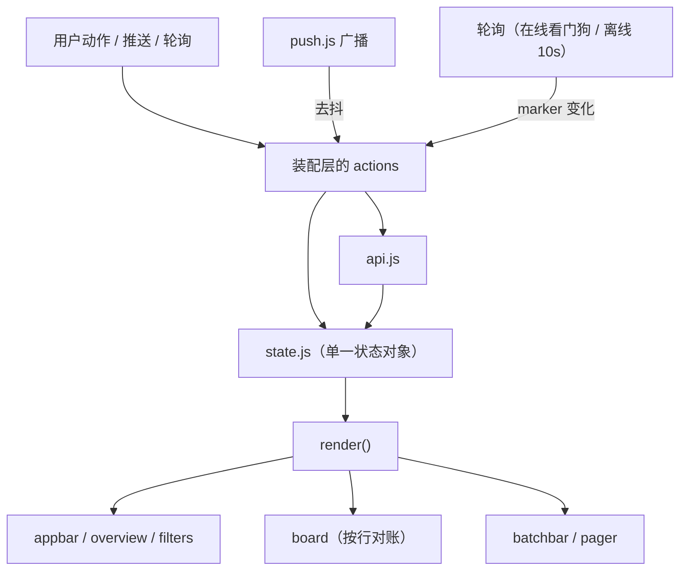

# Web 界面 V2 设计（`/ui_v2/app/`）

> **精简介**：本节起为 2026-10-04 的整篇重写（原文 1146 行）；历史版本见
> `git show <hash>:docs/ui-v2-design.md`：重写前最近一版 `6498bf5`，初版见
> `git show --diff-filter=A --format=%h -- docs/ui-v2-design.md`。
>
> **重写的取舍**：原文§13–§17 是 2026-09-15 至 09-16 六轮迭代的**逐轮记录**（每轮"用户点了哪几条 →
> 抓到什么缺陷 → 怎么修 → 验证数字"）。那是改动日志，属于 `docs/progress.md` 的职责，
> 而且它把设计事实源埋在了 600 行过程叙述下面。**本版只留两类内容**：
> ① **设计契约**（§2–§10：骨架、令牌、组件词汇表、API、文件结构、状态、预算、无障碍）；
> ② **判据与取舍的现状**（§11–§13：哪些不变式被守着、哪些边界是已知的、哪些明确不做）。
> 六轮迭代里"值得下次照做"的部分（缺陷的形态、有代价的设计判断、环境坑）已并入 §12 与 §13，
> 不再按轮次叙述。
>
> **编号是锚点，不能动**：`§2` / `§2.3` / `§3.1` / `§4` / `§4.5` / `§5` / `§6.2` / `§7`
> 分别被 `public/ui_v2/css/*.css` 与 `js/ui/{overview,row,menu}.js`、`src/ui/query.ts`、
> `test/docs.test.ts` 引用；**§7 的目录树格式还被守卫正则逐项校验**（见 §7 的说明）。
>
> **V2 的定位**：它是**开发测试版**（允许后续破坏性重构），默认界面是 V1 `/ui_v1/`
> （站点根与 `/ui/` 的跳转壳都指向它）。守卫分工见 [`ui.md`](ui.md) §3。

---

## 1. 为什么要有 V2

V1 的**工程**是可靠的：交互约定、真实令牌层、诚实的空/错/失联状态、就地 loading/success、
竞态守卫、推送降级。问题**全部集中在视觉与信息架构**：

| # | 问题 | 具体表现 | 根因 |
|---|---|---|---|
| 1 | **正文不是主角** | 内容列被截断在 ~360px，而「大小/创建/修改/访问」四列合计更宽 | 表格列宽按"字段等权"分配，没有按"用户来干什么"分配 |
| 2 | **顶栏浪费** | 品牌之后 ~800px 空白，无搜索、无同步状态 | 顶栏只承担品牌与账号 |
| 3 | **工具栏 8 个控件同权** | 类型分段 + 收藏 + 回收站 + 时间 + 搜索 + 页大小 + 刷新挤成一行 | 高频（搜索）与低频（页大小）同权重 |
| 4 | **统计条竖向浪费** | 60–90px 高度只放 3 个数字 | 卡片式统计占用整行 |
| 5 | **行操作不可见** | 5 个 16px 灰色图标，几乎只能靠 hover 发现 | 无 rest 态的可发现性设计 |
| 6 | **类型标识含糊** | 色点 + 文字，四种类型辨识度低 | 徽标试图同时表达"分类"与"状态" |
| 7 | **行密度与层级** | 56px 行高、灰底表头、阴影偏平 | 未做视觉分层（surface 阶梯） |

**结论**：不是推倒工程，是**推倒视觉与信息架构**。V2 复用 V1 已验证的非视觉资产：
竞态守卫、推送通道、筛选状态 ⇄ URL、剪贴板的降级与可判别结果、无 `innerHTML` 的 DOM 工具、
`api.js` 的错误归一化。

---

## 2. 定位与设计原则

**一句话**：一个**私有、单账号、以「找回来 → 取用」为主线**的剪贴板历史应用，
兼顾一眼掌握"我的剪贴板最近在发生什么"。

四种使用场景（V2 的每个设计决定都要能指回其中之一）：

| # | 场景 | 频率 | 成功标准 |
|---|---|---|---|
| S1 | **找回来**：十几分钟前复制的东西，想再看一眼 / 再粘贴一次 | 高频 | 不搜索、不翻页，进页面 2 秒内看到并复制 |
| S2 | **找回来（旧的）**：上周复制过的一段文本 / 一个文件 | 中频 | 搜索或时间范围 → 预览 → 复制 / 下载 |
| S3 | **确认同步**：刚在手机上复制了，电脑上有没有过来 | 中频 | 顶部「最近同步」一眼可见，无需操作 |
| S4 | **清理与维护**：删几条、清空回收站、确认清理任务在跑 | 低频 | 批量选择顺手，维护信息可查但不碍事 |

四条原则：

1. **正文优先**：内容列是唯一的主角，其余是它的注解。**任何元数据不得比内容占更宽**。
2. **两秒可达**（S1）：打开即见最近记录，主操作（复制）**在行上、rest 态可见**。
3. **概览在顶部一条**（S3）：同步状态、活动趋势、用量、类型分布合成**一条 44–56px 的概览带**，
   展开才看细节 —— 满足"一眼掌握"而不吃列表高度。
4. **移动端是第二形态，不是缩小版**：窄屏下表格换卡片流、筛选换抽屉、主操作换底部固定条，
   **复用同一份数据与同一条写路径**（只换呈现）。

---

## 3. 页面骨架（ASCII 线框）

### 3.1 桌面（≥ 1080px）

```
┌───────────────────────────────────────────────────────────────────────────────────────────┐
│  ⬢ 剪贴板历史                                    ⌘K 搜索        ● 已同步 2 分钟前   ◐  ⓘ  ⏻  │  56px 顶栏（吸顶）
├───────────────────────────────────────────────────────────────────────────────────────────┤
│  1009 条记录        最近同步 2 分钟前        ▁▂▅▃▇▂▁▃▅   20 KB        903·17·72·17        │  概览带 56px
│  ↑ 主数字+副文案     ↑ 同步健康度(S3)        ↑ 14天活动    ↑ 存储        ↑ 类型分布(可点)  │  整条可点 → 展开抽屉
├───────────────────────────────────────────────────────────────────────────────────────────┤
│  ┌─────────────────────────────────────────────────────────────────────────────────────┐  │
│  │ ⌕  搜索剪贴板内容…                                                          ⌘K     │  │  主搜索（大）
│  └─────────────────────────────────────────────────────────────────────────────────────┘  │
│  [ 全部 1009 ][ 文本 903 ][ 图片 17 ][ 文件 72 ][ 组合 17 ]   ☆收藏  🗑回收站  全部时间 ▾  ⚙ │  筛选条 44px（吸顶）
├───────────────────────────────────────────────────────────────────────────────────────────┤
│  共 1009 条 · 按创建时间倒序                                                    50/页 ▾   │  列表头
├───────────────────────────────────────────────────────────────────────────────────────────┤
│  ☐  ┃ 今天 ──────────────────────────────────────────────────────────────────────────────  │  时间分组（sticky 小标题）
│  ☐  ┃ ▌文本  信号量调试输出 …hannel closed before handshake…            ⧉  ☆  📌  ⋯      │
│     ┃        signalr-1789486138463 · 27 B · 1 小时前                          ↑ 主操作可见 │  行 64px
│  ☐  ┃ ▌图片  [▣ 缩略图]  screenshot.png                                 ⧉  ☆  📌  ⋯      │
│     ┃        1920×1080 · 412 KB · 1 小时前                                               │
│  ☐  ┃ ▌文件  ⬒  report-2026-Q3.pdf                                      ⬇  ☆  📌  ⋯      │
│     ┃        2.4 MB · 昨天 14:20                                                          │
├───────────────────────────────────────────────────────────────────────────────────────────┤
│  ‹ 上一页   第 1 / 21 页   下一页 ›                                    跳至 [  1  ] 页      │  分页
└───────────────────────────────────────────────────────────────────────────────────────────┘
          └── 选中 ≥1 条时，底部升起批量操作条（悬浮，不推挤布局）
```

**列的分配（原则 1 的落地）**——表格只有 4 列，元数据合并进第二行：

| 列 | 宽度 | 内容 |
|---|---|---|
| 选择框 | 40px | 复选框（表头全选） |
| 类型条 | 4px | 左边缘 4px 类型色条（替代 V1 的徽标色点） |
| 内容 | **弹性，≥ 45%** | 第一行：类型词 + 预览（文本两行截断 / 图片缩略图 / 文件名）；第二行：`标识 · 大小 · 时间`（次要色） |
| 操作 | 约 150px | rest 态就可见：主操作（⧉ 复制 / ⬇ 下载）+ ☆ + 📌 + ⋯（溢出菜单：预览、删除） |

> 关键取舍：**把「大小 / 创建 / 修改 / 访问」四列收进第二行的次要文本**。
> 排序入口移到列表头右上角的「排序」菜单（V1 那边 6 个排序字段只有 3 个可点，
> 见 [`backend-gaps.md`](backend-gaps.md) §1.4）。

### 3.2 移动端（< 720px）

顶栏收起搜索为图标；**概览带折成两行**（主数字行 + 同步行，趋势图独占第二行）；
搜索点击后进入全屏聚焦态；类型 chips 横向滚动；列表变卡片流（类型条 + 预览两行 + 元信息一行）；
长按卡片进入多选，选中后底部升起操作条。

**移动端三条硬规则**：

1. **命中区 ≥ 44×44px**（`--hit-min`），行内图标按钮在触屏下用隐形扩展区。
2. **主操作不靠 hover**：卡片不显示只有 hover 才出现的按钮，主操作进卡片底部或长按菜单。
3. **筛选抽屉**：时间范围、每页条数、排序、设置进抽屉（`<dialog>`），避免顶部堆三行控件。

---

## 4. 设计系统（令牌层）

### 4.1 视觉方向

**暖中性底 + 单一强调色（深青）+ 星标琥珀**（沿用 V1 的调色板 —— 它是对的，问题在执行细节）。
三处升级：

1. **surface 阶梯由 3 级扩到 4 级**，用**色调差异**（而非边框）分层：页面底 → 卡片 → 卡片内嵌 → 浮层。
   V1 靠 `border` 划一切，是"框感重、层级平"的来源。
2. **行不用边框**，用 `border-bottom: 1px solid color-mix(border 50%)` + 末行无边框，
   配合 hover 整行染色，让表格读成一整块而不是格子。
3. **类型色改成"左侧 4px 色条 + 文字标签"**：色条承担识别（扫视快），文字承担确认。

### 4.2 排版

系统字体栈（国内网络下 Web 字体不可靠）。

| 令牌 | 值 | 用途 |
|---|---|---|
| `--fs-title` | `1.0625rem`（17px） | 页面标题；**概览带的主数字挂的也是它** |
| `--fs-body` | `0.875rem` | 正文、行预览 |
| `--fs-meta` | `0.75rem` | 行第二行元数据 |
| `--fs-micro` | `0.6875rem` | 标签、徽标 |

> ⚠️ **主数字不要改大**：概览带的设计约束是"压成一条"（`--overview-h`）。
> 历史上主数字用过 24–30px 的 `--fs-display`，实测把它改回 30px 会让概览带撑高 14px、放不进那条带；
> 该令牌已删除。字号政策（成组的保留、孤立的删）由 `test/ui-guard.test.ts` 的"令牌不空转"守着。

### 4.3 间距（8pt 网格，V1 是 4pt —— 更大的步长减少"什么都挨着"的拥挤感）

`--sp-1: 4` `--sp-2: 8` `--sp-3: 12` `--sp-4: 16` `--sp-5: 24` `--sp-6: 32` `--sp-7: 48` `--sp-8: 64`

### 4.4 尺寸

| 令牌 | 值 | 说明 |
|---|---|---|
| `--row-h` | `64px` | 列表行（V1 是 56px；内容两行需要更多） |
| `--row-h-dense` | `52px` | 用户开启「紧凑」时 |
| `--control-h` | `34px` | 常规控件 |
| `--search-h` | `44px` | 主搜索框（**令牌名是 `--search-h`**，没有 `--control-h-lg`） |
| `--hit-min` | `44px` | 触屏命中区 |
| `--content-max` | `1240px` | 容器（V1 是 1280px；V2 更窄，两侧留白更多） |

### 4.5 动效

准入规则只有一条（两版共用）：**每个动效对应一个真实内容事件，关掉它信息不丢**。

| 动效 | 事件 | 时长 |
|---|---|---|
| 行入场错峰 | **仅首屏** | 每行 28ms、上限 10 行。⚠️ V1 已整条移除（用户要求：逐行冒出来读起来是"慢"）⇒ 这是两版**有意不同**的一处：V2 保留 |
| 行高亮闪一次 | 内容变化（别处改了这条） | 1200ms |
| 行离场淡出 | 删除成功 | 180ms |
| 就地成功对勾 | 复制 / 下载 / 删除做成 | 160ms + 1.6s 还原 |
| 悬浮面板升起 | 概览带展开 / 批量条出现 | 220ms `--ease-out-expo` |
| 对话框进出 | 开关 | 200ms（`@starting-style`） |
| 跨文档视图过渡 | 登录页 → 列表页 | `@view-transition` |

**明确不加**：计数数字滚动动画（不对应内容事件）、结果区整块交叉淡入（实测 ~60ms 成本且无信息）。

---

## 5. 组件词汇表（契约，测试按此校验）

**命名纪律**：BEM 形态（`block__element` / `block--modifier`）——
`test/ui-contract.test.ts` 的**双向**守卫只认这一形态：JS/HTML 里用到的类必须在样式表里有定义，
样式表里定义的类必须有人用。**新增 / 删除类名必须同步更新守卫扫描结果。**

| 组件 | class 根 | 状态（`data-*`） | 说明 |
|---|---|---|---|
| 顶栏 | `.appbar` | — | 品牌、搜索入口、同步状态、主题、部署信息、登出 |
| 同步状态点 | `.sync` | `data-state="live\|poll\|connecting"` | 点 + 文案，来自推送通道状态与 `/ui/api/poll` |
| 概览带 | `.overview` | 子节点有 `data-value` / `data-key` | 主数字、同步、趋势、体积（`.overview` 本身是无状态的 `<button>`） |
| 趋势图 | `.overview__spark` | — | 内联 SVG，纯装饰（`aria-hidden`），数据来自 `/ui/api/activity` |
| 主搜索 | `.omnibox` | `data-busy` | 44px 高，`⌘K` / `/` 聚焦，自带清空 |
| 筛选条 | `.filters` | — | 类型 chips、收藏、回收站、时间、抽屉入口 |
| 类型 chips | `.chips` / `.chip` | `aria-pressed` | 取代 V1 的 `.segmented` |
| 列表 | `.board` | `data-busy` | 容器（`<table>` 语义保留） |
| 时间分组头 | `.daymark` | — | sticky 小标题 |
| 行 | `.item` | `data-selected`, `data-flashing`, `data-leaving` | 内容两行 + 操作列 |
| 类型条 | `.item__kind` | `data-type="Text\|Image\|File\|Group"` | 4px 左色条 |
| 行操作 | `.rowops` | — | 主操作 + ☆ + 📌 + `⋯` |
| 溢出菜单 | `.menu` | 原生 `hidden` | 预览、删除（**没有**开态属性，别去找 `data-open`） |
| 批量条 | `.batchbar` | — | 底部悬浮，选中 ≥1 条出现；条数在 `.batchbar__count` 的文本里 |
| 抽屉 | `.drawer` | 原生 `[open]` | 时间范围 / 页大小 / 排序 / 紧凑模式 / 清理状态 |
| 按钮 | `.btn` | `data-loading`, `data-state="ok"` | 沿用 V1 的就地状态机 |
| 图标按钮 | `.icon-btn` | 同上 | |
| 徽标 | `.tag` | `data-tone="warn"` | 生产者只有两个：「正文已截断」（无 tone）与「已删除」（`warn`） |
| 对话框 | `.dialog` | — | `<dialog>` + `@starting-style` |
| 提示条 | `.toast` | — | 最多 4 条 |
| 空状态 | `.blank` | `data-kind="filter\|trash\|empty"` | 三种语境三套文案与出口 |
| 骨架 | `.ghost` | — | 保留布局的加载占位 |

**占位与真实必须同高**（判据在 `test/manual/probe.mjs`）：行骨架 = 真实行的**众数**行高、
骨架之间 = 卡片之间的间距、**概览带的值占位 = 真实值那一行的行盒**。
第三条最容易漏：值占位矮 6px、数据落地时每格长高 6px，窄屏（趋势图独占一行时）会让概览带整体高 32px，
把下方内容推下去 —— **窄屏首屏 CLS 会从 0.0026 跳到 0.12，而宽屏看不到这个位移**。
故这条必须按几何钉死，不能只靠 CLS 读数。

---

## 6. API 设计（新增与复用）

### 6.1 复用的（协议面一行不动）

`session` / `login` / `logout` / `history`（列表）/ `history/:type/:hash`（单条）/
`history/:type/:hash/data`（数据 + Range）/ `PATCH history/:type/:hash` /
`history/batch-update` / `history/clear` / `hub-ticket` / `integrity` / `settings` /
`statistics` / `info` / `poll` —— 逐条语义见 [`ui.md`](ui.md) §5。

### 6.2 V2 新增（为设计服务，全部在 `/ui/api/*` 命名空间内）

| # | 端点 | 为什么需要 | 契约 |
|---|---|---|---|
| N1 | `GET /ui/api/overview` | **首屏从 3–4 个请求降到 1 个**：`refresh` + `refreshStats` + `info` 在首屏各打一次，且统计内部还要跑多条查询。概览带需要的是它们**合并后**的一个快照 | `{stats, byType, byTypeActive, info:{…}, marker:{count,lastModified}, serverTime}`。**只读、无副作用**；`info` 里任何单块失败 → 该块为 `null`，其余照常（诊断面不能被它要诊断的对象拖垮） |
| N2 | `GET /ui/api/activity?days=30&tz=-480` | 概览带的**趋势图**需要"每天多少条"—— 其它端点只能给总数 | `{days:[{day, total, Text, Image, File, Group}], max}`。`day` 按**客户端时区**切分（`tz` 分钟，与 `Date.prototype.getTimezoneOffset` 同号），否则 UTC+8 的"今天"会在早上 8 点错位。`days` 上限 90；**1 条聚合查询** |
| N3 | `POST /ui/api/history/batch-meta` | 预览 / 复制**全文**时逐条取单条是 O(N) 请求；列表正文截断在 500 字符且带 `textTruncated` | `{items:[{type,hash}]}`（≤ 100）→ `{items:[完整 HistoryRecordDto…]}`。服务端按 D1 行序返回，**调用方负责按选中顺序重排** |
| N4 | `GET /ui/api/clients` | 概览带想显示"几台设备在线" | **未实施**：需要给 DO 开一个只读分支，且会让概览带多一次 DO 往返 —— 收益不抵成本（现状的同步状态点 + 最近同步时间已够）。将来要做时，契约是 `{clients: number\|null}`，失败为 `null` 而非整体 5xx |
| N5 | `GET /ui/api/export?format=json\|zip` | 「导出历史」是私有数据服务端的最低义务（数据可携带） | **未实施**（P3 候补）：必须**全程流式**（CPU 是**平均**预算，不得先聚合再压缩）；`json` 走 `ReadableStream` 逐行写，`zip` 复用 `fflate` 的流式 `Zip` |

### 6.3 明确不新增的

- 服务端"搜索建议 / 自动补全"—— `LIKE %…%` 够用，且搜索串的字节上限已定。
- 服务端分组接口（按来源聚类）—— `From` 列在历史里恒为空（保留列），无数据可聚。
- 缩略图端点 —— Cloudflare Images 路线属独立立项，见 [`backend-gaps.md`](backend-gaps.md) §2.10。
- `GET /ui/api/status`（把 overview 与 activity 再合并）—— 首屏已压到 2 个请求
  （overview 与列表并发，activity 不阻塞首屏），再合并的收益小于它带来的耦合。

---

## 7. 前端文件结构（V2）

> ⚠️ **下面这棵树由 `test/docs.test.ts` 逐项校验**：它按 `^[│ ]*[├└]── \(?([\w.-]+\.js)\)?`
> 抽出每个 `.js` 条目，与磁盘上的实际文件对账（`public/ui_v1/js`、`public/ui_v1/js/components`、
> `public/ui_v2/js`、`public/ui_v2/js/ui`、`public/ui_shared/js`、`public/ui/js`）。
> **改文件必须同步改这棵树**；`├──` / `└──` 的行格式与括号写法都是判据的一部分。

```
public/
├── _headers                   静态资源的 CSP/安全头 + 缓存策略（由静态资源层施加：`/ui*` 的请求虽先进 Worker，资源仍由 `ASSETS` 出网）
├── robots.txt                 站点根（爬虫只读根路径）
│                              ↑ 根路径**不放** index.html —— 它要留给 PROPFIND，见 wrangler.toml 的注释
├── ui_shared/                 **V1/V2 唯一的共享面**（挂 `/ui_shared/`，同受 UI_ENABLED 管）
│   ├── brand/                 品牌图标：favicon.svg / favicon-32.png / apple-touch-icon.png
│   └── js/icons.js            共用图标表（两版并集；允许放什么见 docs/ui.md §3.4）
├── ui_v2/                     V2（**开发测试版**；默认界面是 V1 `ui_v1/`）
│   ├── manifest.webmanifest   PWA manifest（`start_url` = `/ui_v2/app/`；图标指向共用层）
│   ├── app/                   两页（`/ui_v2/app/` 才是应用本体）
│   │   ├── index.html         列表页
│   │   └── login.html         登录页
│   ├── css/                   样式表名带 `-v2` 后缀（与 ui_v1/ 的同名文件区分开，grep 不会两边一起命中）
│   │   ├── tokens-v2.css      设计令牌（原始值 → 语义 → 组件三层）
│   │   ├── base-v2.css        重置、排版、焦点、可访问性、工具类
│   │   ├── shell-v2.css       骨架：顶栏、概览带、搜索、筛选条、主区、页脚
│   │   ├── board-v2.css       列表：列表头、表格、时间分组、行、空状态、骨架、分页
│   │   └── overlay-v2.css     浮层与控制：按钮、表单、徽标、对话框、抽屉、菜单、批量条、提示条、登录页、关键帧
│   └── js/
│       ├── boot.js            装配点：唯一知道「谁是谁」的地方，也是唯一碰网络的地方
│       ├── theme-init.js      **经典脚本**（不是 module）：首帧前定主题与密度，避免白闪
│       ├── login.js           登录页逻辑
│       ├── next-target.js     `?next=` 的同源判定（纯函数，安全边界）
│       ├── api.js             /ui/api 封装 + 归一化 + 401 统一跳登录
│       ├── state.js           状态容器（`get` / `patch`，刻意不提供订阅）
│       ├── filters.js         筛选状态 ⇄ URL
│       ├── format.js          展示格式化（类型 / 体积 / 相对时间 / 日期分组 / 时钟差）
│       ├── keys.js            全局快捷键的**判据**（模态期间不接管）
│       ├── menus.js           菜单项的**构造**（纯函数，可断言）
│       ├── messages.js        用户文案（确认、错误翻译、剪贴板失败原因；纯函数，可断言）
│       ├── paths.js           记录数据文件的**路径构造**（纯函数；两处各拼一次模板就是"改前缀漏一处"）
│       ├── latest.js          竞态守卫（最新请求胜出）
│       ├── push.js            原生 SignalR 推送通道（票据换 WebSocket）
│       ├── clipboard.js       剪贴板写入（文本 / 图片，含降级与可判别结果）
│       ├── dom.js             DOM 工具（**不提供插入 HTML 的途径**）
│       ├── focus.js           焦点保持：DOM 就地重建时把键盘位置搬回来
│       ├── spark.js           趋势图（内联 SVG，纯函数）
│       ├── theme.js           主题与密度的运行期读写
│       └── ui/                纯呈现组件（**不 import `api.js`**，网络只在 boot.js）
│           ├── appbar.js      顶栏（品牌 h1、同步状态、主题、设置、登出）
│           ├── button.js      按钮构造：`iconButton` / `labelButton`（全站共用）
│           ├── overview.js    概览带（主数字、同步、趋势、体积、类型分布）
│           ├── omnibox.js     主搜索（`/` 与 `Ctrl/Cmd+K` 聚焦）
│           ├── filters.js     类型 chips + 状态开关 + 时间范围
│           ├── board.js       列表容器：对账、时间分组、选择、空/错/加载态
│           ├── row.js         单行：结构与内容签名（`signature`）
│           ├── rowops.js      行内操作按钮（rest 态可见 + 就地状态）
│           ├── batchbar.js    批量操作条
│           ├── pager.js       分页
│           ├── drawer.js      抽屉：趋势明细、视图偏好、自定义范围、保留策略、清理状态、部署信息、维护
│           ├── dialog.js      对话框基元（+ 确认框 / 只读信息面板）
│           ├── menu.js        行溢出菜单与排序菜单
│           ├── blank.js       空状态（三种语境）/ 加载失败态
│           ├── ghost.js       骨架屏
│           └── toast.js       提示条 + **原地状态**（`setPending` / `flashOk`）
├── ui/                        `/ui/` 的跳转壳：index.html + js/redirect-hash.js
│                              ↑ fragment 中继把 `/ui/#Type-hash` 的 hash 带到 `/ui_v1/`（声明式 refresh 不继承 fragment）
├── ui_v1/                     默认界面 V1（**产品面**，挂 `/ui_v1/`；见该目录 README.md）
└── ……（`ui_v1/` 内是 V1 的全部文件；清单见 docs/ui.md §3.2）
```

**分层纪律**（可被测试校验）：`ui/*` 组件**不得** import `api.js` —— 网络只发生在装配层。
这样"渲染"与"取数"不会纠缠，组件可纯函数化。

---

## 8. 状态与数据流


```mermaid
flowchart TD
    EV["用户动作 / 推送 / 轮询"] --> ACT["装配层的 actions"]
    ACT --> ST["state.js（单一状态对象）"]
    ACT --> NET["api.js"]
    NET --> ST
    ST --> R["render()"]
    R --> C1["appbar / overview / filters"]
    R --> C2["board（按行对账）"]
    R --> C3["batchbar / pager"]
    PUSH["push.js 广播"] -->|"去抖"| ACT
    POLL["轮询（在线看门狗 / 离线 10s）"] -->|"marker 变化"| ACT
```

**三条不变式**（从 V1 继承）：

1. **actions 返回结果，组件呈现结果**（`true` 才算做成）。
2. **每次往返过竞态守卫**：列表、统计、概览各持一个 gate，`isCurrent` 通过才写回。
3. **同一视图内按行对账**：行内容签名不变则不重建 DOM（保缩略图、动画、焦点）。

### 8.1 写操作之后打哪个端点

- **V1**：首屏打一次 `overview`（合成快照）；此后每次切视图 / 写操作只补打**轻的** `statistics`。
- **V2**：写操作后走 `refresh({silent: true})` **加** `refreshOverview()` —— 也就是**整只重打 overview**。

代价差在服务端：`statistics` = R2 体积列举 + 一条统计聚合 + 两个口径的类型计数；
`overview` = 上面那整套 **＋** 变更标记 **＋** 部署元信息。

> **统计层只算一次**（已实施）：`overview` 早先会把"统计 / R2 体积 / 按类型计数"各算**两遍**
> （一遍给它自己的 `stats`，一遍在部署信息里）。现已拆成"统计层"与"元信息层"，
> 一次算好同时喂给响应的 `stats` 与 `info` —— 这条对 **V1 的首屏同样有效**。
> **仍未做**：V2 写操作后只补打 `statistics`（不整只重打 `overview`）。
> 安全性有三条依据：写操作是**本机发起**的；`marker` 与"最近同步"由看门狗轮询带回来；
> 部署信息不因一次收藏而变。

---

## 9. 渲染与性能预算

| 项 | 预算 | 手段 |
|---|---|---|
| 首屏请求数 | **≤ 2**（overview + 列表并发） | N1 合并；`info` 不再单独打；`activity` 不阻塞首屏 |
| 首屏 JS 传输 | ≤ 45 KB（gzip 前） | 零构建 ES 模块 + `modulepreload` 全清单 |
| 列表一帧落地 | 首屏后不播入场动画 | 与 V1 相同 |
| 轮询成本 | 在线看门狗 / 离线 10s / 隐藏暂停 | 沿用 V1 |
| 行 DOM 重建 | 仅签名变化时 | `signature()` |
| chrome 层写入 | 无变化不写 DOM | `setText` / `setAttr` 先比后写；趋势图只在数据本身变了时重画 |
| 趋势图 | 纯内联 SVG，≤ 30 个 `<rect>` | `spark.js` 纯函数，无 canvas |
| 首屏 CLS | ≈ 0 | 骨架占位与真实同高；结果区预留最小高度（代价：结果很少时需要滚一下才看到分页 —— 用几乎无损失的滚动换掉整页跳动） |

---

## 10. 可访问性（不可协商项）

- 每页恰好一个 `<h1>`；`<header>/<main>/<footer>/<nav>` 地标齐全；跳转链接在首位。
- 焦点：`:focus-visible` 环；删除行后焦点交给**邻居行的同一个操作**。
- 对话框：`<dialog>` + `showModal`，**结算不依赖 `close` 事件**（headless 的隐藏标签页里不派发）。
- 状态矩阵：每个可交互组件有 rest / hover / `:active` / `:focus-visible` / disabled / loading；
  hover 一律包在 `@media (hover: hover) and (pointer: fine)` 里。
- `prefers-reduced-motion: reduce`：全部动画归零、行立即终态、无视图过渡。
- 触屏：命中区 ≥ 44px；无依赖 hover 的功能。
- 行导航：↓/↑ 到相邻行的**同一个控件**，Home/End 到首末行 —— **加方向键而不是
  roving tabindex**（后者要减少 150 个 Tab 停靠点，是可感知的行为改变；方向键是纯增量）。

---

## 11. 被守卫钉住的不变式

写在这里，是因为它们都没法靠"记得改"来维持：

| 不变式 | 守卫 |
|---|---|
| JS/HTML 用到的类必须在样式表里有定义、样式表里的类必须有人用（**双向**） | `test/ui-contract.test.ts` |
| `modulepreload` 清单 == import 闭包 | 同上（`index.html` / `login.html` 各一份清单） |
| 列表路径不得引入同文档视图过渡（实测成本 ~60ms/次） | 同上 |
| 目录树与磁盘一致（本文件 §7 与 `docs/design.md` §4） | `test/docs.test.ts` |
| 契约类名形态是 BEM；挂载点 id 唯一 | `test/manual/states.mjs` 的遍历式断言 |
| 挂载点 / 开关 / 缓存策略三处一致（`run_worker_first`、`isUiAsset`、`_headers`） | `test/ui-guard.test.ts` |
| 纯逻辑模块（文案 / 菜单 / 快捷键）可被单测直接钉住 | `test/ui-logic.test.ts` |

**为什么 `states.mjs` 要遍历式地查挂载点 id**：有一类缺陷复发过两次 ——
组件用 `replaceWith` 换掉 HTML 里的占位元素时，忘了把 `id` 带到新元素上，
于是"按 id 拿它"永远是 `null`（症状是"点了没反应"，而控制台零错误）。
一次踩坑是意外，两次说明这条约定靠注释守不住，必须机械化。

---

## 12. 已知局限与有代价的设计判断

| 项 | 内容 |
|---|---|
| 趋势聚合用不上索引 | `strftime(..., CreateTime + ?)` 是表达式，`CreateTime` 上的索引用不上。但候选集先被范围条件筛过，扫描量与**窗口内记录数**成正比。记录数上到十万级应改为物化每日计数 |
| 深链接的 hash 清理依赖 `dialog` 的 `close` 事件 | headless 的隐藏标签页里不派发 ⇒ 这条行为**只在真实浏览器可靠**（与 V1 同一条已知限制） |
| 结果区预留最小高度 | 结果很少时分页会落在折线以下，需要滚一下 —— 换取"每次加载不再整页跳动" |
| 行内按钮的"进行中"**不加** `disabled` | 防连点与保焦点在行内按钮上冲突：`disabled` 会让浏览器立刻移走焦点，而行内就地更新要靠焦点回来播对勾。故行内只用 `data-loading` 守卫，对话框按钮才用 `disabled` |
| 次要文字分三级而不是两级 | 对比度缺陷要修，但不能把"次要 / 更次要"压成一级 —— 层级塌陷是另一种可读性问题 |
| 移动端概览带的取舍 | 保留趋势图（约占 1/4 屏）还是省掉它换取更多卡片，取决于手机上更多是"扫一眼"还是"找一条"，尚未定 |
| 登录页冒烟**不测**失败密码 | 服务端对登录失败有限速，冒烟脚本要反复跑 —— 用错密码跑几次会把本机关进小黑屋、连脚本自己的登录都失败。**测试稳定性优先于多覆盖一条文案** |
| `wrangler dev` 不热更新新增文件 | `public/` 的资源清单在启动时构建：运行中**新增**文件返回 404（修改已有文件才热更新）。症状很吓人（页面无行、`booted` 为 null、控制台零错误）。**规则：新增 `public/ui_v2/**` 的文件后重启 dev server 再判断页面** |

---

## 13. 明确不做 / 仍待做

**不做**：`role="toolbar"`（工具条用 `role="group"` —— 前者承诺方向键导航而这里没有，
不引入"承诺了却做不到"的语义）；给提示条加 `tabindex`（会自灭的元素进 Tab 顺序，
焦点可能在它消失的瞬间掉到 `<body>`）；计数滚动动画；服务端缩略图（独立立项）。

**仍待做**：

| 项 | 说明 |
|---|---|
| V2 写操作后只补打 `statistics` | 见 §8.1 末尾 |
| `GET /ui/api/clients`（N4） | 需给 DO 开只读分支；契约见 §6.2 |
| `GET /ui/api/export`（N5） | 必须全程流式；属独立工程量 |
| 移动端复选框位置 | 现在绝对定位在卡片右上角，与内容差 4px；要改需连同"长按进入多选"一起设计 |
| 登录页的端到端探针 | 目前 `states.mjs` 已覆盖 14 条结构与校验断言；**列表页以外**的页面仍在扩充中 |
